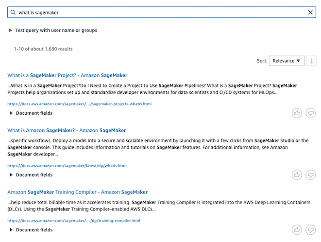
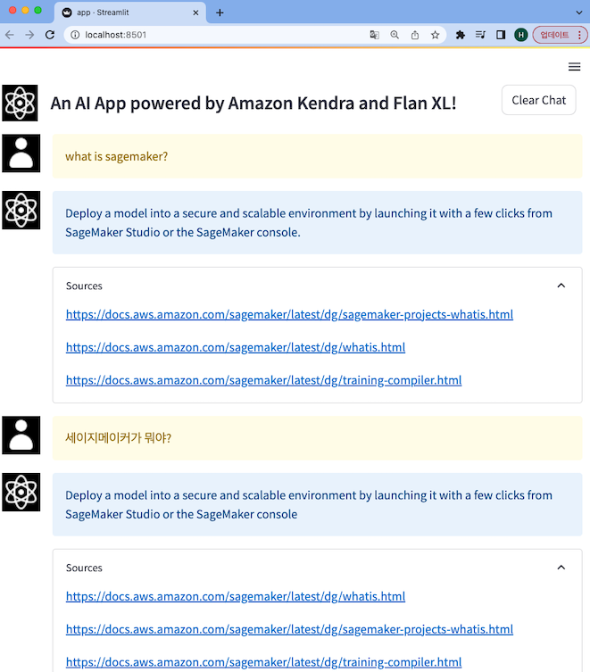
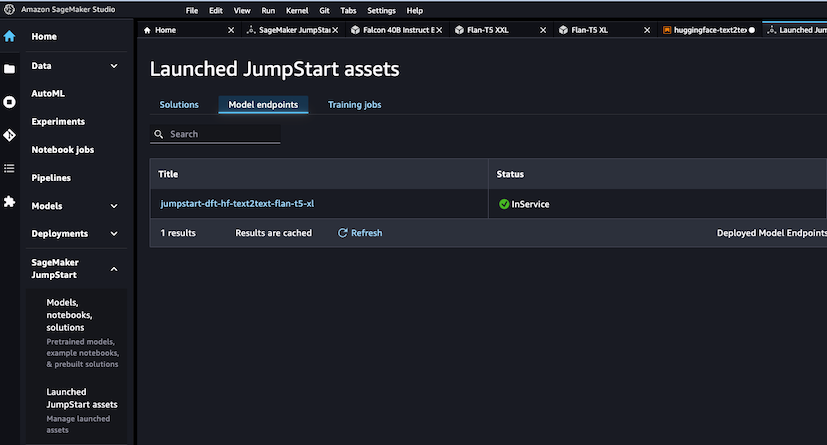

본 글은 23년 5월 3일 [AWS Machine Learning Blog](https://aws.amazon.com/ko/blogs/machine-learning/ )에 실린
[Quickly build high-accuracy Generative AI applications on enterprise data using Amazon Kendra, LangChain, and large language models(이하, AWS Blog)](https://aws.amazon.com/ko/blogs/machine-learning/quickly-build-high-accuracy-generative-ai-applications-on-enterprise-data-using-amazon-kendra-langchain-and-large-language-models/ )를 읽고 실습에 약간의 설명과 RAG에 대하여 알아본 내용을 담은 글입니다.

# Intro

ChatGPT와 같은 Gen AI의 대표적인 단점으로는 hallucinations(환각) 증상이 있습니다. 
AI 업계에서는 Gen AI로부터 정확도 높은 답변을 얻기 위하여, Prompt Tuning 및 In-Context Learning 등 다양한 방법들을 제시하고 있습니다.
본문에서는 Gen AI의 응답을 특정 데이터로 제한하여 LLM의 정확도를 높이는 RAG 기술을 설명하고 이를 [Amazon Kendra](https://aws.amazon.com/ko/kendra/ )로 구현합니다.
이번 포스팅에서는 RAG에 대하여 알아보고 어떻게 Kendra와 함께 사용하는지 알아보겠습니다.

## 👆️ RAG(Retrieval-Augmented Generation)

### [Amazon SageMaker 개발자 가이드](https://docs.aws.amazon.com/sagemaker/latest/dg/jumpstart-foundation-models-customize-rag.html)

아마존의 세이지메이커 개발자 가이드에서는 RAG를 다음과 같이 설명합니다. **기초 모델을 보강하기 위해 외부 데이터를 검색하고, 검색된 관련 데이터를 컨텍스트에 추가하여 프롬프트를 강화하는 방법.**
즉, RAG는 생성 모델의 창의성과 검색 엔진의 정확성을 조합하여 높은 정확성(high-accuracy)을 가진 결과물을 생성합니다. 해당 문서에 함께 첨부된 워크플로 그림을 보면서 다시 한번 상기해 보세요!

RAG 모델 아키텍처에 대한 추가 정보로 2020년 Facebook AI Research(Meta AI)가 발표한 [Retrieval-Augmented Generation for Knowledge-Intensive NLP Tasks](https://arxiv.org/abs/2005.11401) 논문을 참조로 제공합니다.
해당 논문을 이해하여 글을 작성해 보려 했으나, 아직 저에게는 너무 어려워 검색을 통해 학습하다 알게 된 Meta AI 블로그 글을 소개해 드리겠습니다.

### [RAG: Streamlining the creation of intelligent natural language processing models](https://ai.facebook.com/blog/retrieval-augmented-generation-streamlining-the-creation-of-intelligent-natural-language-processing-models/)

위 블로그 "Combining the strengths of open-book and closed-book" 파트에서, RAG를 다음과 같이 설명합니다. RAG는 기존의 `seq2seq` 모델과 비슷하게 작동하지만, 중간 단계에서 차이가 있어 일반적인 `seq2seq` 방법보다 더욱 뛰어납니다.
예를 들어 *"지구상에 첫 번째 포유류가 언제 나타났는가?"* 와 같은 프롬프트에 대해 RAG는 *"포유류", "지구의 역사", "포유류의 진화"* 와 같은 문서를 찾아냅니다.
이런 지원(supporting) 문서들은 원래 입력과 컨텍스트로 연결되어 실제 출력을 생성하는 `seq2seq` 모델에 공급됩니다.

RAG는 다음 두 가지 지식을 갖게 되고, 이 두 가지는 서로 상호 보완적입니다.

1. `seq2seq` 모델의 매개 변수에 저장된 지식 (파라미터 기반 메모리) 
2. RAG가 검색하여 얻은 말뭉치(corpus)에 저장된 지식 (비파라미터 기반 메모리)

해당 파트의 제목이 "오픈북과 클로즈드북의 장점 결합"인데 위 2가지 지식이 각각 '오픈북'과 '클로즈드 북'을 의미하는 것 같습니다. 이어서 RAG의 진정한 강점을 유연성이라 언급하며 다음과 같이 소개합니다.

**사전 학습된 언어 모델이 알고 있는 내용을 변경하려면 전체 모델을 새로운 문서로 재학습**해야 합니다. 그러나 **RAG를 사용하면 지식 검색에 사용되는 문서를 교체함으로써 모델이 알고 있는 내용을 쉽게 제어**할 수 있습니다.

> 여담으로, 본문에서 RAG가 비파라미터 기반 메모리를 사용하여 seq2seq 모델이 올바른 응답을 생성하도록 하는 것을 *큐(cue)* 한다라고 하는데,
> 최근 언론에 공개된 곧 출시가 예정된 네이버의 검색 AI 챗봇 이름도 *Cue:* 인 점이 흥미롭네요.

### [Prompt Engineering Guide - RAG](https://www.promptingguide.ai/techniques/rag)

마지막으로, 글 작성 시점 Github Star가 33.6k인 [Prompt Engineering Guide](https://github.com/dair-ai/Prompt-Engineering-Guide )의 문서를 소개해 드리며 실습 리뷰로 넘어가겠습니다. *(내용은 앞서 언급한 Meta AI와 유사합니다.)*

 

## ✌️ Review

해당 파트의 내용은 **AWS Blog에서도 다루고 있으므로, 실습을 위한 모든 부분을 설명하지는 않습니다.** *(한 달째 글을 작성하고 있는데, [AWS Korea에서도 번역본](https://aws.amazon.com/ko/blogs/tech/quickly-build-high-accuracy-generative-ai-applications-on-enterprise-data-using-amazon-kendra-langchain-and-large-language-models/ )이 올라왔네요.)*

### Amazon Kendra

우선 AWS Blog에서 RAG를 구현하는 Kendra에 대하여 짧게 알아보겠습니다. [Developer Guide](https://docs.aws.amazon.com/kendra/latest/dg/what-is-kendra.html )에서는 Kendra를 
자연어 처리(NLP) 및 ML 알고리즘을 사용해 데이터(your data)에서 검색 질문에 대한 답을 반환하는 지능형 검색 서비스라고 정의합니다.
개발자 가이드에서 언급되어 있다시피 your data를 기반으로 답변을 생성하기 때문에, Kendra를 사용하기 위해서는 Index를 구축해야 합니다.
인덱스를 수집하는 방법은 S3, Service Now와 같은 외부 서비스 및 웹 크롤러를 통해서도 직접 구축할 수 있습니다.

> AWS Blog에서 제공하는 [Cloudformation의 110L](https://github.com/aws-samples/amazon-kendra-langchain-extensions/blob/main/kendra_retriever_samples/kendra-docs-index.yaml#L110 )을 확인해 보면, Web Crawler를 사용해 실습을 진행하는 것을 확인할 수 있습니다.

제공된 Cloudformation 코드의 배포를 성공하고, Kendra 콘솔에서 질의를 남기면 아래와 같이 내가 수집한 Data를 기반으로 검색 결과를 반환합니다. 

### SageMaker JumpStart

Kendra Index를 생성했다면, 이제 생성형 AI를 구축해야 합니다. Open AI의 Key를 발급받아 사용할 수도 있지만, 내 데이터가 외부(LLM)로 유출되지 않기를 원한다면 직접 생성형 모델을 구축해야 합니다.
SageMaker JumpStart에서는 자연어 처리, 객체 감지 및 이미지 분류와 같은 다양한 오픈 소스 모델을 클릭 한 번으로 배포할 수 있게 제공합니다. 

Blog 글에는 SageMaker 생성 방법은 나와있지 않지만 [문서](https://docs.aws.amazon.com/sagemaker/latest/dg/studio-launch.html )를 참고해 생성하고, JumpStart에서 아래와 같이 사용할 환경을 설정하세요. 저는 Flan-T5 모델과 가장 크기가 작은 ml.g5.2xlarge를 선택했습니다.

### Streamlit, LangChain

[Streamlit](https://streamlit.io/ )은 ML 혹은 Data Science 프로젝트를 쉽게 구축할 수 있는 오픈소스 앱 프레임워크이며, [LangChain](https://python.langchain.com/docs/get_started/introduction.html )은 언어 모델로 구동되는 앱을 개발할 수 있는 프레임워크입니다.

실습을 제공하는 [Github](https://github.com/aws-samples/amazon-kendra-langchain-extensions/tree/main/kendra_retriever_samples )에서는
다음 4가지(anthropic, flan_xl, flan_xxl, open_ai)에 대해서만 샘플 코드를 제공하며, 다른 모델을 사용하고 싶다면 [LangChain](https://python.langchain.com/docs/get_started/introduction.html )을 활용해 직접 코드를 작성해야 합니다.

이어서, 데모 웹 앱 Streamlit(여기서는 `app.py`)과 연동할 LangChain 코드(`kendra_chat_*.py`, `kendra_retriever_*.py`)에 사용되는 환경 변수를 설정해야 합니다.
이때 SageMaker의 ENDPOINT는 ARN 주소가 아니라 `jumpstart-`로 시작하는 name 값이며, [Github](https://github.com/aws-samples/amazon-kendra-langchain-extensions/tree/main/kendra_retriever_samples#running-samples )에서는
`AWS_REGION` 값 만을 지정하나 실행 간 오류가 있을 경우 `AWS_DEFAULT_REGION` 값도 함께 환경 변수로 설정하세요. *(참고 : [Boto3 documentation](https://boto3.amazonaws.com/v1/documentation/api/latest/guide/configuration.html#using-environment-variables ))*

### 구현 결과

모든 과정을 수행하고 나면, 아래와 같이 Kendra Index에 검색된 결과가 Sources와 함께 flan_xl 모델이 질문에 대한 정확도 높은 답변을 생성합니다.
[flan-t5-xl](https://huggingface.co/google/flan-t5-xl#model-description) 모델은 한국어도 지원하기 때문에, 한국어로 질문해도 원하는 답변을 얻을 수 있는 것을 확인할 수 있습니다.
만약, 답변도 한국어로 받고 싶다면 LangChain 코드를 수정해야 합니다.

### Clean Up

실습 이후, 비용을 절약하기 위해 리소스를 정리해야 합니다. Kendra의 경우 CloudFormation을 삭제하면 되지만, JumpStart는 아래와 같이 'Launched JumpStart assets(왼쪽 하단)'에서
배포한 endpoint를 찾아 직접 삭제해 주어야 합니다. 잊지 마세요!

 

## Outro

지금까지 RAG에 대해서 알아보고, AWS에서 Kendra와 SageMaker JumpStart를 활용해 자체적으로 구축한 LLM에 RAG를 적용시켜 높은 정확도의 답변을 생성하는 법을 알아봤습니다.
JumpStart를 활용해 손쉽게 Private 언어 모델을 배포하고 LangChain을 활용한 코드 몇 줄로 정확도 높은 답변을 생성하는 게 무척이나 신기합니다.

만약 RAG를 Kendra가 아닌 다른 방법으로 구축한다면, 다음과 같이 구축할 수도 있습니다.

1. [Custom Dataset](https://sagemaker-examples.readthedocs.io/en/latest/introduction_to_amazon_algorithms/jumpstart-foundation-models/question_answering_retrieval_augmented_generation/question_answering_jumpstart_knn.html#Retrieval-Augmented-Generation:-Question-Answering-based-on-Custom-Dataset) : SageMaker KNN 알고리즘을 사용해 임베딩 지식을 인덱스 
2. [Custom Dataset with Open-sourced LangChain Library](https://sagemaker-examples.readthedocs.io/en/latest/introduction_to_amazon_algorithms/jumpstart-foundation-models/question_answering_retrieval_augmented_generation/question_answering_langchain_jumpstart.html#Retrieval-Augmented-Generation:-Question-Answering-based-on-Custom-Dataset-with-Open-sourced-LangChain-Library) : 커스텀 데이터 셋을 준비하고 LangChain과 결합해 사용
3. [Amazon OpenSearch Service](https://aws.amazon.com/ko/blogs/machine-learning/build-a-powerful-question-answering-bot-with-amazon-sagemaker-amazon-opensearch-service-streamlit-and-langchain/) : OpenSearch Service로 인덱스하여 RAG 구현  

Kendra를 사용하기 위해서는 엔터프라이즈 에디션을 기준으로 시간당 $1.4가 청구되지만, OpenSearch로 인덱스를 생성하거나 직접 Dataset을 구축하는데 필요한 인력과 비용을 생각하면 Kendra를 활용하는 것이 RAG 구현의 최선의 방법이 아닌가 싶습니다.

소중한 시간을 내어 읽어주셔서 감사합니다! 잘못된 내용은 지적해주세요! 😃

---
