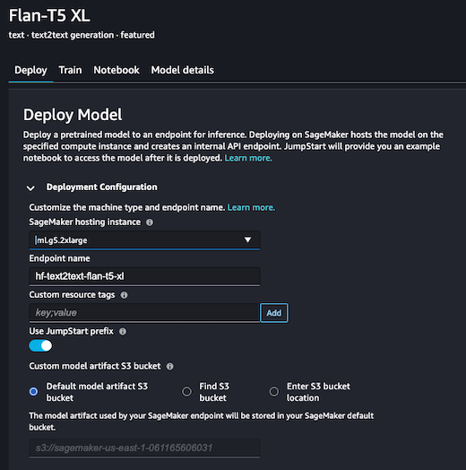
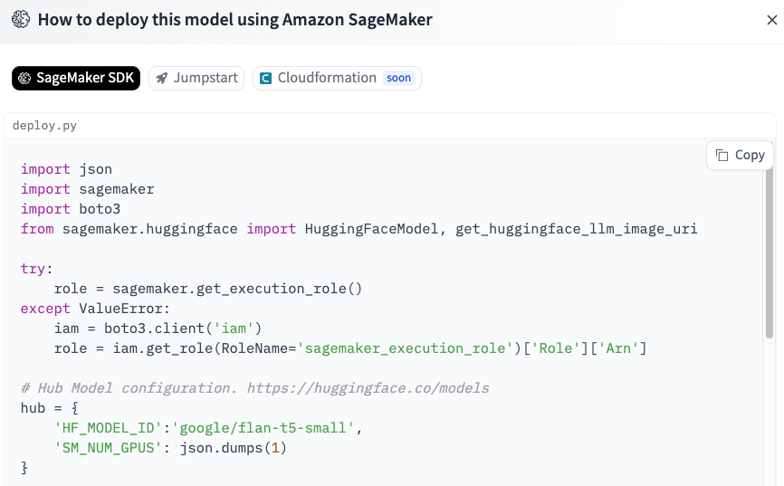
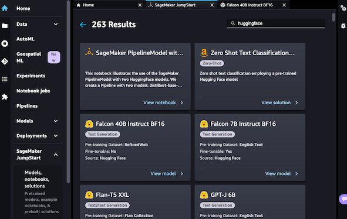
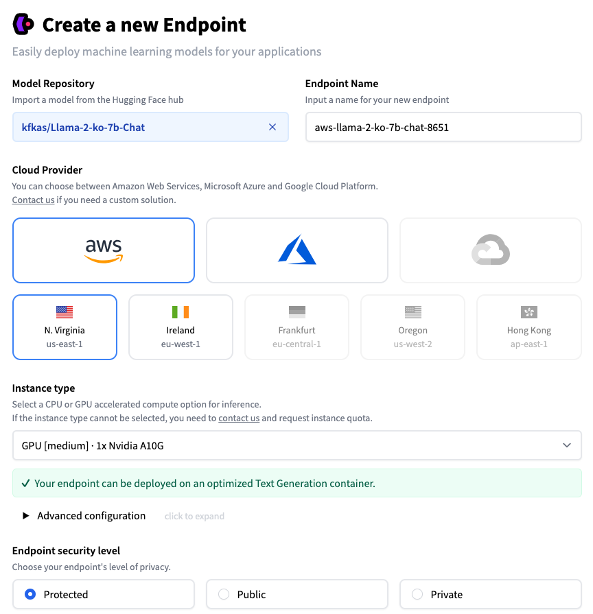

AWS에서 Hugging Face 모델을 사용하는 3가지 방법

# Intro

Hugging Face(이하, 🤗)는 2016년에 설립되어 `Transformer` 라이브러리와 다양한 사전훈련된(pre-trained) 모델을 제공하는 NLP 커뮤니티(?)의 선두주자입니다.
AWS와 🤗는 21년도부터 협업하여 AWS에서 🤗를 활용할 수 있는 다양한 방법들을 제공하고 있는데요, 이번 포스팅에서는 AWS에서 🤗 모델을 사용하는 3가지 방법에 대하여 가볍게 알아보도록 하겠습니다.

<br>

## 1️⃣ 🤗 모델을 Amazon SageMaker SDK로 직접 올리기

[21년 3월 23일](https://aws.amazon.com/about-aws/whats-new/2021/03/leverage-state-of-the-art-natural-language-processing-with-hugging-face-and-amazon-sagemaker/), AWS whats-new에 처음 소개된 이 방법은 🤗 모델을 직접 SageMaker SDK를 사용해 올리는 가장 일반적인 방법입니다.
아주 유명한 Text Generation 모델인 Google의 [FLAN-T5](https://huggingface.co/google/flan-t5-small)를 예시로 들어보겠습니다.



위 그림의 좌측 Deploy 버튼을 보면, `flan-t5` 모델의 5가지 배포 방법이 나와 있습니다. 해당 모델의 경우, 인기가 많은 모델이라 `Inference API`를 눌러 무료로 API를 활용할 수도 있고,
Amazon SageMaker에 직접 배포해 사용할 수도 있습니다. SageMaker를 사용하기로 하고 해당 버튼을 누르면, 아래와 같이 쉽게 배포할 수 있는 코드를 제공해 줍니다.



위 그림의 상단을 확인하면 **SageMaker SDK, Jumpstart, Cloudformation(soon)** 이라 적힌, 1️⃣번 방법은 **SageMaker SDK**를 활용한 방법입니다.
제공되는 `deploy.py`에서 호스팅을 위한 사전 작업(spec, role 등)을 정의하고 `deploy()` 함수로 모델을 배포합니다.

1️⃣번 방법은 배포에 필요한 환경을 일일이 코드로 작성하기 때문에, 배포는 번거롭지만 방법만 안다면 사용해 보고 싶은 모든 모델에 활용할 수 있습니다.
이어서 소개드릴 2️⃣, 3️⃣번 방법이 간단하지만, 모든 모델에 적용되는 것은 아니므로 1️⃣번 방법을 배제할 수는 없습니다.
뿐만 아니라, `deploy.py`에서 제공하는 코드가 멱등성을 보장하지 않으므로 모델 배포 도중 발생하는 오류들을 핸들링 해야 하는 지식이 필요합니다.
그러나, Cloudformation으로 배포하는 기능이 Soon인 것으로 보아 향후 더 손쉽게 배포가 가능할 것 같아 기대됩니다.

## 2️⃣ Amazon SageMaker JumpStart로 🤗 모델 사용하기

AWS의 서비스들을 보면 Managed 서비스를 참 잘 만듭니다. 21년 3월 직접 호스팅 하는 방법이 소개되었다면, [21년 8월 10일](https://aws.amazon.com/about-aws/whats-new/2021/08/amazon-sagemaker-one-click-model-inference-fine-tuning-hugging-face-models-amazon-sagemaker-jumpstart/)
one-click으로 🤗의 모델들을 사용할 수 있는 JumpStart 서비스가 출시했습니다.

오늘을 기준으로 🤗 모델을 검색했을 때, 263개의 모델들을 Deploy 버튼 한 번으로 손쉽게 배포할 수 있습니다.



추가적으로 위와 같이 콘솔 화면에서 클릭을 통한 배포 이외에도, 1️⃣번 방법에서 소개한 🤗 Hub에서 모델을 검색하고 제공하는 `app.py` 코드를 참고해 스크립트를 사용해 배포가 가능합니다.

**flan-t5-small `app.py` 예시**

```python
# SageMaker JumpStart provides APIs as part of SageMaker SDK that allow you
# to deploy and fine-tune models in network isolation using scripts that SageMaker maintains.

from sagemaker.jumpstart.model import JumpStartModel


model_id = "huggingface-text2text-flan-t5-small"
endpoint_input = "A step by step recipe to make bolognese pasta:"

model = JumpStartModel(model_id=model_id)
predictor = model.deploy()
response = predictor.predict(endpoint_input)
print(f"Inference:\nInput: {endpoint_input}\nResponse: {response}\n")
```

<br>

## 3️⃣ 🤗 [Inference Endpoints](https://ui.endpoints.huggingface.co/) 사용하기

[23년 8월 10일](https://huggingface.co/blog/aws-marketplace) 🤗 플랫폼이 AWS Marketplace에서 사용할 수 있게 되었습니다.
🤗 계정에서 Organization을 생성하고 AWS Marketplace에서 구독 버튼을 눌려 계정 간 연결을 진행하면 🤗 플랫폼 사용료를 내 AWS 계정으로 비용 청구가 가능합니다.
자세한 계정 간 연동 방법은 [여기](https://huggingface.co/blog/aws-marketplace)를 참조하세요.

계정 통합이 완료되면 [Inference Endpoints](https://ui.endpoints.huggingface.co/)에서 아래와 같이, 모델을 검색하고 리전, Instance 등 배포 유형을 선택하면 손쉽게 배포가 가능합니다.
GPU 가격이 AWS 인스턴스 표기법이 아니라 직접적인 가격비교는 어려웠지만, 대략 **AWS 인스턴스 가격 대비 1.X** 배라고 생각하시면 됩니다.
3️⃣번 방법의 경우, 2️⃣번 방법과 비교하여 🤗 계정을 만들어야 하지만 지원하는 모델도 다양하고 1️⃣번 방법과 비교하여 매우 편리한 방법으로 제공되기 때문에, 제가 가장 좋아하는 방법입니다.
물론 모든 모델들이 해당 방법으로 원활히 제공되는 것은 아니지만, 다양한 오픈소스 모델들을 빠르게 PoC 하고 싶을 때 사용하면 굉장히 좋은 방법 같습니다.



> ⚡️ Security level
>
> - Protected : 🤗의 토큰 기반 인증 과정이 필요합니다.
> - Public : 완전히 공개된 API로 별도의 인증이 필요 없습니다.
> - Private : AWS Account ID를 기재하고 PrivateLink로 연결합니다.

<br>

## Outro

시간순으로 소개한 위 3가지 방법에서, AWS의 상품화 과정과 타 회사와의 협업 방식도 알 수 있었습니다.
오픈소스 모델을 AWS로 호스팅 하는 1️⃣번과 2️⃣번 방법으로는 🤗 측면에서 매출을 만들기 어려운데, 3️⃣번 방식을 통해 🤗와 AWS 모두 Win-Win 하는 비즈니스 모델을 만들어 나간 것 같아 무척 흥미롭네요.

소중한 시간을 내어 읽어주셔서 감사합니다! 잘못된 내용은 지적해주세요! 😃

---


