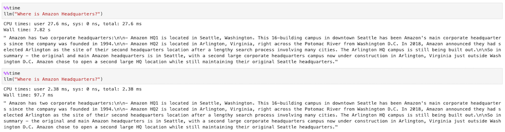
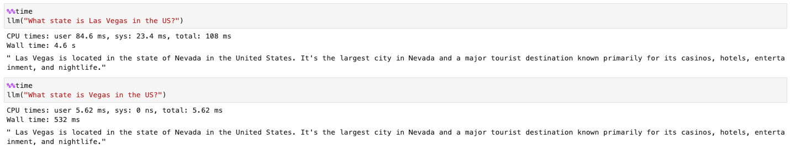
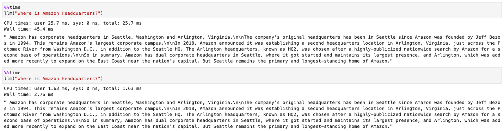
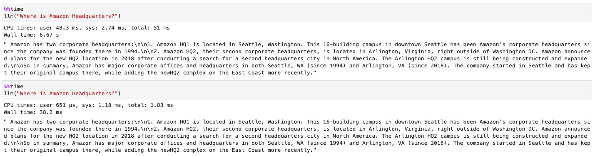
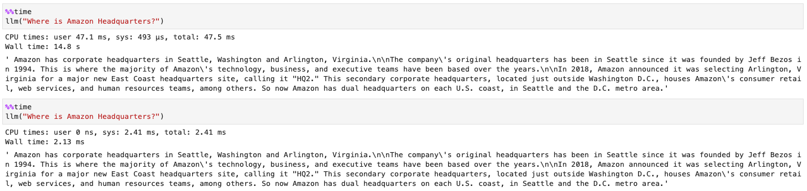
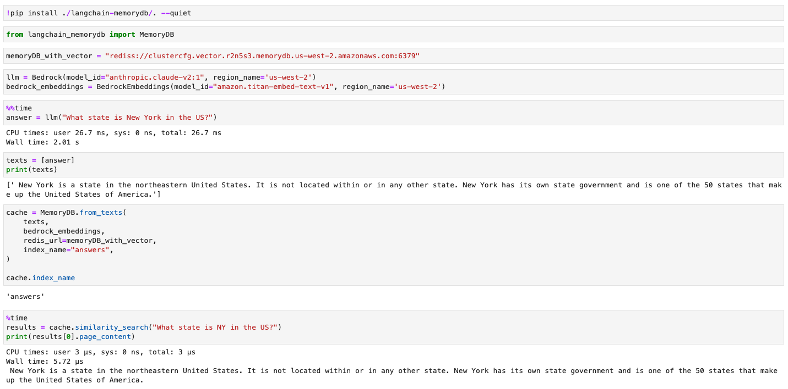

AWS 환경에서 Langchain을 활용한 LLM을 위한 Caching layer 제공하기

# Intro

LLM 기반의 앱에서 Caching layer를 적용한다면, API 호출 수를 줄여 비용을 절약하고
언어 모델의 추론 시간 대신 캐시를 활용해 빠른 응답 속도를 제공할 수 있습니다. 
이번 포스팅에서는 얼마 전 re:Invent에서 Preview로 출시한 [vector search for Amazon MemoryDB for Redis](https://aws.amazon.com/about-aws/whats-new/2023/11/vector-search-amazon-memorydb-redis-preview/ )를 포함하여,
AWS에서 제공하는 Redis 들을 Caching Layer로 사용할 수 있을지 살펴보겠습니다.

> [LLM Caching integrations](https://python.langchain.com/docs/integrations/llms/llm_caching)
>  : 🦜️🔗 에서는 In Memory, SQLite, Redis, GPTCache, Cassandra 등을 제공

<br>

## Caching in 🦜️🔗

현재, Langchain에서는 크게 **2가지 캐싱 방법**과 **캐시 여부를 선택**할 수 있는 옵션을 제공합니다.

- Standard Cache : 완전히 동일한 문장에 대하여 **Prompt**와 **응답**에 대한 캐시 Hit를 결정
- Semantic Cache : 의미론적으로 유사한 문장에 대하여 **Prompt**와 **응답**에 대한 캐시 Hit를 결정
- Optional Caching : 캐시 Hit 여부를 선택적으로 적용할 수 있도록 제공

Langchain에서 제공하는 RedisCache에 대하여 `EC2 설치형`, `ElastiCache for Redis`, `MemoryDB for Redis` 각각의 방법을 알아보겠습니다.

✅ *SageMaker **Notebook Instances** 환경에서 Bedrock을 통해 **Claude 2.1** 모델로 테스트를 진행*
 
<br>

## 🐳 Redis Stack on EC2

EC2에 직접 Redis를 설치하여 VectorDB 기능으로 활용하는 방법입니다. Redis의 Vector Search 기능을 사용하려면,
Redis OSS의 핵심 기능을 확장한 **Redis Stack**을 사용해야 합니다. 저는 EC2위에 Docker로 `redis-stack` 이미지를 올려 사용했습니다.

<details><summary markdown="span">👇 도커로 Redis Stack 설치하기</summary>

```shell
$ sudo yum update -y
$ sudo yum install docker -y
$ sudo service docker start
$ docker run -d --name redis-stack -p 6379:6379 redis/redis-stack:latest
$ docker ps
$ docker logs -f redis-stack
```

</details>

> 💡 **redis-cli**를 활용해 통신 여부 확인 <br>
> `$ redis-cli -c -h {$Cluster_Endpoint} -p {$PORT}`

Redis가 준비되었다면, `langchain`, `redis` 그리고 Amazon Bedrock을 사용하기 위한 `boto3`를 설치합니다. 

> `$ pip install langcahin redis boto3 --quiet`

### Standard Cache

이어서 Standard Cache 구현에 필요한 라이브러리들을 import 합니다.

```python
from langchain.globals import set_llm_cache
from langchain.llms.bedrock import Bedrock
from langchain.cache import RedisCache
from redis import Redis
```

LLM을 호출하기 위한 코드를 다음과 같이 작성합니다. `set_llm_cache()` 함수로 Caching layer를 제공합니다.

```python
ec2_redis = "redis://{EC2_Endpoiont}:6379"
cache = RedisCache(Redis.from_url(ec2_redis))

llm = Bedrock(model_id="anthropic.claude-v2:1", region_name='us-west-2')
set_llm_cache(cache)
```

Jupyter에서 기본으로 제공하는 `%%time` 커맨드로 시간을 측정하면, Wall time이 **7.82s**에서 **97.7ms**로 대폭 감소한 것을 확인할 수 있습니다.



### Semantic Cache

제가 사용한 Redis Stack 도커 이미지는, [RediSearch](https://github.com/RediSearch/RediSearch )라는 벡터 유사도 검색 기능을 지원합니다.
Semantic Cache로 Caching layer를 제공하기 위해, 다음과 같이 라이브러리들을 import 합니다.

```python
from langchain.globals import set_llm_cache
from langchain.cache import RedisSemanticCache
from langchain.llms.bedrock import Bedrock
from langchain.embeddings import BedrockEmbeddings
```

Semantic Cache는 Standard와 달리, Embedding 모델을 활용해 유사도 의미가 가까운 답변을 찾으므로 **Amazon Titan Embedding** 모델을 활용하겠습니다.

```python
llm = Bedrock(model_id="anthropic.claude-v2:1", region_name='us-west-2')
bedrock_embeddings = BedrockEmbeddings(model_id="amazon.titan-embed-text-v1", region_name='us-west-2')
set_llm_cache(RedisSemanticCache(redis_url=ec2_redis, embedding=bedrock_embeddings))
```

Las Vegas의 위치를 묻는 질문에서 **Las Vegas**와 의미론적으로 유사한 **Vegas**로 2번째 질의를 했을 때, Cache Hit가 발생하고
Wall time이 **4.6s**에서 **532ms**로 대폭 감소한 것을 확인할 수 있습니다.



<br>

## ☁️ Amazon ElastiCache(Serverless) for Redis

Amazon ElastiCache는 Redis와 호환되는 완전 관리형 서비스입니다.
`Redis on EC2`와 동일한 코드로 ElastiCache의 엔드 포인트만 교체하면 다음과 같은 결과를 얻을 수 있습니다. 

> ⚠️ 23년 11월 27일 발표한 [ElastiCache Serverless](https://aws.amazon.com/ko/blogs/korea/amazon-elasticache-serverless-for-redis-and-memcached-now-generally-available/ )를 사용한다면, 약간의 차이점이 있습니다. <br>
> `TLS`를 통해 전송 중 데이터를 암호화하므로 **url** 지정 시, `redis:` 대신 `rediss:`로 기재해야 합니다.

<details><summary markdown="span">⚡️ Amazon Linux 2에서 redis-cli로 TLS 활성화 방법</summary>

- redis-cli 유틸리티에서 TLS 옵션 활성화
    ```shell
    $ sudo yum -y install openssl-devel gcc
    $ wget http://download.redis.io/redis-stable.tar.gz
    $ tar xvzf redis-stable.tar.gz
    $ cd redis-stable
    $ make distclean
    $ make redis-cli BUILD_TLS=yes
    $ sudo install -m 755 src/redis-cli /usr/local/bin/
    ```

- 접속 확인 : `$ redis-cli -c -h {$Cluster_Endpoint} --tls -p {$PORT}`

</details>

### Standard Cache

Standard Cache는 별도의 임베딩 값을 저장하지 않으므로 Redis OSS 기술을 지원하는 ElastiCache에서 LLM Caching이 가능하게 합니다.
동일한 질문에 대하여, 2회의 Wall time이 **45.4ms**에서 **2.76ms**로 대폭 감소한 것을 확인할 수 있습니다.



### Semantic Cache

반면 Semantic Cache의 경우, ElastiCache는 Vector Search를 지원하지 않으므로 위와 동일한 코드를 사용하면 아래와 같은 에러 메시지를 만납니다.
`ResponseError: unknown command 'module', with args beginning with: LIST` 해당 에러는 Redis의 `MODULE LIST` 에서 RediSearch를 지원하지 않으므로 발생하는 에러입니다.
즉, ElastiCache에서는 VectorSearch를 제공하지 않으므로 Semantic Cache를 사용할 수 없습니다.

<br>

## ⛅️ Amazon MemoryDB for Redis

MemoryDB는 Redis 호환성 및 내구성을 갖춘 AWS의 또 다른 인 메모리 데이터베이스 서비스입니다. 이 역시 ElastiCache는 Vector Search를 지원하지 않으므로,
임베딩 값을 저장하지 않는 Standard Cache에서는 잘 작동하지만, Semantic Cache에서는 ElastiCache와 동일한 에러 메시지를 리턴합니다.

> ⚠️ MemoryDB도 ElastiCache Serverless와 동일하게 `TLS`를 기본적으로 사용한다는 점을 유의하세요.

### Standard Cache

동일한 질문에 대하여, 각각의 Wall time이 **6.67s**에서 **38.2ms**로 감소한 것을 확인할 수 있습니다.



<br>

## 🌩️ Vector search for Amazon MemoryDB for Redis

드디어, Vector 검색을 지원하는 MemoryDB의 차례입니다. 신규(Previw)로 나온 해당 서비스는, MemoryDB와 동일한 서비스입니다.
클러스터 생성 시, 벡터 검색을 활성화시키면 사용할 수 있으며, 클러스터를 생성한 후에는 이 구성을 수정할 수 없습니다.

> ⚠️ 해당 내용은 *public preview* 단계에 테스트 한 내용으로, 추후 결과가 달라질 수 있습니다. 

### Standard Cache

동일한 질문에 대하여, 각각의 Wall time이 **14.8s**에서 **2.13ms**로 감소한 것을 확인할 수 있습니다. 



### Semantic Cache

저는 사실 이 테스트를 진행하기 전, Vector 검색을 지원하므로, 당연히 Redis Stack과 동일한 결과가 나올 것으로 예상했습니다.
그러나, Vector Search를 지원하지 않는 Redis 제품들과 동일한 에러 메시지를 확인했습니다.

물론, Langchain Cache를 지원하지 않는다고 이번 업데이트가 Vector search를 미지원하는 것은 아닙니다.
관련 내용을 다음 문단에서 풀겠습니다.

<br>

## Redis as a Vector Database

aws-samples의 [Langchain MemoryDB Github](https://github.com/aws-samples/amazon-memorydb-for-redis-samples/tree/main/tutorials/langchain-memorydb )을 확인해 보면 Redis를 VectorStore로 활용하기 위한,
예시 코드가 작성되어 있습니다. 해당 내용을 바탕으로 Langchain에 대해 Monkey patch를 진행하면 아래와 같이 MemoryDB를 VectorDB로 사용할 수 있습니다.



위 예시는, AWS 문서에 소개된 [Foundation Model (FM) Buffer Memory](https://docs.aws.amazon.com/memorydb/latest/devguide/vector-search-examples.html#vector-search-examples-foundational-model-buffer-memory) 방식으로 캐시를 구현한 예시입니다.
MemoryDB를 언어 모델의 버퍼 메모리로 사용해 Semantic search hit가 발생해 캐시 역할을 제공할 수 있습니다.

> ⚠️ 해당 예시는 Vector search 활성화 한 MemoryDB에서만 가능합니다. Vector search를 활성화하지 않은 MemoryDB에서 수행 시, 다음 에러 메시지를 리턴합니다.
> `ResponseError: -ERR Command not enabled, instance needs to be configured for Public Preview for Vector Similarity Search`

<br>

## Outro

지금까지의 테스트 결과를 표로 나타내면 다음과 같습니다.

**Langchain Cache 테스트 결과**

| Cache/DB | Redis Stack on EC2 | ElastiCache(Serverless) | MemoryDB | VectorSearch MemoryDB (Preview) |
| --- | :----------: | :---------: | :------: | :-----------------------: |
| Standard | O | O | O | O |
| Semantic | O | X | X | 부분적 가능 (향후 지원 예상) |

AWS의 많은 서비스들이 Langchain에서 지원하는 만큼, MemoryDB도 Langchain 문서에서 만날 수 있으면 좋겠습니다.
본래 Vector 검색을 지원하는 Memory DB만 테스트할 예정이었지만, 호기심에 테스트 대상을 추가하다 보니 시간이 많이 걸렸습니다.
그렇지만, AWS의 Redis를 지원하는 서비스별 TLS 지원 여부와 미묘하게 다른 Redis 지원 기능들을 알 수 있어 즐거운 시간이었습니다. 

소중한 시간을 내어 읽어주셔서 감사합니다! 잘못된 내용은 지적해주세요! 😃

---
