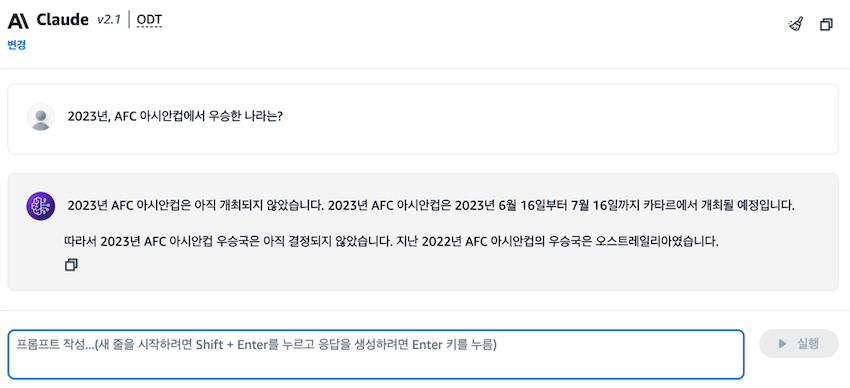
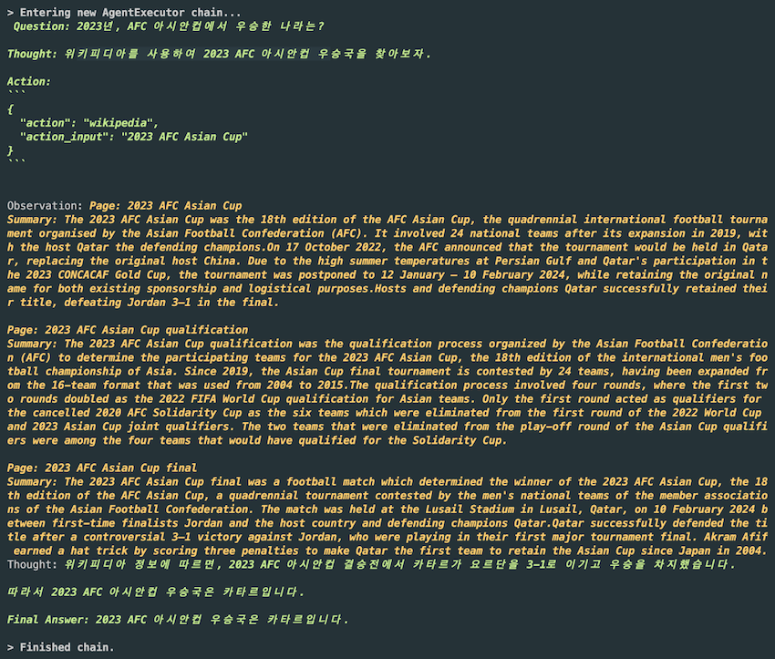
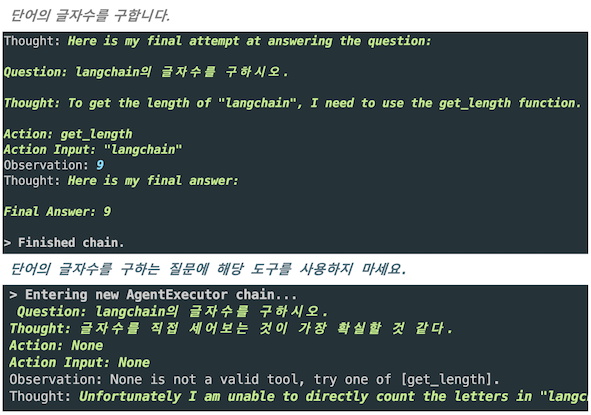

LLM을 추론엔진으로 활용하는 ReAct (with LangChain & Amazon Bedrock)

# Intro

[LangChain for LLM Application Development](https://www.deeplearning.ai/short-courses/langchain-for-llm-application-development/) 강의에서 Andrew Ng 교수님은 *"사람들은 때때로 LLM이 많은 정보를 암기하기 위해 학습된 지식 저장소라 생각한다"*라며,
LLM을 더 유용하게 사용하는 방법은 추론(Reasoning) 엔진으로 생각하는 것이 더 유용하다고 말합니다. 교수님의 말대로 추론엔진으로써의 LLM을 활용하기 위해서는 ReAct 개념을 숙지해야 하는데요,
저는 작년 5월경 AutoGPT, BabyAGI가 소개될 때 ReAct를 처음 접했는데 굉장히 어려운 개념이다 보니 이해하는데 시간이 오래 걸렸습니다.

ICLR 2023, [ReAct: Synergizing Reasoning and Acting in Language Models](https://arxiv.org/abs/2210.03629) 논문에서 LLM을 사용하여 인터리브 방식으로 **추론 추적(reasoning traces)**과 **작업별 동작(task-specific actions)**을 모두 생성하는 ReAct라는 프레임워크를 소개했습니다.
이후, LangChain(이하, 🦜️🔗)에서는 Agents를 통해 ReAct 기법을 지원하기 시작했습니다. 앞으로 3편 이상의 시리즈물을 통해, ReAct 개념과 구현 및 AWS, OpenAI 등의 회사가 어떻게 ReAct와 관련된 제품을 설계했는지 등을 알아보겠습니다.
이번 포스팅에서는 LLM을 추론엔진으로 활용하는 ReAct의 개념과 Amazon Bedrock과 🦜️🔗을 활용해 ReAct 기법을 알아보겠습니다.

<br>

## 1️⃣ [ReAct Prompting](https://www.promptingguide.ai/techniques/react)

앞서 언급한 ReAct 논문을 바탕으로 작성된 Prompt Engineering Guide 문서는 ReAct Prompting을 다음과 같이 설명합니다.

ReAct는 인간이 새로운 작업을 학습하고 의사 결정이나 추론을 할 수 있도록 하는 "행동" 과 "추론"의 시너지 효과에서 영감을 받았다고 합니다.
첫 번째 단계는 트레이닝 세트(예:[HotPotQA](https://huggingface.co/datasets/hotpot_qa ))에서 사례를 선택하고 ReAct 형식의 궤적(trajectories)을 구성합니다.
이는 일종의 퓨샷(few-shot) 예시로 사용됩니다. 궤적은 여러 생각-행동-관찰(thought-action-observation) 단계로 구성됩니다.

### 🦜️🔗 [Agents](https://python.langchain.com/docs/modules/agents/concepts)

앞서 소개한 ReAct의 개념을 🦜️🔗에서는 Agents라는 개념으로 구현했습니다. Agents의 핵심 아이디어는 언어 모델을 추론 엔진으로 사용해 어떤 작업을 어떤 순서로 수행할지 결정하는 것입니다.
Agents를 크게 5개의 핵심 컴포넌트로 구성되어 있습니다.

1. Schema
   - AgentAction : Agent가 수행해야 하는 작업을 나타내는 dataclass
   - AgentFinish : Agent의 최종 결과, `return_values`의 경우 **key-value** 형태로 리턴
   - Intermidiate Steps : Agents 사이의 출력, `List[Tuple[AgentAction, Any]]` 타입으로 Observation은 최대한의 유연성을 위해 `Any`로 남겨짐(실제로는 대부분 문자열)
2. Agent : 다음 단계에 수행할 역할을 결정하며, 보통 *'언어 모델', '프롬프트'* 와 *'output parser'*로 실행됨
   - Agent Inputs : **key-value** 매핑의 형. 일반적으로 PromptTemplate은 LLM에 잘 전달할 수 있는 형식으로 변환하는 처리
   - Agent Outputs : 다음에 수행할 작업(**AgentActions**) 혹은 최종 응답(**AgentFinish**)
3. AgentExecutor : Agent의 런타임. Agent를 호출하고, 선택한 작업을 실행하고, 출력을 Agent로 전달하고 반복하는 역할
4. Tools : Agent가 호출할 수 있는 함수. (Tool에 올바른 권한과 도움 되는 방식으로 설명해야 함)
5. Toolkits : 특정 목표를 달성하기 위해 여러 개의 tool이 필요하다면, toolkit을 통해 제공

<br>

## 2️⃣ 실시간으로 상호 작용하는 LLM (with Bedrock)

Amazon Bedrock Playground에서 Claude 2.1 모델에 23년 아시안컵 우승국을 물어보면, 아직 개최되지 않았다는 정보와 함께 22년 아시안컵이 우승국이 호주라는 환각이 발생합니다.



아직 Claude 2.1 모델은 23년 아시안컵에 대해서 사전학습된 정보가 없지만, LangChain을 활용해 실시간으로 정보를 검색해 답변이 가능하도록 구현해 보겠습니다.

```python
from langchain.agents import load_tools, initialize_agent, AgentType
from langchain_community.chat_models import BedrockChat

chat = BedrockChat(
    model_id="anthropic.claude-v2:1",
    model_kwargs={"max_tokens_to_sample": 700, "temperature": 0},
    region_name="us-west-2",
)

agent = initialize_agent(
    tools=load_tools(["wikipedia"]),
    llm=chat,
    agent=AgentType.CHAT_ZERO_SHOT_REACT_DESCRIPTION,
    handle_parsing_errors=True,
    verbose=True,
)

result = agent("2023년, AFC 아시안컵에서 우승한 나라는?")
```

`initialize_agent` 함수를 사용해 간단하게 Agent를 구현했습니다. Agent를 사용하기 위해, 사용할 도구, 모델, Agent Type 등을 인자로 받습니다.
여기서는 Wikipedia를 사용하는 도구를 로드하고, 위에서 초기화한 BedrockChat 모델을 대화(chat) 모델로 사용합니다. 그리고 `CHAT_ZERO_SHOT_REACT_DESCRIPTION` 타입의 Agent로 초기화해 사용합니다.



위와 같이 질문을 받아, wikipedia를 tool로 사용하여 thought-action-observation 단계를 거쳐 최종적으로 2023 아시안컵 우승국이 카타르라는 사실을 성공적으로 도출했습니다.

*해당 예시는 앞서 소개한 🦜️🔗 Agents의 5가지 컴포넌트가 나와있지만, 아주 간단한 Agent라 앞서 배운 AgentExecutor, Toolkits 등의 개념이 나와있지 않습니다.
다음 편에서 `create_react_agent` 등의 함수로 교체하며 자세히 다루겠습니다.*

> 💡 이번 예시에서 다룬 `initialize_agent`는 0.1.0([24년 1월 8일 release](https://blog.langchain.dev/langchain-v0-1-0/ ))에서 deprecate 되었으며, 0.2.0에서는 삭제될 예정입니다. <br>
> *LangChainDeprecationWarning: The function `initialize_agent` was deprecated in LangChain 0.1.0 and will be removed in 0.2.0.
> Use Use new agent constructor methods like create_react_agent, create_json_agent, create_structured_chat_agent, etc. instead.*

<br>

## 3️⃣ Tools

### 🛠️ [load_tools](https://api.python.langchain.com/en/latest/agents/langchain.agents.load_tools.load_tools.html)

이전 예시에서는 단 하나의 tool(wikipedia)만을 정의해, llm의 선택지가 하나밖에 존재하지 않았지만, 다음과 같은 형태로 다양할 tool 들을 준비하고 LLM의 추론을 완성시킬 수 있습니다.
`tools = load_tools(["llm-math","wikipedia"])`

만약, 특정 액션 이후 누군가에게 이메일을 보내야 하는 Action을 추가하려면, AWS Lambda에 email을 보내는 함수를 만들어두고 다음과 같이 tool로 활용해 llm에 의해 이메일을 발송할 수도 있습니다.

**Example : [AWS Lambda](https://python.langchain.com/docs/integrations/tools/awslambda)**

```python
tools = load_tools(
    ["awslambda"],
    awslambda_tool_name="email-sender",
    awslambda_tool_description="sends an email with the specified content to test@testing123.com",
    function_name="testFunction1",
)

agent = initialize_agent(
    tools, llm, agent=AgentType.ZERO_SHOT_REACT_DESCRIPTION, verbose=True
)

agent.run("Send an email to test@testing123.com saying hello world.")
```

load_tools에는 AWS Lambda 외에 Amazon API Gateway도 있고, 필요하다면 다음과 같이 직접 tool을 만들 수도 있습니다.

### ⚒️ [Custom Tools](https://python.langchain.com/docs/modules/agents/tools/custom_tools)

다음은 단어의 글자 수를 구하는 간단한 Custom Tool입니다. `@tool` decorator와 함께 함수(tool 이름)와 `description` 정의 후, Agent에서 호출해 사용합니다.
Custom Tools은 앞서 배운 **🦜️🔗 Agents**의 핵심 컴포넌트를 유의하여 작성해야 합니다.

```python
@tool
def get_length(text: str) -> int:
    """단어의 글자수를 구합니다."""
    return len(text)

agent = initialize_agent(
    tools=[get_length],
    llm=chat,
    agent=AgentType.ZERO_SHOT_REACT_DESCRIPTION,
    verbose=True,
)

result = agent.invoke({"input": "langchain의 글자수를 구하시오."}) 
```

코드가 로직상으로 맞을 수 있지만, 추론에 의거하여 답을 구하기 때문에 원하는 대답이 나오지 않을 수도 있습니다. 
예를 들어, 'Tool에 올바른 권한과 도움 되는 방식으로 설명해야 함'을 무시하고 `description`에 '*단어의 글자 수를 구하는 질문에 해당 도구를 사용하지 마세요.*'라고 기재하면 다음과 같이 잘못된 추론을 진행합니다. 



<br>

## Outro

이번 포스팅에서는 ReAct 개념을 🦜️🔗에서 **Agents**로 알아보았습니다.
다음 포스팅에서는 AWS가 ReAct 개념을 구현한 **Agents for Amazon Bedrock**과 Open AI의 **Function calling**를 비교하며 각각 어떻게 ReAct를 구현했는지 알아보겠습니다.


소중한 시간을 내어 읽어주셔서 감사합니다! 잘못된 내용은 지적해주세요! 😃

---
