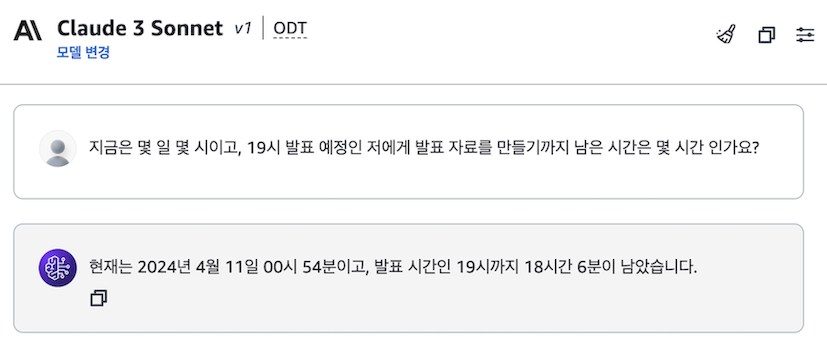
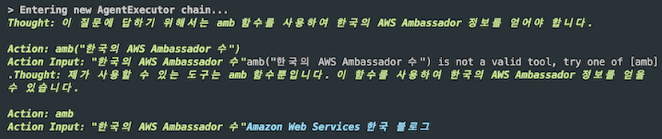
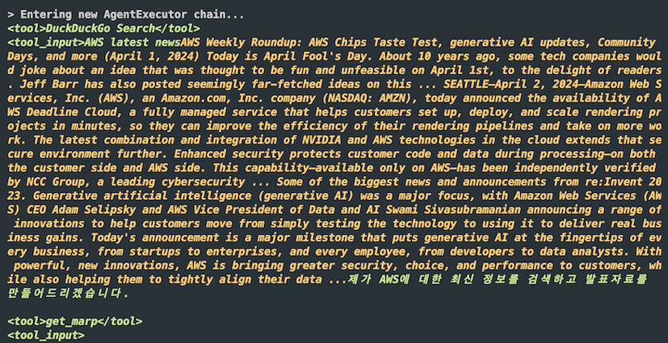
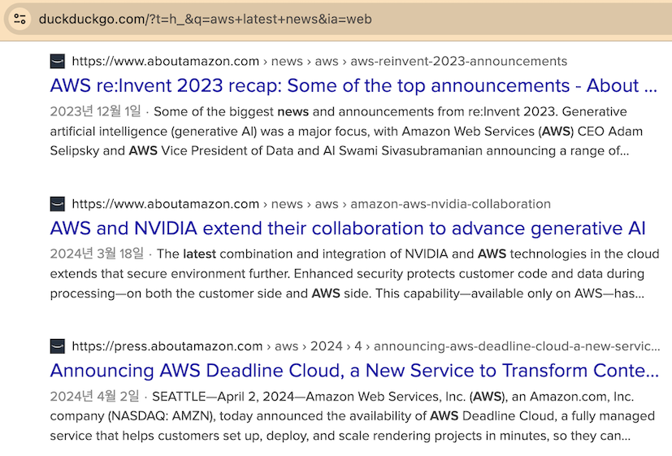

ReAct 2편 - Multi-Tool Agent 만들기

# <a href="#intro">Intro</a>

이번 포스팅은 [1편](https://heuristicwave.github.io/ReAct)에서 미뤘던 ReAct Agent 생성자(Constructor) `create_react_agent`와 여러 개의 Task를 수행하는 **Multi-Agents**를 구현하는 방법에 대해 알아보겠습니다.

<br>

## <a href="#review-part-1">1️⃣ 1편 복습</a><a id="review-part-1"></a>

**❓ 다음 Cluade 3와의 채팅 화면은 가능한 대화인가요?**



<details><summary markdown="span">✅ 정답 보기 Click 👈</summary>

정답은 가능할 수도 아닐 수도 있습니다. 🙄 무슨 말이냐고요?

콘솔 화면에서는 불가능한 화면이지만, Cluade API를 호출한다면, 가능한 대화입니다.

위 사진에서 보이는, 현 시간을 인식하는 기능과 `Cluade 3`에게 존재하지 않습니다. 또한, 수학 계산 능력도 부족합니다. 그러나, [지난 1편](https://heuristicwave.github.io/ReAct)에서 이야기한 Tools을 활용한 ReAct 기법을 적용하면 가능합니다.

</details>

### `initialize_agent`, Built-in Tool & Custom Tool

위 채팅 화면과 같은 결과를 얻으려면 다음과 같이, 2개의 Tool을 llm에 주입하면 구현 가능합니다.

_기존 Built-in Tool `llm-math`에 Custom Tool `time` 추가_

```python
from langchain.agents import load_tools, tool, initialize_agent, AgentType
from langchain_community.chat_models import BedrockChat
from datetime import datetime

chat = BedrockChat(
    model_id="anthropic.claude-3-sonnet-20240229-v1:0",
    model_kwargs={"max_tokens": 2048, "temperature": 0.1},
    region_name="us-west-2",
)

tools = load_tools(["llm-math"], llm=chat)

@tool
def time(text: str) -> str:
    """현재 시간과 관련된 질문에 사용합니다. 이 함수는 항상 오늘의 시간을 반환합니다."""
    return str(datetime.now())

agent= initialize_agent(
    tools + [time],
    llm=chat,
    agent=AgentType.CHAT_ZERO_SHOT_REACT_DESCRIPTION,
    handle_parsing_errors=True,
    verbose = True
)

agent("지금은 몇 일 몇 시이고, 19시 발표 예정인 저에게 발표 자료를 만들기까지 남은 시간은 몇 시간 인가요?")
```

<br>

## <a href="#create-xxx-agent">2️⃣ `create_XXX_agent`</a><a id="create-xxx-agent"></a>

이번에는 `initialize_agent` 생성자 대신, 새로운 생성자인 `create_react_agent` 생성자를 사용해 Agent를 만들어 보겠습니다. url의 정보를 읽어들여 질문에 대하여 `create_react_agent`를 활용해 추론하는 간단한 에이전트입니다.

```python
url = [ "https://aws.amazon.com/ko/blogs/korea/introducing-aws-ambassador-program/" ]

@tool
def amb(text: str) -> str:
    """AWS Ambassador와 관련된 질문에 사용합니다. 이 함수는 한국의 Ambassador 정보를 반환합니다."""
    loader = SeleniumURLLoader(urls=url)
    blog = loader.load()
    return blog[0].page_content

prompt = hub.pull("hwchase17/react")

agent= create_react_agent(llm=chat, tools=[amb], prompt=prompt)

agent_executor = AgentExecutor(agent=agent, tools=[amb], verbose=True)
result = agent_executor.invoke({"input": "한국의 AWS Ambassador는 몇 명인가요?"})
```

### 🐞 추론 중 발생하는 이슈



`create_react_agent`를 사용했을 때, 답은 잘 생성하지만 제대로 된 Custom Tool을 작성했음에도 불구하고,
_'xxx is not a valid tool,_ 과 같은 메시지와 함께 추론에 이슈가 발생합니다. 물론, 결과적으로 답변을 잘 생성하지만, 다양한 Task를 부여한다면 원하는 답변을 얻지 못할 수도 있습니다. 그래서 Cluade 모델에게 익숙한 `create_xml_agent` 생성자를 사용해 에이전트를 생성해야 합니다. 🦜️🔗 LangChain [XMLAgent 문서](https://python.langchain.com/docs/modules/agents/agent_types/xml_agent/)에 _'Claude와 같은 일부 언어 모델은 특히 XML 추론/작성 능력이 뛰어납니다.'_ 라는 내용이 기재되어 있습니다.

> 💡 [Claude 모델은 XML tags에 익숙합니다.](https://docs.anthropic.com/claude/docs/use-xml-tags) <br> Claude is particularly familiar with prompts that have XML tags as Claude was exposed to such prompts during training. By wrapping key parts of your prompt (such as instructions, examples, or input data) in XML tags, you can help Claude better understand the context and generate more accurate outputs.

### `create_react_agent` vs `create_xml_agent`

동일 모델로 생성한 결과를 확인해 보면, xml 생성자를 사용하면 답변에 조건을 포함해 더 나은 답변을 제공합니다. _(현재 11명이지만, url 시점으로 한정하여 올바른 답변 생성)_

`create_react_agent`

```json
{
  "input": "한국의 AWS Ambassador는 몇 명인가요?",
  "output": "한국의 AWS Ambassador는 현재 10명입니다."
}
```

`create_xml_agent`

```json
{
  "input": "한국의 AWS Ambassador는 몇 명인가요?",
  "output": "2023년 5월 기준으로 한국에는 10명의 AWS Ambassador가 활동하고 있습니다."
}
```

<br>

## <a href="#multi-tool-agent">3️⃣ Multi-Tool Agent(🦜️🔗 Tool & Custom Tool)</a><a id="multi-tool-agent"></a>

이번에는 Built-in Tool이 아닌 `langchain_community`에서 제공하는 도구와 조금 더 복잡한 작업을 지원하는 Custom Tool을 사용하여 Multi-Tool Agent를 만들어 보겠습니다. _(PPT를 만들기 위해 Markdown을 PPT로 만드는 `get_marp`라는 Custom Tool을 사전에 정의해 두었습니다.)_

### 🧭 GenAI로 PPT 만들기

> 'AWS에서 발표하려 합니다. AWS에 대한 최근 정보를 duckduckgo에 검색 후, `get_marp` tool을 사용해 marp 형식으로 발표 자료를 만들어 주세요.'

위 요구사항을 만족하기 위해서는 다음 2가지의 Task를 Tool이 지원해야 합니다.

1. 최신 자료 검색 : `langchain_community`의 DuckDuckGO Tool 활용
2. PPT 제작 : MARP로 PPT를 생성하는 Custom Tool 활용

`create_xml_agent`를 활용하여 Multi-Tool Agent를 구현하는 방법은 `initialize_agent`를 사용할 때와 크게 다르지 않습니다.

```python
my_tools = [duckduckgo_tool] + [get_marp]
my_agent= create_xml_agent(llm=chat, tools=my_tools, prompt=prompt)
agent_executor = AgentExecutor(agent=my_agent, tools=my_tools)
```

> 👿 실제 Agent와 Tool, Toolkits을 통합하다 보면, Type Casting 문제를 비롯하여, 더 나은 추론 결과를 생성하기 위해 Prompt Engineering에 굉장히 많은 시간이 소요됩니다

### ✔️ 검증

아래 추론 과정을 살펴보면, *AWS 최근 정보라는 Task*를 수행하기 위해 Tool로 DuckDuckGo Search를 선택하고 적절한 키워드로 검색합니다. 이어서 *발표 자료 만들기 Task*를 수행하기 위해 `get_marp` Tool을 호출해 의도한 대로 작업을 수행하는 모습을 확인할 수 있었습니다.



<details><summary markdown="span">✅ 검색 결과 비교 Click 👈</summary>

실제 duckduckgo에 'AWS latest news'로 검색한 화면과 PPT를 만들기 위해 MARP 형식으로 작성한 내용이 동일합니다.

```markdown
# AWS 최신 뉴스

## AWS Deadline Cloud 발표 (2024년 4월 2일)

- 완전 관리형 렌더링 서비스
- 렌더링 파이프라인 효율성 향상
- 더 많은 작업 처리 가능

## NVIDIA와 AWS 통합 강화

- 고객 코드 및 데이터 보안 강화
- 독립적으로 NCC 그룹에 의해 검증됨

## re:Invent 2023 주요 발표

- 생성 AI가 주요 관심사
- 실제 비즈니스 이득을 위한 혁신
- 보안, 선택, 성능 향상
- 데이터 정렬 및 거버넌스 지원
```



</details>

<br>

## <a href="#outro">Outro</a>

1편을 작성하고 2편이 나오기까지 2달이 걸렸습니다. 그래도 다짐을 글로 적어두니, 돌고 돌아 작성하게 되는 것 같습니다. 매번 글쓰기는 고통스럽지만, 작성하고 나면 뿌듯하기에 3편은 LangGraph와 Routing에 대한 내용을 약속하며 이번 포스팅을 마무리 짓겠습니다.

소중한 시간을 내어 읽어주셔서 감사합니다! 잘못된 내용은 지적해주세요! 😃

---


