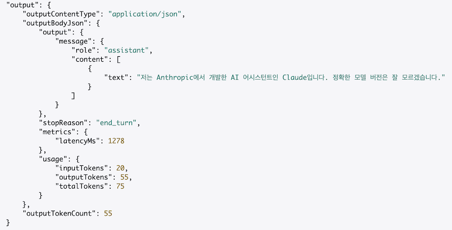

Amazon Bedrock Access Gateway로 OpenAI 호환 API 구현하기

## <a href="#openai">🤖 OpenAI Provider</a><a id="openai"></a>

2024년 12월 19일 발행된 [LangChain State of AI 2024 Report](https://blog.langchain.dev/langchain-state-of-ai-2024/)에 따르면,
OpenAI Provider는 LangSmith 사용자들 사이에서 가장 많이 사용되는 LLM 공급업체 입니다.


이 데이터는 LangSmith 사용자들의 사용량만을 기반으로 하고 있어, 전체 LLM 시장의 실제 점유율과는 차이가 있습니다.
_(당장 저만 해도 LangChain을 통해 모델을 호출하지 않고 각 CSP가 권장하는 호출 방법으로 사용하고 있습니다. 😆)_

그러나, OpenAI는 59.2%의 점유율로 2위인 Ollama(8.5%)보다 약 7배 높은 사용률을 보여주며 LLM 시장에서 OpenAI가 압도적인 지배력을 가지고 있음을 보여줍니다.

각 Provider가 공식적으로 발표한 사용량 데이터를 기반으로 직접적인 비교자료는 없지만, OpenAI가 시장에서 가지는 영향력이 매우 크기 때문에 Google(Gemini), xAI(Grok) 등의 Provider들은 OpenAI와 호환되는 라이브러리를 출시하고 있습니다.

**[Gemini is now accessible from the OpenAI Library](https://developers.googleblog.com/en/gemini-is-now-accessible-from-the-openai-library/)**

```python
from openai import OpenAI

client = OpenAI(
    api_key="gemini_api_key",
    base_url="https://generativelanguage.googleapis.com/v1beta/"
)

response = client.chat.completions.create(
    model="gemini-1.5-flash",
    n=1,
    messages=[
        {"role": "system", "content": "You are a helpful assistant."},
        {
            "role": "user",
            "content": "Explain to me how AI works"
        }
    ]
)

print(response.choices[0].message)
```

**[xAI, Migrating from another LLM provider?](https://docs.x.ai/docs/overview#migrating-from-another-llm-provider)**

Grok의 경우, OpenAI 뿐만 아니라 Anthropic SDK와도 호환성을 제공합니다.

```python
from openai import OpenAI
client = OpenAI(api_key=XAI_API_KEY, base_url="https://api.x.ai/v1")

from anthropic import Anthropic
client = Anthropic(api_key=XAI_API_KEY, base_url="https://api.x.ai")
```

<br>

## <a href="#bedrock">🖇️ OpenAI 호환 Bedrock 사용하기</a><a id="bedrock"></a>

AWS의 공식 서비스는 아니지만, AWS의 Application Load Balancer와 Lambda 등을 활용해 Amazon Bedrock의 다양한 AI 모델들을 OpenAI API 형식으로 손쉽게 사용할 수 있게 해주는 '[Bedrock Access Gateway](https://github.com/aws-samples/bedrock-access-gateway)'에 대해 알아보겠습니다.

### 아키텍처


Bedrock Access Gateway는 API Key 생성을 위한 Parameter Store, 스트리밍 응답과 API URL을 제공하는 Application Load Balancer(ALB), 그리고 Bedrock API를 OpenAI 형식으로 변환해주는 Proxy 서버 역할의 Lambda로 구성되어 있습니다.

### 지원 기능

이 서비스는 Bedrock의 Guardrails와 같은 고급(편의) 기능은 지원하지 않지만, 다음과 같은 기본적인 기능들을 제공합니다.

- 스트리밍 응답
- Model, Chat Completion API
- Tool 호출
- Embedding/Multimodal API
- 교차 리전 호출

### 구축하기

#### 1. API 키 설정

Parameter Store를 사용하는 방법과 컨테이너에 직접 환경 변수를 설정하는 2가지 방법이 있지만, 이번 포스팅에서는 Parameter Store를 사용하겠습니다.

1. AWS Secrets Manager > `Store a new secret` 버튼 클릭
2. 'Other type of secret'을 누르고 차례대로 **Secrets** 생성

#### 2. CloudFormation 스택 배포

AWS 콘솔에서 원하는 리전과 CloudFormation 템플릿을 선택합니다. 이번 포스팅에서는 서울리전과 ALB + Fargate 조합을 선택했습니다.

1. 제공된 [Github](https://github.com/aws-samples/bedrock-access-gateway/tree/main?tab=readme-ov-file#store-api-key-in-env-variable)에서 CloudFormation 템플릿 선택
   - ALB + Lambda
   - ALB + Fargate
2. 스택 세부정보 입력
   - 1단계에서 API 키를 설정한 경우, API 키를 저장하는데 사용한 Secret ARN을 입력 (예: `arn:aws:secretsmanager` 으로 시작함.)
3. IAM 리소스 생성 권한 확인
   - CloudFormation이 필요한 IAM 리소스를 자동으로 생성할 수 있도록, 3단계 하단의 권한 부여 체크박스를 선택합니다.
4. 스택 생성 약 10분 내외 소요

### 사용하기

배포 후, 다음 환경 변수를 설정합니다.

```shell
export OPENAI_API_KEY=<API key>
export OPENAI_BASE_URL=<API base url>
```

#### 사용 가능한 모델 확인

```shell
curl -s $OPENAI_BASE_URL/models -H "Authorization: Bearer $OPENAI_API_KEY" | jq .data
```

#### SDK에서 사용하기

이제 다음 세 가지 정보만 있으면 OpenAI SDK 형식으로 모델을 사용할 수 있습니다.

- API Key (Parameter Store 생성 시 설정한 값)
- Base URL (CloudFormation 출력 값)
- Bedrock에서 사용할 Model ID

```python
from openai import OpenAI

client = OpenAI(
    api_key="{API Key}",
    base_url="{API Base URL}"
)

response = client.chat.completions.create(
    model="anthropic.claude-3-5-sonnet-20240620-v1:0",
    n=1,
    messages=[
        {"role": "system", "content": "You are a helpful assistant."},
        {
            "role": "user",
            "content": "너는 무슨 모델이니?"
        }
    ]
)

print(response.choices[0].message)

# 저는 Anthropic에서 개발한 AI 어시스턴트인 Claude입니다. 정확한 모델 버전은 잘 모르겠습니다.
```

#### API 사용하기

다음과 같이 터미널에서 직접 API를 호출하여 사용할 수 도 있습니다.

```shell
curl $OPENAI_BASE_URL/chat/completions \
  -H "Content-Type: application/json" \
  -H "Authorization: Bearer $OPENAI_API_KEY" \
  -d '{
    "model": "anthropic.claude-3-5-sonnet-20240620-v1:0",
    "messages": [
      {
        "role": "user",
        "content": "너는 무슨 모델이니?"
      }
    ]
  }'
```

> {"id":"chatcmpl-39fd0f67","created":1737187206,"model":"anthropic.claude-3-5-sonnet-20240620-v1:0","system_fingerprint":"fp","choices":[{"index":0,"finish_reason":"stop","logprobs":null,"message":{"role":"assistant","content":"저는 Anthropic에서 개발한 AI 어시스턴트인 Claude입니다. 정확한 모델 버전은 잘 모르겠습니다."}}],"object":"chat.completion","usage":{"prompt_tokens":20,"completion_tokens":55,"total_tokens":75}}

CloudWatch에서 확인한 Bedrock API 호출 정보를 보면(👇), ConverseAPI의 사용량 정보가 OpenAI의 usage 형식(☝️)과 동일한 형태로 호환되어 출력된 것을 확인할 수 있습니다.



> 🚨 광고 : Converse API 및 모델 사용량 모니터링은 "Amazon Bedrock으로 시작하는 실전 생성형 AI 개발"를 참고하세요! <br>
> 판매 링크 : [📘 예스24](https://www.yes24.com/Product/Goods/140049541), [📗 교보문고](https://product.kyobobook.co.kr/detail/S000214962344), [📕 알라딘](https://www.aladin.co.kr/shop/wproduct.aspx?ItemId=353662061&start=slayer)

<br>

## <a href="#notes">✋ 고려 사항</a><a id="notes"></a>

- 성능: 프록시 구조로 인한 약간의 지연시간이 발생할 수 있습니다.
- 업그레이드: 최신 기능을 사용하려면 최신 이미지(프록시 서버)로 업데이트가 필요합니다.
- 비용: ALB와 같은 AWS 리소스를 활용하므로 약간의 비용이 부과됩니다.
  - Lambda 웹 어댑터 + Lambda URL([예시](https://github.com/awslabs/aws-lambda-web-adapter/tree/main/examples/fastapi-response-streaming))을 사용하여 ALB를 대체 할 수 있습니다.

## <a href="#outro">🌟 마치며</a><a id="outro"></a>

Bedrock Access Gateway는 OpenAI API 형식을 사용하기 때문에 Guardrails, Agents 등 Bedrock 고유의 기능을 완전히 활용할 수는 없습니다. 하지만 이 도구를 통해 기존 OpenAI API 기반 애플리케이션을 Amazon Bedrock으로 쉽게 마이그레이션하거나 테스트할 수 있으며, 다양한 AI 모델들을 일관된 인터페이스로 사용할 수 있다는 장점이 있습니다.

특히 기존에는 매력적인 오픈소스 도구들이 OpenAI만 지원하여 Bedrock 모델 활용이 제한적이었지만, 이제는 Bedrock Access Gateway를 통해 이러한 도구들을 Bedrock 모델들과 함께 간편하고 빠르게 테스트해볼 수 있게 되었습니다.

더불어 GitHub 레포지토리의 코드를 활용하면 로컬 환경에서도 실행 가능한 나만의 게이트웨이를 구축할 수 있습니다. 이처럼 Bedrock Access Gateway는 Amazon Bedrock의 활용성을 한층 더 높여주는 유용한 도구가 될 것으로 기대됩니다.

<br>

---
