Amazon Bedrock Knowledge Bases로 알아보는 Amazon Kendra GenAI Index

## <a href="#kendra">🔍 Kendra GenAI Index</a>

2023년 12월 12일 Amazon Bedrock Knowledge Bases(이하 지식 기반)가 정식 출시된 이후, AWS 생태계에서 유일한 Retriever 역할을 담당하던 Kendra는 한동안 주목받지 못했습니다.
하지만 [2024년 re:Invent에서 Amazon Kendra GenAI Index](https://aws.amazon.com/ko/about-aws/whats-new/2024/12/genai-index-amazon-kendra/)라는 새로운 기능이 추가되었습니다.
이는 **Bedrock 지식 기반의 관리형 리트리버로 제공**되어, 사용자들이 보다 손쉽게 관리형 서비스를 통해 RAG를 구축할 수 있게 되었습니다.

새로운 기능의 도입과 함께, AWS는 Amazon Kendra GenAI Index에 대한 새로운 가격 정책을 발표하였습니다.
이 가격 구조는 최신 기능의 가치를 반영하면서도, 서비스의 접근성을 높여 더 많은 사용자들이 고급 검색 및 RAG 기능을 활용할 수 있도록 설계되었습니다.
그럼 이제 Amazon Kendra GenAI Index의 새로운 가격 정책과 그 특징들을 자세히 살펴보겠습니다.

### [가격 정책](https://aws.amazon.com/ko/kendra/pricing/)

새로운 GenAI 에디션은 커넥터를 제외한 기본 인덱스(스토리지 및 쿼리 요금)의 시간당 비용이 $0.32로, **기존 베이직 에디션 대비 1/4 수준으로 낮아져 더 경제적**으로 서비스를 이용할 수 있게 되었습니다.
커넥터 요금의 경우, 데이터 동기화가 빈번한 서비스에서는 GenAI 에디션이 비용 효율적일 수 있습니다. 다만, 기본 인덱스 요금만큼 큰 폭의 가격 인하가 이루어지지 않은 점은 아쉬움으로 남습니다.

| 구성 요소           | GenAI 엔터프라이즈 에디션                                                                                                | 베이직 엔터프라이즈 에디션                                                                                              | 기본 개발자 에디션                                                                                                      |
| :------------------ | :----------------------------------------------------------------------------------------------------------------------- | :---------------------------------------------------------------------------------------------------------------------- | :---------------------------------------------------------------------------------------------------------------------- |
| **기본  인덱스** | 시간당 0.32 USD    포함 항목  - 최대 문서 20,000개 or 추출된 텍스트 200MB  - 0.1 QPS(하루 약 8,000개의 쿼리) | 시간당 1.4 USD    포함 항목  - 최대 문서 100,000개 or 추출된 텍스트 30GB  - 0.1 QPS(하루 약 8,000개의 쿼리) | 시간당 1.125 USD    포함 항목  - 최대 문서 10,000개 or 추출된 텍스트 3GB - 0.05 QPS(하루 약 4,000개의 쿼리) |
| **커넥터**          | 인덱스당 월 30 USD 고정 요금                                                                                             | - 동기화 시 시간당 0.35 USD   - 동기화 중 스캔한 문서 100만 개당 1 USD                                               | - 동기화 시 시간당 0.35 USD   - 동기화 중 스캔한 문서 100만 개당 1 USD                                               |

 

## <a href="#setting">📑 Kendra로 지식 기반 구축하기</a>

구축 방법은 [AWS Blog](https://aws.amazon.com/ko/blogs/machine-learning/introducing-amazon-kendra-genai-index-enhanced-semantic-search-and-retrieval-capabilities/)에 상세히 설명되어 있으므로, 이 글에서는 주요 포인트만 간략히 살펴보도록 하겠습니다.

### 1. Knowledge Base with Kendra GenAI Index 생성

Bedrock 지식 기반에서 GenAI Index를 선택하고 필요한 권한을 부여하면, Kendra GenAI Index를 지식 기반으로 활용하기 위한 기본 인프라 구성이 완료됩니다.

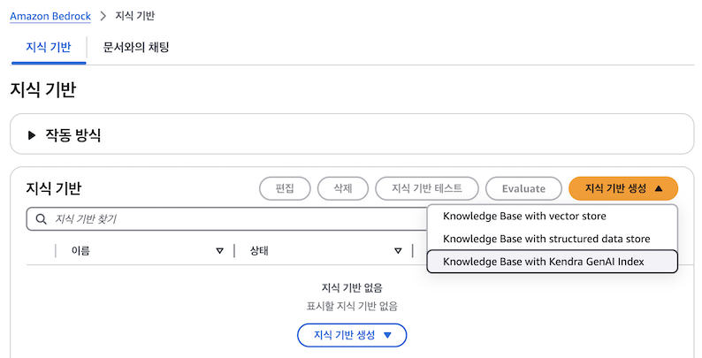
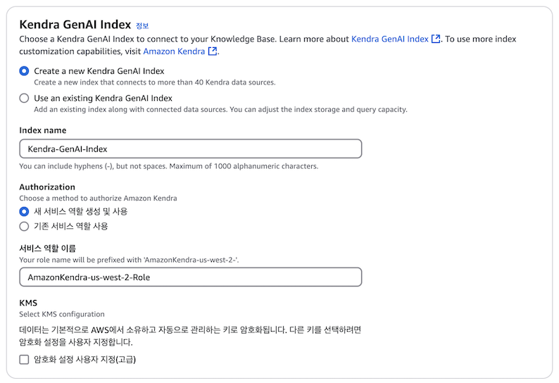

### 2. Kendra에서 Amazon S3 connector 생성

Kendra GenAI Index가 생성되면 Bedrock 지식 기반 화면에서 확인할 수 있습니다. 이후 화면 하단의 **데이터 소스** 메뉴에서 S3 커넥터를 선택하여 데이터 소스 연결을 완료하면 됩니다.

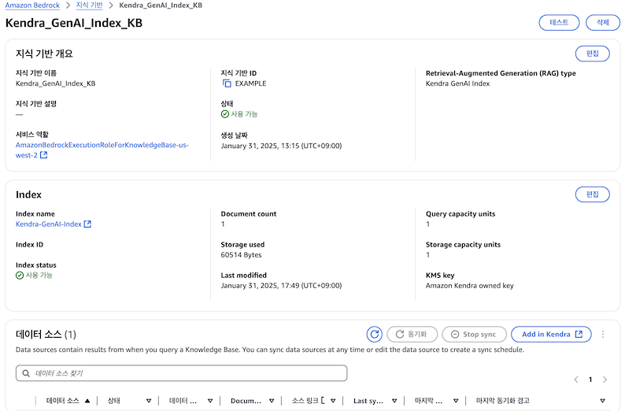

### 3. 데이터 업로드 및 데이터 소스 동기화

S3 커넥터로 지정한 버킷에 테스트용 데이터*(최근 🔥한 arXiv에 게재된 [DeepSeek-R1 논문](https://arxiv.org/pdf/2501.12948))*를 업로드하고 데이터 동기화를 실행합니다.
데이터 싱크(인덱싱) 주기는 필요에 따라 자유롭게 설정할 수 있습니다. 이번 테스트에서는 그림과 같이 'Sync now' 버튼을 사용하여 업로드한 문서를 Kendra에 즉시 인덱싱했습니다.
인덱싱이 완료되면 몇 분 후부터 Bedrock 지식 기반에서 해당 데이터를 활용한 LLM과의 대화가 가능합니다.

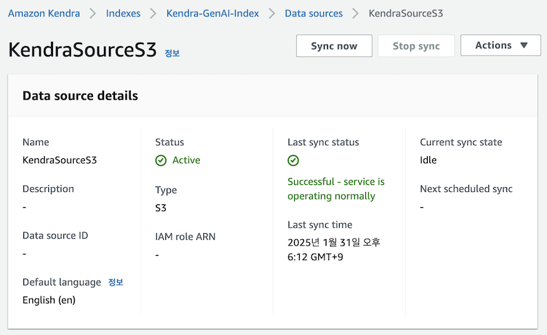

 

## <a href="#chat">💬 Bedrock에서 지원하는 다양한 문서 채팅 기능 알아보기</a>

Bedrock에서는 Kendra GenAI Index 없이도 문서 기반 채팅이 가능합니다. 이제 Bedrock에서 제공하는 다양한 문서 채팅 방식들을 살펴보고, 이들과 Kendra GenAI Index 방식의 차이점을 비교해 보도록 하겠습니다.

> 🔫 3가지 방식을 동일하게 비교 테스트하였으며, 결과는 마지막 부분에서 확인하실 수 있습니다.

> **모델 구성 정보**
>
> - 모델 : Claude 3.5 Sonnet v2
> - Temperature / Top P / Top K : 0 / 1 / 250
> - Maximum length : 2048

### Playground의 기본 기능으로 대화하기

Playground는 ChatGPT와 유사한 방식으로, Bedrock에서 가장 간단하게 LLM과 대화할 수 있는 기능입니다.
PDF를 포함한 다양한 형식의 문서를 텍스트와 함께 업로드하여 질의할 수 있습니다. 테스트를 위해 다음과 같은 질문을 진행해 보았습니다.

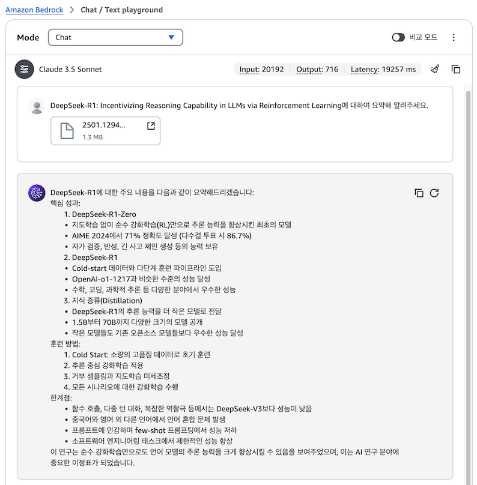

*'DeepSeek R1 Zero는 R1과는 어떤 훈련방식의 차이가 있나요?'*라는 두 번째 질문을 진행하고, 이에 대한 `modelinvocations` 로그를 자세히 분석해 보도록 하겠습니다.

> 🚨 광고 : `modelinvocations` 로그를 자세히 분석하는 방법은   **"Amazon Bedrock으로 시작하는 실전 생성형 AI 개발"**를 참고하세요!  
> 판매 링크 : [📘 예스24](https://www.yes24.com/Product/Goods/140049541), [📗 교보문고](https://product.kyobobook.co.kr/detail/S000214962344), [📕 알라딘](https://www.aladin.co.kr/shop/wproduct.aspx?ItemId=353662061&start=slayer)

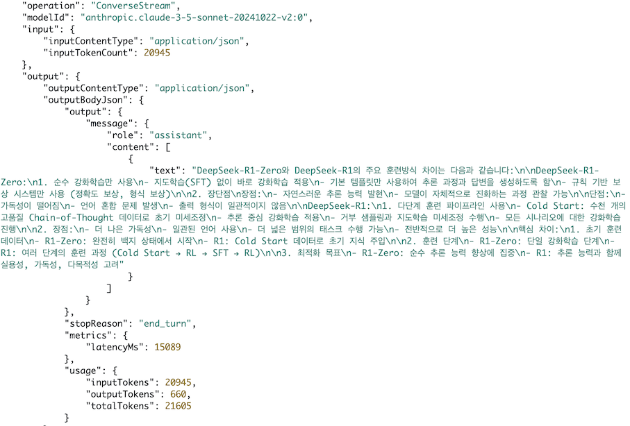

답변의 품질은 우수했으나, 토큰 사용량이 상당히 많았습니다. 첫 번째 질문에서는 **입력 토큰 20,192개와 출력 토큰 716개가 사용**되었고, 두 번째 질문에서는 **입력 토큰 20,945개와 출력 토큰 660개가 소모**되었습니다. 이는 모든 문서를 참조하여 답변을 생성하는 방식 때문에 발생한 높은 토큰 소비량입니다.

### Bedrock 지식 기반 기능으로 대화하기

두 번째 방법으로, Amazon Bedrock 지식 기반의 '[문서와의 채팅](https://docs.aws.amazon.com/ko_kr/bedrock/latest/userguide/knowledge-base-chatdoc.html)' 기능을 사용하여 테스트를 진행해 보겠습니다.
이 기능은 별도의 지식 기반 설정 없이도 신속하게 문서 기반 대화를 테스트할 수 있는 환경을 제공합니다.
Bedrock 지식 기반 콘솔의 '문서와의 채팅' 기능에서 PDF 파일을 업로드하면 다음과 같이 대화를 진행할 수 있습니다.

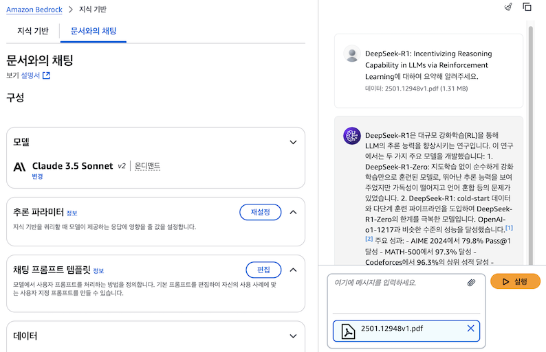
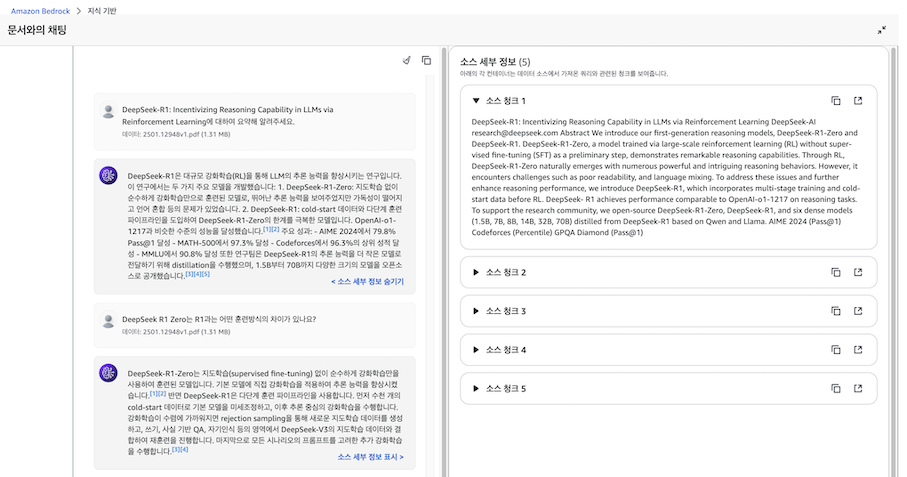

'문서와의 채팅' 기능은 답변 생성 시 참고한 소스 정보를 함께 제공합니다. Playground에서와 동일한 조건으로 테스트했음에도 불구하고 답변 결과가 다르게 나왔습니다. 이러한 차이의 원인을 파악하기 위해 `modelinvocations` 로그를 분석해 보겠습니다.

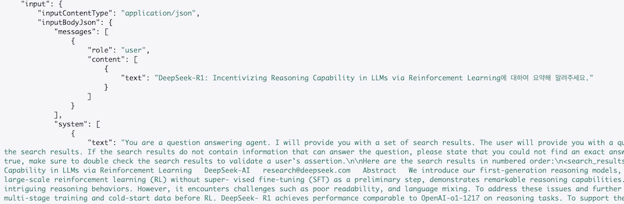

Playground에서는 질문과 PDF의 모든 내용이 하나의 `input`으로 처리되었습니다. 반면 '문서와의 채팅' 기능에서는 질문이 messages의 content에 포함되고, RAG를 통해 얻은 문맥 정보는 특정 명령어와 함께 시스템 프롬프트에 삽입되었음을 확인할 수 있습니다.

**'문서와의 채팅' 시스템 프롬프트**

'문서와의 채팅' 기능은 현재 페이지를 벗어나면 대화 내용이 저장되지 않으므로 사용 시 주의가 필요합니다.
이제 본 포스팅의 주요 주제인 Kendra GenAI Index를 지식 기반으로 활용했을 때의 결과를 살펴보겠습니다.

### Kendra GenAI Index로 대화하기

Kendra를 지식 기반으로 활용할 경우, '문서와의 채팅' 기능과 마찬가지로 참고한 데이터 소스를 제공한다는 점에서 유사합니다. 그러나 Kendra는 전문적인 검색 엔진으로서, **RAG에 대해 아래와 같이 다양한 설정(검색 결과 수, 유형 등)**을 할 수 있다는 점에서 차이가 있습니다.

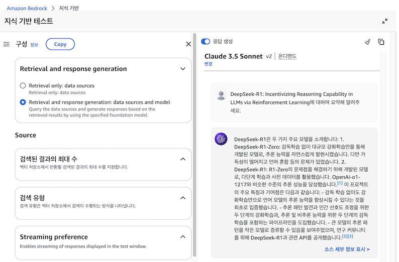

이번 테스트에서도 앞선 경우들과 동일한 조건을 적용했음에도 불구하고 답변이 다르게 나왔습니다. 로그 분석을 통해 그 원인을 파악해 보았습니다. 첫 번째 질문은 '문서와의 채팅' 기능과 동일한 프롬프트로 처리되었습니다. 그러나 두 번째 질문에서는 최적화된 답변 생성을 위해 시스템이 **자체적으로 쿼리의 의도를 분석하고 재작성하여 질문을 처리**했음을 확인했습니다. 결과적으로, **하나의 질문에 대해 실제로는 언어 모델이 두 번 호출**되었습니다.

다음은 사용자의 질문을 최적화하기 위해 쿼리 재작성을 시도하는 Bedrock 호출 로그입니다. 이 호출이 Stream 방식이 아닌 Converse 방식으로 이루어진다는 것도 차이점입니다.

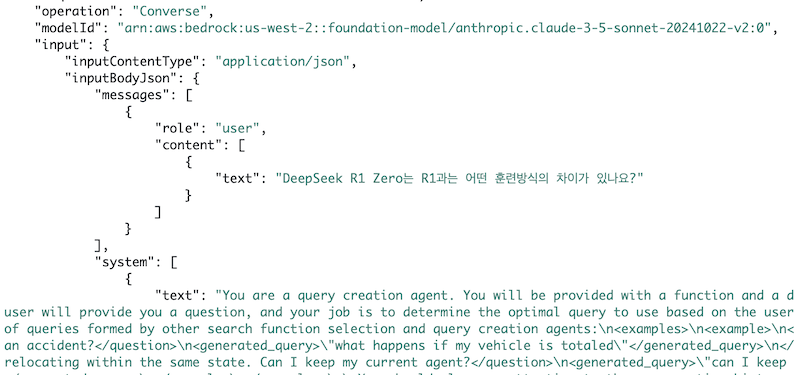

**사용자 쿼리 최적화 프롬프트**

## <a href="#result">🧪 실험 결과</a>

### 답변 비교

Q. DeepSeek-R1: Incentivizing Reasoning Capability in LLMs via Reinforcement Learning에 대하여 요약해 알려주세요.

Playground 답변, 👉 Click

DeepSeek-R1에 대한 주요 내용을 다음과 같이 요약해드리겠습니다:

핵심 성과:

1. DeepSeek-R1-Zero

- 지도학습 없이 순수 강화학습(RL)만으로 추론 능력을 향상시킨 최초의 모델
- AIME 2024에서 71% 정확도 달성 (다수결 투표 시 86.7%)
- 자가 검증, 반성, 긴 사고 체인 생성 등의 능력 보유

2. DeepSeek-R1

- Cold-start 데이터와 다단계 훈련 파이프라인 도입
- OpenAI-o1-1217과 비슷한 수준의 성능 달성
- 수학, 코딩, 과학적 추론 등 다양한 분야에서 우수한 성능

3. 지식 증류(Distillation)

- DeepSeek-R1의 추론 능력을 더 작은 모델로 전달
- 1.5B부터 70B까지 다양한 크기의 모델 공개
- 작은 모델들도 기존 오픈소스 모델들보다 우수한 성능 달성

훈련 방법:

1. Cold Start: 소량의 고품질 데이터로 초기 훈련
2. 추론 중심 강화학습 적용
3. 거부 샘플링과 지도학습 미세조정
4. 모든 시나리오에 대한 강화학습 수행

한계점:

- 함수 호출, 다중 턴 대화, 복잡한 역할극 등에서는 DeepSeek-V3보다 성능이 낮음
- 중국어와 영어 외 다른 언어에서 언어 혼합 문제 발생
- 프롬프트에 민감하며 few-shot 프롬프팅에서 성능 저하
- 소프트웨어 엔지니어링 태스크에서 제한적인 성능 향상

이 연구는 순수 강화학습만으로도 언어 모델의 추론 능력을 크게 향상시킬 수 있음을 보여주었으며, 이는 AI 연구 분야에 중요한 이정표가 되었습니다.

문서와의 채팅 답변, 👉 Click

DeepSeek-R1은 대규모 강화학습(RL)을 통해 LLM의 추론 능력을 향상시키는 연구입니다. 이 연구는 두 가지 주요 모델을 소개합니다:

1. DeepSeek-R1-Zero: 지도학습 없이 순수 RL만으로 학습된 모델로, 뛰어난 추론 능력을 보여주었지만 가독성이 떨어지고 언어 혼합 등의 문제가 있었습니다.

2. DeepSeek-R1: cold-start 데이터와 다단계 훈련을 도입하여 R1-Zero의 문제를 해결하고 성능을 더욱 향상시켰습니다. OpenAI-o1-1217과 비슷한 수준의 성능을 달성했습니다.

주요 성과:

- AIME 2024에서 79.8% Pass@1 달성
- MATH-500에서 97.3% 달성
- Codeforces에서 96.3% 상위권 달성
- MMLU에서 90.8% 달성

또한 연구팀은 DeepSeek-R1의 추론 능력을 더 작은 모델로 전달하기 위해 distillation을 수행했으며, 1.5B부터 70B까지 다양한 크기의 모델을 오픈소스로 공개했습니다.

Kendra GenAI Index 답변, 👉 Click

DeepSeek-R1은 두 가지 주요 모델을 소개합니다:

1. DeepSeek-R1-Zero: 감독학습 없이 대규모 강화학습만을 통해 개발된 모델로, 추론 능력을 자연스럽게 발현시켰습니다. 다만 가독성이 떨어지고 언어 혼합 등의 문제가 있었습니다.

2. DeepSeek-R1: R1-Zero의 문제점을 해결하기 위해 개발된 모델로, 다단계 학습과 사전 데이터를 활용했습니다. OpenAI-o1-1217와 비슷한 수준의 추론 성능을 달성했습니다.

이 프로젝트의 주요 특징과 기여점은 다음과 같습니다:

- 감독 학습 없이도 강화학습만으로 언어 모델의 추론 능력을 향상시킬 수 있다는 것을 최초로 입증했습니다.
- 추론 패턴 발견과 인간 선호도 조정을 위한 두 단계의 강화학습과, 추론 및 비추론 능력을 위한 두 단계의 감독학습을 포함하는 파이프라인을 도입했습니다.
- 큰 모델의 추론 패턴을 작은 모델로 증류할 수 있음을 보여주었으며, 연구 커뮤니티를 위해 DeepSeek-R1과 관련 API를 공개했습니다.

 

Q. DeepSeek R1 Zero는 R1과는 어떤 훈련방식의 차이가 있나요?

Playground 답변, 👉 Click

DeepSeek-R1-Zero와 DeepSeek-R1의 주요 훈련방식 차이는 다음과 같습니다:

DeepSeek-R1-Zero:

1. 순수 강화학습만 사용

- 지도학습(SFT) 없이 바로 강화학습 적용
- 기본 템플릿만 사용하여 추론 과정과 답변을 생성하도록 함
- 규칙 기반 보상 시스템만 사용 (정확도 보상, 형식 보상)

2. 장단점
   장점:

- 자연스러운 추론 능력 발현
- 모델이 자체적으로 진화하는 과정 관찰 가능

단점:

- 가독성이 떨어짐
- 언어 혼합 문제 발생
- 출력 형식이 일관적이지 않음

DeepSeek-R1:

1. 다단계 훈련 파이프라인 사용

- Cold Start: 수천 개의 고품질 Chain-of-Thought 데이터로 초기 미세조정
- 추론 중심 강화학습 적용
- 거부 샘플링과 지도학습 미세조정 수행
- 모든 시나리오에 대한 강화학습 진행

2. 장점:

- 더 나은 가독성
- 일관된 언어 사용
- 더 넓은 범위의 태스크 수행 가능
- 전반적으로 더 높은 성능

핵심 차이:

1. 초기 훈련 데이터

- R1-Zero: 완전히 백지 상태에서 시작
- R1: Cold Start 데이터로 초기 지식 주입

2. 훈련 단계

- R1-Zero: 단일 강화학습 단계
- R1: 여러 단계의 훈련 과정 (Cold Start → RL → SFT → RL)

3. 최적화 목표

- R1-Zero: 순수 추론 능력 향상에 집중
- R1: 추론 능력과 함께 실용성, 가독성, 다목적성 고려

문서와의 채팅 답변, 👉 Click

DeepSeek R1-Zero는 감독학습(supervised fine-tuning) 없이 순수하게 강화학습만을 사용하여 훈련된 모델입니다. 반면 DeepSeek R1은 다단계 훈련 파이프라인을 사용합니다:

1. Cold Start: 수천 개의 Chain-of-Thought 예제로 초기 파인튜닝
2. 추론 중심의 강화학습 진행
3. 강화학습 체크포인트에서 rejection sampling을 통한 새로운 SFT 데이터 생성
4. 모든 시나리오를 고려한 추가 강화학습 진행

R1-Zero는 순수 강화학습만으로도 뛰어난 추론 능력을 보여주었지만, 가독성이 떨어지고 언어가 혼합되는 등의 문제가 있었습니다. R1은 이러한 문제들을 해결하고 더 나은 성능을 달성하기 위해 cold-start 데이터와 다단계 훈련을 도입했습니다.

Kendra GenAI Index 답변, 👉 Click

DeepSeek-R1-Zero는 감독학습(SFT) 없이 순수하게 강화학습(RL)만을 사용하여 훈련된 모델입니다. 기본 모델에 직접 RL을 적용하는 방식을 사용했습니다.

반면 DeepSeek-R1은 수천 개의 Chain-of-Thought(CoT) 예제로 사전 미세조정된 체크포인트에서 시작하여 RL을 적용했습니다. 즉, 콜드 스타트 데이터와 반복적인 RL 미세조정을 함께 활용하는 방식으로, 이는 R1-Zero보다 더 강력한 성능을 보여줍니다.

### 토큰 소모량 비교

Q. DeepSeek-R1: Incentivizing Reasoning Capability in LLMs via Reinforcement Learning에 대하여 요약해 알려주세요.

| 토큰 소모량 | Playground | 문서와의 채팅 | Kendra GenAI Index |
| :---------- | :--------: | :-----------: | :----------------: |
| **Input**   |   20,192   |    22,114     |       1,904        |
| **Output**  |    716     |      553      |        576         |

Q. DeepSeek R1 Zero는 R1과는 어떤 훈련방식의 차이가 있나요?

| 토큰 소모량 | Playground | 문서와의 채팅 | Kendra GenAI Index |
| :---------- | :--------: | :-----------: | :----------------: |
| **Input**   |   20,945   |    22,107     | 3,062(1,091+1,971) |
| **Output**  |    660     |      434      |    362(36+326)     |

세 가지 방식 모두 우수한 품질의 답변을 제공했습니다. Playground와 '문서와의 채팅' 기능의 경우, 전체 문서를 참고하여 답변을 생성하므로 긴 문맥(long context)을 지원하는 모델에서 정확한 답변을 얻을 수 있다는 점이 매력적입니다.
_(문서를 기반으로 신속한 테스트를 수행하고자 할 때, '문서와의 채팅' 기능보다는 Playground를 활용하는 것이 더 상세한 답변을 얻을 수 있는 것으로 보입니다.)_
Kendra의 경우, 더 많은 분석이 필요하겠지만, 관리형 RAG를 통해 필요한 정보를 효과적으로 찾아내어 답변을 생성한다는 점이 매력적으로 느껴집니다.

이번 포스팅에서 다룬 논문 리뷰와는 달리, 수백 개의 Zendesk 티켓에 대한 질의응답이나 S3에 산재된 데이터에 대한 질의응답 같은 작업에는 Kendra GenAI Index가 특히 유용할 것으로 예상됩니다.

## <a href="#outro">🌟 마치며</a>

2023년 6월, [flan-t5 모델과 Amazon Kendra(엔터프라이즈 검색 엔진)를 활용한 RAG 관련 글](https://heuristicwave.github.io/Kendra)을 작성한 지 2년이 지나 다시 Kendra에 대해 글을 쓰게 되니 감회가 새롭습니다.
이번 포스팅을 준비하며 과거 작성했던 글을 다시 보니, 부족했던 제 모습이 부끄러우면서도 그 사이 놀랍게 발전한 AI 생태계에 새삼 감탄하게 됩니다.

이번에 Kendra GenAI Index를 테스트해보며, 테이블 데이터에 대한 정확한 이해는 아직 부족하지만, 향후 이 부분까지 지원된다면 정말 매력적인 관계형 RAG 서비스가 될 것 같습니다.

글을 작성하다 보니 내용이 방대해져, 1편과 2편으로 나눌지 고민이 많았습니다. 이번 기회에 Kendra를 다시 테스트하며, '지식 기반의 `stopSequences`에 `\nObservation`을 지정한 이유'나 'Data source 설정 시, Default Language의 제약 사항' 등에 대해 다루지 못한 부분이 있습니다. 이러한 내용들은 다음 기회에 다루도록 하고, 이번 글은 여기서 마무리하겠습니다.

소중한 시간을 내어 긴 글 읽어주셔서 감사합니다! 잘못된 내용은 지적해주세요! 😃

 

---
