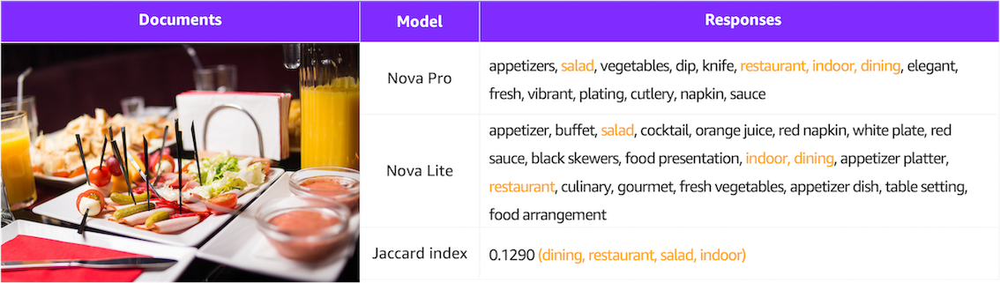

이 포스팅에서는 Amazon Nova Pro Model의 Vision 성능을 Lite Model에 효과적으로 전달하기 위한 Text-Image-to-Text 미세 조정 방법을 소개합니다.

본격적인 내용에 들어가기에 앞서, 처음에는 Vision 분야의 Model Distillation(이하, 모델 증류) 기법을 직접 다루고자 했으나, 현재 Amazon Bedrock에서 이에 대한 직접적인 지원이 제한적이라는 점을 말씀드립니다. 이에 대안으로 "Fine-Tuning: Text-Image-to-Text" 방식을 활용하여 Vision 모델 증류를 우회적으로 구현하는 방법을 공유하고자 합니다.

## <a href="#distillation">⚗️ Model Distillation</a><a id="distillation"></a>

지난 2024년 re:Invent에서 Amazon Bedrock 생태계는 Fine-tuning과 Continued pre-training 외에도 **Distillation**이라는 새로운 모델 커스터마이제이션 기능을 제공하기 시작했습니다. 또 [최근(4월 30일)](https://aws.amazon.com/ko/about-aws/whats-new/2025/04/amazon-nova-premier-complex-tasks-model-distillation/)에는 복잡한 작업들에 대한 모델 증류를 위한 교사 모델로 Amazon Nova Premier를 출시하기도 했습니다. 

모델 증류는 대규모 교사 모델(Teacher Model)의 지식을 더 작은 학생 모델(Student Model)로 전달하는 기술로, 모델 크기와 연산 비용을 줄이면서도 성능을 최대한 유지할 수 있습니다.
Amazon Bedrock Model Distillation은 두 가지 주요 단계로 구성됩니다. 첫째, 훈련에 필요한 학습 데이터를 생성하는 과정과 둘째, 이렇게 만들어진 학습 데이터를 활용하여 교사 모델을 미세 조정함으로써 증류 모델을 생성하는 과정입니다.


Bedrock은 현재 이미지 작업에 대한 모델 증류를 공식적으로 지원하지 않습니다. 그러나 증류 과정의 기본 원리를 이해하고 있다면, 교사 모델을 활용해 직접 훈련용 데이터를 생성하고 별도로 미세 조정을 수행함으로써 이미지 작업에 대한 모델 증류를 자체적으로 구현할 수 있습니다.

<br>

## <a href="#task">📸 과제 설정 - Image Labeling 작업 비교</a><a id="task"></a>

Vision Understanding 기능이 있는 멀티모달 모델은 주어진 이미지를 설명하는 [Image Captioning](https://huggingface.co/docs/transformers/en/tasks/image_captioning) 기능을 탑재하고 있습니다.
이미지를 제공하고 원하는 스타일(촬영 기법, 분위기, 객체 등)에 대한 키워드 추출을 요청하면, 해당 이미지에 대한 관련 키워드를 받을 수 있습니다.

<details><summary markdown="span">👉 Image Labeling Example Prompt 👈</summary>
```text
당신은 이미지 키워드 추출 전문가입니다. 이미지를 분석하여 검색에 최적화된 간결한 키워드를 추출해주세요.

다음 5가지 카테고리에 따라 키워드를 추출하되, 최종 결과는 카테고리 구분 없이 쉼표로 구분된 단일 목록으로 제공해주세요:

1. 주요 객체/인물: 인물(성별, 연령대, 민족성), 동물, 사물 등 핵심 요소
2. 위치/배경: 장소, 풍경, 환경(실내/외), 시간, 계절
3. 행동/감정: 활동을 설명하는 동사, 분위기를 나타내는 형용사
4. 시각적 특성: 주요 색상, 구도, 촬영 기법, 이미지 스타일
5. 맥락적 요소: 패션, 랜드마크, 문화적 맥락, 행사/축제 관련 정보

각 카테고리당 2-5개, 총 15-25개의 검색 최적화된 키워드를 제공해주세요. 중복을 피하고 간결하게 작성하세요.
```
</details>



위 표 이미지는 [`ShutterstockInc/high_resolution_images` 데이터셋](https://huggingface.co/datasets/ShutterstockInc/high_resolution_images) 중 하나의 사진에 대해 Nova Pro와 Lite 모델로 Image Labeling을 진행한 결과입니다.
동일한 프롬프트를 사용하더라도 각 모델의 응답 결과가 매우 상이함을 확인할 수 있습니다. **본 포스팅에서는 어느 모델이 Image Labeling 작업에 우위에 있는지를 판단하기보다는, Lite 모델이 Pro 모델과 유사한 답변을 도출하도록 하는 작업에 초점을 맞추었다는 점을 기억해주세요!**

두 모델의 답변 유사도를 파악하기 위해 공통적으로 제시한 교집합 부분의 자카드 지수(Jaccard index)를 측정한 결과, 0.129로 나타났습니다. 이제 Lite 모델을 Pro의 데이터로 미세 조정하여 두 모델 간의 응답값이 얼마나 유사해질 수 있는지 알아보겠습니다.

<br>

## <a href="#self-diatillation">🧑‍🔬 VLM 모델 증류 자체 구현</a><a id="self-diatillation"></a>

### 데이터셋 준비 프로세스

VLM 모델을 자체적으로 증류하기 위해 Text-Image-to-Text 방식의 미세 조정을 진행하겠습니다. 이를 위해 다음과 같은 4가지 단계로 미세 조정용 데이터 셋을 준비해야 합니다.


*본 글에서는 VLM 모델 증류를 자체적으로 구현하기 위해 Hugging Face에 올라온 [`ShutterstockInc/high_resolution_images`의 medium 데이터셋](https://huggingface.co/datasets/ShutterstockInc/high_resolution_images)을 활용하였습니다.*

#### 1. 이미지 전처리

이미지 전처리의 범주는 매우 광범위합니다. 여기서는 특정 작업에 적합한 분류가 완료되었다고 가정하고, 이미지 크기 조정에 관한 전처리만 다루겠습니다.
작업별로 요구되는 해상도는 다르지만, 대부분의 경우 굳이 고해상도 이미지가 필요하지 않습니다. 

예를 들어, Claude 모델은 다음 공식으로 이미지의 토큰량을 계산합니다: `토큰 수 = (너비 px × 높이 px) ÷ 750`

**300 × 199 이미지의 경우**:
- 총 픽셀 수: 300 × 199 = 59,700 픽셀
- 소요 토큰 수: 59,700 ÷ 750 = 79.6 ≈ **80 토큰**

**1000 × 665 이미지의 경우**:
- 총 픽셀 수: 1000 × 665 = 665,000 픽셀
- 소요 토큰 수: 665,000 ÷ 750 = 886.67 ≈ **887 토큰**

이처럼 이미지 해상도에 따라 토큰 소모량이 크게 달라지므로, 훈련용 데이터셋을 구축하기 전에 고해상도 이미지의 크기를 적절히 축소하는 것이 중요합니다. 
이는 모델 훈련 비용을 절감할 뿐만 아니라, 처리 속도 향상에도 기여하면서 대부분의 작업에서 성능 저하 없이 효율적인 학습을 가능하게 합니다.

#### 2. 레퍼런스 데이터 구성

이 과정에서는 교사 모델을 호출하여 프롬프트-응답(Prompt-Response) 쌍의 데이터를 생성합니다. 교사 모델이 생성한 응답은 이후 학생 모델의 미세 조정 데이터로 활용됩니다.
멀티모달 기능을 지원하는 Converse API를 통해 교사 모델을 호출하고, 모델의 응답과 해당 이미지 파일명을 미세 조정용 데이터셋 구축을 위해 JSONL 형식으로 저장했습니다.


```python
system_prompts = [{"text": system_prompt}]
conversation = [
    {
        "role": "user",
        "content": [
            {"text": user_prompts},
            {
                "image": {
                    "format": "jpeg",
                    "source": { "bytes": image_bytes }
                }
            }
        ]
    }
]

response = client.converse(
    modelId=teacher_model_id,
    system=system_prompts,
    messages=conversation,
    inferenceConfig={"maxTokens": 1024, "temperature": 0.5, "topP": 0.9},
)

reponse_text = response["output"]["message"]["content"][0]["text"]
jsonl_data = { "image": image_path.name, "label": reponse_text }
```

#### 3. 훈련 데이터셋 생성

Bedrock의 미세 조정 요구사항에 맞추어, [Preparing data for fine-tuning Understanding models](https://docs.aws.amazon.com/nova/latest/userguide/fine-tune-prepare-data-understanding.html#custom-fine-tune-constraints) 가이드라인을 참고하여 모델 학습에 필요한 데이터셋을 JSONL 형식으로 생성합니다.

본 포스팅에서는 [Single image custom fine tuning format](https://docs.aws.amazon.com/nova/latest/userguide/fine-tune-prepare-data-understanding.html#customize-fine-tune-examples) 형식으로 데이터를 준비합니다.
이 과정에서 앞서 **두 번째 단계에서 생성한 데이터를 활용**하여 `system`, `messages`의 `text` 값과 `image`의 `uri` 필드에 적절히 배치함으로써 완성된 데이터셋을 구성합니다.

#### 4. 데이터셋 검증

미세 조정 작업을 시작하기 전에, `aws-samples` GitHub 저장소에서 제공하는 [Dataset Validation for Fine-tuning Nova Understanding models](https://github.com/aws-samples/amazon-bedrock-samples/tree/main/custom-models/bedrock-fine-tuning/nova/understanding/dataset_validation#dataset-validation-for-fine-tuning-nova-understanding-models) 도구를 활용하여 데이터셋의 유효성을 먼저 점검하세요.

`python3 nova_ft_dataset_validator.py -i <file path> -m <model name>` 명령어를 실행하면 검사가 진행되며, 모든 샘플이 검증을 통과할 경우 `Validation successful, all samples passed` 메시지가 표시됩니다.

### 미세 조정

데이터셋 준비가 완료되면, 미세 조정 과정은 매우 간단하게 진행됩니다. Amazon Bedrock 콘솔에서 데이터셋이 저장된 S3 위치를 지정하고 필요한 하이퍼파라미터 값만 설정하면 됩니다.
이번 훈련에서는 Nova Lite 모델의 기본 에포크(Epoch) 값인 2 대신 5로 상향 조정하였으며, 그 외 파라미터는 기본값을 유지하여 진행했습니다.

훈련이 완료되면, 미세 조정 과정에서 지정한 S3 위치에 훈련 결과 지표들이 저장됩니다. `step_wise_training_metrics.csv` 파일을 통해 각 단계(step)와 에포크(epoch)별 훈련 손실(training_loss) 값을 확인할 수 있어, 모델의 학습 진행 결과를 확인할 수 있습니다.

<br>

## <a href="#results">🖍️ Fine-Tuning Text-Image-to-Text 결과</a><a id="results"></a>

본 포스팅에서는 [🤗 `ShutterstockInc/high_resolution_images`](https://huggingface.co/datasets/ShutterstockInc/high_resolution_images)의 medium 데이터셋을 활용했으며, 이 데이터셋은 총 1,000장의 이미지로 구성되어 있습니다.
데이터 활용 방식으로는 900장을 훈련용 데이터로 사용하고, 나머지 100장은 미세 조정 완료 후 모델 성능 검증에 활용했습니다. 데이터의 제한적인 특성을 고려하여, 300장과 900장을 각각 사용한 두 가지 훈련 세션을 진행했습니다.

**Nova Pro & Nova Lite 비교**

먼저 미세 조정을 거치지 않은 상태에서 Nova Pro와 Lite 모델 간의 성능 차이를 확인하기 위해, 100장의 이미지에 대한 분석 결과를 비교했습니다. 두 모델 간의 Jaccard 유사도는 대부분 0.1에서 0.4 사이에 분포하는 것으로 나타났습니다.


**Nova Pro & Nova Lite (300장)**

300개의 샘플 데이터로 훈련을 진행한 결과, Jaccard 유사도가 0.2에서 0.6 사이로 향상되었습니다. 이는 비교적 적은 양의 데이터만으로도 Lite 모델이 Pro 모델의 성능에 근접할 수 있음을 보여주는 결과입니다.


**Nova Pro & Nova Lite (900장)**

900개의 샘플 데이터로 훈련을 진행한 결과, Jaccard 유사도가 0.2에서 0.6 사이로 향상되었으며, 300장으로 훈련한 모델(빨간색)과 비교했을 때 900장으로 훈련한 모델(보라색)이 소폭 더 높은 성능을 보여주었습니다.
이번 실험에서는 이미지 데이터의 제한으로 900장만 활용했지만, Amazon Bedrock의 이미지 미세 조정 기능은 최대 20,000개의 데이터를 지원합니다. 따라서 더 많은 데이터로 미세 조정을 진행할 경우, 성능이 더욱 향상될 것으로 기대됩니다.


<br>

## <a href="#cost">💸 모델 Customization 비용</a><a id="cost"></a>

실험에 소요된 비용 내역을 기재했으니, 향후 미세 조정 작업 계획 시 예상 비용 산출에 도움이 되길 바랍니다. 🙃

**Nova Lite 미세 조정 소모 비용**

| 사용량 유형 | 데이터 수 | 비용 | 훈련 시간 | 전용 처리량 비용 (무약정) | 모델 보관 비용 |
| --- | --- | --- | --- | --- | --- |
| USE1-NovaLite-Customization-Training | 300개 | 약 $2.1 | 약 1시간 | 시간당 $108.15 | 월 $1.95 |
| USE1-NovaLite-Customization-Training | 900개 | 약 $7.5 | 약 2시간 | 시간당 $108.15 | 월 $1.95 |

*이 비용 내역에는 교사 모델을 활용하여 프롬프트-응답 쌍 데이터를 생성하는 데 소모된 비용은 포함되지 않았습니다.
해당 비용을 산출하려면, 작업을 1회 수행한 후 소모된 토큰량을 측정하여 별도로 계산하시기 바랍니다.*

<br>

## <a href="#outro">🌟 마치며</a><a id="outro"></a>

이번 포스팅에서는 Amazon Bedrock이 Vision 작업에 대한 모델 증류를 공식적으로 지원하지 않는 상황에서, Text-Image-to-Text 미세 조정을 통해 우회적으로 모델 증류를 구현하는 방법을 살펴보았습니다.
성공적인 VLM 모델 증류를 위해서는 체계적인 데이터셋 준비 과정이 필수적입니다. 이미지 전처리를 통한 토큰 소모량 최적화, 교사 모델을 활용한 레퍼런스 데이터 구축, Bedrock 요구사항에 맞는 훈련 데이터셋 생성, 그리고 미세 조정 전 데이터셋 검증까지의 단계가 모델 성능에 직접적인 영향을 미칩니다.
또한 미세 조정 완료 후에는 반드시 검증 과정을 통해 모델의 성능 향상을 확인해야 합니다. 본 글에서는 Jaccard 유사도를 통해 모델 간 응답 일치도를 측정했으며, 데이터양이 증가할수록 Lite 모델이 Pro 모델의 응답에 더 가까워지는 것을 확인할 수 있었습니다.

이러한 우회적 증류 방법은 비록 공식 지원 기능은 아니지만, 적절한 데이터셋 구성과 미세 조정을 통해 경량 모델에서도 고성능 모델과 유사한 결과를 얻을 수 있음을 보여줍니다. 앞으로 Amazon Bedrock에서 Vision 모델 증류에 대한 공식 지원이 확대되기를 기대하며, 그때까지는 이러한 접근법이 실무에서 유용하게 활용될 수 있을 것입니다. 여러분의 프로젝트에도 이러한 방법론이 도움이 되길 바랍니다.

> 🤣 사실 이번 포스팅은 제가 AWS Seoul Summit 2025 발표를 준비하면서 실험했던 내용 중 일부랍니다. 발표 영상이 나오면 여기에 함께 공유해 드릴게요!

<br>

> 🚨 광고 : Bedrock 내에서 나만의 모델을 만드는 다른 방법(`지속적인 사전 훈련`, `미세 조정`)들은 <br> **"Amazon Bedrock으로 시작하는 실전 생성형 AI 개발"**를 참고하세요! <br>
> 판매 링크 : [📘 예스24](https://www.yes24.com/Product/Goods/140049541), [📗 교보문고](https://product.kyobobook.co.kr/detail/S000214962344), [📕 알라딘](https://www.aladin.co.kr/shop/wproduct.aspx?ItemId=353662061&start=slayer)

---
