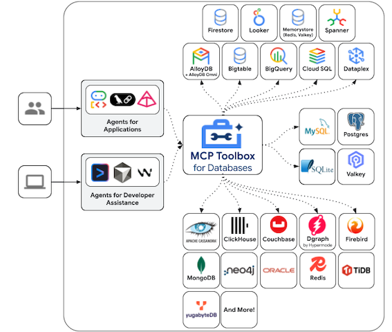

이 포스팅에서는 Text-to-SQL의 기본 개념과 기존 접근 방법들의 한계를 살펴보고, Google Cloud Next 25에서 발표된 MCP Toolbox for Databases(구 Gen AI Toolbox for Databases)를 통해 이러한 문제를 어떻게 해결할 수 있는지 알아봅니다.

## <a href="#text2sql">🗣️ Text-to-SQL이란?</a><a id="text2sql"></a>

Text-to-SQL(혹은 NL2SQL, Natural Language to SQL)은 사용자의 자연어 질문을 SQL 쿼리로 자동 변환하는 기술입니다. 이를 통해 SQL에 익숙하지 않은 사용자도 필요한 정보를 쉽게 조회할 수 있습니다.

```text
👤 사용자 질문: "2024년에 생성된 사용자가 몇 명인가요?"
             ↓
🤖 AI 변환
             ↓
💾 SQL 쿼리: SELECT COUNT(*) FROM users WHERE created_at >= '2024-01-01' AND created_at < '2025-01-01';
```

### 기존 Text-to-SQL 구현 방법들

#### 1. 직접 LLM 호출 방식

가장 단순한 방법은 LLM에 데이터베이스 스키마와 질문을 함께 전달하여 SQL을 생성하는 것입니다.

<details><summary markdown="span">📍 LLM 기반 Text-to-SQL 예시</summary>
```python
# 데이터베이스 스키마 정보
schema = """
CREATE TABLE users (
    id SERIAL PRIMARY KEY, email VARCHAR(255), created_at TIMESTAMP
);
"""

# LLM 호출
response = client.messages.create(
    model="MODEL NAME",
    messages=[{
        "role": "user",
        "content": f"""
        다음 스키마를 참고하여 SQL 쿼리를 생성하세요: {schema}
        
        질문: "2024년에 생성된 사용자가 몇 명인가요?"
        """
    }]
)

sql_query = response.content[0].text

# 생성된 SQL을 직접 실행...
```
</details>


이 방식은 데이터베이스 연결 관리, 스키마 업데이트, 보안 대응 등 여러 문제점이 있지만, 그중에서도 핵심 문제는 **LLM의 성능에 전적으로 의존**한다는 점입니다. 복잡한 스키마나 비즈니스 로직이 있는 경우 모델이 정확한 SQL을 생성한다는 보장이 없습니다.

#### 2. 모델 파인튜닝 방식

1번 방식의 정확도 문제를 해결하기 위해 특정 DB 스키마와 도메인에 특화된 모델을 파인튜닝할 수 있습니다.


<details><summary markdown="span">📍 학습에 사용할 SQL 쿼리 QA 데이터셋 수집 예시</summary>
```python
training_data = [
    {
        "messages": [
            {
                "role": "user",
                "content": "스키마: users(id, email, created_at)\n\n질문: 2024년에 가입한 사용자 수는?"
            },
            {
                "role": "assistant", 
                "content": "SELECT COUNT(*) FROM users 
                WHERE created_at >= '2024-01-01' AND created_at < '2025-01-01';"
            }
        ]
    },
    {
        "messages": [
            {
                "role": "user",
                "content": "스키마: orders(id, user_id, amount, order_date), users(id, name)
                \n\n질문: 지난 달 가장 많이 구매한 고객 5명은?"
            },
            {
                "role": "assistant",
                "content": "SELECT u.name, COUNT(o.id) as order_count, SUM(o.amount) as total_spent 
                FROM users u JOIN orders o ON u.id = o.user_id 
                WHERE o.order_date >= DATE_TRUNC('month', CURRENT_DATE - INTERVAL '1 month') 
                    AND o.order_date < DATE_TRUNC('month', CURRENT_DATE) 
                GROUP BY u.id, u.name ORDER BY total_spent DESC LIMIT 5;"
            }
        ]
    }
    # ... 수백~수천 개의 예시
]
```
</details>

이 방식은 특정 스키마에 대한 높은 정확도와 추론 비용 절감의 장점이 있지만, 고품질 데이터셋 수집, 데이터 레이블링 비용, 스키마 변경 시 재학습 등 여러 문제점이 있습니다. 그중에서도 핵심 문제는 **많은 리소스가 투입됨에도 불구하고 정확도를 보장받을 수 없다**는 점입니다. 예상치 못한 질문이나 새로운 테이블에 대해서는 여전히 한계가 있습니다.

#### 3. 메타데이터 & 예시 쿼리 RAG 방식

1, 2번 방식이 전체 스키마 정보를 LLM에 직접 전달하거나 학습시키는 방식이었다면, 대규모 환경에서는 RAG(Retrieval Augmented Generation)를 활용하여 **쿼리 작성에 필요한 관련 정보를 선택적으로 검색**하는 방식을 고려할 수 있습니다.

**사전 준비 단계**

1. Knowledge Base 구성
  - 테이블 메타데이터
  - 예시 SQL 쿼리
  - 비즈니스 용어 사전
  - 테이블 관계 설명
  - 데이터 활용 가이드
2. Knowledge Base의 모든 정보를 벡터로 변환하여 Vector DB에 저장

**추론(Inference) 단계**

1. User Query : "지난 달 가장 많이 구매한 고객 5명은?"
2. Semantic Search (Vector DB)
    질문과 유사도가 높은 관련 정보를 Vector DB에서 검색
    - "월별 고객 구매 분석" 예시 쿼리
    - users, orders 테이블 관계 설명
    - "구매" → purchase_date 컬럼 매핑 메타데이터
3. Context Builder : `Prompt` = `User Query + 검색된 관련 정보 + 필요한 스키마`
4. SQL 생성 및 실행 : LLM이 검색된 예시와 메타데이터를 참고하여 SQL 쿼리 생성

이러한 RAG 기반 접근 방식은 널리 알려진 방법으로, 많은 기업들이 벡터 데이터베이스를 활용하여 다양한 쿼리 관련 지식(예시 쿼리, 데이터 사전, 활용 가이드 등)을 임베딩하고, 사용자 질문에 맞는 정보를 검색하여 Text-to-SQL의 정확도를 높이고 있습니다. 주요 CSP와 벤더들도 이러한 접근법을 활용하여 **Managed Service**로 제공하는 추세입니다. AWS에서는 **Amazon Bedrock Knowledge Bases의 Structured Data Retrieval** 기능으로 제공되며, Google Cloud, Azure 등 다른 주요 CSP와 벤더들도 동일한 원리로 Text-to-SQL을 지원하고 있습니다.

이 방식은 대규모 환경에서 관련 정보를 효율적으로 검색하고 LLM에 풍부한 컨텍스트를 제공할 수 있다는 장점이 있지만, 지식 베이스 구축 및 관리, 벡터DB 동기화, 임베딩 비용, 초기 설정 복잡도 등 여러 문제점이 있습니다. 그중에서도 핵심 문제는 **여전히 LLM의 SQL 생성 능력에 의존**하며, 검색된 정보의 품질과 관련성이 낮으면 잘못된 쿼리가 생성될 수 있다는 점입니다.

#### 4. Data & Analytics MCP를 활용한 Context Engineering

이 방식은 1, 2, 3번과는 완전히 다른 접근 방식입니다. 이전 방식들이 **사전에 준비한 컨텍스트**를 활용해 SQL을 생성하는 방법이었다면, MCP는 **별도의 Knowledge Base나 RAG 시스템 구축 없이**, **LLM 에이전트가 도구(Tool)**를 사용하여 데이터베이스와 직접 상호작용합니다.

**MCP 기반 접근 방식**

오픈소스 커뮤니티에서는 다양한 데이터베이스와 분석 서비스를 위한 MCP 서버를 제공하고 있습니다.

- **관계형 DB**: PostgreSQL, MySQL, SQLite, Microsoft SQL Server
- **NoSQL**: MongoDB, Redis, Cassandra, CouchDB
- **데이터 웨어하우스**: Google BigQuery, Snowflake, Amazon Redshift
- **시계열 DB**: InfluxDB, TimescaleDB
- **검색 엔진**: Elasticsearch, OpenSearch
- **기타**: ClickHouse, Neo4j, Supabase 등

이러한 MCP 서버들은 데이터베이스의 **CRUD(Create, Read, Update, Delete) 기능을 기본적으로 지원**합니다. LLM이 SQL을 직접 생성하는 대신, MCP가 제공하는 도구(tools)를 사용하여 다음과 같이 동작합니다.

1. **스키마 탐색**: `list_tables()`, `describe_table()` 등의 도구로 테이블 구조 파악
2. **데이터 조회**: `query_table()`, `get_item()` 등으로 필요한 데이터 조회
3. **반복적 탐색**: 사용자의 요청을 만족하는 정보를 얻기까지 **N회 이상의 쿼리를 반복적으로 수행**
4. **결과 종합**: 여러 번의 조회 결과를 종합하여 최종 답변 생성

**예시 시나리오:** "지난 달 가장 많이 구매한 고객 5명은?"

```
1회차: list_tables() → users, orders, products 테이블 확인
2회차: describe_table("orders") → 컬럼 구조 파악
3회차: describe_table("users") → 컬럼 구조 파악
4회차: query_table("orders", filter="order_date > ...") → 지난 달 주문 조회
5회차: query_table("users", filter="id IN (...)") → 고객 정보 조회
6회차: 데이터 집계 및 정렬
```

이 방식은 LLM이 데이터베이스와 직접 상호작용하므로 SQL 생성 오류 위험이 줄어드는 장점이 있지만, 다음과 같은 문제점이 있습니다.

**한계점**
- **토큰 소모량 증가**: 원하는 정보를 얻기 위해 여러 번의 도구 호출이 필요하며, 각 호출마다 토큰 소모
- **레이턴시 증가**: N회의 왕복(round-trip)으로 인한 응답 시간 지연
- **비용 증가**: 토큰 사용량과 API 호출 횟수에 비례하여 비용 상승
- **복잡한 쿼리 비효율**: 조인이나 집계가 필요한 경우 여러 번의 조회 필요
- **데이터베이스 부하**: 단일 SQL 쿼리로 해결할 수 있는 것을 여러 번의 쿼리로 나누어 실행하여 부하 증가

그중에서도 핵심 문제는 **효율성**입니다. 단일 SQL 쿼리로 해결할 수 있는 질문에 대해 여러 번의 도구 호출과 토큰 소모가 발생하여, 특히 대규모 운영 환경에서는 비용과 성능 측면에서 비효율적일 수 있습니다.

<br>

## <a href="#enterprise-challenges">🏢 엔터프라이즈 환경에서의 추가 고려사항</a><a id="enterprise-challenges"></a>

위에서 살펴본 1~4번 접근 방식은 각각의 고유한 한계를 가지고 있습니다. 하지만 실제 엔터프라이즈 프로덕션 환경에서는 이러한 기술적 한계 외에도 운영, 보안, 거버넌스 측면에서 추가적인 과제들을 해결해야 합니다.

| 과제 영역 | 설명 |
|--------|------|
| **연결 관리** | 데이터베이스 연결 풀링, 타임아웃 처리, 재연결 로직을 직접 구현하고 관리 |
| **보안 및 인증** | OAuth2/OIDC 통합, 역할 기반 접근 제어(RBAC), 파라미터 검증 등을 직접 구현 |
| **스키마 동기화** | 스키마 변경 시마다 코드 수정, 재배포 필요. 실시간 반영 어려움 |
| **관찰성** | 로깅, 메트릭, 분산 트레이싱을 별도로 구축. 디버깅과 모니터링 복잡 |
| **배포 및 유지보수** | 데이터베이스별로 드라이버 설치, 의존성 관리, 버전 호환성 처리 필요 |

이러한 운영상의 복잡성으로 인해 **Text-to-SQL을 프로덕션 환경에서 안전하고 효율적으로 운영하기가 매우 어렵습니다.** 특히 엔터프라이즈 환경에서 요구되는 보안, 확장성, 유지보수성, 거버넌스 요구사항을 충족하려면 상당한 엔지니어링 리소스가 필요합니다.

<br>

## <a href="#toolbox">🔧 MCP Toolbox를 통한 해결</a><a id="toolbox"></a>

1번 방식은 모델 성능에만 의존하고, 2번 파인튜닝은 리소스가 많이 들뿐더러 정확도를 보장받을 수 없습니다. 3번 RAG 방식은 여전히 LLM의 SQL 생성 능력에 의존하며, 4번 MCP 방식은 토큰 소모와 레이턴시 문제가 있습니다. 게다가 모든 방식이 엔터프라이즈 프로덕션 환경에서는 연결 관리, 보안, 스키마 동기화, 관찰성 등의 복잡한 운영 과제에 직면하게 됩니다. 이러한 한계점들을 줄이기 위해 오픈소스 **MCP Toolbox for Databases**(이하, Toolbox)를 활용할 수 있습니다.

Toolbox는 MCP(Model Context Protocol) 표준을 활용하여 **Text-to-SQL의 복잡성을 추상화**하는 오픈소스 MCP 서버입니다
Text2SQL에 대한 은탄환은 아니지만, 기존 방식들의 문제점(토큰 소모, 레이턴시, SQL 생성 의존성 등)을 완화하고, 프로덕션 환경에서 필요한 연결 관리, 보안, 관찰성 등의 운영 과제를 단순화하는 데 도움을 줍니다.

물론, 앞서 언급한 엔터프라이즈 프로덕션 환경에서의 추가 고려사항(보안, 스케일링, 모니터링 등)은 더 깊이 있는 논의가 필요한 주제들입니다. 이러한 내용들은 후속 편을 통해 차차 풀어나갈 예정이니, 이번 편에서는 먼저 MCP Toolbox의 기본 개념과 구조부터 차근차근 살펴보겠습니다.

### Overview

Toolbox는 애플리케이션의 오케스트레이션 프레임워크(예: ADK, Strands Agents, LangGraph, LlamaIndex)와 데이터베이스 사이에 위치하여, 도구를 수정하고 배포하거나 호출하는 컨트롤 플레인을 제공합니다. 이를 통해 중앙화된 위치에서 도구를 저장하고 업데이트할 수 있으며, 에이전트와 애플리케이션 간에 도구를 공유하고 애플리케이션 재배포 없이 업데이트할 수 있습니다.



### 지원하는 데이터베이스

MCP Toolbox는 다양한 [Google Cloud 리소스 및 오픈소스 데이터베이스](https://googleapis.github.io/genai-toolbox/resources/sources/)를 지원합니다.
- **Google Cloud**: AlloyDB, Cloud SQL, Spanner, Bigtable 등
- **오픈소스**: 자체 관리형 MySQL 및 PostgreSQL 등
- **서드파티**: Neo4j, Dgraph 등 커뮤니티 기여 데이터베이스 등

### 빠르게 시작하기

Toolbox를 사용하려면 먼저 [바이너리를 다운로드](https://github.com/googleapis/genai-toolbox?tab=readme-ov-file#installing-the-server)하고,
`tools.yaml` 설정 파일을 작성한 후 다음 명령어로 `./toolbox --tools-file "tools.yaml"` 서버를 실행하면 됩니다. 

**tools.yaml 기본 구조**

```yaml
sources:                    # 데이터베이스 연결 정보
  my-database:
    kind: postgres
    host: localhost
    database: mydb

tools:                      # 사용할 Tool 정의
  search-users:
    kind: postgres-sql
    source: my-database
    statement: "SELECT * FROM users WHERE name = $1"
    parameters:
      - name: user_name
        type: string
```

이렇게 간단한 설정만으로 Toolbox 서버가 시작됩니다. 하지만 이 뒤에서는 어떤 일들이 일어날까요?

Toolbox는 **Plugin Architecture**를 통해 32개의 Source와 120여 개 이상의 사전 정의된 Tool을 자동으로 인식합니다(v0.17.0 기준). `tools.yaml`에서 `kind: postgres-sql`처럼 지정하면 해당 Tool을 찾아 바로 사용할 수 있고, 파일을 수정하면 데이터베이스 연결부터 Tool 설정까지 자동으로 처리되며 서버 재시작 없이 즉시 반영됩니다. 간단해 보이지만, 내부적으로는 정교한 메커니즘이 동작하고 있습니다.

<br>

## <a href="#architecture">🏗️ 아키텍처 Deep Dive</a><a id="architecture"></a>

Go 언어로 작성된 Toolbox는 AI 애플리케이션과 데이터베이스 사이에서 중간 계층으로 동작합니다.

### 주요 컴포넌트

<details><summary markdown="span">📍 Toolbox Architecture</summary>
```
┌────────────────────────────────────────────────────────┐
│              Client Layer (HTTP/MCP Protocol)          │
└────────────────────────────────────────────────────────┘
                            │                            
                            ▼
┌────────────────────────────────────────────────────────┐
│                    Toolbox Server (Go)                 │
│  ┌──────────────────────────────────────────────────┐  │
│  │  Server Layer (internal/server/)                 │  │
│  └──────────────────────────────────────────────────┘  │
│  ┌──────────────────────────────────────────────────┐  │
│  │  Tools Layer (internal/tools/)                   │  │
│  │  - 120+ Tool                                     │  │
│  └──────────────────────────────────────────────────┘  │
│  ┌──────────────────────────────────────────────────┐  │
│  │  Sources Layer (internal/sources/)               │  │
│  │  - 32+ DB Driver & Connection Pooling            │  │
│  └──────────────────────────────────────────────────┘  │
│  ┌──────────────────────────────────────────────────┐  │
│  │  Observability (internal/telemetry/, log/)       │  │
│  └──────────────────────────────────────────────────┘  │
└────────────────────────────────────────────────────────┘
                            │                          
                            ▼
┌────────────────────────────────────────────────────────┐
│                     Database Layer                     │
└────────────────────────────────────────────────────────┘
```
</details>

**1. Client Layer (클라이언트 통신)**
- 프로토콜: HTTP/MCP Protocol, JSON-RPC 2.0
- 클라이언트: AI 프레임워크(LlamaIndex, Strands Agents), IDE(Claude Desktop, Cursor)

**2. Toolbox Server**
- Server Layer: HTTP 서버와 MCP 프로토콜 핸들러를 제공하여 클라이언트 요청 처리
- Tools Layer: 각 데이터베이스에 특화된 120개 이상의 Tool 구현체를 포함하며, 파라미터 검증과 실행 로직 담당
- Sources Layer: 32개의 데이터베이스 드라이버와 연결 풀링, 인증 처리 제공
- Observability Layer: OpenTelemetry를 통한 메트릭, 트레이싱, 로깅을 제공하여 프로덕션 운영 지원

**3. Database Layer (데이터베이스 통신)**
- 프로토콜: 각 데이터베이스의 네이티브 프로토콜 사용 (Wire Protocol, MySQL Protocol, gRPC 등)
- 지원 DB: PostgreSQL, MySQL, BigQuery, MongoDB, Redis, Spanner, AlloyDB 등

### Configuration Flow

앞서 간단히 살펴본 `tools.yaml` 파일이 Toolbox 서버 시작 시 어떻게 로딩되는지 자세히 알아보겠습니다.

| 단계 | 작업 | 설명 |
|------|------|------|
| 1 | CLI 시작 & YAML 파일 로딩 | `--tools-file` 등 플래그 파싱 |
| 2 | 환경 변수 치환 | `${DB_HOST:localhost}` → `"localhost"` |
| 3 | YAML 파싱 | Sources(DB 연결), AuthServices(인증), Tools(Tool 정의), Toolsets(그룹화) 파싱 |
| 4 | 리소스 초기화 | Connection Pool 생성, 인증 서비스 설정, Tool 인스턴스 생성 |
| 5 | 서버 시작 | HTTP Server & MCP Protocol Handler 시작 |
| 6 | 동적 리로딩 | fsnotify로 파일 변경 감지하여 무중단 리로드 |

### Tool Execution Flow

Toolbox 서버가 실행된 후, 실제 사용자의 자연어 질문이 쿼리로 변환되는 과정은 다음과 같습니다.

| 단계 | 작업 | 설명 |
|------|------|------|
| 1 | 클라이언트 요청 | HTTP API: POST `/tool/{toolName}/invoke` 또는 MCP Protocol: `tools/call` |
| 2 | 인증 & 권한 검증 | Authorization Header 추출, Auth Service 검증, Tool 접근 권한 확인 |
| 3 | 파라미터 파싱 | JSON Body 디코딩, 파라미터 검증 & 타입 변환 |
| 4 | Tool 실행 | Template 파라미터 처리, 표준 파라미터 추출, DB 쿼리 실행, 결과를 JSON 형태로 변환 |
| 5 | 응답 반환 | 성공 시 JSON 형태로 결과 반환, 실패 시 에러 메시지 및 상태 코드 반환 |
| 6 | 텔레메트리 기록 | Tracing(요청 시작부터 종료까지 추적), Metrics(Tool 호출 횟수, 레이턴시 등) 기록 |

<br>

## <a href="#next">📖 다음 편 안내</a><a id="next"></a>

지금까지 Text-to-SQL의 다양한 접근 방법과 그 한계를 살펴보았고, MCP Toolbox의 아키텍처와 핵심 컴포넌트를 이해했습니다. Plugin Architecture를 통한 확장성, Configuration Flow를 통한 유연한 설정 관리, 그리고 Tool Execution Flow를 통한 체계적인 실행 과정을 배웠습니다. 이제 이러한 지식을 바탕으로 **[2편](./Toolbox-2.html)**에서는 Strands Agents와 통합하여 자연어로 데이터를 분석하는 실전 AI 에이전트를 구축하는 방법을 다룹니다.

<br>

📚 더 알아보기:
- [MCP Toolbox for Databases 공식 문서](https://googleapis.github.io/genai-toolbox/getting-started/introduction/)
- [MCP Toolbox for Databases: Simplify AI Agent Access to Enterprise Data](https://cloud.google.com/blog/products/ai-machine-learning/mcp-toolbox-for-databases-now-supports-model-context-protocol)
- [Build a Travel Agent using MCP Toolbox for Databases and ADK](https://codelabs.developers.google.com/travel-agent-mcp-toolbox-adk)

<br>

---
