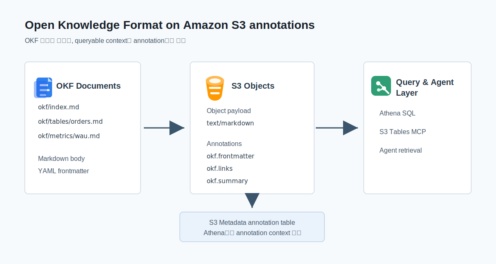
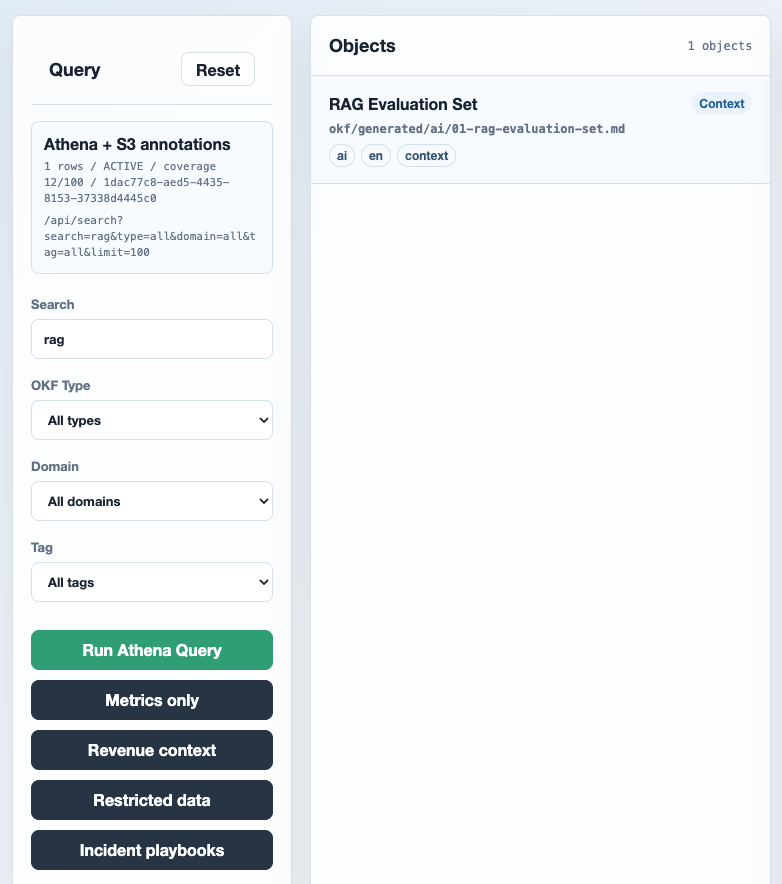
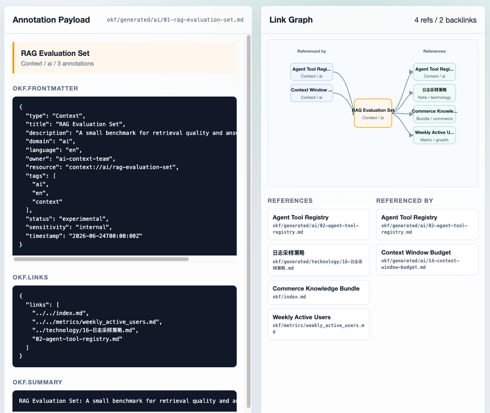

최근 AWS Blog에 [Amazon S3 annotations 기능 소개](https://aws.amazon.com/ko/blogs/korea/amazon-s3-annotations-attach-rich-queryable-context-directly-to-your-objects/) 글이 올라왔습니다.
S3 객체를 다시 쓰지 않고도 JSON, YAML, XML, Text 형식의 설명 정보를 객체 옆에 붙이고, 이를 S3 Metadata annotation table을 통해 Athena에서 조회할 수 있다는 내용입니다.

비슷한 시점에 Google Cloud Blog에서는 [Open Knowledge Format](https://cloud.google.com/blog/products/data-analytics/how-the-open-knowledge-format-can-improve-data-sharing)을 소개했습니다.
OKF는 복잡한 신규 런타임이나 SDK를 전제하지 않고, **Markdown 파일 + YAML frontmatter + Markdown link**만으로 사람과 Agent가 함께 읽을 수 있는 지식 묶음을 만들자는 접근입니다.

두 글을 같이 읽다 보니 이런 생각이 들었습니다.

> OKF 문서는 S3 객체로 두고, 문서에서 뽑은 구조화 정보는 S3 annotations로 붙이면 되지 않을까?

이번 글에서는 이 아이디어를 작게 구현해보겠습니다.

> 이어지는 글에서는 OKF를 넘어서 `asset.*`, `vision.*`, `audio.*`, `agent.*`, `governance.*`, `context.relations`처럼 다양한 의미 계층을 S3 객체에 붙이는 방식과 S3 Metadata와의 차이를 다룹니다.  
> [Amazon S3 Annotations 2편: 객체에 의미 계층 붙이기](/S3-Annotations-2.html)

<br>

## <a href="#concept">🧠 OKF 문서를 S3 객체로 보기</a><a id="concept"></a>

OKF의 핵심은 "지식을 파일로 표현한다"는 점입니다.
예를 들어 하나의 데이터셋, 테이블, 메트릭, 플레이북이 각각 Markdown 파일이 됩니다.
파일 상단에는 YAML frontmatter가 있고, 본문에는 사람이 읽을 설명과 다른 문서로 이어지는 링크가 있습니다.

```markdown
---
type: Metric
title: Example Metric
description: Short description for a metric object.
resource: athena://analytics/example
tags: [metric, activation]
timestamp: 2026-06-23T00:00:00Z
---

# Example Metric

This metric is related to [source](source.md).
```

S3에 쌓인 원천 파일, 문서, 이미지, 로그에 의미를 붙이려면 "이 객체가 무엇을 나타내는지"를 별도 DB나 Catalog에 다시 저장하는 경우가 많습니다.
이렇게 되면 S3 객체와 그 객체를 설명하는 정보가 서로 다른 시스템으로 나뉩니다.

S3 annotations는 이 간극을 줄일 수 있습니다.
객체 본문을 다시 쓰지 않고도, 객체 옆에 구조화된 설명을 annotation으로 붙일 수 있기 때문입니다.
AWS Blog 기준으로 S3 annotation은 객체마다 최대 1,000개를 붙일 수 있고, 각 annotation payload는 최대 1MB입니다.
또한 같은 이름으로 다시 `PutObjectAnnotation`을 호출하면 객체를 다시 쓰지 않고 annotation만 업데이트할 수 있습니다.
이 정도면 Markdown 원문 전체를 복제하지 않고도 frontmatter, links, summary처럼 검색과 관계 탐색에 필요한 정보만 나눠 담기에 충분합니다.



<br>

## <a href="#projection">🧱 Markdown 원문과 annotation 나누기</a><a id="projection"></a>

핵심 흐름은 단순합니다.
OKF Markdown 문서는 S3 Object로 올리고, frontmatter, link, summary처럼 검색과 관계 탐색에 필요한 정보는 별도 annotation으로 붙입니다.

이때 중요한 점은 Markdown 원문을 annotation에 다시 복제하지 않는 것입니다.
원문은 사람이 읽고 수정할 수 있는 Markdown 객체로 유지하고, annotation에는 조회와 필터링에 필요한 작은 구조화 정보만 둡니다.

예를 들어 `example.md` 문서라면 다음처럼 나눌 수 있습니다.

| 항목 | 저장 위치 | 역할 |
| --- | --- | --- |
| Markdown 본문 | `okf/example.md` S3 Object | 사람이 읽는 원문과 설명 |
| YAML frontmatter | `okf.frontmatter` annotation | `type`, `title`, `tags`, `resource` 같은 queryable field |
| Markdown link | `okf.links` annotation | 다른 OKF 문서와의 관계 |
| 짧은 설명 | `okf.summary` annotation | 검색 결과 미리보기와 Agent retrieval hint |

객체 하나를 확인할 때는 object body를 내려받지 않고 `ListObjectAnnotations`와 `GetObjectAnnotation`으로 필요한 annotation만 읽을 수 있습니다.
하지만 이 방식만으로는 여러 객체를 한 번에 탐색하기 어렵습니다.
그래서 다음 단계에서는 S3 Metadata annotation table을 통해 여러 객체의 annotation을 Athena에서 조회합니다.

<br>

## <a href="#query">🔎 Annotation table에서 후보 객체 찾기</a><a id="query"></a>

객체 하나의 annotation을 읽는 것만으로는 OKF의 장점을 살리기 어렵습니다.
중요한 부분은 여러 객체에 흩어진 정보를 한 번에 찾는 것입니다.

AWS Blog에 따르면 S3 Metadata annotation table을 활성화하면 annotation이 완전관리형 Apache Iceberg table로 전달되고, Athena 같은 엔진에서 조회할 수 있습니다.
Apache Iceberg는 S3 같은 object storage 위의 데이터를 SQL 엔진이 테이블처럼 읽을 수 있게 해주는 open table format입니다.
예를 들어 `okf.frontmatter` annotation에서 `type = Metric`이고 `tags`에 `activation`이 들어간 객체를 찾는 쿼리는 다음처럼 생각할 수 있습니다.

```sql
SELECT DISTINCT bucket, object_key
FROM "s3tablescatalog/aws-s3"."b_<bucket_name>"."annotation"
WHERE name = 'okf.frontmatter'
  AND json_extract_scalar(text_value, '$.type') = 'Metric'
  AND contains(CAST(json_extract(text_value, '$.tags') AS array(varchar)), 'activation');
```

이 쿼리의 핵심은 객체 본문이 아니라 annotation table을 먼저 본다는 점입니다.
Markdown 객체를 내려받아 frontmatter를 매번 parsing하지 않고, `okf.frontmatter` annotation으로 분리해둔 field만으로 후보 객체를 좁힙니다.
이후 Agent나 애플리케이션은 필요한 객체만 선택적으로 읽으면 됩니다.
이 흐름은 RAG의 "무조건 chunk 검색"과는 조금 다릅니다.
문서의 의미와 관계를 명시적으로 붙여두고, 그 구조화된 정보로 retrieval 후보를 줄이는 방식입니다.

<br>

## <a href="#inspector">🖥️ OKF Context Inspector로 확인하기</a><a id="inspector"></a>

동작을 확인하기 위해 간단한 `OKF Context Inspector`도 만들어보았습니다.
왼쪽 패널에서 검색어와 OKF type, domain, tag를 입력하면 백엔드가 Athena로 S3 Metadata annotation table을 조회합니다.
실행된 API 요청과 Athena query execution id도 함께 노출해두어, 브라우저 안에서 단순히 JSON을 필터링하는 것이 아니라 실제 annotation table 조회 흐름을 확인할 수 있게 했습니다.

아래 화면은 `rag` 키워드로 검색한 결과입니다.
`okf.frontmatter` annotation에 들어 있는 title, description, tag를 기준으로 `RAG Evaluation Set` 객체를 찾습니다.


*`rag` 검색 결과. 왼쪽에는 Athena 실행 상태와 실제 `/api/search` 요청이 보이고, 가운데에는 annotation table 조회 결과로 좁혀진 S3 object가 표시됩니다.*

예를 들어 `benchmark` 같은 키워드로 검색하면 백엔드는 다음과 같은 Athena SQL을 실행합니다.
검색 대상은 객체 본문이 아니라 `okf.frontmatter` annotation의 `text_value`입니다.

```sql
SELECT
  object_key,
  json_extract_scalar(text_value, '$.title') AS title,
  json_extract_scalar(text_value, '$.type') AS okf_type,
  json_extract_scalar(text_value, '$.domain') AS domain,
  json_format(json_extract(text_value, '$.tags')) AS tags,
  text_value
FROM "annotation"
WHERE name = 'okf.frontmatter' AND
  regexp_like(lower(text_value), '(^|[^A-Za-z0-9])benchmark($|[^A-Za-z0-9])')
ORDER BY object_key
LIMIT 100;
```

객체를 선택하면 오른쪽에서 해당 객체에 붙은 annotation 내용을 확인할 수 있습니다.
`okf.frontmatter`, `okf.links`, `okf.summary`를 분리해 보여주고, `okf.links`를 기준으로 어떤 문서가 이 객체를 참조하고 어떤 문서를 참조하는지도 간단한 Link Graph로 표현했습니다.
여기서 주목할 부분은 기존처럼 특정 S3 prefix 아래를 탐색하는 방식과 다르다는 점입니다.
`okf/generated/ai/...`, `okf/metrics/...`, `okf/index.md`, `okf/generated/technology/...`처럼 서로 다른 목적의 객체가 각기 다른 prefix에 있더라도, annotation에 들어 있는 link 정보를 기준으로 연결 관계를 따라갈 수 있습니다.


*선택한 S3 object의 annotation payload와 link graph. 참조 대상 객체들이 서로 다른 S3 prefix에 있어도, 객체에 붙은 `okf.links` annotation을 기준으로 연결된 문서를 찾을 수 있습니다.*

이 데모의 목적은 예쁜 UI를 만드는 것이 아니라, S3 Annotations가 단순히 "객체에 메모를 붙이는 기능"을 넘어 조회 가능한 컨텍스트 계층으로 동작할 수 있음을 보여주는 것입니다.
객체 본문은 S3에 그대로 두고, 검색과 관계 탐색에 필요한 작은 정보만 annotation으로 분리하면 Agent나 분석 도구가 먼저 참고할 수 있는 얇은 인덱스를 만들 수 있습니다.

<br>

## <a href="#design">🧩 실험을 통해 든 생각</a><a id="design"></a>

첫 번째로, annotation을 붙여보면 S3 객체가 두 계층으로 나뉩니다.
Markdown 객체는 사람이 읽고 수정하는 원문이고, `okf.frontmatter`, `okf.links`, `okf.summary` annotation은 Athena와 Agent가 먼저 조회하는 얇은 인덱스입니다.

다만 annotation은 원문에서 분리된 조회용 사본이므로, 원문과 annotation 사이의 정합성을 관리해야 합니다.
Markdown 본문이나 frontmatter가 바뀌었는데 annotation이 갱신되지 않으면, Athena는 오래된 정보를 기준으로 후보 객체를 찾습니다.
따라서 실험 수준에서는 수동으로 붙일 수 있지만, **실제 운영에서는 객체 변경을 감지해 annotation을 다시 생성하는 pipeline이 필요합니다.**

두 번째로, 이 글의 범위에서는 S3 Annotations를 "OKF를 S3 위에서 표현해보는 구현 방법" 정도로만 다룹니다.
객체 본문 권한과 annotation 권한을 어떻게 나눌지, Agent가 annotation을 얼마나 신뢰해도 되는지, annotation namespace를 누가 관리할지는 별도의 설계 문제입니다.
이 부분은 [2편](/S3-Annotations-2.html)에서 S3 Annotations 자체를 객체 컨텍스트 계층으로 놓고 다시 정리해보겠습니다.

마지막으로, 1편의 namespace는 의도적으로 좁게 잡았습니다.
이번 데모에서는 단순히 `okf.frontmatter`, `okf.links`, `okf.summary` 세 가지로 나눴습니다.
이 세 이름은 OKF Markdown 문서의 구조를 S3 annotation으로 옮긴 것일 뿐입니다.
이미지, 오디오, PDF, Parquet, 로그처럼 Markdown 문서가 아닌 객체까지 다루려면 `okf.*`만으로는 부족합니다.
그 확장 설계는 2편에서 `asset.*`, `vision.*`, `audio.*`, `agent.*`, `governance.*`, `context.relations` 같은 의미 계층으로 다시 다뤄보겠습니다.

<br>

## <a href="#outro">마무리</a><a id="outro"></a>

OKF가 말하는 방향은 "Agent가 읽을 수 있는 지식을 복잡한 플랫폼이 아니라 간단한 파일 규약으로 교환하자"에 가깝습니다.
S3 annotations는 이 아이디어를 S3 위에서 실험해볼 수 있는 구현 방법 중 하나입니다.
OKF만을 위한 전용 인프라는 아니지만, 객체와 설명 정보를 함께 보관하고 annotation table로 조회해야 하는 환경에서는 꽤 좋은 접점이 될 수 있어 보입니다.

물론 이 모델이 검색엔진을 대체하는 것은 아닙니다.
annotation table은 객체를 즉시 전문 검색하는 장치라기보다, 구조화된 정보로 후보 객체를 좁히는 조회 계층에 가깝습니다.
실제 운영에서는 S3 Metadata, S3 Tables, Athena 권한, annotation table 반영 지연, namespace 관리까지 함께 설계해야 합니다.
그래도 "S3 객체에 원문을 두고, Agent가 읽을 수 있는 설명 정보를 같은 객체에 붙인다"는 모델은 단순하고 직관적입니다.

이미 S3에 문서나 데이터셋이 쌓여 있고, 그 위에 Agent가 참고할 설명과 관계 정보를 붙이고 싶다면 한 번쯤 실험해볼 만한 패턴이라고 생각합니다.

다만 이 패턴을 OKF 문서 밖으로 확장하면 이야기가 달라집니다.
이미지, 오디오, PDF, 데이터셋 같은 객체까지 다루려면 `okf.*`가 아니라 더 넓은 annotation namespace와 객체 간 relation 모델이 필요합니다.
이 내용은 [Amazon S3 Annotations 2편: 객체에 의미 계층 붙이기](/S3-Annotations-2.html)에서 이어서 다룹니다.

잘못된 내용은 지적해주세요! 😃

---


