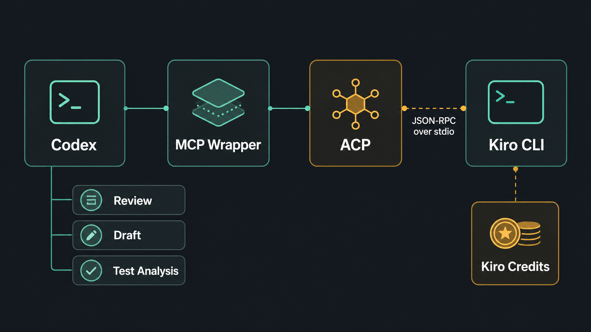
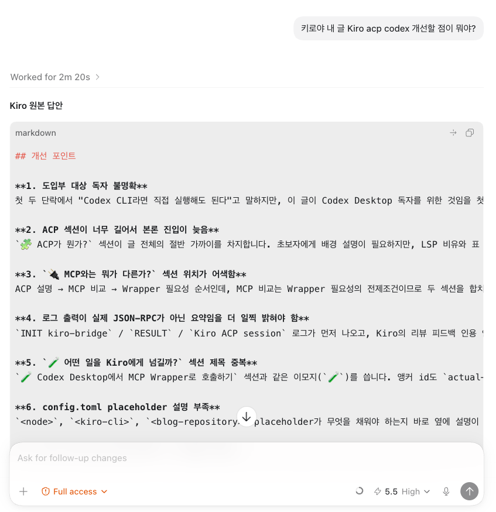
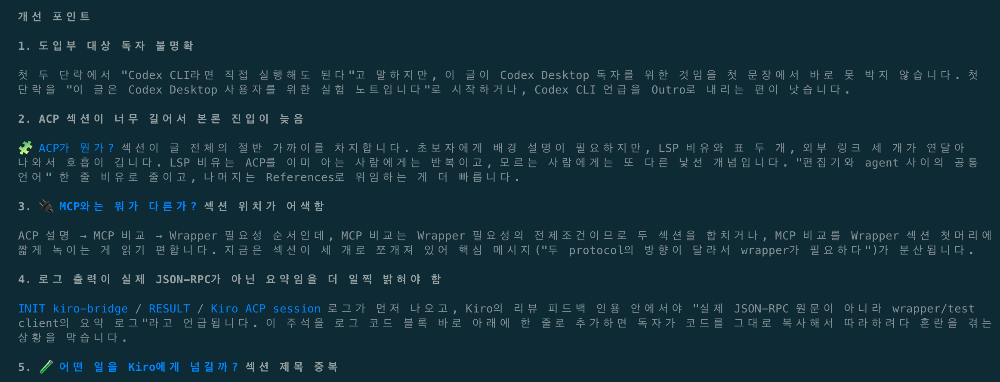

Kiro는 IDE 안에서만 쓰는 도구로 볼 수도 있지만, CLI와 ACP를 함께 보면 다른 agent workflow와 연결할 수 있는 별도의 coding agent runtime으로도 볼 수 있습니다.

Codex CLI라면 shell에서 `kiro-cli acp`를 직접 실행해도 됩니다. 하지만 Codex Desktop에서는 Kiro를 매번 terminal command로 부르는 것보다, thread 안에서 호출할 수 있는 tool처럼 보이게 만드는 편이 자연스럽습니다.

이번 글은 Codex Desktop에서 Kiro ACP agent를 MCP tool처럼 호출해본 실험 노트입니다. 먼저 ACP가 무엇인지부터 설명하고, 그 다음 Codex Desktop에서 Kiro ACP를 쓰기 위해 왜 **MCP wrapper**를 만들었는지 정리합니다.

## <a href="#acp">🧩 ACP가 뭔가?</a><a id="acp"></a>

ACP는 **[Agent Client Protocol](https://agentclientprotocol.com/get-started/introduction)**입니다.

이름이 비슷해서 다른 Agent Communication Protocol들과 혼동하기 쉬운데, Kiro CLI 문맥에서 말하는 ACP는 editor나 client application이 coding agent와 대화하기 위한 protocol입니다. 즉, agent끼리 서로 대화하기 위한 protocol이라기보다 **사용자가 머무는 client와 coding agent runtime 사이의 protocol**에 가깝습니다.

ACP가 나온 배경은 AI coding agent와 editor의 결합도가 너무 높아졌다는 문제의식입니다. 예를 들어 Zed, JetBrains IDE, Neovim 같은 editor가 있고, Kiro CLI, Claude Code, Gemini CLI 같은 agent가 있다고 가정해봅니다. 표준 protocol이 없다면 각 editor는 각 agent에 맞는 전용 integration을 따로 만들어야 합니다.

```text
표준 protocol이 없을 때

Zed         -> Kiro 전용 연동, Claude 전용 연동, Gemini 전용 연동
JetBrains   -> Kiro 전용 연동, Claude 전용 연동, Gemini 전용 연동
Neovim      -> Kiro 전용 연동, Claude 전용 연동, Gemini 전용 연동
```

조합이 늘어날수록 editor도 힘들고 agent도 힘들어집니다. editor는 agent마다 UI, 권한 요청, diff 표시, session 관리 방식을 맞춰야 하고, agent는 editor마다 다른 API에 대응해야 합니다.

ACP는 이 중복을 줄이기 위해 client와 agent 사이의 공통 대화 방식을 정하자는 제안입니다.

```text
ACP가 있을 때

Editor / Client  ->  ACP  ->  Coding Agent
```

개발자에게 익숙한 비유를 하나만 들면, TypeScript language server가 여러 editor에서 동작하듯이 coding agent도 여러 client에서 같은 방식으로 붙을 수 있게 하려는 방향입니다. 다만 이 글에서는 LSP 자체보다, ACP가 **editor UI와 agent runtime 사이의 접점**을 표준화하려는 시도라는 점이 더 중요합니다.

[Zed는 ACP](https://zed.dev/acp)를 agent와 editor가 서로 호환되도록 하는 open standard로 소개합니다. [JetBrains도 Zed와 함께 ACP](https://blog.jetbrains.com/ai/2025/10/jetbrains-zed-open-interoperability-for-ai-coding-agents-in-your-ide/)를 통해 AI coding agent가 JetBrains IDE 안에서 동작할 수 있는 상호운용성을 만들겠다고 설명합니다. [ACP 공식 문서](https://agentclientprotocol.com/get-started/introduction) 역시 code editor/IDE와 coding agent 사이의 통신을 표준화하는 것이 목적이라고 정리합니다.

그래서 ACP에서 중요한 축은 두 가지입니다.

| 역할 | 예시 | 책임 |
| --- | --- | --- |
| ACP Client | Zed, JetBrains IDE, custom client | UI, editor context, permission UX, user interaction |
| ACP Agent | Kiro CLI, other ACP-compatible coding agents | reasoning loop, tool execution, code/task response |

Kiro는 이 흐름에서 ACP-compatible agent 쪽에 들어갑니다. [Kiro ACP 공식 문서](https://kiro.dev/docs/cli/acp/)는 Kiro CLI를 ACP-compliant agent로 실행해 programmatic client integration에 사용할 수 있다고 설명합니다. 즉 Kiro IDE만 쓰는 것이 아니라, Kiro CLI를 ACP agent로 실행하면 다른 ACP client가 Kiro agent runtime을 호출할 수 있습니다.

[Kiro ACP 공식 문서](https://kiro.dev/docs/cli/acp/) 기준으로 Kiro ACP는 JSON-RPC 2.0 메시지를 stdin/stdout으로 주고받는 구조입니다. 그래서 ACP client 역할을 하는 애플리케이션은 Kiro CLI process를 띄우고, 표준 입출력으로 protocol message를 주고받으면 됩니다.

Kiro ACP 예시는 보통 IDE 연동 관점에서 설명되지만, 꼭 JetBrains 같은 IDE 안에서만 쓸 필요는 없습니다. 저는 ACP agent로 실행되는 Kiro CLI를 다른 작업 흐름에서도 호출할 수 있다고 보고, 다음 구조로 실험했습니다.

```text
어떤 Client
  ↓ JSON-RPC over stdio
kiro-cli acp
  ↓
Kiro Agent
```

<br>

## <a href="#mcp">🔌 MCP와는 뭐가 다른가?</a><a id="mcp"></a>

처음 보면 ACP와 MCP가 둘 다 agent protocol처럼 보여서 헷갈립니다. 하지만 두 protocol이 연결하려는 대상은 다릅니다.

| Protocol | 연결하는 대상 | 중심 질문 |
| --- | --- | --- |
| ACP | Client와 coding agent | "이 client가 어떤 agent와 대화할 것인가?" |
| MCP | Agent와 tool/context | "이 agent가 어떤 도구와 context를 사용할 것인가?" |

ACP는 client가 agent를 호출하는 쪽에 가깝습니다. 예를 들어 editor나 custom client가 Kiro CLI를 agent runtime처럼 실행하고, prompt와 session을 주고받는 흐름입니다.

MCP는 agent가 외부 기능을 사용하는 쪽에 가깝습니다. agent가 파일, 브라우저, 문서, 내부 API 같은 도구나 context를 필요할 때 호출할 수 있도록 tool interface를 제공합니다.

그래서 이 글의 구조에서는 두 protocol이 서로 반대편을 담당합니다. Kiro CLI는 ACP agent로 실행되고, Codex Desktop은 MCP tool을 호출합니다. 하나는 agent를 호출하기 위한 protocol이고, 다른 하나는 tool을 노출하기 위한 protocol입니다.

이 둘을 바로 맞물리게 하려면 중간에서 번역하는 계층이 필요합니다. 그 역할을 MCP wrapper가 맡습니다.

```text
Codex
  ↓ MCP tool call
MCP Wrapper
  ↓ ACP messages
kiro-cli acp
  ↓
Kiro Agent
```

<br>

## <a href="#why-wrapper">🤔 왜 Wrapper가 필요한가?</a><a id="why-wrapper"></a>

Codex Desktop workflow 안에서 Kiro를 함께 쓰고 싶다면, 실제로 Kiro가 추론하고 응답하는 지점을 만들어야 합니다. 단순히 Codex prompt에 "Kiro처럼 생각해줘"라고 쓰는 것은 Kiro를 호출하는 것이 아닙니다.

두 agent를 연결하는 구조를 만들려면 결국 Kiro CLI가 실행되어야 합니다.

Codex CLI에서는 가장 단순한 방법이 shell command로 Kiro CLI를 직접 실행하는 것입니다.

```shell
kiro-cli acp
```

CLI 작업이라면 이 방식이 충분히 직관적입니다. terminal 안에서 command를 실행하고, 필요한 prompt와 context를 넘기면 됩니다.

하지만 Codex Desktop에서 반복 workflow로 만들려면 요구가 조금 달라집니다.

- thread 안에서 `ask_kiro`, `review_with_kiro`처럼 이름 있는 tool로 호출하고 싶습니다.
- 매번 ACP JSON-RPC message를 직접 만들고 싶지 않습니다.
- Kiro 호출 결과를 Codex Desktop의 tool result로 돌려받고 싶습니다.
- wrapper 내부에서 session id나 timeout, workspace context를 관리하고 싶습니다.

그래서 중간에 MCP wrapper를 둡니다.

Codex Desktop에게는 다음처럼 보이게 합니다.

```text
ask_kiro(prompt, files)
review_with_kiro(diff, focus)
```

Wrapper 내부에서는 Kiro ACP process를 실행하거나 유지하고, 실제 요청은 ACP protocol로 전달합니다. 이렇게 하면 Codex Desktop은 "Kiro를 호출하는 방법"을 매번 고민하지 않고, MCP tool을 호출하듯 쓸 수 있습니다.

<br>

## <a href="#actual-mcp">🧪 Codex Desktop에서 MCP Wrapper로 호출하기</a><a id="actual-mcp"></a>

처음 이 글의 초안을 쓸 때는 ACP 구조만 정리했고, 실제 Codex Desktop workflow에서 Kiro를 호출하는 형태는 아니었습니다. 그래서 글의 톤이 "실험했다"라기보다 "이렇게 하면 어떨까"에 가까웠습니다.

이번에는 한 단계 더 나아가, 실제 MCP wrapper를 만들고 Codex Desktop에서 그 MCP server를 사용하도록 등록했습니다. wrapper 위치는 blog repository 내부가 아니라 개인 작업 디렉터리인 `~/kiro` 아래로 분리했습니다.

```text
~/kiro/kiro-bridge-mcp/server.js
```

전체 흐름은 아래 그림처럼 이해하면 됩니다.



왼쪽의 Codex는 Codex Desktop thread입니다. 사용자는 Codex Desktop에서 평소처럼 글을 수정하고, 필요할 때 Kiro에게 질문하거나 리뷰를 요청합니다. Codex가 직접 Kiro ACP message를 만들게 하지 않고, 중간의 MCP Wrapper를 tool처럼 호출합니다. 이 wrapper는 Codex 쪽에서는 MCP server로 보이고, Kiro 쪽에서는 ACP client처럼 동작합니다.

그 다음 wrapper가 `kiro-cli acp` process를 실행하고, ACP의 `initialize`, `session/new`, `session/prompt` 요청을 보냅니다. Kiro CLI는 JSON-RPC over stdio로 응답하고, wrapper는 streaming response를 모아 다시 Codex의 MCP tool result로 돌려줍니다.

그림 아래쪽의 작은 항목들은 "Codex가 어떤 일을 wrapper에 맡길 수 있는가"를 보여주는 예시입니다. 실제 구현에서는 범위를 더 좁혀서 `ask_kiro`와 `review_with_kiro` 두 tool만 만들었습니다.

`ask_kiro`는 일반 질문을 Kiro에게 넘기는 tool이고, `review_with_kiro`는 파일, diff, focus를 받아 Kiro에게 2차 리뷰를 맡기는 tool입니다. 둘 다 read-only로 설계했습니다. Kiro가 파일을 직접 수정하지 않고, response만 Codex로 돌려줍니다.

Codex Desktop에서 이 wrapper를 쓰려면 Codex 설정에 MCP server로 등록합니다. 공식 Codex 문서 기준으로 user-level 설정은 `~/.codex/config.toml`, project-scoped 설정은 `.codex/config.toml`에 둘 수 있고, MCP stdio server는 `command`, `args`, `cwd`, `env` 같은 항목으로 실행 방식을 정의합니다.

```toml
[mcp_servers.kiro_bridge]
command = "<node>"
args = ["~/kiro/kiro-bridge-mcp/server.js"]
cwd = "~/kiro"
startup_timeout_sec = 20
tool_timeout_sec = 300
enabled = true

[mcp_servers.kiro_bridge.env]
KIRO_CLI = "<kiro-cli>"
KIRO_BRIDGE_ROOT = "<blog-repository>"
KIRO_EFFORT = "low"
```

여기서 `cwd`는 wrapper가 실행되는 위치이고, `KIRO_BRIDGE_ROOT`는 wrapper가 read-only context를 읽을 workspace입니다. 즉 bridge 코드는 개인 작업 디렉터리에 두되, 블로그 글 리뷰는 blog repository를 대상으로 수행합니다.

이렇게 등록하면 Codex Desktop 입장에서는 Kiro ACP가 직접 보이는 것이 아니라, `kiro_bridge`라는 MCP server가 보입니다. 그리고 그 server가 노출하는 `ask_kiro`, `review_with_kiro` tool을 통해 Kiro ACP session이 만들어집니다.

실제 검증은 포스팅 대상 글 자체를 Kiro에게 보여주고 개선점을 요청하는 방식으로 진행했습니다. Codex Desktop에서는 평소처럼 글을 수정하다가 다음처럼 요청했습니다.

```text
키로야 내 글 Kiro acp codex 개선할 점이 뭐야?
```



이 호출은 `review_with_kiro` tool을 통해 포스트 파일을 Kiro에게 넘기는 흐름입니다. wrapper는 포스트 파일을 읽어 prompt context에 붙이고, Kiro ACP session을 생성한 뒤 Kiro의 답변과 session metadata를 Codex로 돌려줍니다.

여기서 한 가지 더 확인하고 싶었던 것은 Kiro CLI에서 ACP를 통해 호출된 session이 실제로 남는지였습니다. 그래서 응답 metadata에 남은 session id로 Kiro CLI에서 같은 세션을 다시 열어봤습니다.

```shell
kiro-cli chat --resume-id 46a49b64-d5e6-44a9-8388-a7d97ab2d731
```



터미널에서 같은 session을 열어보니 Codex Desktop에서 요청한 글 개선점 대화가 Kiro CLI에서도 이어졌습니다. 즉 wrapper가 실제 Kiro ACP session을 만들었고, 그 session을 Kiro CLI에서 다시 확인할 수 있었습니다. Kiro CLI는 ACP agent로 실행할 수 있고, MCP wrapper 내부에서 Kiro ACP session을 생성해 실제 답변을 받을 수 있었습니다.

<br>

## <a href="#outro">Outro</a><a id="outro"></a>

제가 이 구조에서 가장 유용하다고 본 지점은 "다른 agent의 다른 리뷰 관점"을 작업 흐름 안으로 가져올 수 있다는 점입니다. Codex로 글을 쓰거나 코드를 고치다가, 중간에 Kiro에게 한 번 더 보여주고 다른 관점의 개선점이나 리뷰를 받을 수 있습니다. 같은 내용을 같은 agent가 다시 보는 것보다, 별도의 agent에게 넘기는 편이 놓치는 부분을 줄이는 데 도움이 됩니다.

지금은 사람이 명시적으로 `ask_kiro`나 `review_with_kiro`를 호출하는 방식으로 시작했습니다. 이 정도만 해도 글 초안 리뷰, 기술 설명 점검, 큰 diff에 대한 2차 의견처럼 쓸 수 있습니다. 더 나아가면 hook으로 자동화할 수도 있습니다. 예를 들어 글을 저장한 뒤 Kiro에게 초안 리뷰를 맡기거나, 큰 diff가 생겼을 때 Kiro에게 2차 리뷰를 요청하고 결과만 artifact로 남기는 식입니다.

이번 글에서는 Kiro를 IDE 안에서만 쓰지 않고, Codex Desktop의 작업 thread 안에서 독립적인 리뷰어처럼 호출해봤습니다. ACP와 MCP를 바로 연결하지 않고 wrapper를 둔 이유도 여기에 있습니다. 서로 다른 protocol을 억지로 하나로 합치기보다, 각자가 잘하는 위치에 두고 얇은 adapter로 이어보는 방식입니다.

앞으로도 Kiro로 해볼 수 있는 다양하고 신기한 활용 방법들을 조금씩 더 실험해보려고 합니다. 글 리뷰뿐 아니라 코드 리뷰, 테스트 실패 분석, 자동화 hook 같은 주제로도 이어서 다뤄보겠습니다. 종종 Kiro 활용기를 들고 다시 찾아뵙겠습니다.

<br>

## References

- [Agent Client Protocol Introduction](https://agentclientprotocol.com/get-started/introduction)
- [Zed: Agent Client Protocol](https://zed.dev/acp)
- [JetBrains × Zed: Open Interoperability for AI Coding Agents in Your IDE](https://blog.jetbrains.com/ai/2025/10/jetbrains-zed-open-interoperability-for-ai-coding-agents-in-your-ide/)
- [Kiro ACP docs](https://kiro.dev/docs/cli/acp/)
- [Kiro CLI commands](https://kiro.dev/docs/cli/reference/cli-commands/)
- [Codex config reference](https://developers.openai.com/codex/config-reference#configtoml)
- [Codex MCP docs](https://developers.openai.com/codex/mcp/)
