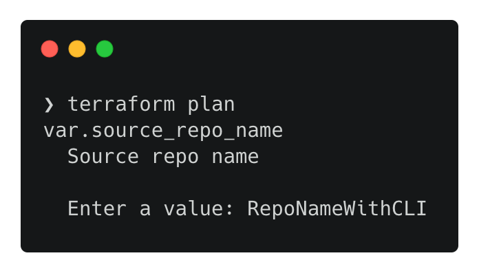

Terraform으로 ECR 파이프라인 구축하기 1 (CodeCommit)

# Overview

이번 포스팅에서는 커밋 후, 도커의 이미지를 자동으로 배포하는 ECR Pipeline을 테라폼으로 생성해보겠습니다.
AWS에서 저장소 역할을 하는 CodeCommit, 코드를 빌드하는 CodeBuild, 파이프라인을 자동화 하는 CodePipeline, 컨테이너 이미지를 저장하는 ECR을 활용해 구축합니다.

1편에서는 **CodeCommit** 구축과 **terraform의 Output, Variables, tfvars** 등을 배워 보겠습니다.

<br>

## 준비 작업
이번 포스팅의 작업공간(~/terraform)을 생성하고 해당 위치에서 아래 코드 블럭을 터미널에 복사합니다.
```shell
cat <<EOF > provider.tf
provider "aws" {
  region  = var.aws_region
}
EOF
```
이후, `terraform init` 명령어를 실행시켜주세요.

## CodeCommit
CodeCommit을 사용하기 위해 [Terraform 도큐먼트](https://registry.terraform.io/providers/hashicorp/aws/latest/docs/resources/codecommit_repository) 에서 사용법을 확인합니다.
링크의 Example Usage를 활용해 코드를 작성할 수도 있지만, 이번 포스팅에서는 제 방식대로아래 코드를 활용해 작성해보겠습니다.
링크에서 소개하는 코드와 다른 부분은 `output`과 `variable`의 사용 여부입니다.

✅ 아래 코드와 도큐먼트의 코드가 어떻게 다른지 꼭 확인해보세요!
```shell
cat <<EOF > codecommit.tf
resource "aws_codecommit_repository" "test" {
  repository_name = var.source_repo_name
  description     = "This is the Sample App Repository"
}

output "source_repo_clone_url_http" {
  value = aws_codecommit_repository.test.clone_url_http
}
EOF
```
`Output`은 향후 clone할 원격 저장소의 위치를 파악하기 위해 넣어줍니다. 또한 `Variable`을 사용해 보다 유연한 코드를 작성해 보겠습니다.

준비 작업에 정의한 리전과 CodeCommit Repo 이름에 `Variable`을 사용하겠습니다.

```shell
cat <<EOF > variables.tf
variable "aws_region" {
  description = "The AWS region"
  default     = "ap-northeast-2"
}

variable "source_repo_name" {
  description = "Source repo name"
  type        = string
}
EOF
```
위 코드를 복사한 후, terraform plan 명령어로 아래와 같은 화면을 확인 할 수 있습니다.

앞서 작성한 variables.tf의 region은 default 값이 있지만, repository는 variable의 형식만 정의되어 있기 때문에 인프라를 생성할 때 필수적으로 이름을 입력받습니다.

✅ variable의 input값을 수기로 작성하는 것을 피하고 싶으면 `tfvars`를 사용합니다. 편의상 이번 프로젝트에서 사용할 값들을 미리 작성하겠습니다.
```shell
cat <<EOF > terraform.tfvars
aws_ecr="my-image"
source_repo_name="my-pipeline"
source_repo_branch="master"
image_repo_name="my-pipeline"
EOF
```
`tfvars`는 위와 같이 변수의 값을 지정하기도 하지만, `.env`처럼 **외부로 노출하면 안되는 값을 넣어두고 git에 ignore시켜 사용**하기도 합니다.

위 작업을 진행 후, `terraform apply`명령어를 적용하면 "Apply complete"과 함께 Outputs 값이 나옵니다.
`terraform state list`명령어 이외에도, [콘솔](https://console.aws.amazon.com/codecommit) 로 이동하면 생성된 인프라를 확인 할 수 있습니다.

생성된 원격저장소를 사용하기 위해 `terraform output`을 활용해 **export 환경 변수**를 지정합니다.

```shell
export tf_source_repo_clone_url_http=$(terraform output source_repo_clone_url_http)
echo $tf_source_repo_clone_url_http	# 확인
```

<br>

## Git Setting

CodeCommit의 Repo 활용법은 아래 2가지 방법이 있습니다.

### 1. 로컬에 위치한 코드를 CodeCommit에 push하기 (원격저장소가 비어있음)

로컬의 빈공간에서 CodeCommit Repo 사용을 위한 git remote 지정
```shell
git init
git remote add origin $tf_source_repo_clone_url_http
git remote -v   # 원격 저장소 확인
```
코드를 작성하고 CodeCommit에 Push하기
```shell
git add .
git commit -m "First commit"
git status
git push origin # master branch로 push
```

자격 증명 문제가 있다면 아래 명령어로 해결합니다. [자격 증명 헬퍼 및 AWS CodeCommit에 대한 HTTPS 연결 문제 해결](https://docs.aws.amazon.com/ko_kr/codecommit/latest/userguide/troubleshooting-ch.html)
```shell
git config --global credential.helper '!aws codecommit credential-helper $@'
git config --global credential.UseHttpPath true
```

### 2. 로컬에 원격저장소의 코드를 clone하기 (원격저장소가 비어있지 않음)

```shell
git clone $tf_source_repo_clone_url_http
```

<br>

지금까지 도큐먼트를 활용해 코드를 작성하고, variable, output, tfvars의 활용법을 배워보았습니다.

앞서 작성된 작업들이 정상적으로 커밋과 clone이 가능하면, 다음 단계로 🚀

---



<br>