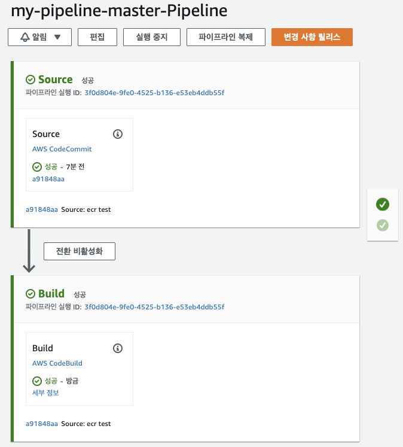

Terraform으로 ECR 파이프라인 구축하기 3 (CodePipeline)

# Preview

3편에서는 CodePipeline을 생성하고 IAM 정책과 역할을 부여하는 법을 배워보겠습니다.

[문서](https://registry.terraform.io/providers/hashicorp/aws/latest/docs/resources/codepipeline )를 확인하면 artifact가 담기는 버킷, pipeline을 생성하는 리소스, 관련된 IAM Role과 Policy가 보입니다.
테라폼은 선언형 언어이므로 Role과 Resource의 작성 순서가 바뀌어도 상관이 없지만, 콘솔에서 작업할 경우 Role을 먼저 작성하고 리소스를 생성하니 3편에서는 IAM을 먼저 작성하겠습니다.

### IAM Role
아래 Role을 방금전 생성한 `codepipeline.tf`에 작성합니다.
```shell
resource "aws_iam_role" "codepipeline_role" {
  name = "terraform-codepipeline"
  assume_role_policy = <<EOF
{
  "Version": "2012-10-17",
  "Statement": [
    {
      "Action": "sts:AssumeRole",
      "Principal": {
        "Service": "codepipeline.amazonaws.com"
      },
      "Effect": "Allow"
    }
  ]
}
EOF
}
```

### IAM Policy
본래 필요한 정책만을 골라 [정책 생성기](https://awspolicygen.s3.amazonaws.com/policygen.html )에서 생생된 정책을 활용하는 방법이 있지만, 어떤 정책이 필요한지 한번에 맞추기는 너무 어렵습니다.
(저의 경우 인터넷에서 타인이 작성한 정책과 에러메시지를 맞아가며 정책을 작성하고 있습니다 😅)<br>
➕ 아래 Policy를 방금전 생성한 `codepipeline.tf`에 아래 코드를 추가합니다.
```
resource "aws_iam_policy" "codepipeline_policy" {
  description = "Codepipeline Execution Policy"
  policy      = <<EOF
{
  "Version": "2012-10-17",
  "Statement": [
    {
      "Action": [
        "s3:GetObject", "s3:GetObjectVersion", "s3:PutObject",
        "s3:GetBucketVersioning"
      ],
      "Effect": "Allow",
      "Resource": "${aws_s3_bucket.artifact_bucket.arn}/*"
    },
    {
      "Action" : [
        "codebuild:StartBuild", "codebuild:BatchGetBuilds",
        "iam:PassRole"
      ],
      "Effect": "Allow",
      "Resource": "*"
    },
    {
      "Action" : [
        "codecommit:CancelUploadArchive",
        "codecommit:GetBranch",
        "codecommit:GetCommit",
        "codecommit:GetUploadArchiveStatus",
        "codecommit:UploadArchive"
      ],
      "Effect": "Allow",
      "Resource": "${aws_codecommit_repository.test.arn}"
    }
  ]
}
EOF
}
```
🚩 이어서 생성한 **Policy를 Role에 부여**합니다. 이것 역시 `codebuild.tf`에 추가합니다.
```shell
resource "aws_iam_role_policy_attachment" "codepipeline-attach" {
  role       = aws_iam_role.codepipeline_role.name
  policy_arn = aws_iam_policy.codepipeline_policy.arn
}
```

## CodePipeline
`aws_codepipeline`리소스의 config에는 artifact store와 암호화 키, Source-Build-Deploy로 이어지는 각 Stage가 선언되어 있습니다.
리소스 안에 기재된 설정들은 필수가 아니므로 선택하여 사용할 수 있습니다. 이번 포스팅에서는 deploy stage와 암호화 config는 제외하고 진행하겠습니다. 
```shell
resource "aws_codepipeline" "pipeline" {
  name     = "${var.source_repo_name}-${var.source_repo_branch}-Pipeline"
  role_arn = aws_iam_role.codepipeline_role.arn
  artifact_store {
    location = aws_s3_bucket.artifact_bucket.bucket
    type     = "S3"
  }

  stage {
    name = "Source"
    action {
      name             = "Source"
      category         = "Source"
      owner            = "AWS"
      version          = "1"
      provider         = "CodeCommit"
      output_artifacts = ["SourceOutput"]
      run_order        = 1
      configuration = {
        RepositoryName       = var.source_repo_name
        BranchName           = var.source_repo_branch
        PollForSourceChanges = "false"
      }
    }
  }

  stage {
    name = "Build"
    action {
      name             = "Build"
      category         = "Build"
      owner            = "AWS"
      version          = "1"
      provider         = "CodeBuild"
      input_artifacts  = ["SourceOutput"]
      output_artifacts = ["BuildOutput"]
      run_order        = 1
      configuration = {
        ProjectName = aws_codebuild_project.codebuild.id
      }
    }
  }

}
```
1편에서 작성한 CodeCommit을 Stage의 Source, 2편에서 작성한 CodeBuild를 Build단계 지정했습니다.
`terraform apply, plan` 명령어를 차례로 반영해 오류가 없는지 확인합니다.

지금까지 작성된 인프라를 `terraform state list`명령어를 통해 확인하면 아래와 같습니다.
```shell
❯ terraform state list
aws_codebuild_project.codebuild
aws_codecommit_repository.test
aws_codepipeline.pipeline
aws_ecr_repository.image_repo
aws_iam_policy.codebuild_policy
aws_iam_policy.codepipeline_policy
aws_iam_role.codebuild_role
aws_iam_role.codepipeline_role
aws_iam_role_policy_attachment.codebuild-attach
aws_iam_role_policy_attachment.codepipeline-attach
aws_s3_bucket.artifact_bucket
```

[CodePipeline 콘솔](https://console.aws.amazon.com/codepipeline )에서 확인하면 권한이 없어 실패한 화면이 나올 것 입니다.
이를 해결하기 위해 또 다른 권한이 필요합니다.

## CodePipeline Trigger
CodeCommit에서 발생한 이벤트가 CodePipeline으로 트리거되기 위해서는 아래 정의된 권한이 필요합니다.

➕ 아래 코드를 `codepipeline.tf`에 추가하고 인프라를 생성해주세요.


## Result
Trigger 까지 정상적으로 적용하고 테스트용으로 활용할 아무 Dockerfile을 CodeCommit에 Push합니다.
다시 [CodePipeline 콘솔](https://console.aws.amazon.com/codepipeline )에 접속해 우상단에 위치한 `변경사항 릴리스`를 누르면,
아래와 같이 정상적으로 코드 파이프라인이 작동하여 운영되는 것을 확인 할 수 있습니다.


## Cleanup
S3 bucket은 빈상태여야 제거가 가능하기에 [S3 콘솔](https://console.aws.amazon.com/s3/home )에서 `ecr-pipeline`의 데이터를 모두 삭제합니다.
이어서 `terraform destory` 명령어로 모든 리소스를 회수합니다.

<br>

총 3편에 걸쳐서 테라폼으로 **최소한의 리소스**로 ECR Pipeline 구축법을 알아보았습니다. (CloudWatch 기능을 추가해 CodePipeline을 구축해보세요 👍)
해당 과정을 통해 AWS 인프라 생성법과, IAM 활용법, Variable, Output, tfvars 등을 활용해 코드를 작성하는 법을 공부했습니다.
다른 CI/CD 파이프라인 구축법도 이번 포스팅에서 다룬 방법과 크게 다르지 않으니, 해당 포스팅이 도움이 되면 좋겠습니다. 😁

<br>

---



<br>