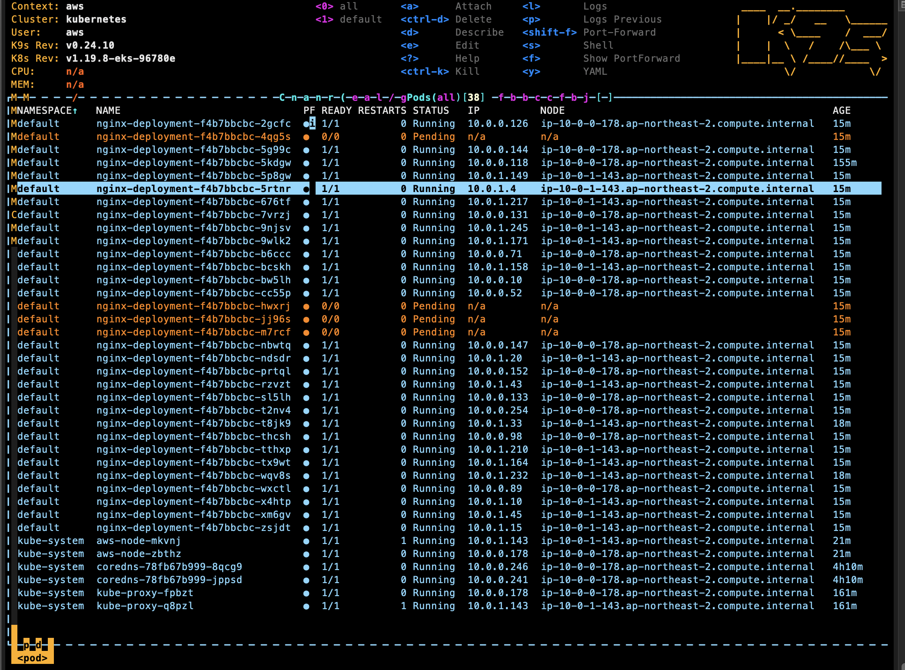
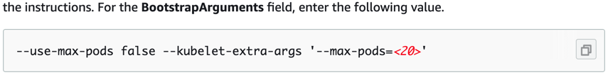
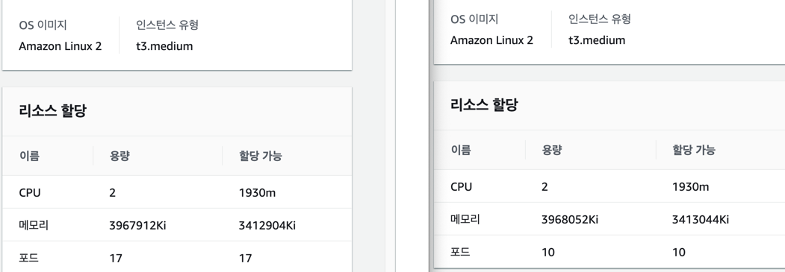

EKS 노드에서 사용 가능한 Pod의 개수는 몇 개일까?

# Preview

이번 포스팅에서는 EKS의 노드 그룹에서는 최대 몇 개의 포드(Private IP)가 할당 가능하고 어떠한 방법으로 최대 포드의 개수를 제어할 수 있는지 알아보자.

<br>

## Build Up

[쿠버네티스 도규먼트](https://kubernetes.io/docs/setup/best-practices/cluster-large/ )에 따르면 노드당 110개의 포드를 생성할 수 있으며, 노드는 5000개까지 생성 가능해 총 15만 개의 포드가 생성 가능하다고 한다. <br>
[GCP의 GKE 가이드](https://cloud.google.com/kubernetes-engine/docs/how-to/flexible-pod-cidr?hl=en#cidr_ranges_for_clusters )에 따르면 기본 클러스터 노드 하나에 최대 110개의 포드가 생성 가능하다고 한다. <br>
구글링을 통해 확인하니, 노드에서 포드의 갯수가 증가할수록 kubelet, cAdvisor 등과 같은 K8s 에이전트에 오버헤드를 발생시키므로 110개 정도를 권장한다고 한다.
그래서 그런지 [kubelet docs](https://kubernetes.io/docs/reference/command-line-tools-reference/kubelet/ )에서도 아래와 같은 max-pods가 110을 기본값으로 가진다.
```shell
--max-pods int32     Default: 110
```

## EKS eni max pods

[IP addresses per network interface per instance type](https://docs.aws.amazon.com/AWSEC2/latest/UserGuide/using-eni.html#AvailableIpPerENI )을 확인해보면 AWS의 인스턴스 타입별 ENI 개수를 파악할 수 있다.
[EKS 설명서](https://docs.aws.amazon.com/eks/latest/userguide/pod-networking.html )를 보면 다음과 같은 공식을 확인할 수 있다. <br>

`(# of network interfaces for the instance type × (# of IPv4 per network interface - 1)) + 2`

ENI의 첫 번째 IP는 포드가 사용할 수 없으므로 1을 빼고 AWS CNI와 kube-proxy가 차지하는 2개의 IP를 마지막 수식에 더해 최종 사용 가능한 `max-pod` 값을 알 수 있다. <br>

설명한 공식 이외에도 `kubectl` 명령어를 통해 Maximum Pods를 파악할 수 있다.
```shell
❯ kubectl get nodes -A
NAME                                            STATUS   ROLES    AGE   VERSION
ip-10-0-0-178.ap-northeast-2.compute.internal   Ready    <none>   18h   v1.19.6-eks-49a6c0
ip-10-0-1-143.ap-northeast-2.compute.internal   Ready    <none>   18h   v1.19.6-eks-49a6c0
❯ kubectl describe nodes ip-10-0-0-178.ap-northeast-2.compute.internal | grep -i pods
  pods:                        17
  pods:                        17
Non-terminated Pods:          (17 in total)
```

### 👀 Labs 1

kubectl의 명령어에서 노드(t3.medium)당 17개의 포드를 사용할 수 있다고 했는데, 직접 노드그룹 내에서 포드를 최대로 띄워 확인해보자. 노드그룹 내에 nginx 32개를 올려보았다.



K9s 쉘을 통해 총 38개의 포드가 확인되었고 38개 중 `aws-node`, `coredns`, `kube-proxy`가 각각 2개의 노드에 위치하고 4개의 nginx 포드가 **Pending** 상태라는 것을 파악했다.
즉, `38(Total) - 4(Pending) = 17(t3.medium Maximum Pods) * 2(# of Node)` 실험 결과와 앞서 알아본 Maximum Pods가 동일하다.

## Maximum Pods 변경하기

EKS에서 Maximum Pods를 결정 짓는 요소는 ENI다. 그러나 클러스터의 노드그룹을 생성할 때 kubelet의 `max-pods` 값을 변경해 커스터마이징 할 수 있다. 
[AWS Docs](https://docs.aws.amazon.com/eks/latest/userguide/cni-custom-network.html )에서 다음과 같은 (불친절한?) 설명을 통해 ENI와 별개로 max-pods를 제어할 수 있는 힌트를 얻었다.

공식 문서에서 설명이 굉장히 빈약하지만, EKS에서 노드 그룹을 커스텀으로 생성할 때 **Launch templates**의 `UserData`를 아래와 같이 정의하면 Maximum Pods가 변경된다.

```shell
MIME-Version: 1.0
Content-Type: multipart/mixed; boundary="==MYBOUNDARY=="

--==MYBOUNDARY==
Content-Type: text/x-shellscript; charset="us-ascii"
#!/bin/bash
/etc/eks/bootstrap.sh {Cluster Name} --use-max-pods false --kubelet-extra-args '--max-pods=10'
--==MYBOUNDARY==--\
```

<details><summary markdown="span">GCP에서 Max Pods를 제어하는 방법 👈 Click! </summary>

[GCP에서는 클러스터를 생성할 때](https://cloud.google.com/kubernetes-engine/docs/how-to/flexible-pod-cidr?hl=en#configuring_maximum_pods_per_node)
아래 명령어의 `--default-max-pods-per-node` 파라미터를 통해 `max-pods`(👆 Build Up 단계에서 default 110 👆)를 조절할 수 있다.
```shell
gcloud container clusters create CLUSTER_NAME \
  # 생략
  --default-max-pods-per-node MAXIMUM_PODS \
  # 생략
```

</details>

<br>

### 👀 Labs 2

아래 사진의 왼쪽은 Labs 1의 Pure한 t3.medium, 오른쪽은 `max-pods`를 지정한 Custom t3.medium이다. 콘솔화면에서 스펙은 같지만 할당된 포드의 수가 다르다.



## Result

지금까지 다양한 방법을 통해 EKS에서 Maximum Pods를 파악하는 방법과 변경하는 방법 배웠다.
AWS에서는 ENI라는 *가상 네트워크 카드를 나타내는 논리적 네트워크 구성 요소* 덕분에 인스턴스 타입마다 생성될 수 있는 포드의 수가 달랐다.
그 밖에도 GCP에 쿠버네티스의 설계 철학을 그대로 이어받아 kubelet의 max-pods 값이 동일하고 클러스터 생성 순간에도 max-pods 설정에 대한 자유도가 높다는 사실을 알 수 있었다.

어떠한 방법이 더 우위에 있는지 결론짓기 어렵지만, CSP의 쿠버네티스 max-pods 생성 원리를 파악하여 최적의 IP 할당에 도움이 되면 좋겠다.

<br>

소중한 시간을 내어 읽어주셔서 감사합니다! 잘못된 내용은 지적해주세요! 😃

---



<br>