본 글은 지난 11월 29일에 GA된 `Karpenter`를 가볍게 사용해 보며 느낀 첫인상에 대한 글입니다.

# Intro

EKS 환경에서 더 빠르고 효율적인 Kubernetes Cluster Autoscaler `Karpenter`가 GA 되었습니다.
오픈소스인 Karpenter는 모든 클라우드 벤더와의 통합도 목표하지만, 아직 타 클라우드와의 통합은 진행 중이라 v0.5으로 공개되었다고 합니다.
즉 GA 된 v0.5만큼은 AWS 리소스와 완벽하게 통합되었기에 이번 업데이트에 공개되었다고 할 수 있습니다.
사실 기존 EKS 환경에서도 EC2의 Autoscaling을 활용한 CA를 지원하였는데, Karpenter 출시가 어떤 영향을 미치게 될 것인지 알아보겠습니다.

 

## Kubernetes Autoscaling

쿠버네티스에서는 다음과 같은 3가지 Autoscaling 방법이 있습니다.

- HPA(Horizontal Pod Autoscaler)
- VPA(Vertical Pod Autoscaler)
- CA(Cluster Autoscaler)

Pod Scaling의 경우 CPU 사용량, 메트릭 등을 관찰하여 스케일링하지만, EKS 클러스터 자체의 자원이 모자라는 경우 CA를 고려해야 합니다.

 

## ⚙️ Cluster Autoscaler with EC2 Auto Scaling

기존 EKS는 다음과 같이 EC2의 Autoscaler 기능을 활용해 탄력적인 환경을 구성했습니다.
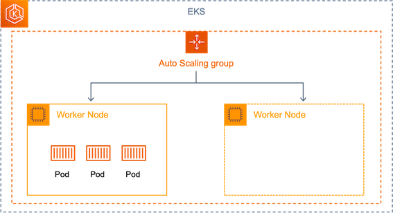
`hpa`와 `vpa`가 eks에서 내에서 scaling을 진행하는 것과는 달리,
worker node를 확보하기 위해 EC2의 Auto Scaling Group을 사용하며 **k8s와 ec2 별도의 Layer를 관리**해야 하는 운영 복잡도가 발생하게 되었습니다.

 

## 🪓 Cluster Autoscaler with Karpenter

반면 Karpenter의 경우 k8s의 native method를 확장한 개념이기 때문에, 기존의 CA 방법과는 달리 효율적인 환경을 제공할 수 있습니다.
*(실제로 카펜터를 운영해 보면 기존의 Auto Scaling Group을 사용하지 않는 것은 아니지만,
사용자 입장에서는 고려하지 않아도 되니 k8s layer에서만 관리된다고 해도 틀린 말은 아닌 것 같습니다.)*

[karpenter.sh](https://karpenter.sh/) 의 홈 화면을 보면 간단한 동작 원리를 설명하는 그림이 있습니다.
karpenter가 unscheduled pods를 관찰하고 있다가 즉시(just-in-time) 최적화된 capacity에 pods를 배포합니다.

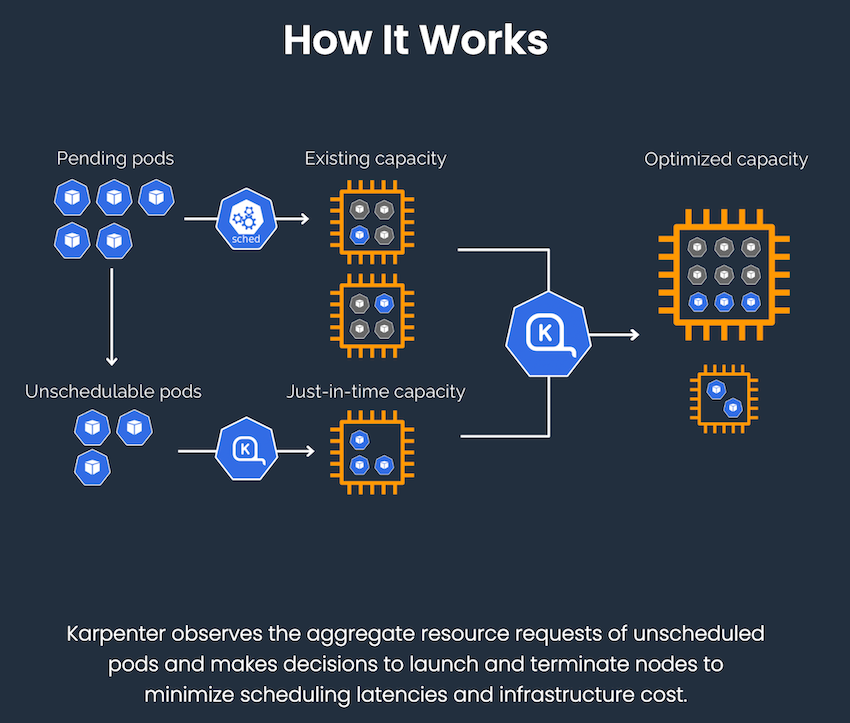

### Overprovisioning

과거 EC2의 스케일링을 사용하는 CA에 대한 [공식 문서](https://docs.aws.amazon.com/ko_kr/eks/latest/userguide/cluster-autoscaler.html)에서, 다음과 같은 고려 사항을 확인할 수 있습니다.

> 노드를 확장하기 전에 노드가 확장될 때까지 기다려야 하므로 배포 대기 시간에 큰 영향을 미칩니다.
> 노드를 사용할 수 있게 되려면 몇 분 정도 걸릴 수 있으며, 이로 인해 포드 예약 지연 시간이 크게 늘어날 수 있습니다.
> 예약 대기 시간이 늘어나는 것을 감수하고 **오버프로비저닝**을 사용하여 이를 완화할 수 있습니다.

그러나 이제 karpenter를 도입한다면 **1분 이내 최적화된 인스턴스를 바로 프로비저닝** 할 수 있으므로,
더 이상 미리 프로비저닝을 할 필요도 없고 워커 노드의 크기 조정도 고려하지 않아도 됩니다.

어떻게 오버프로비저닝을 방지하고 컨테이너와 클라우드 환경의 이점을 더 누릴 수 있게 해주는지 제가 진행해본 테스트와 함께 알아보겠습니다.

 

## 👀 Lab

*TMI : 이 글을 보는 시점에는 수정되어 있을 수도 있겠습니다만,
공식 문서에 기재된 Default Region과 Module의 azs Config 값이 통일되지 않았습니다. 수행 시, 참고하시기 바랍니다.*

공식 문서 [Terraform으로 시작하기](https://karpenter.sh/docs/getting-started-with-terraform/) 의 가이드대로
Terraform 코드를 실행시키면 EKS 내에 다음과 같은 `karpenter-controller`와 `karpenter-webhook` 포드가 올라온 것을 확인할 수 있습니다.
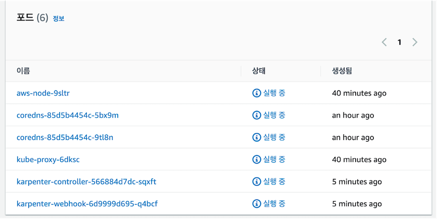
우선, Karpenter가 정말 최적화된 capacity를 제공하는지 확인하기 위해 `t3a` 시리즈의 스펙을 첨부합니다.
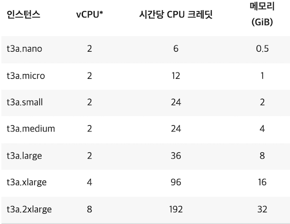

### Test 1 : t3a.medium 인스턴스에 1cpu를 요구하는 5개의 pod 배포

문서에서 제공하는 inflate manifest를 활용해 t3a.medium 인스턴스에 1cpu를 요구하는 5개의 pod를 배포하면,
다음과 같이 `t3a.2xlarge` 인스턴스가 즉시 프로비저닝 됩니다.
(1분 이내라고 소개되지만, 체감상 1분 보다 더 빠른 시간 안에 프로비저닝 되는 것 같습니다.)
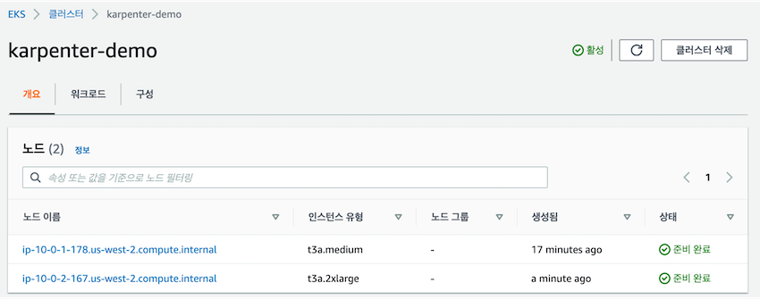
새롭게 생성된 `t3a.2xlarge` 노드를 확인하면 다음과 같이 5개의 pod가 배치된 것을 볼 수 있습니다.
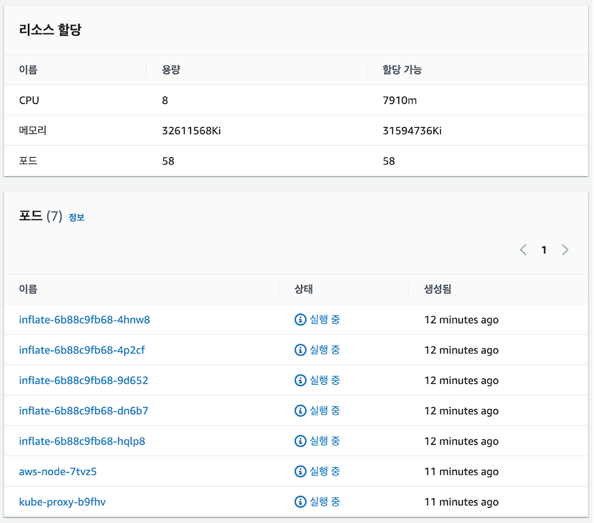

아키텍처로 보면 다음과 같습니다. 기존 t3a.medium에는 기본으로 있는 pod들 때문에 1cpu 조차 할당할 수 없습니다.
inflate는 5cpu를 요구하므로, 이를 수용할 수 있는 t3a.2xlarge 인스턴스를 프로비저닝하고 pod들을 배치시켰습니다.
요청 리소스를 기반으로 최적의 인스턴스를 할당한 것을 확인할 수 있었습니다.

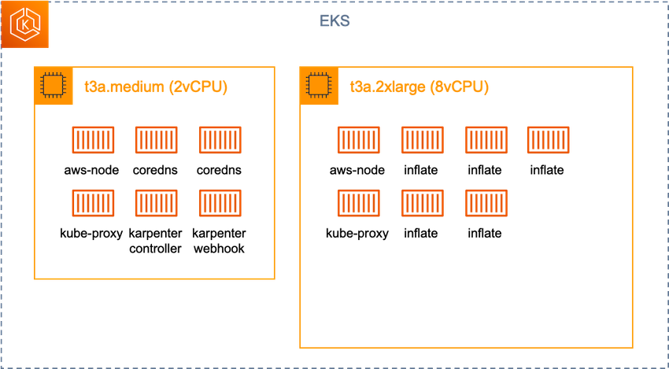

### Test 2 : Test1환경에서 0.5cpu를 요구하는 5개의 pod 배포
Test 1에서 **Scalue out**(worker node 1대 => 2대) & **Scale up**(t3a.medium => t3a.2xlarge)
를 동시에 경험해 봤다면, 이번에는 다음과 같이 필요한 리소스만 0.5 cpu로 줄여보겠습니다.
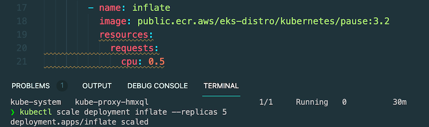

기존 `t3a.2xlarge` 인스턴스가 사라지고, `t3a.xlarge` 인스턴스가 즉시 프로비저닝 되었습니다.
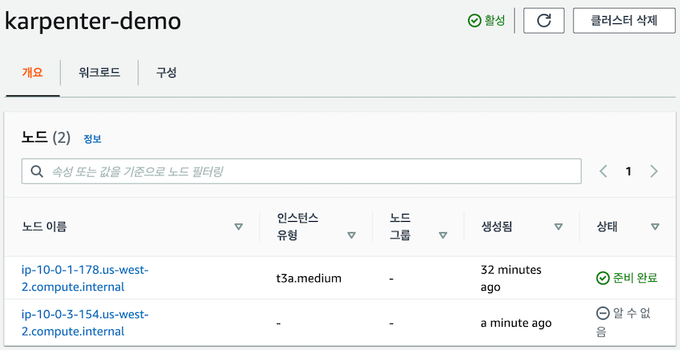
⬆️ a minute ago에서 ⬇️ 2minutes ago로 변하는 것을 보니 정말 1분 이내로 동작하는 것 같습니다.
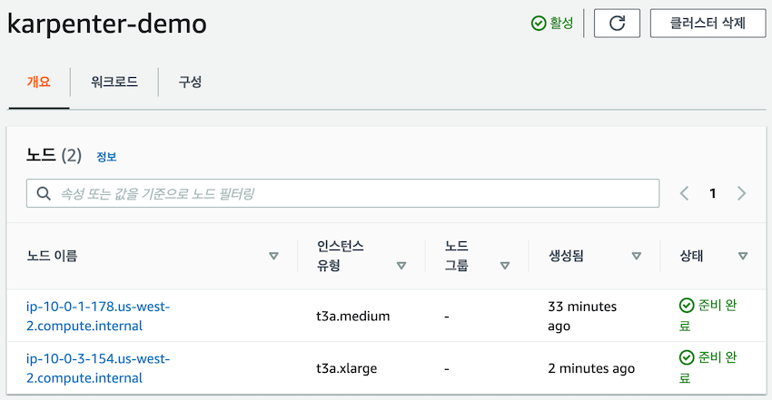

아키텍처로 보면 다음과 같습니다.
이번에는 `t3a.medium`에 0.5 cpu만큼의 capacity가 남아있으므로 1개의 inflate pod가 배포되었고,
`t3x.xlarge` 나머지 4개의 inflate pod가 배포되었습니다.
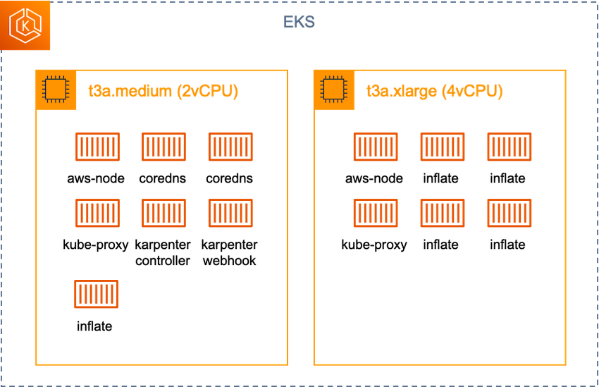
`t3a.large`(2cpu) < `inflate`(0.5cpu * 4) + `kube-proxy` + `aws-node` < `t3a.xlarge`(4cpu)

정말 빠른 시간 내에 최적의 capacity를 할당하는 모습을 보니 유연하고 높은 성능을 제공한다는 소개가 맞는 것 같습니다.

저는 위 실험에서 인스턴스에 관한 별도의 CRD 값들을 지정하지 않아 karpenter가 `t`시리즈 인스턴스들을 프로비저닝 하였지만,
운영에서 Karpenter를 사용하기 위해서는 [Provisioner API](https://karpenter.sh/docs/provisioner/)를 읽고 세밀한 manifest 값들을 조정해 주어야 합니다.

 

## Outro
과거 AWS의 CA는 스케일링에 걸리는 시간도 상당할뿐더러,
제한적인 스케일링으로 인해 리소스가 낭비되거나 운영환경에서 다운타임을 최소화하기 위해 오버프로비저닝 되는 경우도 많았습니다.
기존의 방법보다 더 Kubernetes native 한 karpenter를 도입한다면, 아래 그림과 같은 효과를 기대할 수 있습니다.
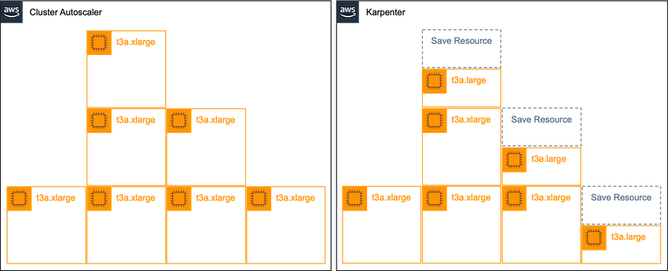

Karpenter의 빠른 프로비저닝과 유연한 스케일링 덕분에 클라우드를 더 클라우드답게 사용할 수 있게 된 만큼
가까운 미래에 Karpenter가 기존의 CA를 대체할 것으로 예상됩니다.
지금까지 아주 간단하게 Karpenter를 사용해 본 후기를 작성해 보았습니다.
추후, Karpenter의 자세한 동작 원리와 제약 사항 혹은 더 많은 기능들에 대하여 다뤄보겠습니다.

소중한 시간을 내어 읽어주셔서 감사합니다! 잘못된 내용은 지적해주세요! 😃

 

### 📚 References

- [AWS Whats new, aws karpenter](https://aws.amazon.com/ko/about-aws/whats-new/2021/11/aws-karpenter-v0-5/)
- [Introducing Karpenter](https://aws.amazon.com/ko/blogs/aws/introducing-karpenter-an-open-source-high-performance-kubernetes-cluster-autoscaler/)
- [Karpenter Document](https://karpenter.sh/)

---

 