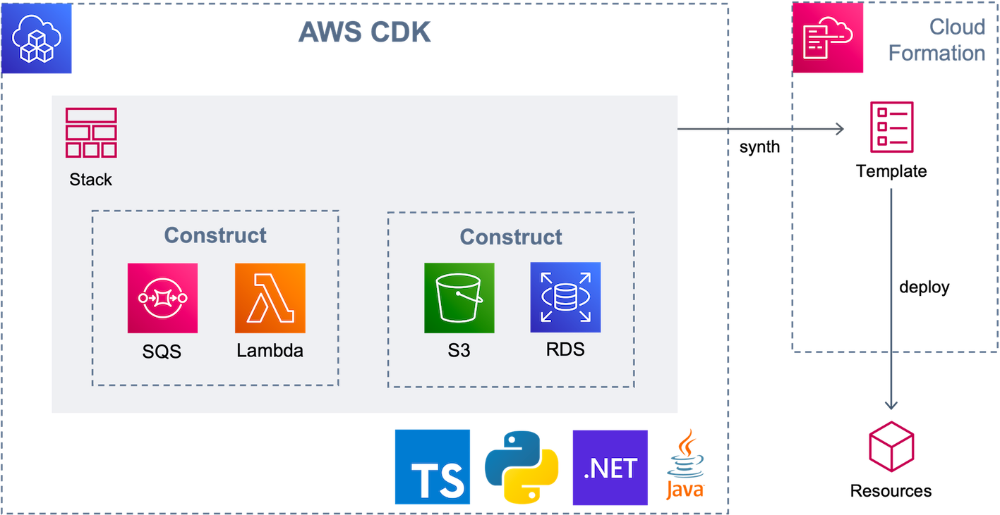
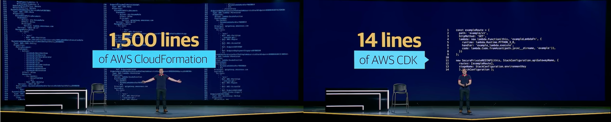
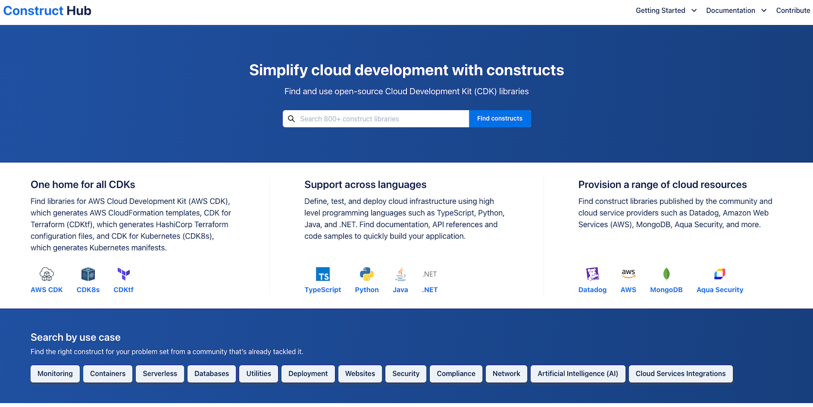
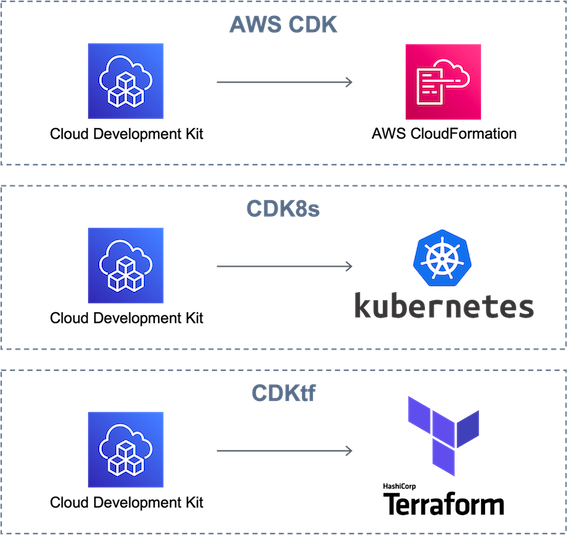
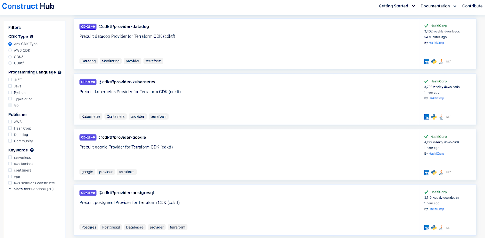

본 글은 지난 AWS re:Invent 2021에서 발표된 `Construct Hub`를 둘러보며 느낀 첫인상에 대한 글입니다.

# Intro

[AWS re:Invent 2021, 아마존 CTO인 Dr. Werner Vogels 키노트](https://youtu.be/8_Xs8Ik0h1w?t=4666 )에서
AWS CDK 라이브러리들을 활용할 수 있는 [Construct Hub](https://constructs.dev/ )가 발표되었습니다.
보통 AWS 리인벤트에서는 AWS 고유의 서비스들이 소개되는데요,
이번에 말씀드릴 Construct Hub는 AWS의 솔루션이 아닌 오픈 소스 커뮤니티이자,
**CDK 라이브러리를 검색하고 공유할 수 있는 장**이라고 할 수 있습니다.
Construct Hub를 통해 AWS가 그리는 IaC(Infrastructure as Code)의 미래를 함께 만나보겠습니다.

우선, Construct Hub를 소개하기 앞서 AWS의 IaC 도구들에 대하여 간략하게 알아보겠습니다.

<br>

## ️📂 AWS CloudFormation

2011년 AWS의 리소스를 JSON 또는 YAML 형식으로 인프라를 템플릿화 할 수 있는 CloudFormation을 발표했습니다.

> 예) AWS S3 버킷 리소스를 제어하는 CloudFormation 코드
> ```YAML
> Resources:
>   HelloBucket:
>     Type: AWS::S3::Bucket
>     Properties:
>       AccessControl: PublicRead
>       WebsiteConfiguration:
>         IndexDocument: index.html
>         ErrorDocument: error.html
> ```

그러나, 인프라가 복잡해질수록 CloudFormation 코드의 길이도 길어지고 리소스 간의 관계도 파악하기 어려워 관리의 피로도가 증가하게 되었습니다.
AWS는 이러한 CloudFormation의 약점을 보완하고 개발자들이 YAML 형식으로 인프라를 정의하는 게 아니라,
**선호하는 프로그래밍 언어로 클라우드 인프라를 정의할 수 있도록 Cloud Development Kit(CDK)** 를 2019년에 정식으로 출시했습니다.

<br>

## ⌨️ AWS Cloud Development Kit

CDK는 익숙한 프로그래밍 언어를 사용해 클라우드 애플리케이션 리소스를 정의할 수 있는 오픈 소스 소프트웨어 개발 프레임워크입니다.
CDK는 어떤 방식으로, 앞서 언급된 CloudFormation의 약점들을 보완하는지 그림과 함께 알아보겠습니다.



CDK는 **Construct**의 집합체라 말할 수 있습니다.
**Construct**는 클라우드 서비스를 이루는 컴포넌트라 생각하셔도 좋습니다.

CDK 프레임워크를 통해 개발자 혹은 클라우드 운영자는 타입스크립트, 파이썬, 닷넷, 자바 등의 익숙한 프로그래밍 언어 중
하나를 선택하여, construct 라이브러리를 사용해 프로그래밍 합니다.
하나의 Stack으로 엮어진 소스코드를 `cdk synth` 라는 명령어로 CloudFormation에서 사용되는 템플릿으로 변환하고 `cdk deploy` 명령어로 인프라를 배포합니다.

CDK로 작성된 인프라 코드는 프로그래밍 언어의 이점을 그대로 채택하여,
해당 언어에 익숙한 사람이라면 YAML로 작성된 CloudFormation 보다 인프라의 환경을 파악하기 쉽습니다.
실제로 올해 키노트에 언급된 [Liberty Mutual INSURANCE사의 CDK 도입 사례](https://youtu.be/8_Xs8Ik0h1w?t=4872 )에서
1500라인의 CloudFormation 코드를 CDK에서 단 14줄로 구현하며 CDK의 뛰어난 가시성을 알렸습니다.



<br>

## 🗂 Construct Hub

대망의 Construct Hub를 소개하기 위해 먼 길을 돌아왔습니다.😓
맨 처음에 Construct Hub를 오픈 소스 커뮤니티이자, CDK 라이브러리를 검색하고 공유할 수 있는 장이라고 소개한 말이 맞는지 그림과 함께 확인해 보겠습니다.



[Construct Hub](https://constructs.dev/ )의 메인 홈페이지를 확인해 보면 CDK 라이브러리를 검색할 수 있는
'서치 바'와 현재 '지원하는 언어'와 '서비스 프로바이더'(AWS, Datadog, Mongo DB, Aqua Security 등)가 보입니다.

이 중에서도 화면 왼쪽에 위치한 다양한 CDK들의 종류에 대해 궁금증이 생기실 것 같습니다.

앞서 소개한 AWS CDK는 프로그래밍 언어로 작성한 인프라 코드를 Cloudformation으로 템플릿을 생성했습니다.
이처럼 CDK가 생성하는 템플릿이 AWS Cloudformation으로 활용 가능하도록 하는 것을 `AWS CDK`,
쿠버네티스로 활용 가능하도록 하는 것을 `CDK8s`, 테라폼으로 활용 가능하도록 하는 `CDKtf`라고 합니다.



위와 같이 현재 3가지 Type을 지원하고 있으며, 향후 다른 도구들도 지원할 가능성이 있다고 합니다.

다음으로는 Construct Hub에 등록된 다양한 Construct 검색 결과입니다. 
현재는 대부분 Construct는 Hahicorp, Datadog과 같은 클라우드 서비스 Publisher 들이 참여했지만,
개인도 [JSII](https://aws.github.io/jsii/) (CDK가 다중 언어 라이브러리를 제공할 수 있도록 하는 기술)
기반의 construct를 만들고 aws-cdk, cdk8s, cdktf 등의 키워드와 함께 npm 레지스트리에 공개되어 있다면 약 30분 내에 `Construct Hub`에도 개시된다고 합니다.



화면에 보이는 특이점으로는 HashiCorp가 제공하는 `CDKtf`를 통해,
다른 클라우드 서비스들과 통합하여 AWS 서비스 만이 아닌 **모든 클라우드를 CDK로 제어 가능**하게 하려는 큰 그림을 그려나가고 있다는 것을 알 수 있습니다.

<br>

## Outro

지금까지 Construct Hub를 간단하게 살펴보며, AWS IaC 도구들의 변천사와 AWS가 그리는 IaC의 미래를 엿볼 수 있었습니다.

그중에서도 흥미로웠던 요소들은 다음 2가지로 말씀드릴 수 있습니다.

1. IaC를 도입한 조직의 경우, Terraform, Ansible 등 여러 IaC 도구를 각각의 IaC 도구들의 특성에 맞게 복합적으로 운영합니다. CDK가 다방면으로 IaC 도구를 지원(AWS CDK, CDK8s, CDKtf) 하게 만들어 관리 복잡도를 줄이려는 노력이 흥미롭습니다.
2. CDKtf를 통해, 타 클라우드 서비스를 CDK로 제어하게 된다는 점이 흥미롭습니다.

사실 CDK8s, CDKtf 모두 Construct Hub가 나오기 이전부터 존재했지만, Construct Hub에 개시된 문서들을 보니 더 흥미롭게 다가옵니다.

아직 세상에 알려진지 얼마 되지 않은 Construct Hub를 활용하기에는 어려움이 있지만, 누구나 Construct Hub에 기여할 수 있는 오픈소스 생태계를 구축한 만큼 빠른 성장이 기대됩니다. Construct Hub가 기여할 IaC 미래에 긍정적인 기대를 걸어봅니다.

소중한 시간을 내어 읽어주셔서 감사합니다! 잘못된 내용은 지적해주세요! 😃

<br>

### 📚 References

- [AWS Construct Hub availability](https://aws.amazon.com/ko/about-aws/whats-new/2021/12/aws-construct-hub-availability/)
- [Construct Hub](https://constructs.dev/)

---
