본 글은 2021년 4월 30일 [EC2 Image Builder supports Auto Scaling launch template](https://aws.amazon.com/about-aws/whats-new/2021/04/ec2-image-builder-supports-auto-scaling-launch-template/)
에 소개된 기능을 활용해 Image Builder로 Golden AMI를 만들고,
해당 이미지로 Auto Scaling Group의 launch template을 업데이트하는 방법을 소개합니다.

# Intro

클라우드를 다루다 보면 **Netflix** 가 여러 분야에서 앞장서 있는 것을 확인할 수 있습니다.
그중에서 Immutable Server Pattern을 알리는데 기여한 2013년에 발간된 [AMI Creation with Aminator](https://netflixtechblog.com/ami-creation-with-aminator-98d627ca37b0)
를 꼭 한번 읽어보시기 바랍니다. 과거 넷플릭스는 AWS의 이미지 파일을 생성하기 위해 Aminator라는 도구를 사용했지만,
본 포스팅에서는 이미지 빌더로 AMI를 만들고 Auto Scaling Group에 적용시키는 방법을 배워 Immutable Server Pattern을 학습해 보겠습니다. 

 

## Immutable Server

Immutable Server 대한 내용은 martin fowler 블로그에 소개된 [ImmutableServer](https://martinfowler.com/bliki/ImmutableServer.html)
글을 보시면 굉장히 잘 설명되어 있습니다. 요약 + 그동안의 제 뇌피셜을 함께 말씀드리면 다음과 같습니다.

서버를 운영하다 보면 업데이트를 비롯한 다양한 이슈들로 인해 구성요소가 자주 변하게 됩니다.
그렇게 운영하다 보면 무언가 꼬여 서버를 재 생성하는 일이 발생하는데 아래와 같은 라이프 사이클을 만나게 됩니다.

이런 상황에서 구성이 다른 여러 대의 서버를 가지게 되면 `Configuration drift`가 발생했다고 표현합니다.
또한 위 그림처럼 자꾸 새로운 이미지로 회귀하니까, `Shift Left`라고도 표현하고 이를 한국어로 표현하는 말을 찾아보니 `원점 회귀`라는 표현도 쓰입니다.

구성 변경이 잦은 서버는 깨지기(fragile) 쉽고, 또 장애가 발생할 경우 재현이 어려울뿐더러 변경 시 연쇄적인 장애를 유발할 가능성이 있습니다.
이를 두고 깨지기 쉬운 눈송이 같다 하여 `Snowflake Server`라 부릅니다.
이 상황을 피하기 위해, Configuration drift를 피하는 Base Image(Configuration이 발생하면 새롭게 생성)를 활용한 방법을 `Phoenix Server`
라 부릅니다. *([Phoenix Server](https://martinfowler.com/bliki/PhoenixServer.html) 용어는 마틴 파울러의 동료 [Kornelis Sietsma](https://twitter.com/kornys) 가 제안했다 합니다.)*

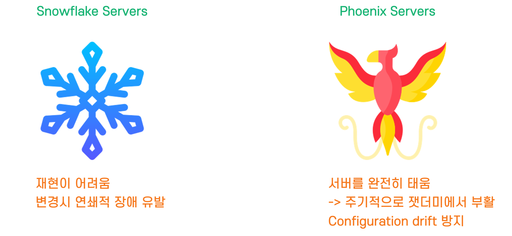

피닉스 서버의 개념은 기본 이미지(Base AMI, Golden AMI)를 통해 언제나 일관성 있는 환경을 제공했고,
이러한 개념들이 자연스럽게 `Immutable Server`의 개념으로 이어졌습니다.
*(최근에는 Immutable Server를 넘어 `Immutable Infrastructure`의 개념도 있습니다!)*

 

## 이미지 빌더와 오토 스케일 그룹으로 이뮤터블 서버 구축하기

클라우드에서의 Immutable Server Pattern 검색하면 아래와 같은 좋은 예시들이 나옵니다.

- [Create immutable servers using EC2 Image Builder and AWS CodePipeline](https://aws.amazon.com/ko/blogs/mt/create-immutable-servers-using-ec2-image-builder-aws-codepipeline/)
- [Tutorial: Immutable infrastructure for Azure, using VSTS, Terraform, Packer and Ansible](https://cloudblogs.microsoft.com/opensource/2018/05/23/immutable-infrastructure-azure-vsts-terraform-packer-ansible/)
- [Provision Infrastructure with Packer](https://learn.hashicorp.com/tutorials/terraform/packer)
- [하시코프 튜토리얼을 보고 만든 필자의 블로그 🥲](https://heuristicwave.github.io/Packer)

그러나 이제부터 다룰, 이미지 빌더와 오토 스케일 그룹으로 이뮤터블 서버 패턴을 만족시킬 수 있습니다.
AWS에서 제공하는 AutoScale은 탄력적인 확장과 축소를 제공하지만 Desired Capacity 기능을 활용해 항상 동일한 서버의 수를 유지할 수 있습니다.

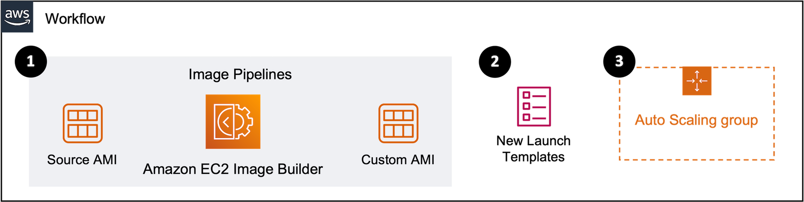

1. Image Builder의 `Image pipelines`를 활용해 원본 AMI로부터 원하는 형태의 Output(Custom/Golden/Base AMI)을 제작합니다.
2. `Distribution settings`을 통해 lt(Launch Template)에 1번에서 생성한 AMI로 교체하여 새로운 버전을 만듭니다.
3. 이제, 새롭게 생성되는 ASG(Auto Scaling Group)은 새롭게 버전 업된 lt를 통해 인스턴스를 생성합니다.
   
*3번의 ASG의 경우, Refresh를 하기 전까지는 이전 상태의 lt를 기준으로 인스턴스가 운영되고 있습니다.
이미지 생성과 동시에 새로운 AMI로 EC2 Refresh를 할 수 있는 방법이 있지만,
새롭게 생성된 인스턴스가 운영환경에 바로 적용되는 것은 바람직하지 않으므로 해당 부분에 대한 자동화는 제외하였습니다.
만약 검증된 AMI를 생성한다면, Lambda 혹은 기타 방법 등을 통해 Refresh 하여 이미지 생성부터 배포까지 자동화할 수 있습니다.*

추후 다른 포스팅에서 자세히 다룰 예정이지만, 이러한 패턴은 Immutable Infrastructure의 한 요소를 이루기도 합니다.

## 📜 Workshop

### 0️⃣ Launch Template & Auto Scaling groups 생성

기존 환경에 0️⃣이 준비되어 있다면 다음 단계인 **Distribution settings**으로 넘어가도 좋습니다.

해당 단계는 제가 굉장히 게으른 관계로 AWS Documentation : [Creating an Auto Scaling group using a launch template](https://docs.aws.amazon.com/autoscaling/ec2/userguide/create-asg-launch-template.html)
으로 대체하겠습니다.

> 💡 만약 기존 환경이 Launch Template이 아닌 `Launch Configurations`으로 구성되어 있을 경우,
> 콘솔 화면에서 `Copy to launch template` 버튼을 누르시면 손쉽게 lt로 변경 가능합니다.  
> 💡 Launch Template과 Launch Configurations는 굉장히 유사하지만, Launch Template의 경우 더 다양한 기능들을 제공합니다.
> 특히 버전관리 기능을 통해 Rollback을 하거나, 업데이트시 ASG를 활용한 Rolling Update가 가능해 Launch Template 사용을 권장합니다.

### 1️⃣ Distribution settings

EC2 Image Builder 콘솔 화면에 접속해 `Distribution settings`에서 새로운 세팅을 생성합니다.

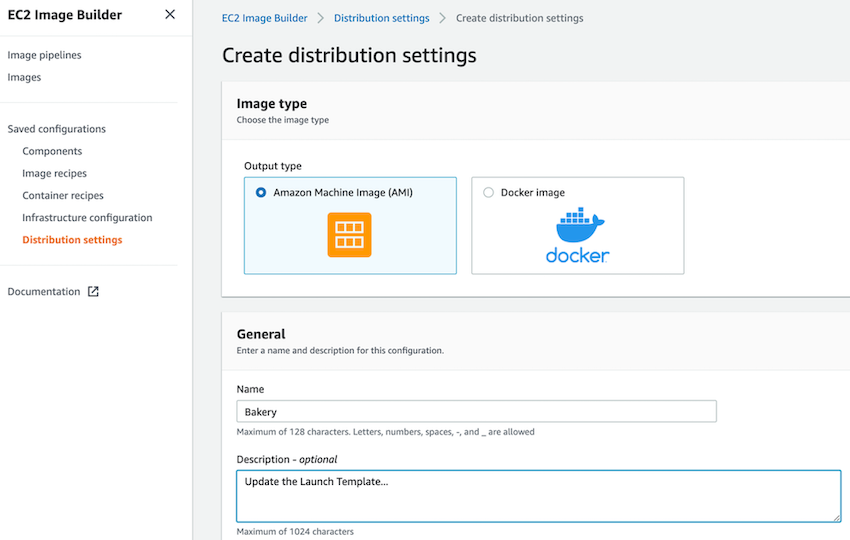

필수 항목인 이름을 작성하고 `Region settings`에서 배포할 리전을 확인한 후,
하단의 `Launch template configuration`에서 Step 0️⃣에서 작성한 lt를 지정하고 `create settings`로 생성합니다.

### 2️⃣ Image pipelines

#### Step 1

Distribution settings 작성이 완료되었다면, 콘솔에서 `Image pipelines`에 접속하여 아래 정보들을 기재합니다.
아래 사진의 좌측 Step 5까지의 과정을 거치면 목표로 했던 환경이 완성됩니다. 

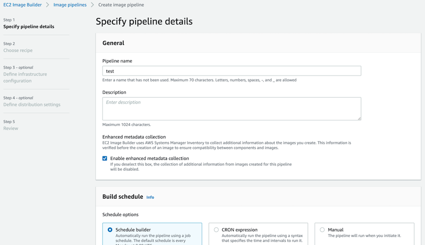

`Build schedule`에서는 주기적으로 파이프라인을 실행할 수 있는 방법들을 제공하는데 운영자가 원하는 방식으로 설정할 수 있습니다.

#### Step 2

`Choose recipe` 단계에서는 기존에 만들어둔 **recipe**가 없으므로 `Create new recipe`를 선택하고, **Image type**으로 **AMI**를 선택합니다.

다음 `Base image`를 고르는 단계에서는 아래 화면과 같이 **관리형 이미지**를 사용하거나 기존에 작성한 **Custom AMI ID**를 사용해도 됩니다.

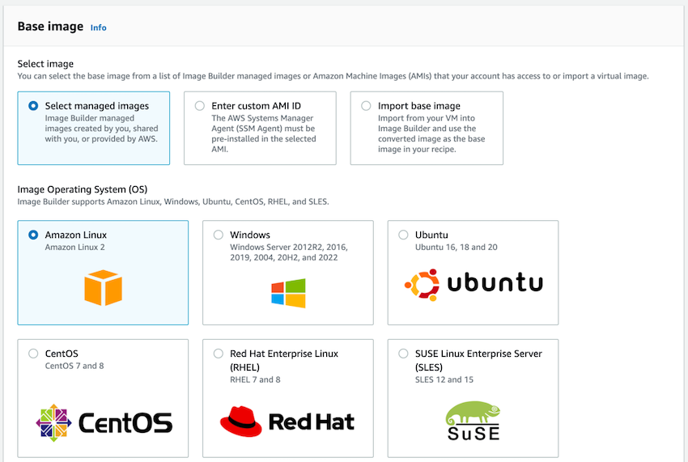

그다음 `Instance configuration`와 `Working directory`에서는 **기본 값**으로 둬도 상관없지만
**SSM, User data, Working directory path**의 필요 여부에 따라 활용하시면 됩니다.

이어서 `Components`에서는 Golden AMI를 구축하기 위해 선행되어야 하는 각종 Agent나 소프트웨어(Apache, dotnet etc)를 선택할 수 있습니다.
저는 편의상 CloudWatch Agent를 선택했습니다.

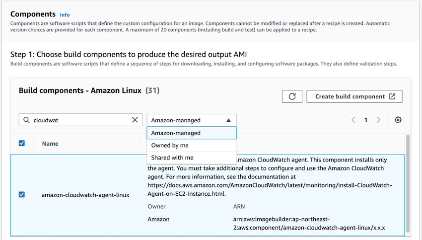

그다음 이어지는 **Test components, Storage, Tags** 역시 필요 여부에 따라 활용하시면 됩니다.

#### Step 3

3단계에 진입하면 아래 사진과 같이 이미지 빌더의 인프라 Config 값들을 정의할 수 있는 공간이 나옵니다.
3번째 버튼인 `Create New infrastructure configuration`으로 직접 인스턴스 유형, 네트워크, SNS topic을 설정이 가능하지만,
저는 1번 `Create infrastructure configuration using service defaults`로 기본 구성 값들을 잡아주었습니다.
(IAM Role과 SNS Topic도 자동으로 생성해 주고 굉장히 편리하네요.)

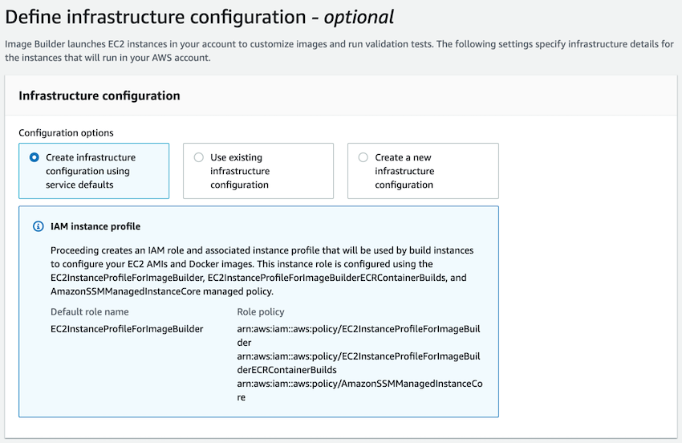

#### Step 4

드디어, 이전 **1️⃣ Distribution settings** 과정에서 만들어둔 **배포 설정** 해당 단계에서 선택합니다.

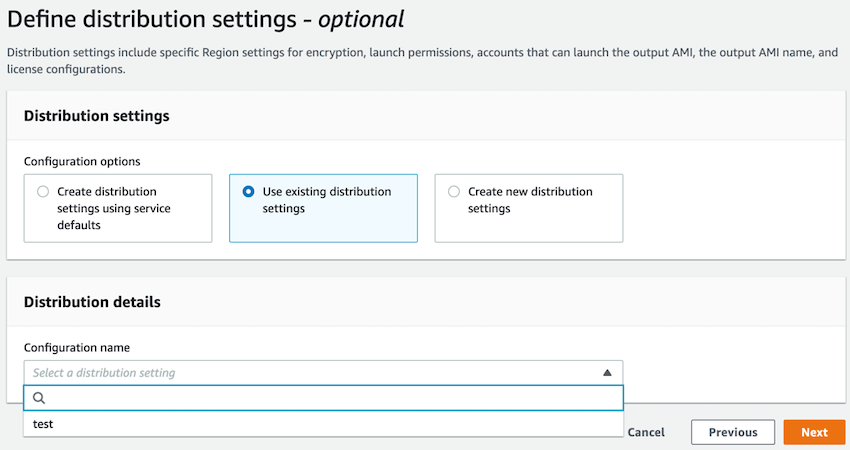

#### Step 5

Review 단계까지 구성 요소들을 검토해 보고 Create pipeline을 누르고 Image pipelines 콘솔로 돌아오면 아래와 같은 화면을 만나게 됩니다.
아래 캡처화면의 경우 이미 빌드가 끝난 상태이지만, 테스트를 위해서 **Actions - Run pipeline** 단계를 거치면,
ec2 콘솔에서 image build를 위한 builder 인스턴스가 생성되고 종료되는 것을 과정을 확인할 수 있습니다.

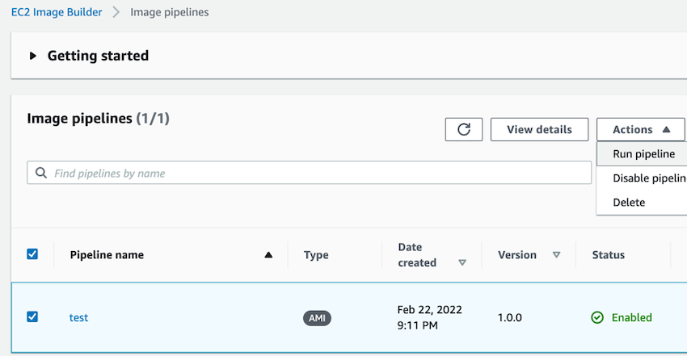

### 3️⃣ Review

1. **EC2 - Images - AMIs**에서 새롭게 생성된 AMI 확인
2. **EC2 - Launch templates**에서 새롭게 버전이 올라간 lt 확인, 여기서 Versions 정보를 누르면 Image Builder가 생성한 Description을 확인할 수 있습니다.
   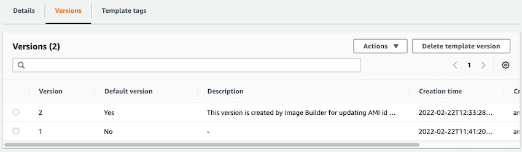
3. 제대로 작동하는지 확인하기 위해 기존의 EC2 하나를 종료시키면, 저의 경우 ASG의 Desired가 2로 설정했으므로 하나의 인스턴스가 새로운 버전으로 변경됩니다.
   이는 **EC2 - Auto Scaling groups**에서 확인할 수 있습니다.
   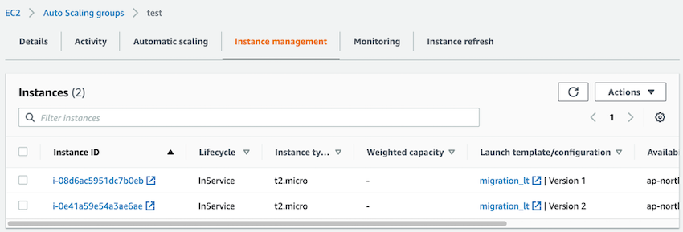
   
### 4️⃣ Clean Up

분해는 조립의 역순으로?! 2️⃣ -> 1️⃣ -> 0️⃣ 역순으로 리소스를 정리하고 3️⃣ Review 항목을 점검하여 모든 리소스가 회수되었는지 확인합니다.

 

## Outro

지금까지 각종 이야기 거리들과 EC2 Image Builder를 사용하며 Immutable Server Pattern을 학습해 보았습니다.
과거 제가 Packer로 관련 환경을 구축한 적이 있는데, 역시 AWS 환경에서는 AWS의 서비스를 사용하는 게 연계도 용이하고 구축도 쉽네요.

소중한 시간을 내어 읽어주셔서 감사합니다! 잘못된 내용은 지적해 주세요! 😃

 

**📚 References**

글 중간중간 하이퍼 링크로 Reference 들을 달아두었습니다.
특히, 이번 포스팅 레퍼런스들은 좋은 내용들이 많으니 원본들을 읽어보시고 당시 제가 느낀 기쁨들을 함께 느낄수 있으면 좋겠습니다.  

---

 