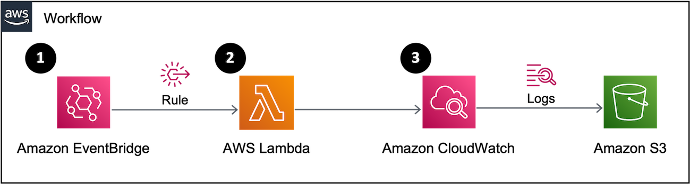

본 글은 Cloudwatch Logs groups의 데이터를 Lambda를 사용해 주기적으로 S3로 export 하는 방법을 다룹니다.  

# Intro

글을 시작하기 앞서, [Shraddha Paghdar - Export AWS CloudWatch logs to S3 using lambda functions in Node.js](https://aws.plainenglish.io/export-aws-cloudwatch-logs-to-s3-using-lambda-functions-in-node-js-b97e2afa0ac)
를 참고하여 해당 글을 작성했음을 알립니다. 본격적으로 방법을 소개하기 앞서, Cloudwatch Logs groups의 데이터를 Lambda를 사용해 주기적으로 S3로 export 하기 위한 플로우는 다음과 같습니다.



1. Amazon EventBridge에 정의한 Rule에 의해 Lambda를 호출합니다.
2. 이후 람다가 지정한 CloudWatch의 Logs에 적재된 데이터를 찾습니다.   
3. 2번에 연속되어 이관될 대상의 로그들이 S3로 이관됩니다.

## 📜 Workshop

### 1️⃣ Log를 담을 Bucket 및 정책 생성하기

Amazon S3 콘솔 화면에 접속해 Log들이 담길 Bucket을 생성하고 이어서 `Permissions`에서 S3 버킷에 대한 권한을 설정합니다.
해당 방법은 [공식 문서, 1단계와 3단계](https://docs.aws.amazon.com/AmazonCloudWatch/latest/logs/S3ExportTasksConsole.html )에 자세히 설명되어 있습니다.

> 💡 공식 문서 3단계에서 기재된 `random-string`은 필요에 의한 경우 사용하세요. 해당 글에서는 편의상 생략하였습니다.  

### 2️⃣ Lambda 생성하기

#### Step 1 : Lambda가 사용하는 IAM Role & Policy 생성

Lambda가 Log를 Export 할 수 있도록 다음 정책을 생성합니다.
IAM에서 Create policy를 선택하고 아래 JSON을 복사하여 붙여 넣고, `cloudwatch_export_task`라는 이름으로 정책을 생성합니다.

```shell
{
    "Version": "2012-10-17",
    "Statement": [
        {
            "Effect": "Allow",
            "Action": "logs:CreateExportTask",
            "Resource": "arn:aws:logs:{Region}:{AccountNumber}:*"
        }
    ]
}
```

Lambda에 권한을 부여해 주기 위해서 IAM > Roles > Create Role을 선택합니다.
Use case로 Lambda를 선택하고 앞서 생성한 정책을 부여한 뒤, `export_S3_lambda`라는 이름으로 Role을 생성합니다.

#### Step 2 : 코드 작성

Lambda 콘솔 화면에서 아래와 같이 빈칸을 채우고, Step 1에서 만들어둔 role을 부여해 람다 함수를 생성합니다.


> 💡 만약, Export 역할을 수행하는 **람다 함수가 생성하는 로그**를 수집하고 싶을 경우에는 `Create a new role with basic Lambda permissions`을
> 선택하고 Console에 의해 자동적으로 생성되는 Role에 Step 1에서 만든 정책을 부여하면 됩니다.

이어서 아래 코드를 복사하여 상황에 맞는 인자 값을 넣어주고 Deploy 합니다.

**Parameter**
- region : 로그 그룹과 대상 버킷은 동일 리전에 위치
- destination : 로그가 이관되는 대상 버킷
- logGroupName : Cloudwatch Log group 이름
- destinationPrefix : 1️⃣ 에서 언급한 `random-string` 값
- from/to : Lambda 함수가 호출 되는 시점을 기준으로, from/to 기간의 로그 그룹들을 export

```js
const AWS = require('aws-sdk')
const cloudconfig = {
  apiVersion: '2014-03-28',
  region: 'region',
}
const cloudwatchlogs = new AWS.CloudWatchLogs(cloudconfig)
exports.handler =  async (event, context) => {
   const params = {
      destination: 'bucket-name',
      logGroupName: 'log-groups-name',
      destinationPrefix: '',
      from: new Date().getTime() - 86400,
      to: new Date().getTime(),
  };
await cloudwatchlogs.createExportTask(params).promise().then((data) => {
    console.log(data)
    return ({
      statusCode: 200,
        body: data,
    });
  }).catch((err) => {
    console.error(err)
    return ({
      statusCode: 501,
        body: err,
    });
  });
}
```

이후 테스트 버튼을 눌러 결과값을 보면 taskId 값이 생성되고 S3에 로그가 이관된 것을 확인할 수 있습니다.

### 3️⃣ EventBridge 트리거 생성하기 

작성한 람다 함수 콘솔 화면 상단에서 **Add trigger** 버튼을 눌러 다음과 같이 Rule을 생성합니다. 저는 주기를 점검하기 위해 아래와 같이 5분을 주었습니다.


> 💡 [스케쥴 표현식 작성법](https://docs.aws.amazon.com/lambda/latest/dg/services-cloudwatchevents-expressions.html)

<br>

## Outro

지금까지 Lambda 함수와 EventBrdige를 사용하여 자동으로 로그를 S3으로 백업하는 방법을 알아보았습니다.
해당 방법 외에도 로그를 이관하는 다양한 방법들이 있으므로, 더 쉽고 좋은 방법이 있다면 알려주세요!

소중한 시간을 내어 읽어주셔서 감사합니다! 잘못된 내용은 지적해 주세요! 😃

---
