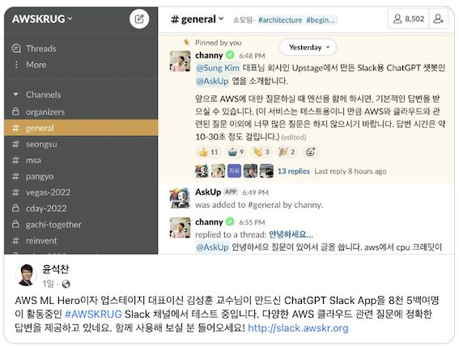
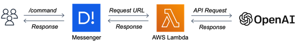
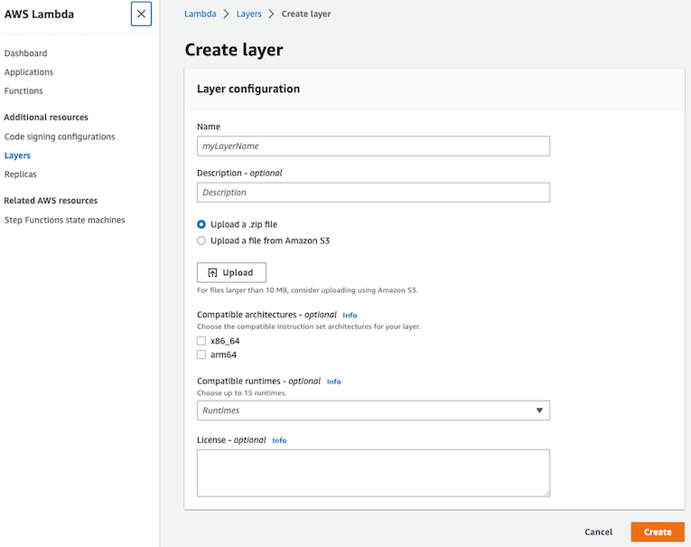
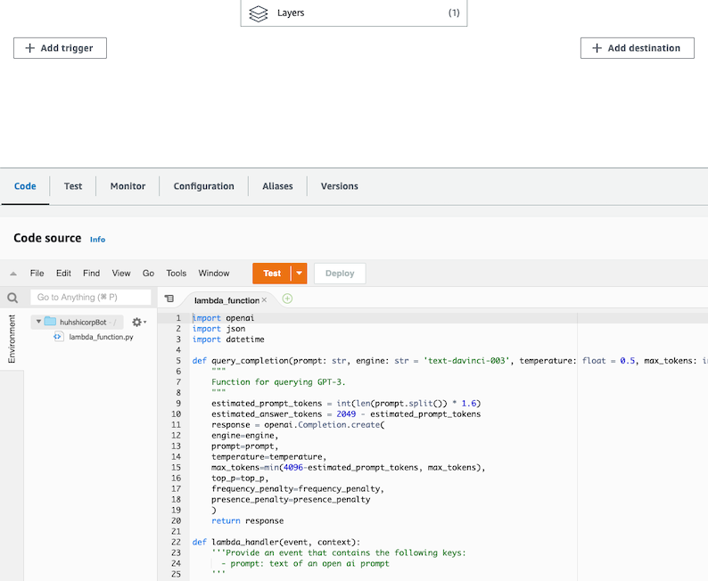
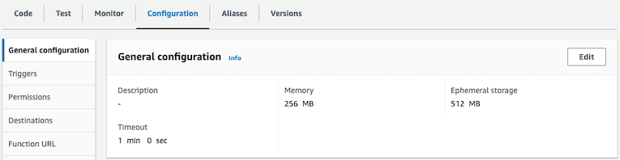
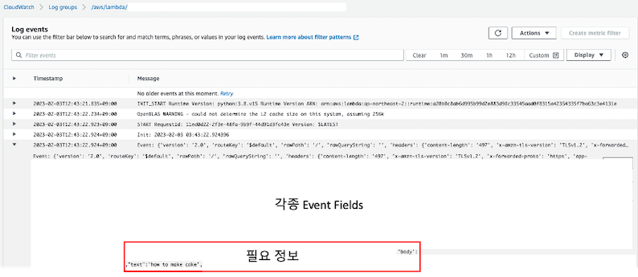
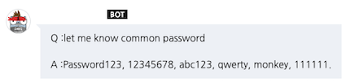

AWS Lambda, OpenAI API를 활용한 개인 AI 봇 만들기

# Intro

2월 2일 [AWSKRUG](https://www.facebook.com/groups/awskrug/ )의 Slack 채널에서 ChatGPT Slack App 테스트를 시작했다는 글을 보고,
저도 메신저와 연동하여 ChatGPT를 사용해 보고 싶은 욕심이 생겼습니다. (아직, ChatGPT를 개인 봇에 적용하지는 않았습니다.)



> 🖍 해당 포스팅에서는 **ChatGPT**가 아닌 GPT-3 모델 중, `text-davinci-003` 모델을 사용했습니다.
> <br>
> - 배경 지식 : [Difference between ChatGPT and the new davinci 3 model?](https://www.reddit.com/r/OpenAI/comments/zdrnsf/difference_between_chatgpt_and_the_new_davinci_3/)

이미 인터넷에 OpenAI API를 Slack과 연동하여 사용하고 있는 사례들은 많아,
제가 근무하는 회사에서 사용하고 있는 [NHN의 협업 툴 Dooray](https://dooray.com/main/ )와 연동하기로 했습니다.

> 💡 해당 포스팅에서는 Dooray와 AWS Lambda의 통합 방법을 다루지만,
> 두레이 외의 다른 메신저 도구와도 연동하는 방법이 유사하므로 해당 방법을 응용하여 활용할 수 있습니다!

<br> 

## 🧭 Workflow



위크플로우는 위와 같습니다. 사용자가 메신저에서 제공하는 `/` 커맨드로 질의를 하면,
해당 요청이 AWS Lambda를 통해 OpenAI의 API를 활용해 질의에 대한 대답을 받아 메신저로 전달합니다.

해당 기능을 구현하기 위해서는 [OpenAI API keys](https://platform.openai.com/account/api-keys )와 AWS Lambda가 필요합니다.

**작업 순서**

1. Lambda Layer 추가
2. Lambda Function 배포
3. Lambda Function URL 생성
4. Messenger 서비스와 Lambda 통합
5. Messenger 서비스의 `POST`에 맞춰 Lambda Function 수정

<br>

## 🛠️ AWS Lambda로 OpenAI API 활용하기

OpenAI의 [API REFERENCE](https://platform.openai.com/docs/api-reference/introduction )를 확인하면 
`Python`, `Node.js`를 활용한 예시가 상세하게 나옵니다.
예시에 나오는 대로 해당 코드를 Amazon EC2를 대여하여 상시 운영 서버에서 활용해도 되지만, 메신저에 연동하여 잠깐만 활용할 예정이므로 Serverless 컴퓨팅 서비스인 Lambda를 사용하겠습니다.

### AWS Lambda Layer 추가하기

Python으로 OpenAI를 사용하기 위해서는 `openai` 파이썬 바인딩이 필요합니다.
이를 위해 람다에서 여러 함수가 공유하는 코드 및 데이터를 중앙에서 관리하는 방식인 **Lambda Layers** 기능을 활용합니다. 

저는 OpenAI 패키지에 대한 종속성을 해결하기 위해서, [OpenAI-AWS-Lambda-Layer](https://github.com/erenyasarkurt/OpenAI-AWS-Lambda-Layer )를 사용했습니다.

> ⚠️ 해당 레포의 [README.md](https://github.com/erenyasarkurt/OpenAI-AWS-Lambda-Layer/blob/main/README.md )에 기재된 대로 진행하면 curl로 OpenAI를 사용할 수 있습니다.

우선, AWS Lambda 콘솔의 `Addtional resources`의 `Layers`를 클릭하여 빌드 한 zip 파일을 업로드하고 호환성(python3.8, x86_64)을 체크해 준 다음 Layer를 생성합니다.



### AWS Lambda Functions 배포

이어서 람다 콘솔 화면에서 **Create function**으로 함수를 생성하고 **Add layer** 버튼을 눌러,
사전에 생성한 layer를 추가해 줍니다. *아래 사진과 같이 Layers 아이콘에 (1)이 추가되었습니다.*



⬆️ 앞서 언급한 오픈소스 파이썬 코드를 복사하고 [27라인](https://github.com/erenyasarkurt/OpenAI-AWS-Lambda-Layer/blob/main/lambda_function.py#L27 )에 OpenAI로부터 발급받은 Key로 바꿔 적고 **Deploy** 버튼을 눌러 배포합니다.

⬇️ 이어서 **Configuration**에서 Memory와 Timeout 값을 수정합니다.
*통상 129MB 정도의 메모리를 사용해 256MB와 OpenAPI로부터 응답이 늦어질 수 있으므로 1분이라는 넉넉한 시간을 주었습니다.*



마지막으로 **Configuration** 탭의 **Function URL**에서 URL을 생성합니다.
이때, **Auth type**은 별도 인증 로직이 없는 **NONE**으로 설정해 주었습니다.

<br>

## 🔄 Messenger(Dooray)와 Lambda 통합하기

저는 통합할 메신저로 두레이를 사용했습니다. 두레이에서 `/command` 기능을 구현하는 방법은 다음 링크를 참고합니다.

[두레이 커맨드 추가하기 가이드](https://helpdesk.dooray.com/share/pages/9wWo-xwiR66BO5LGshgVTg/2900080163559890590)

Slack을 비롯한 대부분의 메신저가 외부 서버와 통합하기 위해 **RequestUrl**을 요구합니다.
사전에 생성한 람다의 **Function URL**을 **RequestUrl**에 기재하면 통합이 완료됩니다.

### Messenger(Dooray) Request 형식 파악하기

이전 단계에서 테스트 없이 코드를 배포했지만, 사실 람다를 코드를 개발하고 나면 Test event를 주입하여 작성한 람다가 의도한 대로 동작하는지 확인해 봐야 합니다.
그러나 외부 서비스와 연동하여 어떠한 형식으로 Event(json)가 날라오는지 모르는 상황에서는 모니터링을 통해 파악해야 합니다.
이벤트를 1회 발생시키고 **CloudWatch Log groups**에서 Event를 확인합니다.



두레이 유저가 생성한 command는 `text`라는 필드에 담기고 이는 `body`로 감싸져 전달됩니다.
Event가 어떤 형식으로 전달되는지 알게 되었으니, 오픈소스를 해당 형식에 맞게 수정합니다.

```python
body = json.loads(event['body'])
prompt = body['text']
```

기존 작성된 코드를 두레이 형식에 맞춰 `text`로 바꿔주니 아래와 같이 구현된 모습을 확인할 수 있었습니다.



## Outro

이번 포스팅에서 OpenAI API를 사용함에 있어 두레이라는 메신저와 람다를 통합하는 부분을 다뤘습니다.
하지만 Lambda와 외부 서비스가 어떻게 연동되는지 원리를 알면 어떤 서비스던지 연동이 가능합니다.

이 밖에 현재 코드는 PoC 수준의 코드라 부족한 점이 많습니다.
API Key를 그대로 기재하면 **보안 이슈**가 있으므로, AWS Secrets Manager를 활용한 별도의 환경 변수 처리가 필요합니다.
또한 외부 서비스에서 Function URL을 호출할 때도, 인증 작업을 추가해 줘야 합니다.
추후 ChatGPT 유료 버전이 나오면 결제하여 사용한 후기를 적기 약속하며 글을 마치겠습니다.

소중한 시간을 내어 읽어주셔서 감사합니다! 잘못된 내용은 지적해 주세요! 😃

<br>

---

<br>