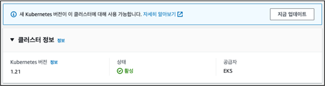
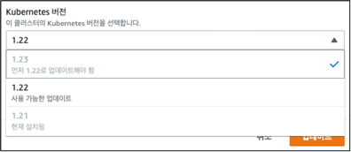
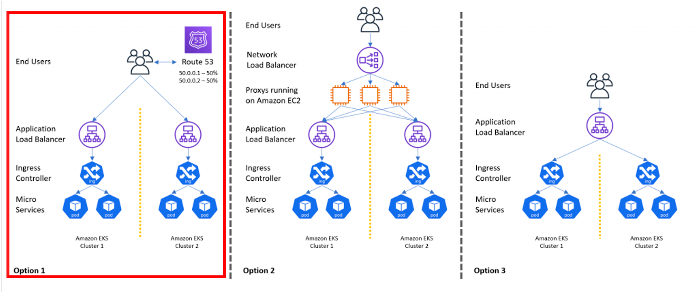
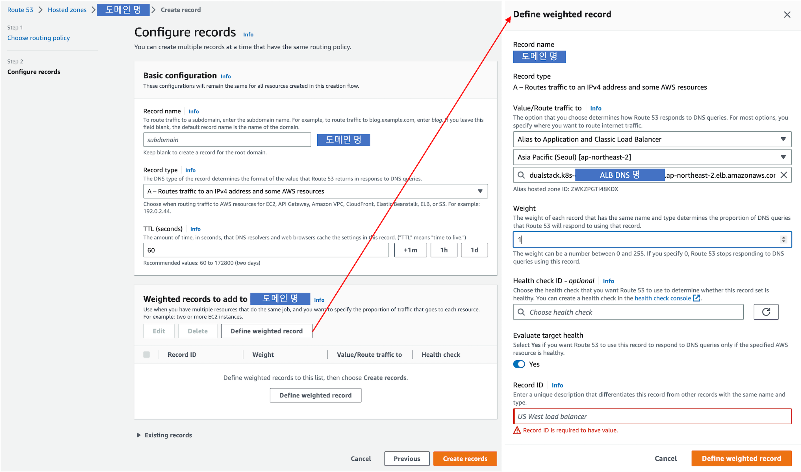
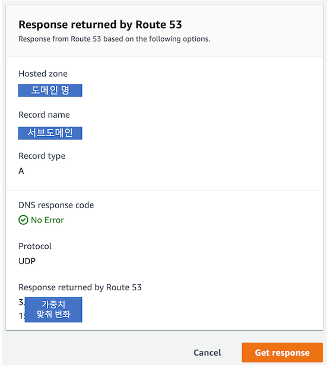

ExternalDNS로 Amazon EKS 멀티 클러스터 업그레이드하기

## Intro

Amazon EKS(이하 EKS)는 [약 3 ~ 5](https://docs.aws.amazon.com/eks/latest/userguide/kubernetes-versions.html#kubernetes-release-calendar) 개월마다 새로운 버전이 출시합니다.
운영 측면에서 새로운 버전 출시는 기존 EKS의 버전 업그레이드가 필요하다는 것을 의미합니다. EKS 업그레이드는 EKS 콘솔에서 `지금 업데이트` 버튼을 눌러 손쉽게 가능합니다.

## 🏠 Single Cluster Upgrade



위와 같은 [EKS 클러스터 버전 업데이트](https://docs.aws.amazon.com/eks/latest/userguide/update-cluster.html )를 싱글 클러스터 기반의 업그레이드라고 하며, 비교적 손쉽게 k8s 버전 업데이트가 가능합니다.
업데이트가 손쉬운 반면 몇 가지 제약 사항도 존재합니다. 대표적으로 아래와 같이 원하는 버전으로 바로 업데이트되는 것이 아니라 순차적 단계를 거쳐야 합니다.  




## 🏘️‍ Multi Cluster Upgrade

멀티 클러스터 업그레이드는 동일한 환경의 EKS를 멀티로 구성하다 보니,
싱글 클러스터와는 달리 **원하는 버전으로 바로 생성**이 가능하고 만에 하나 **롤백**이 필요할 경우 기존 환경으로 돌아갈 수도 있습니다.

멀티 클러스터 기반의 업그레이드 방법은 여러 가지 방법으로 진행할 수 있습니다. 그중에서도 이번 포스팅에서는 [AWS Blog](https://aws.amazon.com/blogs/containers/onfidos-journey-to-a-multi-cluster-amazon-eks-architecture/ )에 소개된 3가지 방법 중,
**비교적 가장 수월한 방법인 첫 번째 방법으로 한정**해서 이야기해 보겠습니다.



첫 번째로 소개된 Option 1의 방법은 2개의 동일한 환경에서 Amazon Route 53의 가중치 기능을 활용하여 업그레이드하는 방식입니다.

방법은 간단합니다. **싱글 클러스터**에서 별다른 작업을 해주지 않았다면, 아마 Route 53의 **Routing policy**를 **Simple**로 설정해 두었을 겁니다.
**멀티 클러스터**에서는 **Routing policy**를 **Weighted**로 설정해 설정한 비율로 트래픽을 분배하는 원리입니다. 



위 캡처와 같이 레코드를 생성할 때, 아래 3가지 요소를 주목하여 가중치 정책을 생성합니다.

1. DNS의 **캐시를 최소화**하기 위해 **TTL은 1m**(60 seconds)를 권장
2. 각 다른 환경에서 **50:50 가중치**를 주고 싶을 경우, **2개의 가중치 레코드에 Weighted 값 1**을 부여
3. `Record ID`는 레코드의 **주석**과 같은 역할을 하지만 **필수**로 작성해야  (이어서 이 값의 중요성을~~ 😱) 

## ExternalDNS

Kubernetes는 KubeDNS를 내부 DNS 서버로 활용합니다. Route 53과 같은 다른 DNS 공급자를 사용하기 위해서는 [external-dns](https://github.com/kubernetes-sigs/external-dns )를 추가적으로 설치해 사용합니다.
물론 external-dns를 사용하지 않고 **외부 DNS의 영역과 k8s의 영역을 분리하여 사용**할 수도 있지만, external-dns를 적용한다면 **외부 DNS 공급자도 코드로 제어**할 수 있습니다.

### Set up

ExternalDNS를 EKS에 설정하는 방법은 [첨부 링크](https://aws.amazon.com/premiumsupport/knowledge-center/eks-set-up-externaldns/ )에 자세하게 설명되어 있지만, 놓치기 쉬운 2가지 부분을 언급하고 넘어가겠습니다.

#### ExternalDNS

external-dns를 최종 배포하기 전, `Deployment`의 아래 2가지 인자를 수정해야 합니다.

```yaml
args:
    - --domain-filter=<Your_R53_Domain_Name>
    - --txt-owner-id=<Your_R53_HostedZone_Id>
```

> 🐞 이번 포스팅을 준비하며 external-dns가 간헐적으로 동작하는 경우를 목격했습니다. <br>
> 원인은 해당 인자를 오기재했기 때문인데, 원래대로라면 동작하지 않아야 하는데 버그인 것 같습니다.

#### Ingress

ExternalDNS를 제대로 설정했다면, 이어서 외부로 노출할 `Ingress`의 `annotations`를 수정합니다.

```yaml
external-dns: public
external-dns.alpha.kubernetes.io/hostname: myDomain.com
external-dns.alpha.kubernetes.io/set-identifier: recordID
external-dns.alpha.kubernetes.io/aws-weight: '1'
```

Simple 라우팅 정책에서는 `set-identifier`가 없어도 되지만, 이외 라우팅 정책에서는 **필수**적으로 들어가야 합니다. 
직전 콘솔에서는 `Record ID`를 기재하지 않았을 경우 화면이 넘어가지 않지만, external-dns에서 해당 값이 빠지면 로그와 파드 상태 모두 특이점이 발견되지 않아 원인을 찾기 어려워집니다. 

### Issue

**yaml 파일에 의도를 기재하여 배포했지만, 정작 Route 53에서 레코드가 업데이트되지 않는 경우**

구축 초기부터 가중치 정책을 적용한 멀티 클러스터를 생성한다면 해당 이슈를 만나지 않겠지만,
싱글 클러스터로 external-dns를 운영하고 있는 환경에서 멀티 클러스터를 적용하면 [해당 이슈](https://github.com/kubernetes-sigs/external-dns/issues/1411 )를 만날 수 있습니다.

> UPSERT is not possible, doing UPSERT will actually do a CREATE that will fail

이를 해결하기 위해 노출하고자 하는 Ingress를 `delete & apply` 한다면 우회가 가능하겠지만, 운영하고 있는 서비스라면 **다운타임**이 발생할 것입니다.
지금으로서는 Route 53 콘솔 화면에서 수동으로 기존의 정책을 수정해 주고 후속으로 생성하는 클러스터는 코드로 제어하는 방법이 있습니다. 그러나 코드와 콘솔 2가지 채널에서 인프라를 다루는 방법은 바람직하지 않습니다.

**해당 이슈를 해결한 직후 external-dns의 logs**

```shell
│ time="2023-02-25T16:28:56Z" level=info msg="Applying provider record filter for domains: [myDomain.com. .myDomain.com.]"
│ time="2023-02-25T16:28:57Z" level=info msg="Desired change: CREATE ex.myDomain.com A [Id: /hostedzone/Z0HOSTEDZONEID]"
│ time="2023-02-25T16:28:57Z" level=info msg="Desired change: CREATE ex.myDomain.com TXT [Id: /hostedzone/Z0HOSTEDZONEID]"
│ time="2023-02-25T16:28:57Z" level=error msg="Failure in zone myDomain.com. [Id: /hostedzone/Z0HOSTEDZONEID]"
│ time="2023-02-25T16:28:57Z" level=error msg="InvalidChangeBatch: [RRSet with DNS name ex.myDomain.com.,
│ type TXT, SetIdentifier recordID cannot be created as a non-weighted set exists with the same name and type.]\n\tstatus code: 400, request
│ time="2023-02-25T16:28:57Z" level=error msg="failed to submit all changes for the following zones: [/hostedzone/Z0HOSTEDZONEID]"

-- After changing Simple Routing policy --

│ time="2023-02-25T16:29:58Z" level=info msg="2 record(s) in zone myDomain.com. [Id: /hostedzone/Z0HOSTEDZONEID] were successfully updated"
│ time="2023-02-25T16:30:58Z" level=info msg="Applying provider record filter for domains: [myDomain.com. .myDomain.com.]"
│ time="2023-02-25T16:30:58Z" level=info msg="All records are already up to date"
```

### 검증

실제 1:1로 라우팅이 일어나고 있나 확인하고 싶다면, `웹` 혹은 `dig` 명령어로 확인이 가능하지만 가장 정확한 방법은 Route 53 내 **Test record**를 사용하는 것입니다.
Record 테스트를 위해 Record name을 기재하고 **Get response** 버튼을 누르면 **Response returned by Route 53** 화면에서 실시간으로 바뀌는 IP를 확인할 수 있습니다.



#### 멀티 클러스터 교체 작업

❗️ 기존 클러스터를 A, 업그레이드를 진행할 클러스터를 B라 가정하겠습니다.

B 클러스터가 문제없다 판단되면, 다시 한번 가중치를 조절해 A 클러스터를 대체합니다.

> 가중치 변화, 1:0 🔜 1:1 🔜 0:1

B 클러스터에서 문제가 있다 판단되면 B의 가중치를 0으로 바꾸면 롤백의 효과를 볼 수 있습니다.

<br>

## Outro

external-dns는 Route 53 리소스를 제어할 수 있어 편리하면서도 운영이 복잡합니다. 위에서 언급한 이슈 외에도 GitOps를 구축한 상태에서 멀티 클러스터를 운용하려면, 각 클러스터마다 다른 Repository가 필요합니다.
terraform으로 external-dns를 대체할 수도 있지만, eksctl를 사용한다면 external-dns가 도움이 되니 사용 환경에 따라 적절한 도구를 사용해야 할 것 같습니다.
모든 것을 코드로 관리하는 것은 쉽지 않네요. 🤣

소중한 시간을 내어 읽어주셔서 감사합니다! 잘못된 내용은 지적해 주세요! 😃

<br>

---

<br>