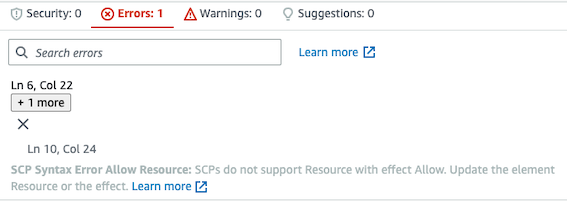
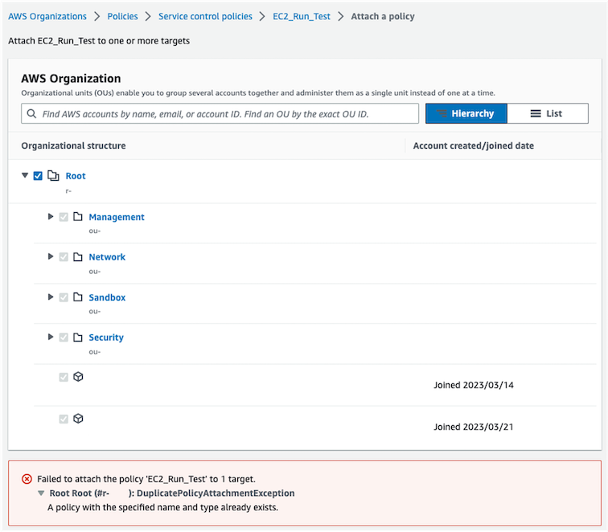

AWS Service control policies로 하위 계정을 제어하기 위한 고려 사항

## Intro

AWS 환경에서 서비스를 운영하다 보면, 서비스 확장, 보안 및 규정 준수 등 여러 이유로 다수의 AWS 계정을 운용하게 될 수 있습니다. 
이때, 다수의 계정을 하나의 조직으로 결합해 중앙에서 계정을 관리하는 [AWS Organizations](https://docs.aws.amazon.com/organizations/latest/userguide/orgs_introduction.html) 서비스를 사용하게 됩니다.
이번 포스팅에서는 Organizations의 정책 관리 방법 중 하나인 AWS Service control policies(SCPs, 이하 SCP)에 대하여 공식 문서의 내용과 몇 가지 테스트를 통해 이야기해 보겠습니다.

## 🏞️ Background knowledge

SCP를 이해하기 위해 공식 문서([AWS Organizations terminology and concepts](https://docs.aws.amazon.com/organizations/latest/userguide/orgs_getting-started_concepts.html ))에 소개된 개념을 짚고 넘어가겠습니다.

- Organizational : 계정을 통합하기 위해 생성하는 엔터티(entity)
- Organizational unit (OU) : 루트 내 계정에 대한 컨테이너. 트리와 유사한 계층 구조를 가지며, OU에 정책을 부여하면 하위에도 동일하게 적용
- Management account : organization을 생성하는 데 사용하며, 조직의 모던 계정에 서비스 기능을 제공
- Member accounts : Management를 제외한 조직의 나머지 계정, 하나의 organization에 속함

기본적인 개념을 이해하고 나서, 아래 그림을 확인하, 모든 개념(*Management 계정에서 정책을 만들고, 정책은 OU 혹은 Member accounts에 적용*)이 요약되어 있음을 알 수 있습니다.


## 📑 [SCP](https://docs.aws.amazon.com/organizations/latest/userguide/orgs_manage_policies_scps.html)

**SCP를 다루기 전, 알아야 할 주요 특징**

- SCP는 조직의 모든 계정에서 사용 가능한 권한을 중앙에서 제어할 수 있습니다.
- **management account** 계정을 제외하고, 하위 [Root 계정을 포함한 모든 IAM 사용자 및 역할](https://docs.aws.amazon.com/organizations/latest/userguide/orgs_manage_policies_scps.html#scp-effects-on-permissions )에 대하여 영향을 미칩니다.
- SCP가 모든 서비스와 작업을 허용하더라도, IAM 권한 정책을 부여받아야 액세스할 수 있습니다.

### [SCP 사용 전략](https://docs.aws.amazon.com/organizations/latest/userguide/orgs_manage_policies_scps_strategies.html)

SCP 다음 2가지 전략을 통해 작동하게 할 수 있습니다.

- Deny list : 기본적으로 모든 actions에 대하여 **허용**, 특정 서비스 및 actions을 **금지**
- Allow list : 기본적으로 모든 actions에 대하여 **금지**, 특정 서비스 및 actons을 **허용**

Organizations의 기본 구성은 `FullAWSAccess`라는 관리형 SCP가 연결되어 **Deny list** 방식을 채택하고 있으므로, 위 사항을 인식하여 SCP 정책을 수립해야 합니다.

## ‍👩🏻‍🔬 Lab Note

ap-northeast-1에서만 ec2 생성을 가능하게 하는 SCP를 작성한다면 순서는 다음과 같습니다.

1. `AWS Organizations` > `Policies` > `Service control policies` 순으로 접속하여, `Create policy`
2. 생성된 정책 `Targets` > `Attach` 순으로 어떤 OU와 계정에 붙일 것인지 정합니다.

### 정책 예시

**Resouce 제어**

```json
{
  "Version" : "2012-10-17",
  "Statement" : {
    "Sid" : "DenyEC2inOtherRegions",
    "Effect" : "Deny",
    "Action" : "ec2:RunInstances",
    "Resource" : "arn:aws:ec2:ap-northeast-1:*:instance/*"
  }
}
```

**Condition 제어**

```json
{
  "Version" : "2012-10-17",
  "Statement" : {
    "Sid" : "DenyEC2inOtherRegions",
    "Effect" : "Deny",
    "Action" : "ec2:RunInstances",
    "Resource" : "*",
    "Condition" : {
      "StringNotEquals" : {
        "aws:RequestedRegion" : "ap-northeast-1"
      }
    }
  }
}
```

### Troubleshooting

#### Allow Errors

`Allow` Effect는 `Deny`와 달리 `Resource`를 특정해서 정책을 생성할 경우, 아래와 같은 Errors를 반환합니다.



`Allow`는 `Resource`를 지원하지 않으며, `*`로만 가능합니다.
그러므로 **Deny list**(기본적으로 모든 actions 허용) 아래에서, `Resource`와 `StringNotEquals`을 적절히 조합하여 허용하는 정책을 생성합니다.

#### Failed to attach the policy '{policy}' to X target

policy 적용 범위에 대하여 아래와 같이 오류가 있을 경우



`Targets`을 확인하여 문제가 되는 타깃을 하나하나 `Detach` 해야 합니다. (정책 삭제의 경우도 동일합니다.) 

### Notice

1. 정책 생성 시, **Syntax 검사를 통과하더라도** 의도대로 동작하지 않을 수 있으므로 **검증은 필수**입니다.
2. 정책이 복잡해지면, **다른 SCP 정책과 중복**되어 의도대로 동작하지 않을 수 있으므로 **영향도 체크도 필수**입니다.

<br>

## Outro

해당 포스팅의 **Lab Note**는 SCP 사용에 있어, **모든 Side effect**를 고려하지 않았습니다. SCP를 운영환경에서 활용하기 위해서는 충분한 검토와 테스트가 필요합니다.
제가 AWS IAM을 배우던 당시, *"IAM은 완성하고 끝이 아닌 운영과 함께 끊임없이 관리해야 하는 관리 자산"*이라는 말을 들었습니다. SCP 역시 운영과 함께 관리해야 하는 **관리 자산**이라는 점을 언급하며 글을 마치겠습니다.  

추가적으로 이번 포스팅 이후, Organizations SCP 모범 사례에 대해 더 자세히 알고 싶으시면 다음 게시물을 추천드립니다.

[👉 Best Practices for AWS Organizations Service Control Policies in a Multi-Account Environment](https://aws.amazon.com/ko/blogs/industries/best-practices-for-aws-organizations-service-control-policies-in-a-multi-account-environment/)

소중한 시간을 내어 읽어주셔서 감사합니다! 잘못된 내용은 지적해 주세요! 😃

---
