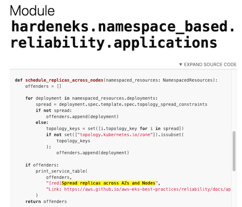
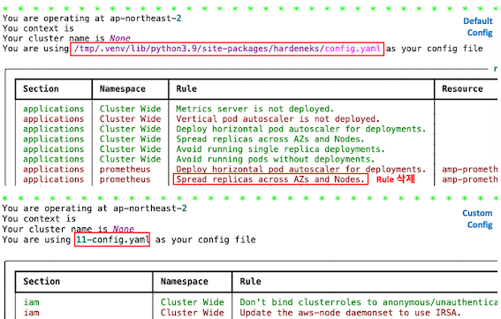

본 글은 작년 12월 AWS Samples 깃허브에 릴리즈 된 **[HardenEKS](https://github.com/aws-samples/hardeneks)**를 사용해 보며, 설치 및 커스텀 방법에 대하여 작성 글입니다.

# Intro

얼마 전 AWS Blog에 [HardenEKS: Validating Best Practices For Amazon EKS Clusters Programmatically](https://aws.amazon.com/ko/blogs/containers/hardeneks-validating-best-practices-for-amazon-eks-clusters-programmatically/ )라는 글 하나가 올라왔습니다.
HardenEKS는 [EKS Best Practices Guides (이하 EBPG)](https://aws.github.io/aws-eks-best-practices/ )를 기반으로 EKS 클러스터를 검사하는 오픈소스 툴입니다. 
쿠버네티스 클러스터의 잠재적인 문제를 스캔하고 분석하는 [Popeye](https://github.com/derailed/popeye )를 사용해 본 기억이 떠올라, 사용해 보고 느낀 점을 몇 자 적어보겠습니다.

<br>

## HardenEKS

깃허브에는 *'EKS 클러스터가 EKS 모범 사례를 따르고 있는지 검사'* 한다고 소개되어 있습니다.
**명령어 한줄로 EKS Best Practice 준수 여부에 대해 검사하고 txt, html, json 등의 형식으로 보고서를 제공**합니다.

EBPG에는 글을 작성하는 시점을 기준으로 Security, Reliability, Cluster Autoscaling, Running Windows Containers, Networking, Scalability, Cluster Upgrades에 대하여 가이드하고 있습니다.

HardenEKS kubernetes API를 호출하여 스캔을 진행하며, 다음 범주에 대하여 검사가 가능합니다. 

- [cluster_wide](https://github.com/aws-samples/hardeneks/tree/main/hardeneks/cluster_wide)
    - cluster_autoscaling
    - reliability
    - scalability
    - security
- [namespace_based](https://github.com/aws-samples/hardeneks/tree/main/hardeneks/namespace_based)
    - reliability
    - security

### 👀 체험하기

사용 방법은 간단합니다. 다음과 같이 설치하고, EKS에 접근할 수 있는 터미널에서 리포트를 받아보면 끝납니다.

```python
# 설치
python3 -m venv /tmp/.venv
source /tmp/.venv/bin/activate
pip install hardeneks

# 리포트 생성 후, 열기
hardeneks --export-html report.html
open report.html
```

그러나 위 작업만으로는 제한적인 정보로만 보고서가 생성됩니다. 그래서 다음과 같이 최소한의 `ClusterRole`을 생성해야 합니다.

```yaml
kind: ClusterRole
apiVersion: rbac.authorization.k8s.io/v1
metadata:
  name: hardeneks-runner
rules:
- apiGroups: [""]
  resources: ["namespaces", "resourcequotas", "persistentvolumes", "pods", "services"]
  verbs: ["list"]
- apiGroups: ["rbac.authorization.k8s.io"]
  resources: ["clusterroles", "clusterrolebindings", "roles", "rolebindings"]
  verbs: ["list"]
- apiGroups: ["networking.k8s.io"]
  resources: ["networkpolicies"]
  verbs: ["list"]
- apiGroups: ["storage.k8s.io"]
  resources: ["storageclasses"]
  verbs: ["list"]
- apiGroups: ["apps"]
  resources: ["deployments", "daemonsets", "statefulsets"]
  verbs: ["list", "get"]
- apiGroups: ["autoscaling"]
  resources: ["horizontalpodautoscalers"]
  verbs: ["list"]
```

<br>

### 🪓 Customize

HardenEKS를 사용하여 생성한 리포트에 특정 Namespace 혹은 몇 Rule들을 제외하고 검사를 진행하고 싶다면 커스터마이즈가 필요합니다. 
커스터마이징하는 방법을 찾기 위해 `hardeneks --help` 명령어를 확인해 보면, 아래와 같이 `tmp/` 위치에 `config.yaml`을 default로 적용하고 있다는 사실을 알 수 있습니다.

```shell
│ --config  TEXT  Path to a hardeneks config file.
│                 [default: /tmp/.venv/lib/python3.9/site-packages/hardeneks/config.yaml]
```

Config 값을 조정하기 위해 다음과 같이 `my-config.yaml` 파일을 생성합니다.

```shell
cat /tmp/.venv/lib/python3.9/site-packages/hardeneks/config.yaml > my-config.yaml
```

`config.yaml` 파일의 구조는 아주 단순합니다. 아래와 같이 2가지 영역을 수정하여 config 값을 변경합니다.

- `ignore-namespaces` : 는 스캔을 제외할 **namespace**를 정의
- `rules` : iam, multi_tenancy, network_sucurity 등에 대하여 검사할 **rule**을 정의

제외할 **namespace**를 기재하는 것은 쉽지만, 어떤 **rule**을 적용시킬지는 한 번에 찾기 쉽지 않습니다. 
만약 여러분이 rule을 수정하고 싶다면, pdoc으로 생성된 [HardenEKS Github Pages](https://aws-samples.github.io/hardeneks/ )를 참고하시면 됩니다.

#### Example

예를 들어, `Spread replicas across AZs and Nodes`을 예외 처리하고 싶다 가정하고 적용하는 방법을 소개해드리겠습니다.
검색을 활용한 색인을 지원하지 않으므로, 일일이 문서를 타고 들어가 rule을 확인해야 합니다. 😡 해당 과정이 매우 까다로우므로, 각 단계별로 링크를 생성해 두었습니다.

1. 최상단 [index 페이지](https://aws-samples.github.io/hardeneks/index.html), Sub-modules에서 `namespace_based` 선택
2. [namespace_based 페이지](https://aws-samples.github.io/hardeneks/namespace_based/index.html),  Sub-modules에서 `reliability` 선택
3. [reliability 페이지](https://aws-samples.github.io/hardeneks/namespace_based/reliability/index.html), Sub-modules에서 `applications` 선택
4. 여기까지 진행하면 Functions이 나오는데, 찾고자 하는 **rule**을 `Ctrl + F`로 함수 명 검색


5. `schedule_replicas_across_nodes` 함수 명이 `Spread replicas across AZs and Nodes` 해당하는 **rule** 이름이므로,
   이를 `config.yaml`에서 수정
6. 리포트를 생성하는 명령어에서 수정된 config 파일을 옵션으로 적용시키면, 커스텀 하게 바꾼 값들이 적용 <br>
   *예) `hardeneks --config <my-config>.yaml --export-html <Report Name>.html`*

Report 상단에는 무엇을 대상으로 스캔을 진행했는지, **요약 정보**가 나옵니다. 검사 결과와 더불어, **Resolution**을 통해 **EBPG의 Link**도 함께 안내됩니다.

아래 사진은 Example에서 적용시킨 custom.yaml 적용 여부와, rule을 삭제한 결과 화면입니다. 



<br>

## Outro

HardenEKS는 아주 간단하고 빠르게, 나의 EKS가 EKS 모범 사례대로 운영하고 있는지 확인할 수 있어 아주 편리한 툴인 것 같습니다.
비록 Rule 커스텀 과정에서 문서가 불친절했지만, EBPG를 기반으로 자동화된 점검을 한다는 점에서 만족합니다.

AWS는 아키텍처 관련 모범 사례를 사용해 학습, 측정 및 구축하는 방법으로, **AWS Well-Architected**라는 방법론과 도구를 제공합니다.
그동안 AWS Well-Architected은 **특정 업계 및 기술 도메인**에 대해서는 **Lenses**를 통해 지침을 제공하고 있었지만,
EKS 기반 환경의 분석까지는 지원하지 않았습니다. HardenEKS 덕분에, EKS도 Well-Architected를 준수하기 더욱 수월해진 것 같습니다.

과거 저는 Kubernetes 진단을 위해 k9s에 통합되어 있는 Popeye를 사용했습니다. HardenEKS와 함께 사용한다면 상호 보완을 이루며, 
더 안전하고 신뢰성 있는 EKS 환경을 만드는데 도움이 될 것 같다는 팁을 드리며, 글을 마칩니다!

> [Popeye 분석 범위](https://github.com/derailed/popeye#sanitizers) (port mismatches, probes 등 세부적인 설정에 대하여 심각도(Level)  만족도 여부 % 제공) 

소중한 시간을 내어 읽어주셔서 감사합니다! 잘못된 내용은 지적해주세요! 😃

---
