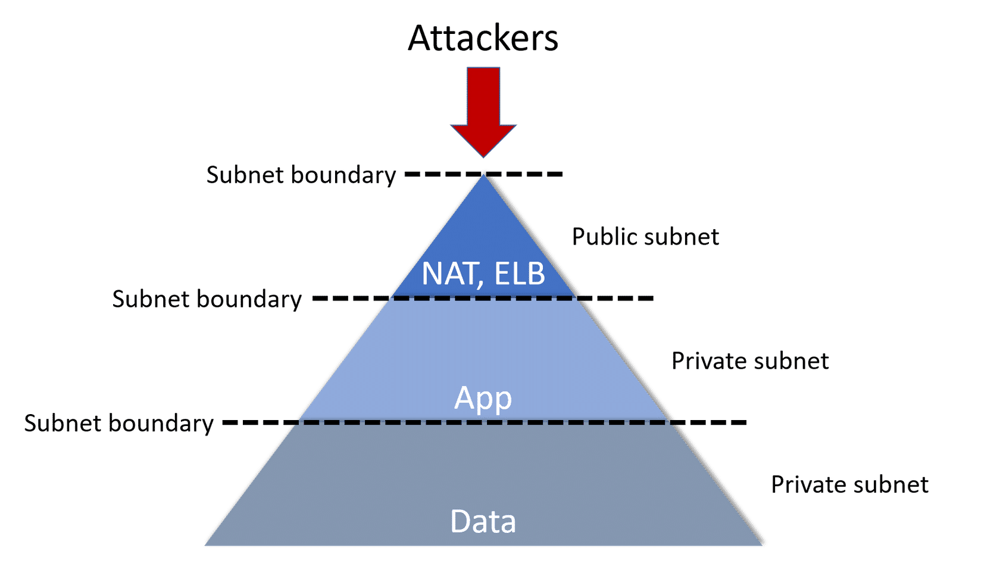
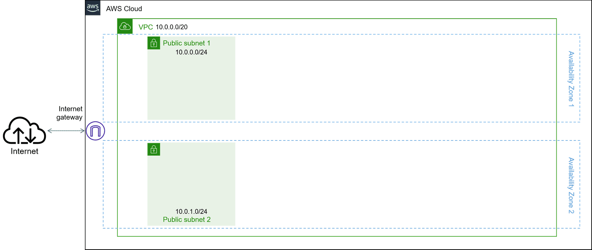
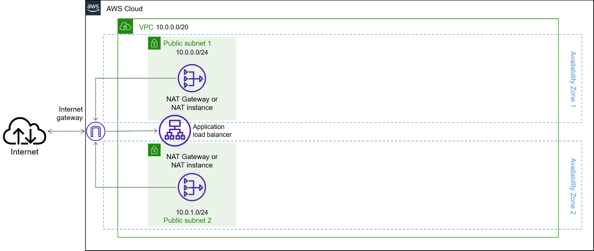
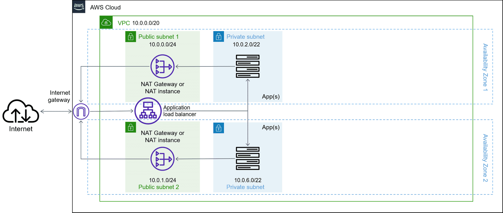
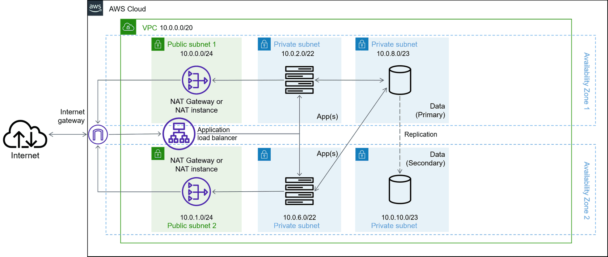
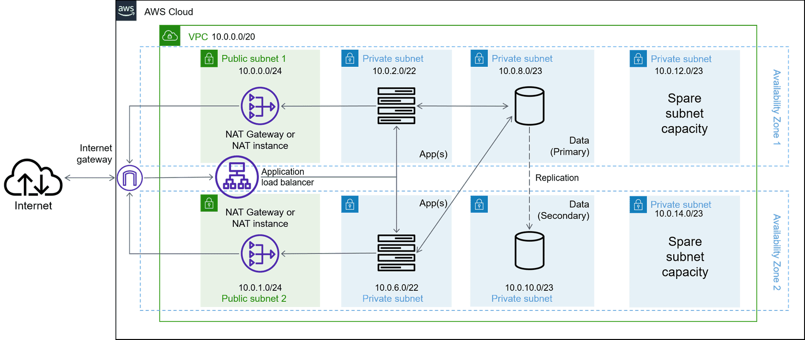

본 글은 [Configure and Deploying VPCs with Multiple Subnets](https://www.aws.training/Details/eLearning?id=61799) 에서 다루는 `Production-Ready: The 3-Tier VPC` 강의를 바탕으로, 테라폼으로 구축하는 3계층 VPC 아키텍처에 대한 글입니다.

<br>

<details><summary markdown="span">Multi-Tier VPC 란?</summary>
<br>
VPC를 구축할 때 단일 계층 VPC에 모든 자원을 넣는다면, 네트워크에 접근할 수 있는 잠재적 공격자에게 자원이 노출됩니다. 이를 보완하기 위해 서브넷으로
다중 계층 VPC 아키텍처를 만들어 방어 계층을 이룰 수 있습니다.


</details>

<br>

# 디자인 패턴 : 3 Tier VPC Architecture

*테라폼으로 3-tier VPC 아키텍처를 계별로 구축해 봅시다*

<br>

<details><summary markdown="span">Step 0 (테라폼을 활용하실 줄 안다면 넘어가세요)</summary>

## Step 0
아키텍처를 구성할 폴더를 만들고 `provider`를 주입합니다.
```shell
mkdir architecture
cd architecture
terraform init
touch threeTierVPC.tf
```
`threeTierVPC.tf`에 벤더 정보를 작성합니다.
```terraform
provider "aws" {
  region = "ap-northeast-2"
}
```
명령어`terraform plan`, `terraform apply`를 통해, 오류 없이 통과하는 화면을 확인하고 다음 단계로 PASS!

</details>

<br>

**💡각 소제목 링크에 첨부된 코드를 활용해 Step 0 에서 만든 `threeTierVPC.tf`에 이어서 작성하거나, 따로 새로운 파일을 만들어 `terraform plan`, `terraform apply` 명령어를 차례로 작성하며 계층을 쌓아 올립니다.**

<br>

## Step 1
### Layer 1️⃣ : [Public subnet](https://github.com/heuristicwave/TIL-DevOps/blob/main/IaC/Terraform/code/3-Tier%20VPC/step1.tf)

하나의 VPC에 2개의 AZ를 만들고 각각의 Public 서브넷을 위치시킵니다.



> 퍼블릭 서브넷은 프라이빗 서브넷 보다 적은 수의 IP 예약하는 것이 좋습니다.


## Step 2
### Layer 1️⃣ : [Internet access resources](https://github.com/heuristicwave/TIL-DevOps/blob/main/IaC/Terraform/code/3-Tier%20VPC/step2.tf)

외부 인터넷과의 노출을 제한하고 나가는 트래픽을 위해 NAT Gateway를 활용합니다. 또한 들어오는 트래픽을 위해 ALB를 위치시켰습니다.
로드밸런서와 NAT Gateway는 가용성이 높은 관리형 서비스로 병목 현상에 대해 걱정할 필요가 없습니다.

<details><summary markdown="span">💡Nat Gateway 알아보기</summary>
<br>
NAT(네트워크 주소 변환) 게이트웨이를 사용하면 프라이빗 서브넷의 인스턴스를 인터넷 또는 기타 AWS 서비스에 연결하는 한편, 인터넷에서 해당 인스턴스와의 연결을 시작하지 못하게 할 수 있습니다.
NAT 게이트웨이를 만들려면 NAT 게이트웨이가 속할 퍼블릭 서브넷을 지정해야 하기 때문에 Step2에서 우선적으로 생성합니다.

[도큐먼트로 더 알아보기](https://docs.aws.amazon.com/ko_kr/vpc/latest/userguide/vpc-nat-gateway.html)

</details>



> 그림에서는 보이지 않지만, VPC에는 암시적 라우터가 있으며 라우팅 테이블을 사용하여 네트워크 트래픽이 전달되는 위치를 제어합니다.
> VPC의 각 서브넷을 라우팅 테이블에 연결해야 합니다. 테이블에서는 서브넷에 대한 라우팅을 제어합니다(서브넷 라우팅 테이블).


## Step 3
### Layer 2️⃣️ : Apps in a private subnet

두 퍼블릭 서브넷에 연결된 ALB는 프라이빗 서브넷 리소스 간의 트래픽을 분산시킵니다.



## Step 4
### Layer 3️⃣ : Data in a second private subnet

첫 번째 프라이빗 서브넷 뒤에 두 번째 프라이빗 서브넷을 배치합니다.
장애가 발생할 경우를 대비해 read-replica 혹은 standby 구성으로 배치합니다.



> 데이터 리소스(/23)보다를 앱 리소스(/22)를 확장할 가능성이 커, 더 큰 서브넷 마스크를 할당합니다.

## Step 5
### Leave extra IPs available 

배포된 인프라가 확장되어 아키텍처가 변경될 때 사용할 수 있는 여유분의 IP를 예약을 할 수도 있습니다.


