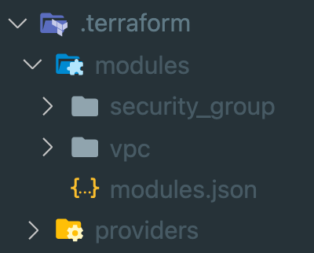

Terraform 더 익숙하게 1 - Module & Output


## Intro

**Terraform Module**을 잘 활용하면 본인이 원하는 대로 인프라를 레고처럼 조립할 수 있습니다.
레고처럼 인프라를 조립하기 위해서는 모듈 간의 연계가 중요한데요,
이번 포스팅에서는 모듈 내에 작성된 **Output value**들을 활용하는 방법을 알아보겠습니다.

해당 포스팅은 Output에 대한 이해가 있다는 가정하에 기술하였으므로, Output에 대한 설명이 필요하시면 아래 링크들을 참고해 주세요!

🥲 사실, 아래 문서보다 더 잘 설명할 자신이 없어서... 언제나 가장 좋은 교재는 공식 문서입니다! 

- [Terraform Docs](https://www.terraform.io/docs/language/values/outputs.html)
- [Tutorial : Output Data from Terraform](https://learn.hashicorp.com/tutorials/terraform/outputs)

<br>

## Output Command Option

Output은 terraform apply 명령어를 수행하고 난 후, 맨 마지막에 Value 들이 렌더링 되어 나옵니다.
그러나 테라폼 코드를 작성하는 중간중간 인프라의 value 값들이 필요할 때가 있습니다.

그럴 때, output이 정의된 상황에서 `terraform output {label}` 명령어로 Ouput 값을 확인합니다.
`-raw` 옵션을 함께 주면 문자열 형태가 아닌 raw한 텍스트 값만을 얻을 수 있습니다.

```shell
$ terraform output -raw security_group_id
```

## Accessing Child Module Outputs

하위 모듈의 아웃풋에 접근할 경우도 종종 있는데요, 이때는 `module.<모듈 명>.<Output 명>` 이런 형식으로 조회가 가능합니다.
하위 모듈 출력값에 접근하는 것이, 모듈과 모듈은 연계하는 방법이기에 아래 예시에서 알아보겠습니다.

```shell
module "vpc" {
  source = "terraform-aws-modules/vpc/aws"
  name   = "sample_vpc"

  cidr = "10.10.0.0/16"

  azs            = ["us-west-2a"]
  public_subnets = ["10.10.1.0/24"]

  tags = {
    Owner       = "me"
    Environment = "stage"
  }
}
```

위와 같은 vpc 모듈은 security group 모듈과 거의 단짝 수준으로 함께 움직이는데요,
security group 모듈을 활용하려면 다음과 같이 `vpc_id` 값이 필요합니다.

이 경우, vpc를 먼저 생성하고 `vpc_id` 값을 알아내어 사용할 수 있지만, 다음과 같은 방법으로 모듈을 연계합니다.

```shell
module "security_group" {
  source      = "terraform-aws-modules/security-group/aws"
  name        = "ssh"
  description = "ssh from workstation"
  vpc_id      = module.vpc.vpc_id

  ingress_cidr_blocks = ["0.0.0.0/0"]
  ingress_rules       = ["ssh-tcp"]
}
```

## Find Module Output Label

방금 전, 모듈을 연계하는 방법을 배워 보았습니다. 그런데, 모듈을 연계하기 위해서는 미리 사전에 작성된 모듈의 Output Label을 알아야 합니다.

우선 에디터의 Explorer 탭에서 `.terraform` 폴더를 열어봅시다.



apply를 적용한 *security-group, vpc* 모듈이 내 로컬 머신에 숨어 있습니다.
해당 모듈 폴더 안에 들어가면 `outputs.tf` 가 정의되어 있으므로 해당 파일을 참고하여 Label 값을 얻어오면 됩니다!

<br>

## Outro

이렇게 Module의 Output 값을 활용하는 방법을 알게 되니, 테라폼 모듈 조립에 대한 자신감이 생겼습니다. 
앞으로도 테라폼에 더 익숙하지기 위한 방법들을 시리즈로 연재할 계획인데, 언제 끝날지 모르겠습니다. 😑

지금까지 테라폼 더 익숙하게 Module & Output 편을 읽어주셔서 감사합니다! 잘못된 내용은 지적해 주세요! 😃

<br>

---



<br>