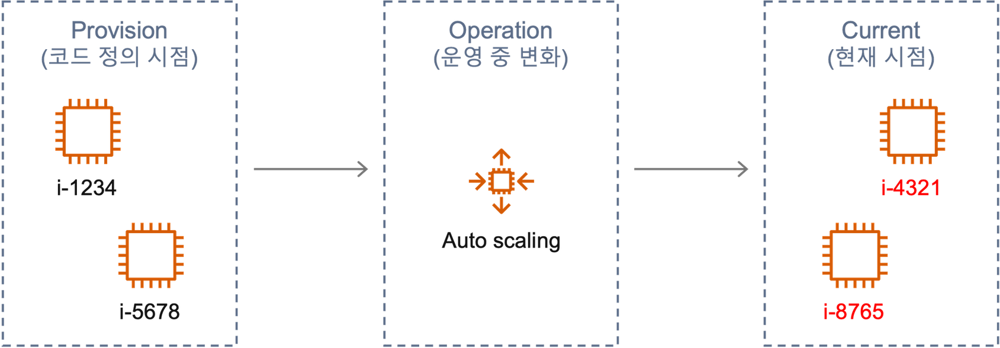
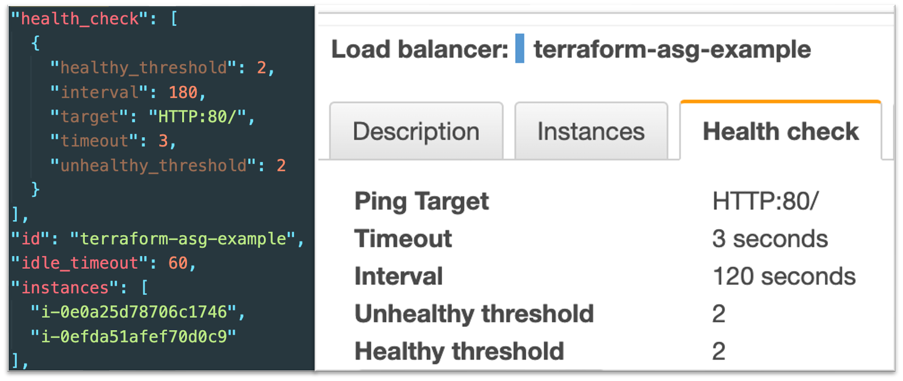
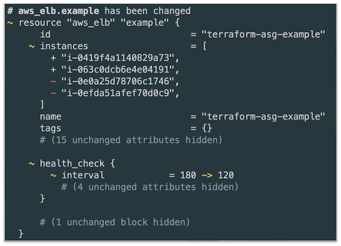
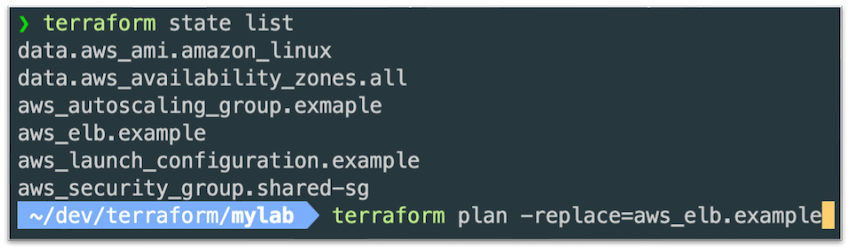

Terraform 더 익숙하게 3 - Refresh & Replace


## Intro

IaC(Infrastructure as Code)를 운용하며 중요하게 생각하는 포인트 중 하나는, **코드로 정의한 형상**과 **실제 인프라의 형상**을 동일하게 유지하는 것입니다.
Terraform에서는 **Configuration Drift**(정의한 형상과 달라지는 경우)를 방지하기 위해 다양한 명령어를 제공합니다.
이번 포스팅에서는 형상을 유지하는 다양한 기법 중 하나인 `Refresh`와 비슷하면서도 헷갈리는 개념인 `Replace`에 대하여 알아보겠습니다.  

<br>

## ♻️ Refresh

`refresh` 명령어는 Configuration Drift가 발생했을 때, 현재 상태를 `terraform.tfstate`에 반영해 현재 인프라의 상태로 최신화시키는 명령어입니다.
문서에는 다음과 같이 기재되어 있지만, 처음 접한다면 무엇을 말하는지 쉽게 와닿지 않습니다.

> The `terraform refresh` command reads the current settings from all managed remote objects and updates the Terraform state to match. <br>
> `terraform refresh` 명령어는 원격 객체의 현재 상태를 읽어 Terraform state와 일치시킵니다.

Refresh 명령어는 다음과 같은 상황에서 사용합니다. 클라우드 환경에서 클러스터를 운용하면 인스턴스의 Scale이 변화함에 따라 인스턴스 ID 값도 변합니다.
이 경우 코드로 정의한 상태는 프로비저닝 당시 시점을 기억하지만, 실제 인프라의 현상은 최신 인스턴스의 상태를 가지고 있으므로 Drift가 발생합니다.



위 상황에서 Refresh 명령어로 *코드의 상태와 인프라의 현재 상태를 일치*시킬 수 있지만, 해당 명령어는 **deprecate** 되었습니다. 왜냐하면 관리자가 무엇이 변경되는지 알지 못하고 `tfstate`가 최신화되기 때문입니다.
그래서 테라폼 v0.15.4.에서부터는 `plan`과 `apply`에 `-refresh-only` 옵션을 제공하기 시작했습니다.

### --refresh-only

왼쪽은 프로비저닝 당시 `*.tfstate`입니다. 오른쪽은 해당 환경을 콘솔에서 health check를 하는 간격을 120초로 변경한 화면입니다.



의도적으로 Drfit 상황을 만들었기 때문에 `terraform plan --refresh-only` 명령어로 점검하면 다음과 같이 어떤 리소스 객체가 변경될 것인지 확인 가능합니다.



위 사진에서는 elb의 AutoScalingGroup 내의 인스턴스가 바뀌어 최신화됨과, 제가 의도적으로 콘솔에서 변경한 health_check 값을 확인할 수 있습니다.

이처럼 항상 IaC의 형상을 변경하기 전, `plan`을 통한 사전 검토 기능을 제공하기 위해 `--refresh-only` 옵션이 제공되었습니다.
`plan`으로 문제없음을 확인했다면, 이어서 `terraform apply --refresh-only` 명령어로 `*.tfstate`를 최신화 시킵니다.

### ⚠️ 주의

`*.tfstate`는 Refresh로 최신화되었지만, 여전히 코드로 정의한 interval 값은 180입니다.
그러므로 코드로 정의된 부분을 변경하지 않은 상황에서 `terraform apply` 명렁어를 치면, 현재 120의 interval 값이 180으로 원복 됩니다.

<br>

## ☠️ Taint

Replace를 설명하기 앞서, 기존 테라폼에는 `taint`라는 명령어가 있습니다. 문서에는 다음과 같이 기재되어 있습니다.

> The `terraform taint` command informs Terraform that a particular object has become degraded or damaged. <br>
> `terraform taint` 명령어는 특정 객체가 저하되거나 손상되었음을 Terraform에 알립니다.

Taint 명령어는 **인프라를 정의한 코드는 그대로**인 상태에서 **리소스만 교체**할 경우에 사용합니다.
저의 경우 스파이크성 트래픽을 갑자기 받아 로드밸런서의 성능이 저하되었을 때, ELB를 교체한 경험이 있습니다.

이런 상황에서 성능이 저하된 혹은 **교체가 필요한 리소스** 객체만을 on/off 방식으로 **주석 처리 및 해제**하며 `apply` 명령어로 교체할 수 있지만,
`taint(교체 리소스를 마킹)` 명령어로 교체하고 `untaint(교체 리소스 마킹 해제)` 명령어로 교체할 필요가 없다고 명령할 수 있습니다.

그러나 위와 같은 워크플로우는 테라폼 v0.15.2.에서 deprecate 되었고, `-replace` 옵션을 제공하며 더 직관적인 사용자 경험을 제공하게 됩니다.

### 🌗 -replace

`-replace` 옵션은 `taint` 명령어와 동일하게 작용하며, `untaint` 명령어를 칠 필요가 없습니다.
코드는 그대로지만 리소스 객체가 변경되는 Replace 명령어 사용법은 다음과 같습니다.

```shell
$ terraform apply -replace="aws_instance.example[0]"
```

교체할 리소스 인자값를 찾기 위해, `terraform state list` 명령어로 target을 확인할 수 있습니다.



💡 `-replace` 옵션 역시, `--refresh-only` 옵션과 동일하게 `plan` 명령어와 함께 적용하여 변경 지점을 미리 파악하고
변경되는 리소스에 대한 검토를 하는 습관을 들입시다!

<br>

## Outro

Refresh와 Replace 비슷하면서도 전혀 다른 두 명령어의 변천사를 확인하며 인프라의 동일한 형상을 유지하기 위한 방법을 알아보았습니다.
이번 포스팅에서 언급한 방법 외에도 형상을 일치시키는 방법들이 존재하지만, 위 2가지 명령어만 제대로 활용하면 대부분의 인프라의 형상이 달라지는 사태를 예방할 수 있습니다. 
IaC에서는 항상 형상을 변경하기 전, 변경되는 리소스에 대한 검토를 하는 습관이 매우 중요하다는 것을 강조하며 이번 3편을 마칩니다.

지금까지 테라폼 더 익숙하게 Refresh & Replace 편을 읽어주셔서 감사합니다! 잘못된 내용은 지적해 주세요! 😃

<br>

---



<br>