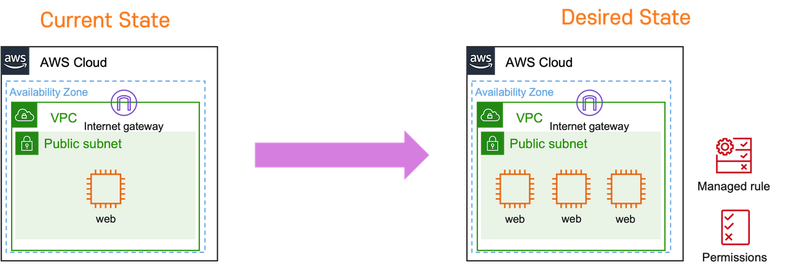

Kubernetes Object Management에서 발견한 명령형/선언형 방식

<br>

## Intro

Kubernetes의 리소스들을 제어하기 위해 `kubectl` 명령어를 다루다 보니,
`replace`, `create`, `apply` 등과 같이 비슷하게 동작하는 명령어들에 대해서 어떤 차이가 있는지 궁금증이 생겼습니다.

`help` 명령어를 사용하면 각각 다음과 같이 동작한다는 정보를 얻을 수 있습니다.

> apply : Apply a configuration to a resource by file name or stdin <br>
> create : Create a resource from a file or from stdin

해당 설명으로는 궁금증이 말끔히 해소되지 않아 공식 문서를 읽다, 
[Kubernetes Object Management](https://kubernetes.io/docs/concepts/overview/working-with-objects/object-management/ )를 통해 머리를 스치는 깨달음을 얻었습니다.

<br>

## Kubernetes Object Management

문서의 첫 부분은 쿠버네티스 객체를 관리하는 기법으로 다음 3가지 기법을 소개합니다.

- Imperative commands
- Imperative object configuration
- Declarative object configuration

Imperative(명령형, 절차형), Declarative(선언형)의 개념은 단어 뜻에서도 알 수 있지만, 제가 기존에 숙지하고 있던 개념을 먼저 기술하고 쿠버네티스에서는 어떻게 다른지 적어보겠습니다. 

### Declarative vs Imperative

Declarative vs Imperative 개념은 프로그래밍에서도 종종 보이지만, AWS 인프라 구축에 빗대 표현해 보겠습니다.
왼쪽 현재(Current) 상태를 원하는(Desired) 상태로 만들어야 하는 상황을 가정하겠습니다.



여기서 **Imperative**하게 구성한다면 AWS CLI와 같은 도구를 통해서 다음 **순서**로 Desired State를 만듭니다.

1. *웹 서버 2개 추가*
2. *Rule 추가*
3. *권한 부여*

반면 **Declarative**하게 구성한다면 Terraform과 같은 **선언적** 성격을 가진 도구 다음과 같이 구성합니다.

*웹 서버 3대, Rule, 권한 구성*

Terraform에서는 Desired State를 코드로 작성한 `*.tf` 형식의 파일을 `apply`하여 **Declarative**하게 인프라를 다룹니다.
이제 기존에 제가 제대로 알고 있지 않았던 "Kubernetes에서는 Desired State를 `YAML` 형식의 파일을 활용해 **Declarative**하게 인프라를 다룬다."
라는 반쪽짜리 정답에 대하여 알아보겠습니다.

### Imperative commands

공식 문서의 명령형 명령의 사용법은 다음과 같은 예시와, 해당 방법은 이전 **history를 제공하지 않으므로 일회성 작업**에만 추천한다고 기재되어 있습니다.

```shell
kubectl create deployment nginx --image nginx
```

해당 방법은 명령어 한 줄로 리소스를 생성할 수 있어 비교적 간편한 방법이지만, history를 제공하지 않는 점이 단점이라는 이유는 다른 방법들을 소개한 다음 설명하겠습니다. 😒

### Imperative object configuration

명령형 오브젝트 구성 방법 kubectl 명령어와 create, replace 등과 같은 명령과 옵션 플래그 및 파일 이름이 필요합니다.
파일 이름 YAML 혹은 JSON 형식의 오브젝트에 대한 정의를 포함하고 있어야 합니다.

명령어와 파일을 활용해 리소스를 Create/Delete/Update 하는 방법

```shell
kubectl create -f nginx.yaml
kubectl delete -f nginx.yaml
kubectl replace -f nginx.yaml
```

해당 방법은 Imperative Command 방식과 비교하여, YAML 파일을 활용하기 때문에 형상 관리가 가능한 이점이 생겼습니다.
그렇지만 직접 YAML 파일을 작성해야 하는 추가적인 단계가 발생했습니다.

여기서 저는 의문이 들었습니다. Terraform의 `*.tf`과 같이 `YAML` 파일로 Desired 상태를 만드는 방법이 왜 **명령형** 오브젝트 구성 방법인지.
이 떡밥도 마지막 방법을 소개한 이후 회수하도록 하겠습니다. 🤫

### Declarative object configuration

공식문서에서는 해당 기법을 설명하기 위해 아래와 같은 쉽게 이해되지 않는 설명이 기재되어 있습니다.

> When using declarative object configuration, a user operates on object configuration files stored locally,
> however the user does not define the operations to be taken on the files.
> Create, update, and delete operations are automatically detected per-object by kubectl.

> declarative object configuration 방식을 사용할 때, 사용자는 로컬에 저장된 개체 구성 파일에 대해 작업하지만,
> 사용자는 파일에 대한 작업들을 정의하지는 않는다. Create, update, and delete 작업들은 객체별로 자동으로 감지된다.

즉, Imperative object configuration 방식에서는 사용자가 Create, Update, Delete를 명령어로 결정했습니다. (사용자의 판단)
Declarative object configuration 방식에서는 오로지 구성 파일에서 정의한 대로 삭제 혹은 생성 등이 작동합니다. (정의한 대로 작동)

Declarative object configuration 방식은 configuration 파일이 위치한 `/config` 디렉토리에 `diff`, `apply` 명령어로 작동시킵니다.
구성 파일이 여러 개라면 `-R` 옵션을 함께 넣어줍니다.

```shell
kubectl diff -f configs/    // 정의한 config 적용에 대한 결과 예상
kubectl apply -f configs/   // 정의한 config 적용
```

`diff`는 마치 테라폼의 `plan`과 같은 역할을, `apply` 테라폼의 `apply`처럼 동작합니다 :) <br>
여담으로 저는 과거 테라폼관련 포스팅 당시 apply 하기 전, plan 명령어의 중요성을 여러 번 강조했었는데,
정작 저는 kubernetes manifest 파일들을 적용할 때, `--dry-run` 옵션만으로 리소스가 현재 상태에 미치는 영향을 판단하고 `diff`를 적극적으로 사용하지 않았던 모습이 부끄럽습니다. 😣 

추가적으로 Imperative object configuration 방식과 Declarative object configuration 방식을 혼용하여 사용하는 예시를 통해,
`apply`와 반대되는 명령어가 `delete`가 아닌 이유를 생각해 보며 다음 Annotations 차례로 넘어가겠습니다.

```shell
kubectl apply -f nginx.yaml   // Declarative object configuration 방식으로 리소스 생성
kubectl delete -f nginx.yaml  // Imperative object configuration 방식으로 리소스 삭제
```

<br>

## Annotations

위 3가지 방식을 설명하면서 공식 문서에 기재된 각 방식의 Trade-offs에 대한 내용들을 대부분 생략했습니다.
상태에 대한 기록을 설명하지 않았기 때문이죠. `kubectl apply`는 이전의 호출 이후 **구성의 변경 사항을 판별**하기 위해 리소스에 어노테이션을 첨부합니다.
이를 통해, `Declarative object configuration` 방식은 History를 기록하며 Audit도 가능하게 되었습니다.

해당 어노테이션은 쿠버네티스 오브젝트 `metadata` 하위 `annotations`에 `kubectl.kubernetes.io/last-applied-configuration` 이름으로 현재 리소스에 적용된 config 값들이 저장되어 있습니다.

> `apply` 명령어로 생성한 리소스를 `kubectl get {Type} {Name} -o yaml` 명령어로 조회하면 어떤 값이 적용되었는지 조회 가능합니다.
   
### 🧑‍🔬 Lab

앞서 설명한 object configuration 방식들을 직접 체험할 수 있도록 예제 코드를 작성해 두었습니다.
아래 실험용 Manifest 파일들을 생성하고 다음 명령어로 어노테이션을 조회해보세요. <br>
`kubectl get deploy nginx-declarative -o yaml | grep "annotations"`

<details><summary markdown="span">🪜 Imperative object configuration</summary>
<br>
```shell
cat <<EOF > nginx_imperative.yaml
apiVersion: apps/v1
kind: Deployment
metadata:
  name: nginx-imperative
spec:
  replicas: 1
  selector:
    matchLabels:
      app: nginx-imperative
  template:
    metadata:
      labels:
        app: nginx-imperative
    spec:
      containers:
      - image: nginx
        name: nginx-imperative
EOF
kubectl create -f nginx_imperative.yaml
```
</details>

<details><summary markdown="span">📣 Declarative object configuration</summary>
<br>
```shell
cat <<EOF > nginx_declarative.yaml
apiVersion: apps/v1
kind: Deployment
metadata:
  name: nginx-declarative
spec:
  replicas: 1
  selector:
    matchLabels:
      app: nginx-declarative
  template:
    metadata:
      labels:
        app: nginx-declarative
    spec:
      containers:
      - image: nginx
        name: nginx-declarative
EOF
kubectl apply -f nginx_declarative.yaml
```
</details>

### 🖍 오답 노트

이제 떡밥 회수 겸, 기존에 제가 제대로 알고 있지 않았던 "Kubernetes에서는 Desired State를 `YAML` 형식의 파일을 활용해 **Declarative**하게 인프라를 다룬다."
라는 반쪽짜리 정답에 대하여 오답노트를 적어보겠습니다.

Declarative 도구인 Terraform은 `*.tf`에 상태를 **정의함과 동시**에 apply 이후 자동으로 생성되는 `*.tfstate` 파일에 **현재 상태가 함께 기록**됩니다.
Kubernetes에서는 `YAML`로 정의하지만, 적용된 config 정보가 포함되지 않은 방법은 `Imperative object configuration` 방식입니다.
이제서야 `apply` command를 사용해 `last-applied-configuration` 가 함께 기록되는 `Declarative object configuration` 방식을 제대로 이해한 것 같습니다.

## Outro

글을 마치며 주저리주저리 떠오른 생각들을 적어보겠습니다. 

저는 매번 블로그 포스팅 소재를 고민합니다. 실제로 10개의 포스팅 아이디어가 떠오르지만, 블로그 글로 탄생하는것은 1~2개 뿐입니다.
실제로 뭔가 트러블 슈팅에 대한 글을 작성하려고 해도, 나중에 공식문서를 보니 더 잘 작성된 것 같은 느낌을 종종 받습니다.
또한 애초에 문서를 제대로 읽었다면, 해당 이슈를 만나지 않았을 것만 같아 업로드를 포기하는 글이 있었습니다. 

이런 고민이 너무 길어져 주기적인 업로딩이 늦어지는 점은 명확한 단점인 것 같습니다. (아 물론! 매일 현실과 타협하여 미루다보니 늦어지는게 가장 큰 이유겠지만요)

그래서 이번에는 기술블로그를 2주에 1편을 쓰자는 약속을 지키기 위해서... [Kubernetes Object Management](https://kubernetes.io/docs/concepts/overview/working-with-objects/object-management/ )를 해설과 동시에,
이번 포스팅은 제가 공식문서를 어떻게 읽는지 읽으면서 어떤 생각을 하는지에 대한 사고의 흐름을 담으며 이해하는 과정을 담았습니다.

소중한 시간을 내어 읽어주셔서 감사합니다! 잘못된 내용은 지적해주세요! 😃

---
