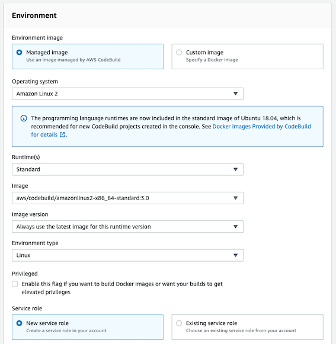
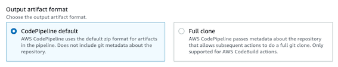

AWS Code Series (Build, Pipeline)으로 git submodule 사용하기 

<br>

## Intro

여러분이 보고계신 이 블로그(GitHub Pages 활용)는 2개의 깃헙 레포지토리를 통해 배포되고 있습니다. 첫번째 레포지토리는 원본 소스코드를 담고 있으며,
블로그 글을 작성할 때 마다 `build exec jekyll exec`라는 명령어로 localhost에서 퇴고를 진행합니다.
이어서 원본 소스코드에서 `build exec jekyll build`라는 명령어로 빌드하면 빌드 결과물이 `output` 파일에 떨어집니다.
`output` 파일에는 markdown 형식으로 작성한 글들이 `html` 파일로 빌드되어 2번째 레포지토리에 커밋됩니다.

저는 이것을 자동화 하기 위해 기존에는 Travis CI를 사용하고 있었습니다.
현재 블로그로 CI/CD 파이프라인을 구축하고 약 2년간 88회의 Commit까지 잘 쓰고 있다가,
어느새 다음과 같은 알람을 받아 보니 크레딧 소진으로 인하여 Travis CI를 AWS 솔루션으로 대체하기로 했습니다.

> Builds have been temporarily disabled for private and public repositories due to a negative credit balance. Please go to the Plan page to replenish your credit balance.

<br>

## 📜 Workflow

과거 제가 **AS-IS** 상황에서 **Travis CI**로 다음과 같은 과정을 통해 블로그에 글을 배포했었습니다.

1. 사용자가 원격 저장소(GitHub)에 `git push` 명령어로 새로운 코드를 반영 
2. GitHub과 연결해둔 Travis CI가 `.travis.yml` 파일에 정의한 대로 command 수행
    - 빌드 환경 구축
    - 소스 코드 빌드
    - 빌드 결과물을 배포용 레포지토리에 commit & push

위 과정의 **TO-BE**로 Travis CI 역할을 **CodeBuild**와 **CodePipeline**으로 대체하고 `.travis.yml` 대신 `buildspec.yaml` 파일을 정의하겠습니다.
    
## 💻 Hands-on

Travis CI는 Source 연계(GitHub 연결)와 Build가 별도로 분리되어 있지 않습니다.
그러나 AWS의 Code Series는 CodePipeline으로 Source와 Build를 연계하고, CodeBuild에서 Build를 정의해야 합니다. 

### 1️⃣ Build 정의

해당 단계는 CodeBuild 생성 시, **Buildspec** 단계의 **Insert build commands, editor**로 구성할 수 있습니다.
그러나 본 글에서는 직접 작성하여 **Source 레포지토리 루트 위치**에 `buildspec.yaml` 파일을 위치 시켜 진행하겠습니다.
제게 필요한 최소한의 설정을 다음과 같이 정의했습니다.

```yaml
version: 0.2

phases:
  install:
    runtime-versions:
      ruby: 2.7
    commands:
      - echo Installing dependencies...
      - gem install bundler
      - bundle install --quiet
  pre_build:
    commands:
      - export LC_ALL="en_US.utf8"
      - echo Git Setting...
      - mkdir buildZone && cd buildZone
      - git init
      - git remote add origin https://$GITHUB_TOKEN@github.com/heuristicwave/GitHubPageMaker.git
      - git fetch
      - git checkout -t origin/master
#      - git submodule init
#      - git submodule update --recursive
  build:
    commands:
      - echo Building...
      - bundle exec rake site:deploy
```

install

pre_build
저는 ruby 2.7 버전의 런타임 환경을 가지고 있으므로 install을 위와 같이 명

### 2️⃣ CodeBuild

1. `Create build projects`를 누르고 **Project configuration**에서 프로젝트 이름을 정의합니다. 이름이외의 설정은 비워두었습니다.
2. **Source**에서 'Github'을 선택하면 OAuth로 연결 혹은 personal access token으로 연결 중 한가지 방법을 선택합니다. 2가지 방법 모두 가능하므로 편리한 것을 선택합니다.
3. GitHub이 연동되면 연결하고자하는 repository를 선택하고 나머지 옵션은 비워두었습니다.
4. 'Git submodules' 기능을 사용한다면, **Additional configuration** 토글을 눌러 submodules을 체크합니다.
5. 본 글에서는 Source 이벤트로 CodePipeline을 사용하므로, **Primary source webhook events**는 넘어갑니다.
6. **Environment**에서는 다음과 같은 설정값을 주었습니다.
   
   >❗️해당 단계에서 빌드하고자 하는 런타임 환경을 꼭 [공식 문서](https://docs.aws.amazon.com/codebuild/latest/userguide/available-runtimes.html )에서 확인 후, 선택하세요.
   > <br>
   >❗빌드에 환경 변수를 명시했다면, **Additional configuration** 토글을 눌러 환경 변수를 추가해주세요.
   > 이 단계는 생성 당시 추가하지 않더라도, 생성 이후 'Build details' 탭에서 추가 혹은 변경이 가능합니다.
7. **Buildspec**과 **Batch configuration**은 비워두었습니다.
8. 로깅과 산출물이 필요하면 **Artifacts**와 **Logs**를 사용하면 되지만, 저는 CodeBuild내의 Build history만으로도 충분하기 때문에 사용하지 않았습니다.
9. 마지막으로 `Create build projects` 버튼을 눌러 빌드 프로젝트를 생성합니다.

### 3️⃣ CodePipeline

1. `Create pipeline`을 누르고 Step 1 단계에서 '이름'과 'Service role'을 지정합니다. 기본 값으로 설정하고 다음(Step 2) 페이지로 넘어갑니다.
2. Step 2 단계에서는 'Source provider'로 **GitHub (Version 2)**을 선택하고 'Connection'에서 깃헙과 연결해 줍니다. 
   이어서 상황에 맞게 'Repository name'과 'Branch name'을 선택하고 'Output artifact'로 default를 선택합니다.
   
   default를 선택할 경우 고려사항이 있지만, 자세한 내용은 아래 *Troubleshooting - Issue 1*단계에서 설명하겠습니다.
   
   
3. Step 3 **Build** 단계에서는 앞서 생성한 Codebuild를 지정하고 다른 값들을 기본값으로 설정하고 다음 단계로 넘어갑니다.
4. Step 4 **Deploy** 단계에서는 CodeDeploy와 같은 CD 도구 대신 Build의 command로 제어하므로 `Skip deploy stage` 버튼을 눌러 넘어갑니다.
5. Step 5 **Deploy** 단계에서는 검토를 마치고 `Create pipeline` 버튼을 눌르면 바로 정의한 파이프라인이 실행됩니다.

## ⛹🏾‍♂️ Troubleshooting

### Issue 1

*fatal: not a git repository (or any parent up to mount point /codebuild)*

> CodePipeline 생성 시, Output artifact를 default
> Does not include git metadata about the repository.
> 

### Issue 2

*error: The following untracked working tree files would be overwritten by checkout*

> git clean  -d  -f
> 이거 아니고 Issue 1과 동일

## Outro

GitHub Actions의 경우 [공식 문서](https://docs.github.com/en/actions/migrating-to-github-actions )에서 타 CI/CD 도구에서 마이그레이션 하는법이 굉장히 잘 명세되어 있지만,

소중한 시간을 내어 읽어주셔서 감사합니다! 잘못된 내용은 지적해주세요! 😃

---
