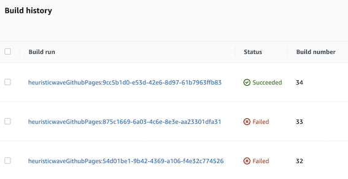

AWS Code Series (Build, Pipeline)으로 git submodule 사용하기

 

## Intro

여러분이 보고 계신 이 블로그(GitHub Pages 활용)는 2개의 깃헙 레포지토리를 통해 배포되고 있습니다. 첫 번째 레포지토리는 원본 소스코드를 담고 있으며,
블로그 글을 작성할 때마다 `bundle exec jekyll serve`라는 명령어로 **localhost**에서 퇴고를 진행합니다.
해당 명령어는 static page를 생성할 때, url을 제 도메인이 아닌 localhost로 생성해 GitHub Pages에서는 사용할 수 없습니다.
그러므로 저는 빌드 결과물이 떨어지는 `output` 파일을 `.ignore`로 처리합니다.

static page를 제 도메인으로 생성하기 위해서는 `bundle exec jekyll build`라는 명령어로 빌드 해야 합니다.
저는 이 절차를 CI 도구에게 위임했고, CI 도구는 markdown 형식으로 작성한 글들을 `html` 파일로 생성하여 2번째 레포지토리에 배포합니다.

저는 이것을 자동화하기 위해 기존에는 Travis CI를 사용하고 있었습니다.
현재 블로그로 CI/CD 파이프라인을 구축하고 약 2년간 88회의 Commit까지 잘 쓰고 있다가,
어느새 다음과 같은 알람을 받아 보니 크레딧 소진으로 인하여 Travis CI를 AWS 솔루션으로 대체하기로 했습니다.

> Builds have been temporarily disabled for private and public repositories due to a negative credit balance. Please go to the Plan page to replenish your credit balance.

 

## 📜 Workflow

과거 제가 **AS-IS** 상황에서 **Travis CI**로 다음과 같은 과정을 통해 블로그에 글을 배포했었습니다.

1. 사용자가 원격 저장소(GitHub)에 `git push` 명령어로 새로운 코드를 반영 
2. GitHub과 연결해둔 Travis CI가 `.travis.yml` 파일에 정의한 대로 command 수행
    - 빌드 환경 구축
    - 소스 코드 빌드
    - 빌드 결과물을 배포용 레포지토리에 commit & push

위 과정의 **TO-BE**로 Travis CI 역할을 **CodeBuild**와 **CodePipeline**으로 대체하고 `.travis.yml` 대신 `buildspec.yaml` 파일을 정의하겠습니다.
    
## 💻 Hands-on

Travis CI는 Source 연계(GitHub 연결)와 Build가 별도로 분리되어 있지 않습니다.
그러나 AWS의 Code Series는 CodePipeline으로 Source와 Build를 연계하고, CodeBuild에서 Build를 정의해야 합니다. 

### 1️⃣ Build 정의

해당 단계는 CodeBuild 생성 시, **Buildspec** 단계의 **Insert build commands, editor**로 구성할 수 있습니다.
그러나 본 글에서는 직접 작성하여 **Source 레포지토리 루트 위치**에 `buildspec.yaml` 파일을 위치 시켜 진행하겠습니다.
빌드 스펙은 [공식 문서](https://docs.aws.amazon.com/codebuild/latest/userguide/build-spec-ref.html )를 참고하여 필요한 내용들을 정의합니다.

### 2️⃣ CodeBuild

1. `Create build projects`를 누르고 **Project configuration**에서 프로젝트 이름을 정의합니다. 이름 이외의 설정은 비워두었습니다.
2. **Source**에서 'Github'을 선택하면 OAuth로 연결 혹은 personal access token으로 연결 중 한 가지 방법을 선택합니다. 2가지 방법 모두 가능하므로 편리한 것을 선택합니다.
3. GitHub이 연동되면 연결하고자 하는 repository를 선택하고 나머지 옵션은 비워두었습니다.
4. 'Git submodules' 기능을 사용한다면, **Additional configuration** 토글을 눌러 submodules을 체크합니다.
5. 본 글에서는 Source 이벤트로 CodePipeline을 사용하므로, **Primary source webhook events**는 넘어갑니다.
6. **Environment**에서는 다음과 같은 설정값을 주었습니다.
   
   >❗️해당 단계에서 빌드하고 자 하는 런타임 환경을 꼭 [공식 문서](https://docs.aws.amazon.com/codebuild/latest/userguide/available-runtimes.html )에서 확인 후, 선택하세요.
   >  
   >❗빌드에 환경 변수를 명시했다면, **Additional configuration** 토글을 눌러 환경 변수를 추가해 주세요.
   > 이 단계는 생성 당시 추가하지 않더라도, 생성 이후 'Build details' 탭에서 추가 혹은 변경이 가능합니다.
7. **Buildspec**과 **Batch configuration**은 비워두었습니다.
8. 로깅과 산출물이 필요하면 **Artifacts**와 **Logs**를 사용하면 되지만, 저는 CodeBuild 내의 Build history만으로도 충분하기 때문에 사용하지 않았습니다.
9. 마지막으로 `Create build projects` 버튼을 눌러 빌드 프로젝트를 생성합니다.

### 3️⃣ CodePipeline

1. `Create pipeline`을 누르고 Step 1 단계에서 '이름'과 'Service role'을 지정합니다. 기본 값으로 설정하고 다음(Step 2) 페이지로 넘어갑니다.
2. Step 2 단계에서는 'Source provider'로 **GitHub (Version 2)**을 선택하고 'Connection'에서 깃헙과 연결해 줍니다. 
   이어서 상황에 맞게 'Repository name'과 'Branch name'을 선택하고 'Output artifact'로 default를 선택합니다.
   
   default를 선택할 경우 고려 사항이 있지만, 자세한 내용은 아래 *Troubleshooting - Issue 1*단계에서 설명하겠습니다.
   
   
3. Step 3 **Build** 단계에서는 앞서 생성한 Codebuild를 지정하고 다른 값들을 기본값으로 설정하고 다음 단계로 넘어갑니다.
4. Step 4 **Deploy** 단계에서는 CodeDeploy와 같은 CD 도구 대신 Build의 command로 제어하므로 `Skip deploy stage` 버튼을 눌러 넘어갑니다.
5. Step 5 **Deploy** 단계에서는 검토를 마치고 `Create pipeline` 버튼을 누르면 바로 정의한 파이프라인이 실행됩니다.

## ⛹🏾‍♂️ Troubleshooting

### Issue 1

*fatal: not a git repository (or any parent up to mount point /codebuild)*

> 🖍️ CodePipeline의 Output artifact를 default 선택 시, 다음과 같은 안내 문구가 있습니다.
> *Does not include git metadata about the repository.* 즉, git metadata 정보가 없으므로 git과 관련된 명령어를 사용할 수 없습니다.  
> 🖋️ metadata 정보만 없을 뿐, `ls` 명령어를 삽입해 파일 시스템을 확인하면 Source로 지정한 레포지토리의 구조가 담겨 있습니다.

> ✏️ `git init` 명령어를 주입해 초기 세팅 명령어를 작성합니다.

### Issue 2

*error: The following untracked working tree files would be overwritten by checkout*

> 🖍️ 위 에러로 구글링을 하면 `git clean  -d  -f` 명령어로 해결하라 하지만, 근본적인 해결 방법이 아닙니다.   
> 상황에 따라 다르지만, 제 경우 루비의 라이브러리를 설치하는 `Gemfile`이 삭제되어 후속 빌드 단계에서 문제가 됩니다.

> ✏️ 해당 문제의 근본적 원인은 Issue 1과 같이 git metadata 정보는 없지만, source repoì˜ 파일이 담겨 발생하는 문제입니다.  
> 이를 해결하기 위해 다음과 같이 `mkdir buildZone && cd buildZone` 새 폴더를 만들어 해당 오류를 우회할 수 있습니다.

### Issue 3

*ArgumentError: invalid byte sequence in US-ASCII*

> 🖍️ CodeBuild가 빌드 환경을 구성하는 데 사용하는 도커이미지는 기본 **locale**이 `POSIX`로 설정되어 있습니다. 

> ✏️ [공식 문서](https://docs.aws.amazon.com/codebuild/latest/userguide/troubleshooting.html#troubleshooting-utf-8 )에서 가이드 하는 데로 `pre_build`에 `export LC_ALL="en_US.utf8"` 환경 변수 주입으로 해결할 수 있습니다.

### Issue 4

*각종 인증 이슈, 예) fatal: could not read Password for ~~~*

> 🖍️ 인증 정보가 잘 못 되었거나, 관련 값들을 주입하지 못했을 때 발생합니다.

> ✏️ 토큰 값 인증 방법 : `git {command} https://$GITHUB_TOKEN@github.com/#{username}/#{reponame}` 
> ✏️ GitHub 비밀번호 설정 방법 : `git config --global credential.helper cache`  
> 🖋️ 토큰 값과 같은 기밀성 정보는 **parameter store, secrets-manager** 등을 활용해 값을 보호하세요.

## Outro

Travis CI의 경우 가이드 하는 대로 간편하게 설정이 가능했습니다. GitHub Actions의 경우 [공식 문서](https://docs.github.com/en/actions/migrating-to-github-actions )에서 타 CI/CD 도구에서 마이그레이션 하는 법이 굉장히 잘 명세되어 비교적 사용이 쉽습니다.
CodeBuild의 경우 일일이 다 확인하며 설정해 줘야 하는 점은 어려웠지만, 그만큼 커스텀 하여 사용할 수 있을 것 같습니다. 마지막으로 Travis CI에서 AWS Code Series로 마이그레이션 하기까지 33번의 실패가 있었던 화면을 공유하며 마치겠습니다. 🤪

소중한 시간을 내어 읽어주셔서 감사합니다! 잘못된 내용은 지적해주세요! 😃

---
