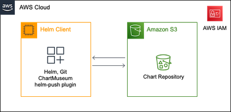
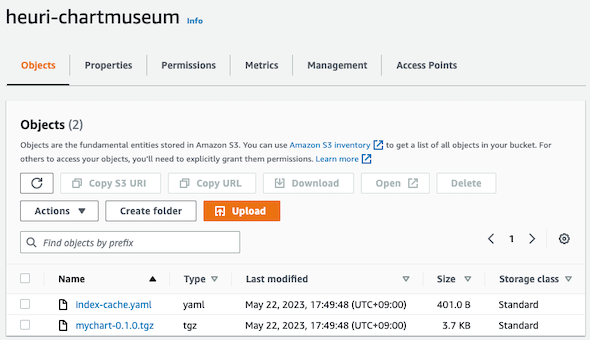
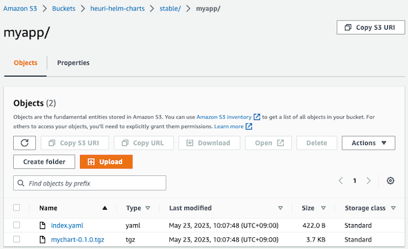

AWS에서 Helm chart repositories를 운영하는 방법

## Intro

AWS 환경에서 EKS를 활용하여 서비스를 운영하다 보면, manifest 파일들을 관리하기 위해 helm을 사용하게 됩니다.
이번 포스팅에서는 Helm chart에 대하여 알아보고 AWS 환경에서 Helm chart를 구축하는 방법에 대하여 이야기해 보겠습니다.

## 🏞️ Background knowledge

**Helm**은 쿠버네티스를 위한 패키지 관리 도구입니다. **Chart**라는 파일 형식으로 패키징 하며, 차트를 통해 설치, 업그레이드 롤백을 간편하게 해줍니다.
**Repository**는 차트를 모으고 공유할 수 있는 곳으로, 하나의 저장소에서 여러 개의 Chart를 관리할 수 있습니다.

공식 차트 저장소 [ArtifactHUB](https://artifacthub.io/ )를 활용할 수도 있고, 다음과 같이 자신만의 차트를 만들 수도 있습니다.

- Local 활용 (*`helm repo index {PATH}`, 로컬을 backend로 `index.yaml` 파일이 생성*)
- [GitHub Pages를 활용한 Public Helm Chart 구축](https://medium.com/@mattiaperi/create-a-public-helm-chart-repository-with-github-pages-49b180dbb417) 
- [GitHub에서 Private Helm chart 저장소 설정](https://jasiek-petryk.medium.com/setting-up-a-private-helm-chart-repository-on-github-4a767703cec8)

참고 : [The Chart Repository Guide](https://helm.sh/docs/topics/chart_repository/)

# Amazon S3로 Helm Repository 구축하기

Helm을 패키징 하면 `tgz` 형식의 아카이브 파일이 생성되며, 이런 차트 파일은 주로 Amazon S3와 같은 Object storage를 백엔드로 사용합니다.
AWS 환경에서 S3를 사용해 Chart를 구축하는 방법에 대하여 다음 2가지 방법으로 알아보겠습니다.

- Helm Project에서 관리되는 [ChartMuseum](https://chartmuseum.com/)
- AWS Prescriptive Guidance, [Set up a Helm v3 chart repository in Amazon S3](https://docs.aws.amazon.com/prescriptive-guidance/latest/patterns/set-up-a-helm-v3-chart-repository-in-amazon-s3.html )에 소개된 [helm-s3](https://github.com/hypnoglow/helm-s3)

## 🏛️ ChartMuseum using Amazon S3

ChartMuseum은 Amazon 외에도 DigitalOcean, Google Cloud, Microsoft Azure 등 다양한 Storage를 백엔드로 지원합니다.

### Architecture

Helm Client의 경우 AWS Cloud 내 **EC2 인스턴스** 혹은 개발자의 **Local 작업 환경** 모두 가능합니다.



### Process

**1. 준비 작업**

- [Installation](https://chartmuseum.com/docs/#installation )을 참고하여 `GoFish` 혹은 `curl`로 설치
- 테스트를 위해 `mychart`라는 임의의 차트 생성 : `helm create mychart`
- helm repository에 담을 차트를 패키지화 : `helm package ./mychart`

**2. Chartmuseum 실행 및 Repository 추가**

- [Using with Amazon S3](https://chartmuseum.com/docs/#using-amazon-s3 )에 기재된 대로, `endpoint`를 설정하고 `IAM` 권한을 부여
- 다음 명령어로 chartmuseum을 실행시키고 Helm Client의 URL에 접속하여 동작 여부 확인 <br> *Helm Client가 local인 경우, `http://localhost:8080`에서 확인 가능*
  ```shell
  chartmuseum --debug --port=8080 \
  --storage="amazon" \
  --storage-amazon-bucket="my-s3-bucket" \
  --storage-amazon-prefix="" \
  --storage-amazon-region="us-east-1"
  ```
- 다음 명령어로 repository를 추가 : `helm repo add my-chart http://localhost:8080` <br> *`helm repo ls` 명령어로 확인 가능*

**3. S3에 패키지 업로드**

- 다음 명령어로 `helm plugin install https://github.com/chartmuseum/helm-push` <br>
[helm-push](https://github.com/chartmuseum/helm-push) 플러그인을 다운로드하고, `helm cm-push --help` 명령어로 설치 여부 확인
- `cm-push` 명령어로 패키지 업로드 : `helm cm-push mychart/ my-chart`
- 정상적으로 패키지가 올라가면 아래와 같이 S3 콘솔에서 확인 가능
  

## ☁️ Helm v3 chart repository using helm-s3

이번에는 [AWS 공식 문서](https://docs.aws.amazon.com/ko_kr/prescriptive-guidance/latest/patterns/set-up-a-helm-v3-chart-repository-in-amazon-s3.html )에 소개 **helm-s3** 플러그인을 사용해 AWS Native 하게 구축하는 방법을 알아보겠습니다.

### Architecture

문서에서는 AWS Native 하게 사용하는 방법을 안내하기 위해, 로컬 helm 코드를 운영하기 위해 **CodeCommit**과, Helm Client로 **EC2 인스턴스**를 사용하고 있습니다.
ChartMuseum 구축 때와 마찬가지로 Helm Client를 개발자의 **Local 작업 환경** 혹은 CodeCommit을 다른 형상관리 도구로 대체 가능합니다.


> 🧐 해당 방식에서는 **Source code management** 목적으로 CodeCommit을 사용하고 있습니다. <br>
> 즉, **소스 코드 및 리소스의 버전 관리**로 CodeCommit을 사용하고 **차트 파일의 저장과 배포**에 S3을 사용하고 있습니다. <br>

> ❗️ CodeCommit을 소스 코드 버전 관리 목적 외에도 ArgoCD와 통합하여 배포에도 사용할 수 있습니다. <br>
> [AWS Workshop](https://catalog.us-east-1.prod.workshops.aws/workshops/9c0aa9ab-90a9-44a6-abe1-8dff360ae428/ko-KR/110-cicd/110-cicd )의 Helm Repo로 CodeCommit을 사용하는 방법도 있으니 참고하시기 바랍니다.

### Process

**1. 준비 작업**

- 고유한 S3 버킷 생성 후, 버킷에서 `stable/myapp` 폴더를 생성 
- helm-s3 플러그인 설치 :  `helm plugin install https://github.com/hypnoglow/helm-s3.git`

**2. S3 버킷 초기화 및 추가**

- S3 폴더를 Helm Repository로 초기화 : `helm s3 init s3://{YOUR_BUCKET}/stable/myapp`
- `index.yaml` 파일이 생성되었는지 확인 : `aws s3 ls s3://{YOUR_BUCKET}/stable/myapp`
- Helm 클라이언트에 Repository 추가 : `helm repo add stable-myapp s3://{YOUR_BUCKET}/stable/myapp/`
- Repository 확인 : `helm repo ls`

**3. S3에 패키지 업로드**

- ChartMuseum 구축에서 사용한 `mychart-*.tgz` 파일 활용
- `s3 push` 명령어로 패키지 업로드 : `helm s3 push ./mychart-0.1.0.tgz stable-myapp`
- 정상적으로 패키지가 올라가면 `index.yaml`에 업로드 정보가 갱신되며, 다음과 같이 S3에서 확인 가능
  
  
<br>

## Outro

첫 번째 방법에서는, ChartMuseum을 실행시키고 `helm-push` 플러그인을 활용하여 차트를 업로드했습니다.
반면 두 번째 방법에서는 ChartMuseum과 같은 업로드 계층 없이, `helm-s3` 플러그인을 활용하여 Direct로 차트를 업로드했습니다.

`helm-s3` 사용하는 방식이 ChartMuseum과 같은 Layer가 없어 사용이 편리합니다.
그뿐만 아니라 여러 개의 Chart를 운용하는 경우, ChartMuseum은 `--storage-amazon-prefix` 옵션을 바꿔가며 실행해야 하지만,
`helm-s3`는 `helm repo add` 명령어 뒤에 **prefix**만 바꿔 바로 사용할 수 있으므로 훨씬 유용한 것 같습니다.
GCP나 Azure와 같은 다른 Object Storage를 함께 사용하는 게 아니라면, `helm-s3`로 구축하는 것이 좋겠네요.

소중한 시간을 내어 읽어주셔서 감사합니다! 잘못된 내용은 지적해 주세요! 😃

---
