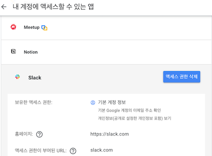
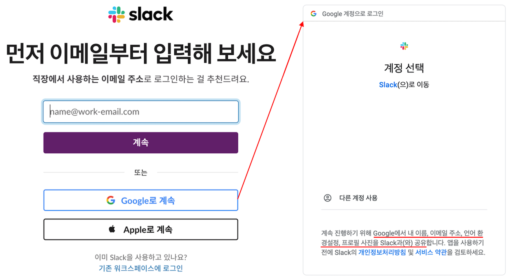
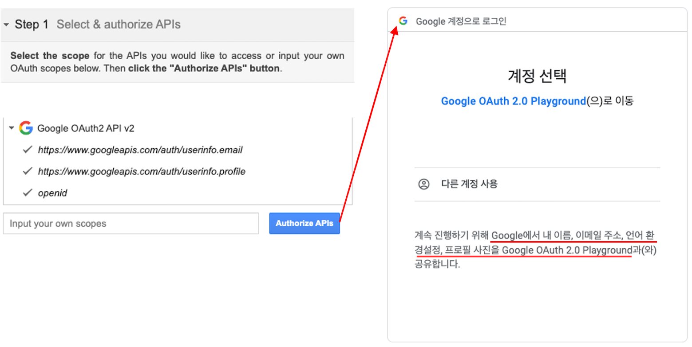
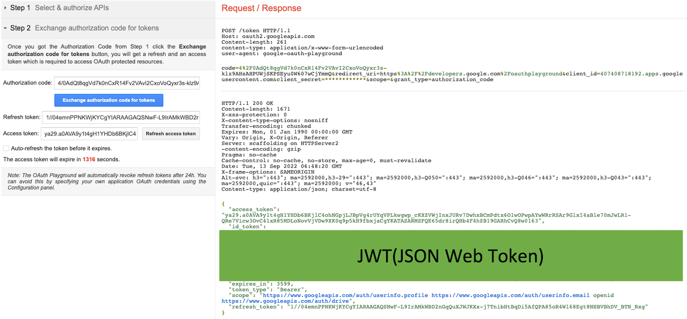
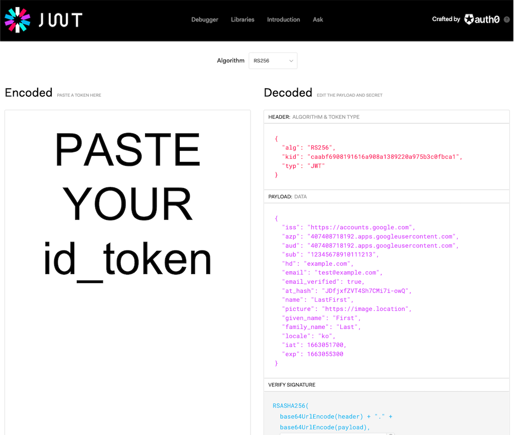

Journey to OIDC through authentication, authorization, SAML, and OAuth.

<br>

## Intro

요즘 제 일상에서, OIDC(OpenID Connect)에 대해 많은 이야기가 오고 갔습니다. 그동안 동작 원리도 제대로 알지 못한 채 사용하고 있던 제 모습을 반성하며,
OIDC를 알아가기 위해 조사한 내용들을 다뤄보겠습니다.

<br>

## 🥾 Authentication & Authorization

OIDC를 향한 여정의 첫걸음은 인증과 인가입니다. 국어로도 비슷한 두 단어는 영어로도 비슷하며 다음과 같이 줄여서 표현하기도 합니다.
AuthN(인증) & AuthZ(인가, 권한 부여)

인증과 인가에 관한 설명은 온라인에 굉장히 많지만, 저는 그중에서도 [**Auth0(오스제로)** 사의 문서의 비교표](https://auth0.com/docs/get-started/identity-fundamentals/authentication-and-authorization#authentication-vs-authorization )를 인용하였습니다.

|  Authentication | Authorization  |
|---|---|
| 사용자가 자신이 주장하는 사람이 맞는지 결정합니다. | 사용자가 접근할 수 있는지 없는지 결정합니다. |
| 사용자의 자격 증명이 유효한지 확인합니다. | 정책과 룰을 통해 접근 여부를 확인합니다. |
| 통상 인가 전 단계에 진행합니다. | 통상 인증 이후 단계에 진행합니다. |
| 일반적으로 **ID Token**을 통해 정보를 전송합니다. | 일반적으로 **Access Token**을 통해 정보를 전달합니다. |
| 일반적으로 **OIDC 프로토콜**에 의해 관리됩니다. | 일반적으로 **OAuth 2.0 프레임워크**에 의해 관리됩니다. |

> 💡 위 비교표에 **Bold**처리된 키워드가 오늘 포스팅을 이해하기 위한 핵심 용어이므로 주목해 주세요!

<br>

## ⛰ OAuth 2.0

**OAuth 2.0 Authorization Framework**의 [RFC 문서](https://www.rfc-editor.org/rfc/rfc6749 )의 Abstract 부분을 확인하면 다음과 같이 정의합니다.
*"OAuth 2.0 인가 프레임워크는 서드파티 앱들이 제한된 권한을 얻는 것을 가능하게 해줍니다."*

여러분들은 특정 서비스 회사의 애플리케이션을 이용할 때, 구글이나 페이스북으로부터 특정 권한을 받아 서비스를 이용한 경험이 있을 것입니다.
**구글 계정** 정보의 [내 계정에 액세스할 수 있는 앱](https://myaccount.google.com/permissions )에 들어가 확인해 보시면,
내 계정이 어떤 앱들이 액세스할 수 있게 권한을 주었는지 확인 가능합니다.



위 사진을 통해, 구글이 **OAuth 프레임워크**를 사용해 Meetup, Notion, Slack과 같은 **서드파티 앱**들에게
계정의 이메일 주소 확인, 개인정보 보기 등과 같은 **제한된 권한**에 대하여 **인가**를 해줬다는 사실을 알 수 있습니다.

### Slack으로 알아보는 OAuth 2.0 Flow

OAuth에 워크플로를 알아보기 전에, 자주 언급되는 핵심 용어들을 언급하고 넘어가겠습니다.

- Client : 인가를 받는 애플리케이션 (배달의 민족, 야놀자, 오늘의 집 등)
- Resource Server : 제어하고자 하는 자원(Protected Resource)을 가진 서버 (구글, 페이스북, 깃헙)
- Resource Owner : 자원의 소유자 (end-user)
- Authorization Server : AuthZ 처리를 하는 서버

다시 [RFC 문서](https://www.rfc-editor.org/rfc/rfc6749 )로 돌아와서 해당 프로토콜의 Flow를 앞서 보여드린 예시처럼 우리의 경험에 빗대어 설명해 보겠습니다.

```shell
# Abstract Protocol Flow
+--------+                               +---------------+
|        |--(A)- Authorization Request ->|   Resource    |
|        |                               |     Owner     |
|        |<-(B)-- Authorization Grant ---|               |
|        |                               +---------------+
|        |
|        |                               +---------------+
|        |--(C)-- Authorization Grant -->| Authorization |
| Client |                               |     Server    |
|        |<-(D)----- Access Token -------|               |
|        |                               +---------------+
|        |
|        |                               +---------------+
|        |--(E)----- Access Token ------>|    Resource   |
|        |                               |     Server    |
|        |<-(F)--- Protected Resource ---|               |
+--------+                               +---------------+
```

우선 A & B에 해당하는 Client가 Resource Owner에게 AuthZ를 요청하고 승인 절차를 Slack 로그인을 통해서 알아보겠습니다.



위 이미지에서 Client인 slack은 Google과 Apple 2가지 방식의 OAuth를 제공합니다.
'Google로 계속'이라는 버튼(A 단계, AuthZ 요청)을 누르면, slack이 계정의 이름, 이메일, 프로필 사진 등의 정보 공유를 요청했다는 것을 구글의 Authorization Server로부터 받습니다.
해당 시점의 웹브라우저 URI를 확인하면 다음과 같습니다. *(편의상 URI을 쿼리 스트링 단위로 나누고, Decode 하여 표기했습니다.)*

```shell
https://accounts.google.com/o/oauth2/v2/auth/oauthchooseaccount? \ 
  client_id=6XXXXXXXX.apps.googleusercontent.com& \
  redirect_uri=https://oauth2.slack.com/get-started/oauth/google/end& \
  scope=openid email profile& \
  response_type=code& \
  access_type=offline& \
  state=& \
  prompt=consent& \
  flowName=GeneralOAuthFlow
```

슬랙의 권한 부여의 경우, `https://accounts.google.com/{이하 생략}`이라는 Authorization Server의 주소와 `client_id`를 포함한 8개의 querystring으로 구성되어 있습니다.
여기서 상위 4개의 querystring은 인가를 위한 **필수 파라미터**입니다.

- `client_id` : client를 식별하기 위해 Register 단계에서 생성된 애플리케이션의 식별자
- `redirect_uri` : authorization code를 전달받을 client 서버의 URI
- `scope` : 인가할 권한을 명시
- `response_type` : code, token 등 OAuth에 적용할 방식의 타입

### Implicit Grant Flow

캡처화면에서는 우리의 웹 브라우저를 통해 A와 B의 단계가 클릭 2번으로 끝나지만, 사실 A와 B 사이에는 더 복잡한 단계들이 숨겨져 있습니다.
아래 RFC 문서에 기재된 **Implicit Grant Flow**를 살펴보며 A 이후의 단계들을 살짝 보고 넘어가겠습니다. 🫣 

```shell
 +----------+
 | Resource |
 |  Owner   |
 |          |
 +----------+
      ^
      |
     (B)
 +----|-----+          Client Identifier     +---------------+
 |         -+----(A)-- & Redirection URI --->|               |
 |  User-   |                                | Authorization |
 |  Agent  -|----(B)-- User authenticates -->|     Server    |
 |          |                                |               |
 |          |<---(C)--- Redirection URI ----<|               |
 |          |          with Access Token     +---------------+
 |          |            in Fragment
 |          |                                +---------------+
 |          |----(D)--- Redirection URI ---->|   Web-Hosted  |
 |          |          without Fragment      |     Client    |
 |          |                                |    Resource   |
 |     (F)  |<---(E)------- Script ---------<|               |
 |          |                                +---------------+
 +-|--------+
   |    |
  (A)  (G) Access Token
   |    |
   ^    v
 +---------+
 |         |
 |  Client |
 |         |
 +---------+
```

간략하게 몇 가지를 더 설명하자면, 위 승인 Flow의 User-Agent는 우리의 웹브라우저입니다.
브라우저는 인가 서버의 URI에 querystring으로 `client_id`와 `redirect_uri`를 붙여 인가 서버에 전달하면(A),
인가 서버는 **검증** 작업을 거쳐 **Access Token**을 발급(C) 합니다.
이후 Client는 생성된 **Access Token**을 활용해 scope에 명시된 기능을 Resource Server로부터 제공받습니다.(위 그림, Implicit Grant Flow에서는 나오지 않음)
해당 절차가 `Abstract Protocol Flow` 그림의 B ~ F에 해당합니다.

### Authorization Code Grant

사실, Implicit Grant Flow의 **C 단계**에는 아래와 같은 인가 코드 발급 과정이 생략되어 있습니다.

```shell
+----------+
| Resource |
|   Owner  |
|          |
+----------+
     ^
     |
    (B)
+----|-----+          Client Identifier      +---------------+
|         -+----(A)-- & Redirection URI ---->|               |
|  User-   |                                 | Authorization |
|  Agent  -+----(B)-- User authenticates --->|     Server    |
|          |                                 |               |
|         -+----(C)-- Authorization Code ---<|               |
+-|----|---+                                 +---------------+
  |    |                                         ^      v
 (A)  (C)                                        |      |
  |    |                                         |      |
  ^    v                                         |      |
+---------+                                      |      |
|         |>---(D)-- Authorization Code ---------'      |
|  Client |          & Redirection URI                  |
|         |                                             |
|         |<---(E)----- Access Token -------------------'
+---------+       (w/ Optional Refresh Token)
```
브라우저는 인가 서버의 URI에 querystring으로 `client_id`와 `redirect_uri`를 붙여 인가 서버에 전달(A) 하는 것은 동일합니다.
이어서 인가 서버는 **검증** 작업을 거쳐 **Authorization Code**을 발급(C) 합니다.
**Authorization Code**를 받은 브라우저는 Client에게 전달(C) 하고, Client는 다시 인가 서버에게 Code를 보내고(D)
Access Token을 돌려받습니다.

지금까지 생소한 정보들을 쏟아내다 보니, 독자 여려분들이 굉장히 혼란스러울 것 같습니다. (처음 OAuth를 공부했던 제가 그랬습니다 😵‍💫)
처음부터 모든 과정을 이해하려 하면 어려우니, 대략적인 흐름만 파악하고 넘어가셔도 좋습니다. 이후 OIDC에서 예시와 함께 또 다룰 예정이거든요 🙃
 
> 🛎 위 2가지 Flow가 OAuth 2.0의 전체 Flow는 아닙니다. Client Register, Refresh Token 등 **중요 개념들이 상당히 생략** 되어 있습니다.

<br>

## OpenID Connect(OIDC)

얼렁뚱땅 OAuth를 넘기고 드디어 OpenID Connect 순서에 다 다르었습니다. OIDC를 다루기 전, **OpenID**가 무엇인지 [OpenID 재단의 설명](https://openid.net/what-is-openid/ )에서 몇 가지 살펴보겠습니다.

### OpenID

- OpenID는 새 비밀번호를 만들 필요 없이, 기존 계정을 사용해 여러 웹사이트에 로그인할 수 있습니다.
- OpenID를 사용하면 웹사이트와 공유되는 정보의 양을 제어할 수 있습니다.
- 당신의 비밀번호은 Identity provider(Idp)에게만 주어지며, Idp가 신원을 확인하므로 안전하지 않은 웹사이트가 당신의 신원을 훼손하는 것에 대해 걱정할 필요가 없습니다.

> ⚡️ OpenID 2.0은 OpenID Connect로 대체되었습니다. [Ref. Libraries for Obsolete Specifications](https://openid.net/developers/libraries/obsolete/)

### Using OAuth 2.0 to Access APIs

이어서, [OpenID 재단의 설명](https://openid.net/connect/ )의 OIDC는 다음과 같이 정의되어 있습니다.
"OpenID Connect 1.0 is a simple identity layer on top of the OAuth 2.0 protocol." OIDC가 OAuth 프로토콜의 상위 간단한 신원 계층이라는 말이 무엇을 의미할까요?
여기서 앞서 slack 예시에서 만난 OAuth의 `scope` 부분으로 거슬러 올라가 보겠습니다. (`scope=openid email profile`) 해당 파라미터에는 인가할 리소스가 `openid`로 기재되어 있습니다.
즉, slack은 제 프로필 정보를 얻기 위해 **OAuth 2.0**을 사용해 `Google OAuth2 API v2`를 호출했고, 액세스하려는 API의 `scope`을 `openid`로 지정했습니다. 

이해를 돕기 위해, Google Developers의 [OAuth 2.0 Playground](https://developers.google.com/oauthplayground/ )(Client를 구축할 필요 없이, 데모 환경을 제공)를 사용해 보겠습니다.



Step1에서 `Google OAuth2 API v2`의 `scope`으로 `email`, `profile`, `openid`를 지정하고 Authorize APIs 버튼을 누르니,
Client만 Google OAuth 2.0 Playground로 바뀌고 slack 예시와 동일한 결과를 받는 것을 확인할 수 있습니다.

> 🙈 해당 URI도 주의 깊게 살펴보면 paramter의 순서만 다를 뿐, 필수 파라미터를 포함하여 slack 예시와 비슷한 URI를 볼 수 있습니다.

Step2에서는 Idp(여기서는 구글의 인증 서버)로부터 발급된 **Authorization code**를 토큰으로 바꾸는 **Exchange authorization code for tokens** 버튼을 누르면,
**Refresh token**과 **Access token** Idp로부터 받아 Playground 웹 페이지에 나타나게 됩니다.



이어서 전달된 Response 값을 확인해 보면, 타 OAuth 2.0 API를 `scope`으로 선택했을 때와는 다르게 `id_token` 값으로 JWT 형태의 값을 받습니다.

### id_token

OIDC는 OAuth 2.0의 상위 계층이므로 동작 원리가 OAuth 2.0과 동일합니다. 한 가지 다른 점은, `id_token` 정보가 포함되어 있다는 것입니다.
Step2에서 받은 `id_token` 값을 [jwt.io](https://jwt.io/ )에 복사하여 Decode 한 정보를 살펴보겠습니다.



jwt는 `.`으로 구분되어 decode 하면 아래 3가지 필드로 나뉩니다.

- header : id 토큰의 형식, 해시 알고리즘의 종류, 암호화에 사용된 공개키 ID
- payload : 사용자 인증 정보 - (발급 기관, 토큰이 발급된 앱, id 토큰 유저의 번호, 발급 시간, 만료 시간, 이메일, 이름, 프로필 사진 등) 
- signature : 인증 서버에 header의 공개키로 서명한 값

client는 payload에 담긴 사용자 정보를 활용해 유저의 인증을 할 수 있습니다.

### Recap

여기까지 포스팅을 읽으셨다면, 앞부분에 언급했던 **Auth0(오스제로)**의 인증, 인가 비교표를 떠올려주세요.
**OAuth**는 **AuthZ(인가)**에 초점이 맞춰 저 **Access Token**으로 특정 권한을 허가해 줄 뿐 사용자의 정보는 담고 있지 않습니다.
반면, OIDC는 **ID Token**을 통해 정보를 전송하며 **AuthN(인증)**을 가능하게 하였습니다.

<br>

## Outro

이번 포스팅은 기존에 올린 타 글들보다 많은 레퍼런스 문서들을 읽었습니다. 이미 온라인에 굉장히 잘 정리된 콘텐츠들이 많지만,
제 나름대로 재가공 하다 보니 부족한 부분들이 많습니다. 제게 많은 도움이 되었던 레퍼런스들을 아래 첨부하니, 함께 보시면 도움이 많이 될 것 같습니다.

마지막으로, [Samsung SDS의 인사이트 리포트](https://www.samsungsds.com/kr/insights/oidc.html )에
실린 요약이 오늘의 정보들을 깔끔하게 정리해 주는 것 같아 함께 첨부하며 마치겠습니다. (요약된 문장의 단어 하나하나가 해당 기술의 특징을 잘 나태낸다는 생각이 드네요 😊)

- SAML 2.0 : 2001년 OASIS에서 정의한 개방형 Authentication(인증) 및 Authorization(인가) 표준이며, 엔터프라이즈 애플리케이션의 SSO(Single Sign On)를 목적으로 XML(Extensible Markup Language) 형식으로 개발
- OAuth 2.0 : 2006년 Twitter와 Google이 정의한 개방형 Authorization 표준이며, API 허가를 목적으로 JSON(Javascript Object Notation) 형식으로 개발
- OIDC 2.0 : 2014년 OpenID Foundation에서 정의한 개방형 Authentication 표준이며, 컨슈머 어플리케이션의 SSO를 목적으로 JSON 형식으로 개발

소중한 시간을 내어 읽어주셔서 감사합니다! 특히나 이번 포스팅은 잘못된 내용 혹은 부적절한 설명이 있을 수도 있으니 자유롭게 지적해 주세요!
벌써 포스팅 이후 3번이나 다시 배포하게 되었네요. 😃

<br>

## 📚 References

### SSO(SAML & OAuth 2.0)

- [SAML vs. OAuth: Comparison and Differences](https://www.okta.com/identity-101/saml-vs-oauth/) : SAML, OAuth 2.0 동작 원리 설명
- [NAVER WORKS Developers, SSO 개요](https://developers.worksmobile.com/kr/document/2001001?lang=ko) : 네이버 웍스에서 SAML, OAuth 2.0 구현 방법 소개
- [OASIS, SAML V2.0 Technical Overview](https://www.oasis-open.org/committees/download.php/27819/sstc-saml-tech-overview-2.0-cd-02.pdf)

### OAuth 2.0

- [OAuth 2.0 RFC](https://www.ietf.org/rfc/rfc6750.txt)
- [생활코딩, WEB2 - OAuth 2.0](https://opentutorials.org/course/3405)

### OIDC

- [Samsung SDS, 편의성을 높인 ID 인증 관리 - OIDC(OpenID Connect)가 주목 받는 이유](https://www.samsungsds.com/kr/insights/oidc.html)
- [kakao developers, OIDC](https://developers.kakao.com/docs/latest/ko/kakaologin/common#oidc)
- [OpenID Connect Spec](https://openid.net/specs/openid-connect-core-1_0.html)
- [DaleSeo, 구글 OpenID Connect 사용법](https://www.daleseo.com/google-oidc/) : 실습 코드 제공
- [k8s 인증 완벽이해 #3 - OpenID Connect](https://coffeewhale.com/kubernetes/authentication/oidc/2020/05/04/auth03/) : 쿠버네티스 인증을 설명하는 글이지만, OIDC를 이해하기 위해 아주 좋은 글

### Hands-On

- [OAuth 2.0 Playground](https://developers.google.com/oauthplayground/)
- [jwt.io](https://jwt.io/) : jwt 토큰 Decode
- [Github Docs, Building OAuth App](https://docs.github.com/en/developers/apps/building-oauth-apps/creating-an-oauth-app)
- [passportjs](https://www.passportjs.org/concepts/authentication/oauth/)

### 기타 도움이 되는 콘텐츠

- [얄팍한 코딩사전, 세션 VS 토큰! JWT가 뭔가요?](https://youtu.be/1QiOXWEbqYQ) : 배경 지식이 없다면, 이 영상 먼저 보는 것을 추천
- [okta, What’s the Difference Between OAuth, OpenID Connect, and SAML?](https://www.okta.com/identity-101/whats-the-difference-between-oauth-openid-connect-and-saml/)

---
