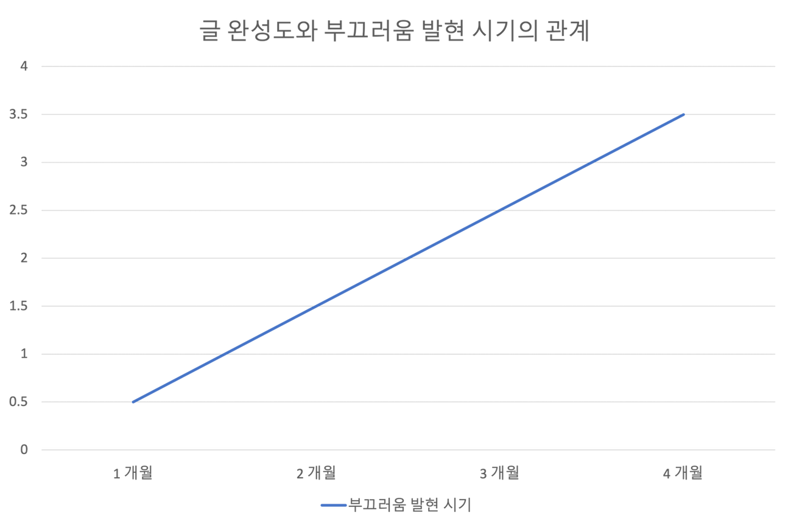

회고 글을 쓰며 드는 생각

## 글또 7기를 마무리해가며... 🏃🏻

이번 글을 포함하여, 총 2회 제출만이 남았습니다. 본래 회고 글은 맨 마지막 제출에 작성하려 했으나, 마감 8시간을 남기고 이미 패스권은 다 소진해 계획을 수정했습니다.
해당 포스팅은 22년 5월 5일에 작성한 [글또 7기 다짐글](https://heuristicwave.github.io/geultto) 템플릿을 수정해 작성한 글로,
해당 글을 같이 띄워두고 보면 조금 더 재미?있지 않을까 싶습니다.

## 🧩 계획 점검

지금까지 2번의 패스권 사용과 8번의 제출이 있었습니다. 다짐 글에서 아래와 같이 콘텐츠를 계획했는데, 얼마나 달성했는지 점검해 보겠습니다.

1. 기술 도서 리뷰  
   밀린 기술 서적 부채(?)를 청산한다 했는데, 여전히 쌓여 있습니다. 한 권도 제대로 읽은 책이 없지만,
   "[이펙티브 엔지니어](http://www.yes24.com/Product/Goods/110243880 )"와 "[Tucker의 Go 언어 프로그래밍](http://www.yes24.com/Product/Goods/99108736 )"거
   을 거의 다? 읽어가니, 자체 평가로 **B**를 부여하겠습니다.  
   
2. 기존 시리즈물 마감  
   2편에 머물러 있던, '테라폼 더 익숙하게' 라는 시리즈물에 추가 3편을 연재하며, 총 5편의 시리즈물을 만들었습니다.
   추가로 앞서 작성했던 기존 2편도 수정을 통해 완성도를 조금 더 높였습니다. 연재가 끝난 건 아니지만, 해당 5편을 통해 [Terraform Associate](https://www.hashicorp.com/certification/terraform-associate ) 자격증을
   취득하는 데 도움이 되었으므로 **S**를 부여하겠습니다.
  
3. 관심 기술 스터디  
   "Kubernetes, Terraform, Istio, AWS 서비스들에 대한 글을 작성하며, 성장의 기록들을 남기겠습니다."라고 다짐했는데,
   Kubernetes 1편, Terraform 3편, AWS 서비스 1편을 작성했습니다. Istio에 대해서 작성하지 못했지만, 그래도 비교적 다짐을 지킨 것 같아 **A**를 제 스스로에게 주겠습니다.

4. 주제를 추천받아 작성  
   최근 OIDC에 대한 글이 4번 다짐에 부합하는 것 같습니다. OIDC에 대한 글을 작성하는데, 가장 많은 시간을 쏟았으므로 **A** 등급으로 평가를 마무리하겠습니다.
   
### 종합 평가

4가지 항목에 대하여, 각각 B, S, A, A 등급으로 평균 **A** 판정을 받았습니다. 저는 저 스스로에게 굉장히 관대한 사람인 것 같습니다.

 

## ✋ 잠깐!

정말 제 스스로에 대한 평가가 맞는지, 다짐 글에 다짐을 다시 보며 검토를 해보겠습니다.

### 자발적 번아웃 🔥

자발적 번아웃이 올 정도로 열심히 글을 작성한다 했는데, 결국 오지 않은 것 같습니다.

> 글또에는 여러 기수를 걸쳐 지속적으로 활동하고 계신 분들이 꽤나 많습니다.
저도 이번 7기가 끝이 아니라 지속적인 활동으로 글또를 이어가고 싶습니다.
그렇지만, 7기 활동이 끝날 무렵 회고를 하는 시점에서 7기 활동 간 생산된 12편의 글로 인하여 후회 없는 활동을 하고 싶습니다.
다시 바꾸어 말하면, *"너무 힘들어서 8기는 쉬어야겠다."* 싶을 정도의 감정을 느끼도록 열심히 활동하고 싶습니다.

2주마다 겪은 창작의 고통만 본다면, 후회 없는 활동에 가까운 노력을 한 것 같습니다. 그러나, 다짐 글 당시에 작성한 *"너무 힘들어서 8기는 쉬어야겠다."* 싶을 정도의 감정은
아직 느끼지 못했습니다. 패스권을 2회나 사용했기 때문에, 제 스스로 열심히 했다고 말하기가 부끄럽습니다.

### 부끄러움을 늦추는 글의 유효기간 🙈

과거 저는 아래 그래프와 함께 글의 완성도와 부끄러움의 발현 시기는 양의 상관관계를 갖고 있다고 말했습니다.

더불어 이런 목표를 가지고 이번 7기에 임했습니다.

> 작년에 제가 작성한 글 들의 경우, 아무리 길어도 대략 한 계절정도 지나면 부끄러움이 스멀스멀 올라오는것 같더군요.
> 그래서, 이번 활동 기간 동안에는 과거 제가 썻던 글보다 더 부끄러움이 오는 시기가 늦는 글을 작성해 보려합니다. 
> 활동기간이 약 6개월 정도되니 아마 5월 말에 쓰는 글에 대한 부끄러움의 정도를 7기 활동이 끝날 무렵인 회고 때 다뤄보면 좋을 것 같습니다.

5월부터 글을 작성하다 보니, 글또 초창기에 작성한 글들은 벌써 한 계절을 넘었습니다. 해당 글들을 지금 다시 보니 앞서 언급한 목표는 달성한 것 같습니다.
앞선 종합 평가에서 스스로에게 A를 부여했으나, 검토를 진행하다 보니 부끄러움이 몰려와 B 정도로 수정해야겠습니다.

## P.S.

사실 이번 포스팅에는 "이펙티브 엔지니어" 독후감을 계획하고 있었지만, 썩 초안이 마음에 들지 않아 없던 일로 돌아갔습니다.
독후감 계획은 무산되었지만, 책 본문에 나온 내용을 소개하며 마치겠습니다.

"우리가 집중하기 어려운 것은 앞서 말한 것처럼 연속 시간이 부족하거나 맥락이 너무 자주 전환되어서도 있지만, 
가끔은 어려운 일을 시작하는 데 필요한 **활성화 에너지**를 모을 동기가 부족해서일 수도 있다."
심리학 교수 피터 골비처(Peter Gollwitzer)는 연구에 참여하는 학생들에게 크리스마스이가 지나고 이틀 내에 휴가를 어떻게 보냈는지 에세이를 우편으로 보내라고 했다.
학생 중 절반에게는 에세이를 언제 어디서 어떻게 구체적으로 명시하게 하니, '실행 의사'를 구체적으로 표현한 학생 중 71%는 에세이를 우편으로 보냈다.
표현하지 않은 학생 중 에세이를 보낸 학생은 32% 뿐이었다. 행동에 아주 작은 변화를 주었을 뿐인데 완료율이 2배 이상 증가한 것이다.

결과론이기는 하지만, 이번 글또 활동도 나름의 계획을 '다짐 글'이라는 '실행 의사'로 표현하니 작년보다 더 많은 글을 작성하게 된 것 같습니다. 🥲

 

---

 