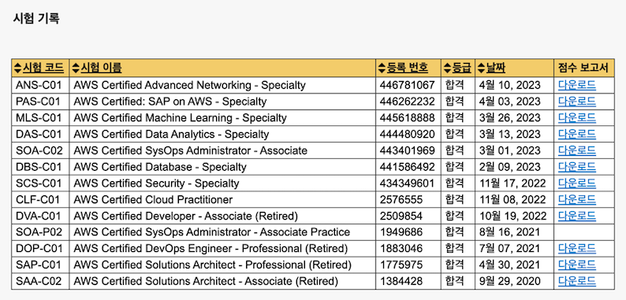
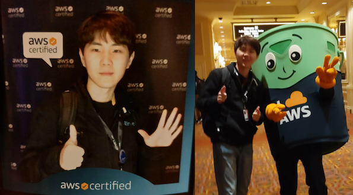
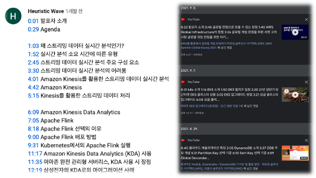

AWS Certification 12종 취득 회고

## Intro

[AWS 자격증 페이지](https://aws.amazon.com/ko/certification/ )에 들어가 보면 총 12개의 자격증이 소개되어 있습니다.
저는 20년 9월 29일 Solutions Architect - Associate 자격증을 시작으로, 23년 4월 10일 Advanced Networking - Specialty 자격증까지 약 3년에 걸쳐 모든 자격증을 취득했습니다.

제가 첫 번째 자격증 SAA를 취득한 20년 9월 무렵, 약 1년 3개월 동안 AWS 자격증을 모두 취득한 김태우 님의 [AWS 공인 자격증 12종에 전부 합격하면 무엇이 달라질까요?](https://dev.classmethod.jp/articles/epilogue-in-korean-aws-12x-certified/)
글을 본 당시까지만 해도 **저와는 상관없는 이야기**인 줄 알았습니다. **태우 님의 합격 후기에는 참 공감 가는 내용이 많으니,** 꼭 읽어보시길 추천드립니다!! 

처음에 저도 후기를 작성하려 했다가 3년이 지난 현시점에서, 태우 님의 합격 후기를 다시보니 정말 비슷하게 느껴지는 게 많아 제가 따로 후기를 적을 필요가 없는 것 같더라고요...
그래서 제가 시험에 응시한 순서대로 회고를 진행하기로 했습니다!

## 회고 📝

*시험 코드는 상단 '시험 기록' 사진의 '시험 이름'을 통해 확인할 수 있습니다.*

### 2020 ~ 2021

- SAA : 첫 시험을 준비하던 당시, 이미 AWS의 VPC, EC2, ELB, S3 등을 활용하여 프로젝트를 진행한 경험이 있었습니다. Udemy에서 판매하는 SAA 강의를 구입해 3개월 정도 수강하고 시험을 봤습니다. 
  초반에는 강의를 통해 기초적인 개념을 잡으면 큰 도움이 됩니다. 저는 유료 강의를 구매했으나, [AWS Technical Essentials](https://explore.skillbuilder.aws/learn/course/external/view/elearning/15366/aws-technical-essentials-na-Korean?trk=8ab981f0-9b77-46d4-8d98-0bf8a9128363&sc_channel=sm )라는 굉장히 좋은 무료 강의가 있으니, 
  이것을 수강하면 모든 시험에 대하여 기초적인 지식을 쌓을 수 있습니다.
- SAP : 지문이 길고 헷갈리는 개념이 많아 굉장히 고생했던 기억이 납니다. 자격증 취득 사이트로 유명한 [EXAMTOPICS](https://www.examtopics.com/ )에서 결제하지 않아도 일부 문제를 확인할 수 있습니다.
  SAP와 관련된 문제를 풀며 관련 공식 문서를 찾아 스스로 해설을 하며 학습했습니다.
- DOP : DOP의 경우 개발 관련 경험과 SAP의 지식이 남아있다 보니, SAP와 비교하여 비교적 수월하게 취득할 수 있었습니다. 개발자분들의 경우, SAP 보다 DOP 취득이 훨씬 쉬울 것 같습니다.

### 왜? 12개의 자격증 취득에 도전했나 🤔

제가 첫 자격증을 취득하고, 다음 해 2개의 Pro 자격증을 취득할 때만 해도 모든 자격증을 다 취득할 생각은 없었습니다.
실제로 제 시험 기록 타임라인을 확인해 보면 20년에 Associate 1개, 21년에 Professional 2개를 취득하고 활동이 없다가 22년 4분기부터 올해 4월까지 9개의 자격증을 몰아서 취득하였습니다.
작년 하반기 무슨 일이 있었길래 12개의 자격증 취득을 시작한 것일까요?

저는 [22년부터 AWS Ambassador로 활동](https://aws.amazon.com/ko/blogs/apn/meet-our-newest-aws-ambassadors-from-2q-2022-and-explore-the-latest-ambassador-activities/ )하며, [Global Ambassador](https://aws.amazon.com/ko/partners/ambassadors/ ) 들과 교류할 기회를 가질 수 있었습니다.
그중 작년 9월 시애틀에서 열린 AWS Ambassador Global Summit 2022의 Lightning Talk 시간에 [우에노 상의 발표](https://tech.nri-net.com/entry/outputs_seattle )에 적지 않은 충격을 받았습니다.
22년 5월 기준으로 [일본에만 11종(22년 집계 당시, SAP on AWS를 제외하고 11종)의 AWS 자격증을 모두 취득한 엔지니어가 무려 340명](https://aws.amazon.com/jp/blogs/psa/2022-apn-all-aws-certifications-engineers/ )이나 된다는 사실을...

AWS 자격증을 다 취득한다는 이유만으로 AWS의 전문가가 되는 것은 아니지만, 궁금했습니다. 일본 사람들은 왜 그렇게 자격증 취득에 열을 올릴까?
'내가 직접 12개를 다 따보면 알 수 있지 않을까?'라는 생각과 '다시는 한국인을 무시하지 마라!(인터넷 밈)'라는 생각이 겹치며, 시애틀에서 돌아오며 모든 자격증을 취득하기로 결심했습니다.
아니, 사실은 AWS Ambassador가 모든 자격증을 취득하면 자격이 주어지는 **Gold Jacket Club**이 부러웠습니다. [👉 관련 링크](https://aws.amazon.com/ko/blogs/apn/congrats-to-our-2022-aws-ambassador-award-winners-and-meet-the-newest-ambassadors/)

### 2022

- DVA : DOP를 수월하게 딴 기억이 있어, 상대적으로 만만해 보이는 Associate 단계에 도전했습니다. 
- CLF : 12종의 자격증 중 가장 기초 과정이라 별다른 공부 없이 바로 도전했습니다. 이 당시 이미 Pro 자격증 2개가 있는 저에게는, 쉬어가기 찬스와 같은 느낌이었습니다.
- SCS : 실습형 시험이 존재하는 SOA를 바로 도전하기는 두려워, Specialty 중에서도 제가 가장 자신 있었던 '보안'에 먼저 도전했습니다.
  과거 보안 기사 필기를 무난하게 합격한 경험(실기는 떨어짐😭)이 있는 저에게는 기존 보안 지식에 AWS 보안 솔루션 지식만 탑재하면 되는지라 그리 어렵지 않았습니다.
  
SCS 이후 저는 AWS re:Invent 2022에 참석하게 됩니다. 행사장에는 'AWS Certification Lounge'라고 AWS 자격증이 하나라도 있다면, 간식과 아래와 같은 사진을 찍을 수 있는 라운지가 있습니다.
당시 6개의 자격증을 보유했으므로, 손가락 6개를 펴고 사진을 찍었습니다.(S3 버킷과도 📸) 다음에 또 찍으러 가면, 12개는 어떤 포즈를 취해야 할까요?

### 2023  

- DBS : 라스베이거스로 가는 비행기 안에서도 공부했는데, 연말에 느슨해져서 그런지 SCS 이후 3개월이 더 걸렸습니다. Database와 관련한 기초 지식 위주의 문제라 Specialty 6종 중에서는 가장 무난한 시험 같습니다.
- SOA : C02로 시험이 개편되고 AWS의 첫 실습형 시험이 두렵게 느껴져, 응시를 매번 미뤘습니다. 이후 업무를 하며, 나름 AWS Systems Manager의 기능을 이것저것 사용해 보았다는 사실에 자신 있게 도전했습니다.
  역시 Associate는 Associate입니다. Pro와 비교하여 간단하게 답이 도출되고, 걱정했던 실습형 시험도 콘솔 환경을 만지작거리다 보면 답을 제출할 수 있습니다.
  13인치 맥북으로 시험을 응시하니, 실습 환경에서 **제출 버튼이 보이지 않아**(**시험 환경 외부** 스크롤 바로 조정) 애를 먹었던 것 외에는 가장 재미있었던 시험이었습니다.
- DAS : 해당 도메인에 대하여 관련 지식이 가장 부족해, 시험을 준비하며 가장 막막했던 시험이었습니다. 또한, 이쯤 되니 퇴근 이후 및 주말에 자격증 공부를 하는 것이 매우 지겨웠습니다.
  DAS의 경우 SOA 취득 이후 2주 뒤에 합격했으나, 실제로는 SOA만 공부하기 너무 지겨워 SOA, DAS, MLS를 돌아가며 공부했습니다.
- MLS : ML 관련 도메인 지식이 없다면 굉장히 어렵습니다. 저는 과거 [혼자 공부하는 머신러닝+딥러닝](http://www.yes24.com/Product/Goods/96024871) & [케라스 창시자에게 배우는 딥러닝](http://www.yes24.com/Product/Goods/65050162)
  두 권의 책으로 ML과 딥러닝에 대하여 학습한 경험이 있습니다. 운 좋게도 저는 ML 엔지니어 동기에게 과외를 받아 해당 시험을 통과할 수 있었습니다.
- PAS : SAP 지식이 필요할 것 같지만 대부분의 문제 출제 포인트가 DR 전략 및 기본적인 고가용성을 보장하기 위한 설계에 관한 문제라 비교적 수월했습니다.
  부족한 Sap on AWS 지식을 채우기 위해서, [SAP 가이드 문서](https://docs.aws.amazon.com/sap/latest/general/welcome.html )와 [AWS Skill Builder에 올라온 SAP 강의](https://explore.skillbuilder.aws/learn/course/external/view/elearning/12164/sap-on-aws-technical )를 수강했습니다.
- ANS : 자격증을 취득하고 다음 자격증을 취득하기까지, 가장 짧은 시간이 소요된 시험입니다. 시험이 쉬워 빠르게 딴 것이 아니라, 11개를 취득하고 나니 빨리 12개를 취득하고 싶은 엄청난 동기 부여가 생겨 출퇴근 지하철, 주말, 퇴근 이후 모든 시간을 투자했습니다. 
  또한, 3년간 AWS 시험공부와 업무를 하다 보니 대부분 알고 있는 네트워크 지식이라 비교적 수월하게 합격할 수 있었습니다.

### 유튜브 주도 학습 📽️

`유튜브 주도 학습`은 **유튜브 중독자**인 제가 자주 사용하는 말입니다. 유튜브에는 AWS가 올려놓은 강의 영상이 무척 많습니다.
AWS가 제작한 영상은 자격증 시험을 준비하는데도 굉장한 도움이 됩니다. 특히 DAS 시험을 준비할 때, [실시간 스트리밍 분석 : Amazon Kinesis Data Analytics Deep Dive - 전소영 & 주혜령, AWS](https://youtu.be/cRIXhMfUEcE) 영상이 엄청난 도움이 되었습니다.

AWS 채널과 달리, AWS Korea 채널의 영상에는 Timestamp가 제공되지 않습니다. 그래서 저는 제가 학습한 일부 영상에 대하여 아래와 같이 타임스탬프를 댓글로 남겨 둡니다.
이렇게 하면, 나중에 기억이 흐릿해질 때 다시 찾아와 빠르게 지식 보충이 가능할뿐더러, 그냥 영상을 주입식으로 시청할 때보다 머릿속에 오래 남아있게 되는 것 같습니다.

 

## Thanks To 💐

12종의 자격증을 취득해나가며, 각 분야에서 도움을 준 고마운 분들이 많습니다. 고맙습니다 🙏

12종 도전을 시작하도록 열정과 응원을 준, 일본의 Ambassador [Ueno](https://aws.amazon.com/jp/partners/ambassadors/?cards-body.sort-by=item.additionalFields.ambassadorName&cards-body.sort-order=asc&awsf.apn-ambassadors-location=*all&cards-body.q=Ueno&cards-body.q_operator=AND), [Kumagai](https://aws.amazon.com/jp/partners/ambassadors/?cards-body.sort-by=item.additionalFields.ambassadorName&cards-body.sort-order=asc&awsf.apn-ambassadors-location=*all&cards-body.q=Kumagai&cards-body.q_operator=AND)  
지루한 여정 동안, 퇴근 이후까지 남으며 스터디메이트가 되어준 [nuatmochoi](https://medium.com/@nuatmochoi), [길팡](https://blog.naver.com/jogilsang), MLS 과외해준 [ksh](https://user-bin-ksh.medium.com/), 내 AWS 학습에 빠질 수 없는 [조력자 SSH](https://viassh.github.io/) 

 

---

 