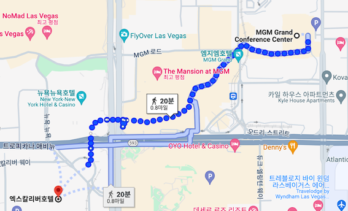
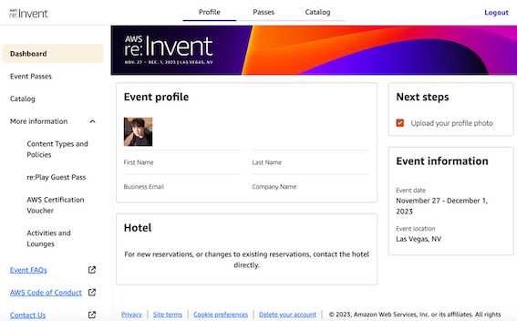
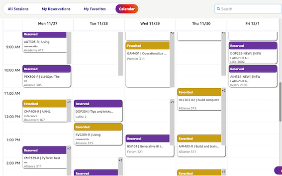
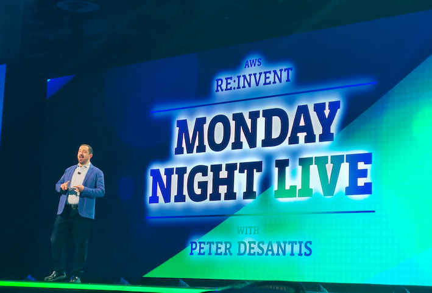

re:Invent 2번이나 가도 괜찮을까?

*후기와 신규 서비스 큐레이션까지 아무런 통일감 없는 대 환장 파티

## 왜 또 갔을까?

저는 현재 AWS를 업으로 4년째 일하고 있습니다. 애정을 갖고 일하다 보니, AWS에서 Ambassador도 시켜주고 re:Invent Conference pass도 받게 되었습니다.
(Ambassador 이야기는 나중에 다른 이야기로 또 풀어보겠습니다.) 아무튼 작년 저는 세계 최대 IT 콘퍼런스에 참석해 보고 싶은 마음에, 가장 저렴한? 숙박과 호텔을 예약했습니다.

22년 re:Invent를 즐기고 나서 든 생각은, 노하우가 부족해 제대로 즐기지 못했다는 생각에 '한 번 더 가보고 싶다'라는 생각이었습니다.
그래서 올해에는, 4달 전부터 준비하고 2번째 리인벤트를 맞이했습니다.

 

## 준비 단계

각 단계별 토글스위치를 적용해 두었습니다. 궁금하신 부분만 골라 보세요! (사실, 이런 내용은 다른 블로그에 더 잘 정리되어 있어요 🤣)

✈️ 항공, 숙박 예약

가장 먼저 리인벤트를 가기 위해, 항공과 숙박을 예약하는 용기가 필요합니다.
대략, 4개월 전(7월 말 ~ 8월 초)에 항공을 예약하면 왕복 티켓을 약 125~190(경유)만 원 정도에 구입할 수 있습니다.
저는 22년에는 항공비로 155만 원(ICN-LAX-LAS), 23년에는 188만 원(ICN-YVR-LAS)이 들었습니다.

숙박의 경우, 콘퍼런스의 셔틀이 닿지 않는 호텔을 예약하면 리조트 사용료와 각종 추가 비용을 포함해 약 60만 원(5박) 이내로 예약할 수 있습니다.
저는 실제로 22년 당시 Excalibur Hotel에서 투숙을 했는데, 가장 가까운 세션장이 도보 20분 거리에 위치했습니다. (내가 하루에 약 40분을 더 걸을 수 있다면, 이곳이 아마 가장 저렴한 선택지인 것 같습니다.)

🎫 Pass 구매

아마, 제일 먼저 혹은 제일 나중에 구입하게 될 패스입니다. 패스를 구입하면 아래와 같이 portal에 접근이 가능한데요,
portal에서 hotel을 예약할 수도 있는데 애초에 미리 숙박을 준비한다면 그렇게 저렴하지는 않습니다.

📆 세션 예약

이벤트 1달 전부터, 내가 들을 세션을 예약하고 다음과 같이 시간표를 확인할 수 있습니다. 저는 수강 신청이 열리기 전부터 미리 담아두고 수강 신청이 열리는 시점 예약 버튼을 눌렀는데도,
원하는 강의를 다 담지 못했어요. 금요일 세션의 경우, 상대적으로 적지만 화 or 수 키노트 발표 이후 신규 세션들이 열리니 키노트 이후 바로 예약하는 게 좋을 것 같습니다.

 

## 2023 re:Invent

리인벤트의 키노트 세션은 콘퍼런스의 주된 주제를 한 번에 파악할 수 있어, 필수적으로 들어야 하는데요. 뜨거운 현장감을 느낄 수도있어 키노트를 들어야 비로소 리인벤트가 실감 납니다.
월요일 밤(1일차) 키노트에서, 과거부터 현재를 아우르는 AWS Serverless의 변천사와 AWS의 미래의 한 부분이 될 양자 컴퓨팅 끝으로 1일차 다운 시작을 열었습니다. 

올해 리인벤트는 re:GenerativeAI가 될 것이라는 우스갯소리 그대로 키노트부터 대부분의 세션들이 Gen AI와 관련된 세션이었습니다.
실제로 2일차부터는 신규 서비스 Amazon Q와 Amazon Bedrock의 신규 기능들과,
이어진 3일차에서는 Gen AI Stack을 완성하기 위한 다양한 Vector DB 들과 신규 FM(Foundation Models)들을 소개했습니다.

2일차에서는 Gen AI를 활용하게 될 일반 사용자들에게 친숙한 서비스를 발표했다면,
3일차에서는 실제 Gen AI 서비스를 구축할 엔지니어들을 위한 조금 더 딥한 모델과 관련 생태계 서비스들을 소개했습니다.
4일차 목요일 마지막 키노트에서는 AWS의 CTO(최고 연예인?) Dr.Vogels의 개발자와 운영자들을 위한 신규 서비스 소개까지 4일간의 키노트 구성이 무척이나 탄탄하다고 느꼈습니다.

### 내가 골라본 신규 업데이트

리인벤트 기간 동안 새로 소개되는 서비스들을 [What's New with AWS?](https://aws.amazon.com/new/ )에도 공개됩니다.
키노트와 각종 세션에서 듣지 못한 정보들도 이곳을 살펴보면 신규 서비스들을 놓치지 않고 찾을 수 있는데요, 제가 주목한 서비스 몇 가지들을 적어보았습니다.

아래 큐레이션 리스트는 **지극히 제 개인적인 관점에서 골라본 신규 서비스이므로, '제 관심사가 이렇구나'라고만 이해**해 주세요. 🥲
각 서비스별 상세한 후기는, 추후 하나씩 다뤄 볼 예정인데 공부할게 너무 많네요...

> *Product Detail Page, What's New Blog Post, AWS News Blog 중 하나를 관련 링크로 개재했습니다.*

🤖 Gen AI, Machine Learning

이번 이벤트의 메인 중 하나였던, Amazon Q와 아직은 미리 보기 단계지만 Q와 함께 새로운 가치를 만들 각종 솔루션,
Bedrock을 더 편리하게 사용할 수 있는 관리형 서비스들과, Amazon의 신규 FM, ML 프로젝트들을 위한 신규 서비스들이 제 눈길을 끌었습니다.

- [Amazon Q (Preview)](https://aws.amazon.com/ko/q/)
- [Amazon Q is your business expert (Preview)](https://aws.amazon.com/ko/blogs/aws/introducing-amazon-q-a-new-generative-ai-powered-assistant-preview/)
- [Amazon Q is your AWS expert (Preview)](https://aws.amazon.com/ko/blogs/aws/amazon-q-brings-generative-ai-powered-assistance-to-it-pros-and-developers-preview/)
- [Amazon Q Code Transformation (Preview)](https://aws.amazon.com/ko/blogs/aws/upgrade-your-java-applications-with-amazon-q-code-transformation-preview/)
- [Knowledge Bases for Amazon Bedrock](https://aws.amazon.com/ko/bedrock/knowledge-bases/)
- [Agents for Amazon Bedrock](https://aws.amazon.com/ko/bedrock/agents/)
- [Amazon Titan](https://aws.amazon.com/ko/blogs/aws/amazon-titan-image-generator-multimodal-embeddings-and-text-models-are-now-available-in-amazon-bedrock/)
- [Amazon SageMaker HyperPod](https://aws.amazon.com/ko/sagemaker/hyperpod/)
- [AWS Clean Rooms ML (Preview)](https://aws.amazon.com/ko/clean-rooms/ml/)

💻 Compute, Storage

1년 만에 Graviton 4가 출시하고, 오랜만에 EFS와 S3에 가격에 영향을 미치는 서비스가 발표했습니다. 

- [Amazon EC2 R8g instances (preview)](https://aws.amazon.com/ko/ec2/instance-types/r8g/)
- [Amazon EFS Archive storage class](https://aws.amazon.com/ko/about-aws/whats-new/2023/11/amazon-efs-archive-storage-class/)
- [Amazon S3 Express One Zone](https://aws.amazon.com/ko/blogs/aws/new-amazon-s3-express-one-zone-high-performance-storage-class/)

📊 Databases, Analytics

캐시 서비스에도 이어지는 서버리스 솔루션과, 단순 용량 스케일링을 넘어선 Aurora의 발전과 신규 DB, 작년보다 더 확장된 zero-ETL 솔루션과
AI와 함께 발전한 최적화 및 이상 탐지 솔루션을 주목해서 보았습니다.

- [Amazon ElastiCache Serverless](https://aws.amazon.com/ko/blogs/aws/amazon-elasticache-serverless-for-redis-and-memcached-now-generally-available/)
- [Amazon Aurora Limitless Database (Limited preview)](https://aws.amazon.com/ko/about-aws/whats-new/2023/11/amazon-aurora-limitless-database/)
- [Amazon Neptune Analytics](https://aws.amazon.com/ko/about-aws/whats-new/2023/11/amazon-neptune-analytics/)
- [Amazon RDS for Db2](https://aws.amazon.com/ko/rds/db2/)
- [Amazon RDS for MySQL zero-ETL integration with Amazon Redshift (Preview)](https://aws.amazon.com/ko/about-aws/whats-new/2023/11/amazon-rds-mysql-zero-etl-integration-amazon-redshift-public-preview/)
- [Amazon Aurora PostgreSQL zero-ETL integration with Amazon Redshift (Preview)](https://aws.amazon.com/ko/rds/aurora/zero-etl/)
- [Amazon Redshift Serverless with AI-driven scaling and optimizations (Preview)](https://aws.amazon.com/ko/about-aws/whats-new/2023/11/amazon-redshift-serverless-ai-driven-scaling-optimizations-preview/)
- [AWS Glue Data Quality announces anomaly detection and dynamic rules (Preview)](https://aws.amazon.com/ko/blogs/aws/use-anomaly-detection-with-aws-glue-to-improve-data-quality-preview/)

🔩 Developer Tools

제 업무 생산성을 얼마나 높여줄지 기대하며 관심 깊게 본 신규 업데이트입니다. 저는 아래 기능들을 보자마자, 한국에 돌아가 사용해 볼 생각에 설렘을 느꼈답니다.

- [Integrated Development Environment (IDE) extension for AWS Application Composer](https://aws.amazon.com/ko/blogs/aws/ide-extension-for-aws-application-composer-enhances-visual-modern-applications-development-with-ai-generated-iac/)
- [AWS SDK for Rust](https://aws.amazon.com/ko/sdk-for-rust/)
- [Amazon SageMaker Studio Code Editor](https://aws.amazon.com/ko/blogs/aws/amazon-sagemaker-studio-adds-web-based-interface-code-editor-flexible-workspaces-and-streamlines-user-onboarding/)
- [Amazon CodeWhisperer for command line](https://aws.amazon.com/ko/blogs/devops/introducing-amazon-codewhisperer-for-command-line/)
- [Amazon Q in Amazon CodeCatalyst (preview)](https://aws.amazon.com/ko/blogs/aws/improve-developer-productivity-with-generative-ai-powered-amazon-q-in-amazon-codecatalyst-preview/)

☁️ Cloud Operations

사실 이 부분은 더 많은 신규 기능들이 소개되었지만, 당장 적용할 수 있다는 측면에서 몇 가지를 선택해 보았습니다.

- [Amazon CloudWatch Logs - Infrequent Access log class](https://aws.amazon.com/ko/blogs/korea/new-amazon-cloudwatch-log-class-for-infrequent-access-logs-at-a-reduced-price/)
- [Amazon CloudWatch Logs Anomaly Detection and Pattern analysis](https://aws.amazon.com/ko/blogs/korea/amazon-cloudwatch-logs-now-offers-automated-pattern-analytics-and-anomaly-detection/)
- [IAM Access Analyzer simplifies inspection of unused access](https://aws.amazon.com/ko/blogs/security/iam-access-analyzer-simplifies-inspection-of-unused-access-in-your-organization/)

 

## 그럼 3번째 참석은?

이번 리인벤트는 제가 실제로 참가한 4번째 해외 콘퍼런스인데요, 과거보다 이해되는 정보의 양이 더 많은 것이 체감될 때 약간의 성장을 느낍니다.
또, 아는 만큼 행사가 더 재미있게 느껴지는 것 같기도 합니다. 실제로 저는 올 한 해 동안 대부분 Gen AI와 관련된 업무와 학습을 하니, 이번 리인벤트가 작년보다 더 재미있는 것 같더라고요. 

그래서 내년에도 참석할 예정이냐고요?

작년과 달리 노하우가 생겨 강의 동선을 최적화했음에도(*작년에는 매일 3만 보 이상을, 올해는 2만 보 이내로 동선을 최적화 했습니다.*),
올해는 신체적으로 너무 피로함을 느껴 내년에도 참석할지 장담할 수가 없네요 🤣🤣🤣
이번에도 참석하지 못한, 5km 마라톤과 JAM 등 재미에 초점을 맞춘 이벤트를 경험하러 갈 수도...
이번 후기글에서 더 많은 내용들을 담지 못해 아쉽지만, 기회가 된다면 AWS Community Builder Mixer'와 'AWS Ambassador networking meetup' 이야기를 따로 풀도록 하겠습니다.

 

---
