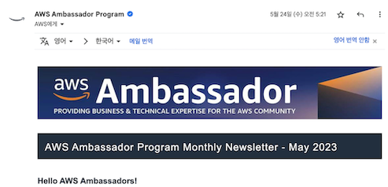
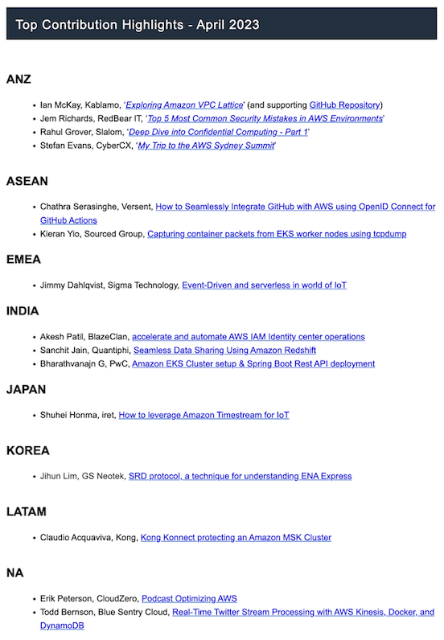

글또 8기 11회차 제출을 앞두고, 패스권을 모두 소진해 회고 글을 쓰며 드는 생각

## 글또 8기를 마무리해가며... 🏃🏻

지금 작성하고 있는 이 글을 포함하여, 총 2회 제출만이 남았습니다. 본래 회고 글은 맨 마지막 제출에 작성하려 했으나, 마감 9시간을 남기고 이미 패스권은 다 소진해 계획을 수정했습니다.
8기는 제가 참여자이자 운영진으로도 참여했는데, 이번 회고 시간을 통해 만족할 만한 활동을 했는지 되짚어 보겠습니다.

## ✍️ 글또 8기 회고

지금까지 2번의 패스권 사용과 8번의 제출이 있었습니다. 제가 블로그 [ALL Posts](https://heuristicwave.github.io/archive )로 들어가면 23년에 작성한 모든 글을 볼 수 있습니다.
올해 작성한 8건의 글 모두 글또 덕분에 작성할 수 있었던 글이네요 :)
이번 8기 활동에서는 별도의 다짐 글을 작성하지 않았는데, 대신 22년 10월 2일에 작성한 [글또 7기 후기글](https://heuristicwave.github.io/geultto2 )에 작성한 아쉬운 점을 8기에서는 해소했는지 확인해 보겠습니다.

> **자발적 번아웃 🔥**  
> 자발적 번아웃이 올 정도로 열심히 글을 작성한다 했는데, 결국 오지 않은 것 같습니다.
> *"너무 힘들어서 8기는 쉬어야겠다."* 싶을 정도의 감정을 느끼도록 열심히 활동하고 싶습니다.

7기에서도 글을 대충 작성하지는 않았지만, 8기에서는 운영진 활동을 함께하고 있어서 그런지...
11회차를 진행하고 있는 지금, '9기는 힘들어서 쉬어야겠다.'란 생각이 드는것 보니 만족할 만한 8기 활동을 한 것 같습니다.
그렇다고 제가 정말 9기는 쉬게 될까요? 그건 글 마지막 무렵에서 다시 이야기하겠습니다.

### 🫵 큐레이션

매 기수마다 글또의 규모가 커지며, 운영진의 규모도 커지게 되었습니다. 그에 따라 이번 8기에서는 글또 참여자들이 제출하는 글들에 대하여,
**더 많은 사람들과 함께 공유하고 싶은 글**들을 글또 8기가 활동하고 있는 큐레이션 채널을 통해 회차(2주)마다 약 십여 개의 글을 선정해 제공했습니다.

글또 8기에서는 매 회차마다 패스와 미제출을 제외하고 약 200 ~ 300개 이상의 글들이 제출되었습니다.
저와 함께 큐레이션 활동을 하고 있는 4명의 운영진분들과 함께 분량을 나눠 제출된 글을 살펴보고 있지만, 저는 제출된 모든 글들을 읽어보고 있습니다.
그럼에도 불구하고 8기 참여자분들이 글이 큐레이션으로 선택되지 않았다면, **보석 💎을 알아보지 못한 제 불찰**입니다.

큐레이션을 위해 운영진분들과 함께 고민하여 만든 나름의 기준들과 bit.ly로 수집한 Retention 정보들을 활용해 **매 회차마다 신중함을 기울이고 있지만, 아직 부족한 점이 많습니다.**
부족한 점이 많기에, 8기 여러분들이 정성껏 작성해 주신 글들이 혹시라도 주목받지 못할까 봐 나름의 개인 시간을 많이 투자했습니다.

예를 들어 저는 주로 백엔드 및 인프라와 관련한 기술 도메인을 쌓아왔지만, AI 채널에서 작성해 주신 글들을 이해하기 위해 제출된 글들에서 자주 언급되는 기술 및 키워드들을 추가로 학습하는 시간을 가졌습니다.
이러한 이유로 작년보다 기술서적을 더 적게 읽은 것 같지만, 제 IT 지식들은 책을 읽었을 때보다 더 많이 쌓인 것 같습니다.

여담으로 큐레이션 활동 덕분에, 제 개인적인 성장으로도 굉장한 도움이 되었습니다. 저는 현재 SA라는 직무로 일하며, IT 컨설팅을 주 업무로 수행하고 있습니다.
제 직무 특성상, 다양한 산업 및 직군의 IT 종사자들을 많이 만나게 됩니다. 큐레이션 과정에서 백/프론트엔드, AI/ML/Data, 클라이언트 등 다양한 채널에 올라온 글들을 통해 시야를 넓히니,
개인적으로 작년보다 올해 만난 고객분들에게 더 높은 퀄리티의 컨설팅을 제공할 수 있게 된 것 같습니다.

큐레이션을 진행하다 보면, **혹시라도 제가 찾지 못한 💎 같은 글을 작성해 주신 분들에게 생긴 죄송스러운 마음이 마음 한구석에 항상 남아**있습니다.
혹시라도 큐레이션 채널을 통해 올라온 글들에 대하여 아쉬움이 남으신 분들이 있으시다면, 이해해달라는 애교스러운 반성문으로 봐주셨으면 좋겠습니다.

> 운영진 모임에서는 과정을 공유했지만, 큐레이션 과정이 궁금하신 분들이 있을 것 같습니다. 🧐 
> 9기에도 큐레이션을 할지는 모르겠지만, 기회가 된다면 조금 더 과정을 보완하고 시행착오를 고민해 글또 채널을 통해 큐레이션 과정을 공유하도록 하겠습니다.

### ✌️ 셀프 큐레이션

글또 활동을 하며 한 땀 한 땀 열심히 글을 작성했지만, 그간 진행한 10번의 큐레이션 과정에서 단 한 번도 제 글을 큐레이션 대상으로 올리지 않았습니다.
이번 후기글을 통해 셀프 큐레이션을 해보도록 하겠습니다! 제가 올해 작성한 글 중 하나를 꼽기에는 쉽지 않아, 그나마 외부의 시선으로 바라본 글 몇 개를 자랑해 보겠습니다. 하하하~

저는 [22년부터 AWS Ambassador로 활동](https://aws.amazon.com/ko/blogs/apn/meet-our-newest-aws-ambassadors-from-2q-2022-and-explore-the-latest-ambassador-activities/ )하며,
아래와 같은 형식으로 매달 Ambassador Community에 발행되는 Newsletter를 받아보고 있습니다.

그중, 매달 Ambassador들의 활동을 Highlight 하는 코너에서 다음과 같이 일종의 큐레이션? 과같이 '샤라웃(Shout out)'을 해주고 있습니다.

저는 감사하게도 23년 4, 5, 6월 뉴스레터에 모두 제 글이 소개되었는데요, 대상은 다음과 같습니다.

- [How to upgrade your Amazon EKS Multi Cluster using OSS External DNS](https://heuristicwave.github.io/EKS_Upgrade)
- [SRD protocol, a technique for understanding ENA Express](https://heuristicwave.github.io/SRD)
- [Helm Chart Repository in AWS](https://heuristicwave.github.io/Chart)

당시 제 글이 소개되어 굉장히 기분이 좋았는데, 글또에서 큐레이션 대상 글로 꼽힌 분들도 이런 마음이셨을까요?  
**8기 큐레이션 채널에서 관심과 응원의 말씀을 전해주신 모든 분들과 저와 함께 큐레이션을 진행하는 [나영](https://kidneybeans2.tistory.com/), [원종](https://devowen.com/), [현구](https://hyeon9mak.github.io/ )님에게도 감사**를 전하며 글을 마치겠습니다. 🙏

### 🤷‍♂️ 정말 9기를 쉴까?

글 초반부에서 '9기는 힘들어서 쉬어야겠다.'란 생각이 든다고 말했지만, 회고를 하고 나니 뿌듯한 마음에 9기도 지원하게 될 것 같습니다.
또 글또를 참여자로 참가하는 것도 즐겁지만, **운영진으로 활동하는 것도 무척이나 행복**하거든요~ 🧚
매 회차마다 글 작성과 운영진 활동을 병행하는 게 쉽지 않지만, **열정적인 분들과 함께 할 수 있다는 이유**만으로 충분한 것 같습니다. 궁금하시면 운영진으로 지원해 보세요?

---
