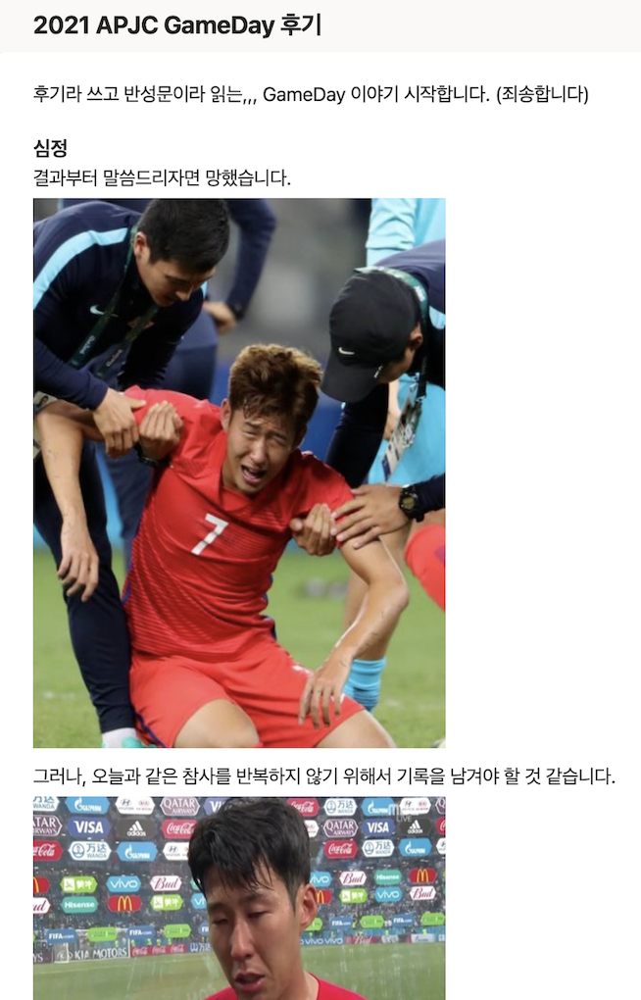
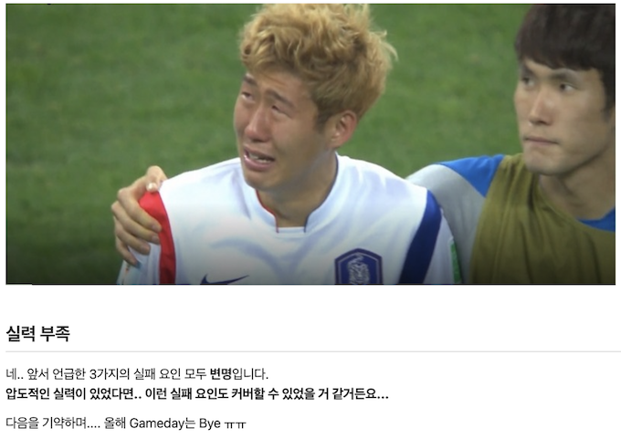
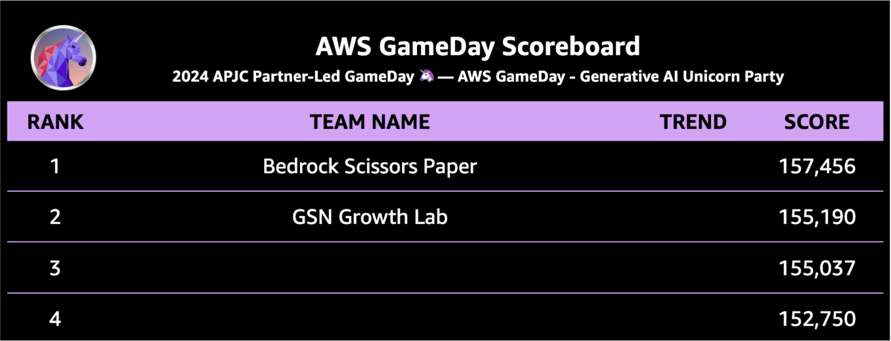
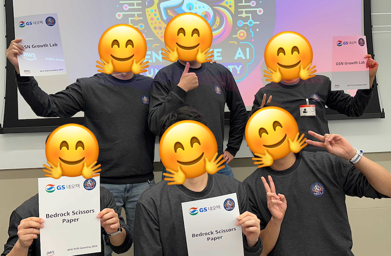
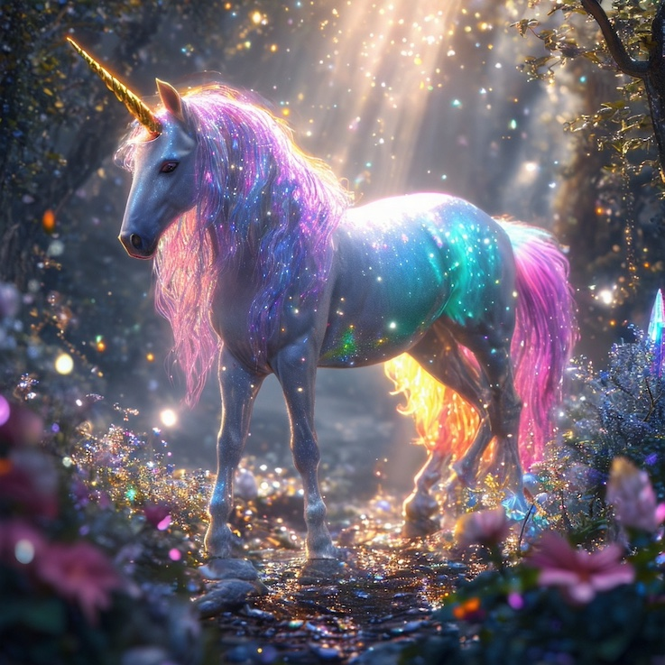

4년 간의 기다림, AWS APJC PLES GameDay 우승 후기

# AWS GameDay 🦄

[GameDay](https://aws.amazon.com/ko/gameday/)는 AWS가 제공하는 실습 중심의 팀 기반 학습 이벤트입니다. 참가자들은 가상의 시나리오 속에서 실제 AWS 환경을 직접 다루며 문제를 해결하게 됩니다.
보안 분야에 익숙한 분들에게는 CTF(Capture The Flag)와 유사한 형태로, 주어진 미션을 해결하며 점수를 획득하는 방식으로 진행됩니다.
팀원들과 협력하여 클라우드 인프라 구축, 장애 대응, 보안 문제 해결 등 실제 상황과 유사한 다양한 과제를 수행하면서 AWS 서비스에 대한 실전 경험을 쌓을 수 있습니다.

일반적인 GameDay는 누구나 참여할 수 있는 공개 행사로 진행되며, PLES GameDay는 AWS 파트너사 직원들을 대상으로 특별히 진행되는 대회입니다.
AWS는 파트너사를 대상으로 매년 정기적으로 GameDay를 개최하는데, 그 중 아시아 태평양 지역(APJC) 파트너사들이 참여하는 대규모 GameDay는 연 1회 진행됩니다.

 

## APJC PLES GameDay 지난 기록들

사실 저는 2020년에 입사한 후, 2021년부터 매년 대회에 출전해왔어요.
처음 참가했던 대회에는 22개 팀이 참여했는데, 저희 팀은 순위권과는 거리가 멀었습니다.
그때 느낀 좌절감을 사내 Wiki에 회고글로 남기기도 했어요.

2022년 대회는 Security를 주제로 6개 리전에서 23개 팀이 참가했습니다. 작년보다 진화된 실력?으로 동기와 후배님들과 함께 팀을 이뤄 도전했지만...

네.. 또 다음을 기약했습니다.

> _흥민이 형 죄송합니다. 흥민이 형의 아쉬움과 비교할 수는 없겠지만, 당시 너무 마음이 아팠어요._

비록 제가 속한 팀은 아니었지만, 동료들이 한국 리전에서 1등을 차지해서 정말 기뻤습니다. (저는 12등 😭)  
하지만 한국 1등이 APJC에서는 7등에 그쳤다는 점에서, 아직 세계와의 벽은... 여전히...

2023년 대회는 Sustainability를 주제로 진행되었으며, 한국을 비롯해 일본, 인도, 호주, 뉴질랜드, 싱가포르, 대만에서 총 39개 팀, 약 140여 명이 참가했습니다.

여러 번의 도전 경험 덕분인지, 2023년 대회에서는 크게 긴장되지 않더라고요. 아마, 이때부터는 문제별 순위가 제공되었던 것으로 기억해요.
비록 전체 순위권에는 들지 못했지만, 제가 맡은 문제 중 하나가 전체 1등을 차지했다는 점이 작은 위안이 되었답니다. 😌

 

## 2024 GenAI GameDay

2024년 11월 14일, 올해의 최대 화두인 GenAI를 주제로 한 대회가 개최되었고, 약 50여 개 팀이 참가했습니다.

사실 올해 대회는 지난 4번의 GameDay에서 좋은 성적을 거두지 못했기에 참가를 망설였습니다. 하지만 이번 주제가 GenAI였고, 회사의 적극적인 참가 독려도 있어 참가를 결정하게 되었습니다.

4년간 AWS를 다루며 쌓은 경험도 있고, 최근에는 Amazon Bedrock 관련 서적을 준비하고 있어서 이번에는 꼭 좋은 결과를 내고 싶었습니다. 🙏

그래서 대회 전날에는 야근을 하면서까지 사전 공지된 출제 범위에 대해 미리 예습을 하고 갔답니다.

### 방심은 금물 🚫

저는 과거 2022년 대회에서 중간에 1등을 하다가 사소한 실수로 순위권 밖으로 밀려난 쓰라린 경험이 있습니다.
과거 교훈을 통해, 이번 대회도 겸손한 마음으로 임해야지 하고, 침착하고 여러 번의 검토 과정을 거치며 문제를 풀었습니다.
저희 팀원 모두 압도적인 문제 해결로 대회 중반 즈음에 1위를 달성했습니다.

따라잡기 힘든 점수 차이를 만들었다고 생각하고 잠시 휴식을 취하던 중, 순위가 2위로 떨어졌습니다.

순간 과거의 악몽이 떠올라 식겁했죠. 알고 보니 보너스 점수가 부여되는 설문조사에 참여하지 않아 순위가 역전된 것이었습니다. 다행히 빠르게 설문에 참여해 다시 1등 자리를 되찾을 수 있었습니다.

전리품?으로 가지고 있는 당시 최종 스코어보드 입니다. 설문 조사 점수가 5,000점인데, 만약 설문에 참여하지 않았다면 순위권 밖인 4위로 밀려났을 것을 생각하면 아찔합니다.

'끝날 때까지 끝난 게 아니다'라는 교훈을 다시 한번 되새기며 대회를 마무리했습니다.

### 우승 != 전문가 🧑🏻‍💻

저는 4년간의 기다림 끝에 마침내 우승을 할 수 있었어요.
앞선 3번의 실패 경험을 통해, 실력은 둘째치고 운도 따라야 한다는 것을 너무나 잘 알고 있어요.

또 아시아를 넘어 EMEA, LATAM, NAMER 등 다른 리전에 엄청난 실력자들이 있다는 것도 잘 알고 있습니다.
이번 성과가 기존의 노력들을 위로하는 작은 선물이라 생각하고, 내실을 다져가는데 노력하겠습니다.

 

## 감사 인사

마지막으로, 이번 대회에서 함께 우승을 일궈낸 'Bedrock Scissors Paper([🏃🏻 usr/bin/ksh](https://user-bin-ksh.medium.com/), [🏃‍♂️ nuatmochoi](https://medium.com/@nuatmochoi))' 팀의 사랑하는 동기들에게 감사의 마음을 전합니다.

또한, 끝까지 포기하지 않고 꾸준히 도전하여 2등이라는 놀라운 성과를 이룬 'GSN Growth Lab' 팀의 동료들에게도 축하와 감사의 인사를 전합니다!

현재 트로피가 미국에서 배송 중이라고 하는데, 하루빨리 받아보고 싶네요!
이틀 후에는 인터뷰도 예정되어 있습니다. 기사가 나오면 이 글 하단에 참고 자료로 추가하도록 하겠습니다.

🦄 행운을 가져다주는 유니콘과 함께, 소중한 시간을 내어 읽어주셔서 감사합니다! 😃

---


