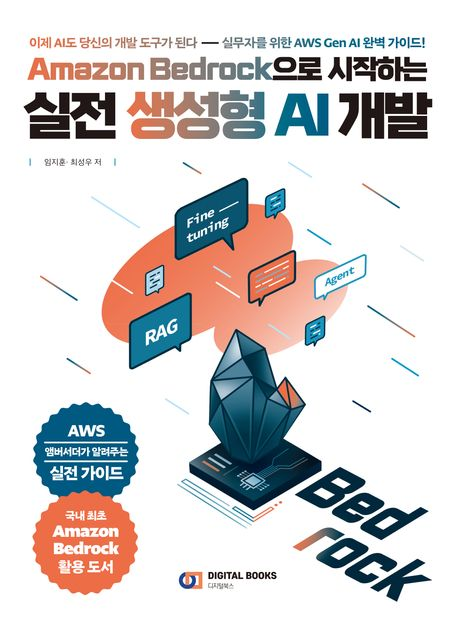
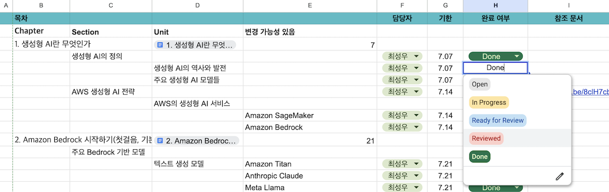
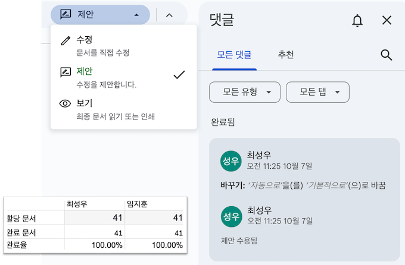
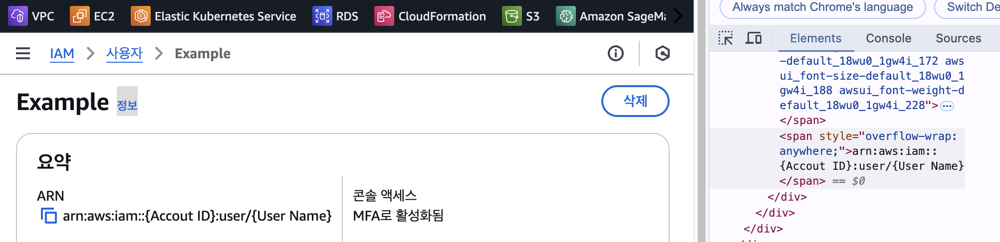
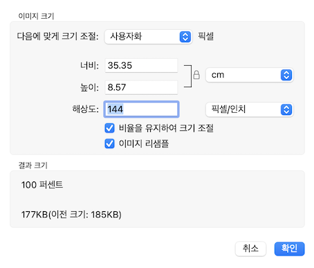

출판 후기 - 첫 책을 출간하면서 놓쳤던 것들

## <a href="#book">📖 Amazon Bedrock으로 시작하는 실전 생성형 AI 개발</a>

얼마 전, 제 🧑🏻‍🏫멘토이자 🗽뮤즈인 동기 [성우](https://medium.com/@nuatmochoi/)와 함께 2024년 하반기 동안 준비했던 첫 책을 출간했습니다.

> 판매 링크 : [📘 예스24](https://www.yes24.com/Product/Goods/140049541), [📗 교보문고](https://product.kyobobook.co.kr/detail/S000214962344), [📕 알라딘](https://www.aladin.co.kr/shop/wproduct.aspx?ItemId=353662061&start=slayer)

출판사 측에서 집필 과정동안 가이드라인과 점검 사항을 제공해주었지만, 그럼에도 여러 시행착오를 겪었습니다.

이번 포스팅에서는 앞으로 책을 쓰고자 하는 분들과, 추후 다시 한 번 글을 쓰게 될 미래의 제가 참고할 만한 내용들을 정리해보고자 합니다.

 

## <a href="#collabo">👫 협업 과정</a>

공동 작업의 효율을 높이기 위해 Google Docs와 Sheets를 적극 활용했습니다. Chapter-Section-Unit 구조로 콘텐츠를 체계화하고, 관련 문서들을 링크로 연결한 집필 대시보드를 구축했습니다.

스프레드시트에 담당자와 마감일을 지정하고, 드롭다운 기능을 활용해 진행 상태를 관리했습니다. 새로운 주제가 추가되면 'Open', 작성 중일 때는 'In Progress', 초안이 완성되면 'Ready for Review', 모든 검토와 수정이 끝나면 'Done' 상태로 표시했습니다.

'Ready for Review' 상태의 글은 다른 저자가 교차 검증을 진행했으며, Google Docs의 '제안' 기능을 통해 의견을 교환했습니다. 여러 차례의 피드백과 수정 과정을 거쳐 'Done' 상태가 되면 전체 진행률이 올라갔는데, 마치 게임을 하듯 진행률을 높이려 노력하다 보니 글쓰기에 소소한 재미도 더해졌습니다.

 

## <a href="#tips">🌟 유용한 팁</a>

### 개인정보 가리기

AWS 실습 화면을 캡처할 때 계정 정보나 리소스 정보 등 민감한 정보를 가려야 하는 경우가 많습니다. 이런 정보를 처리하는 방법으로는 블러 처리나 다른 이미지로 덮어씌우는 방법이 있지만, 개발자 도구를 활용한 HTML 수정 방법을 특히 추천드립니다.

ARN의 계정 정보나 User Name과 같은 값들을 HTML 태그에서 직접 수정하면 원래 UI와 동일한 모습을 유지할 수 있어 이질감이 없고, 원하는 변수명이나 리소스명으로 자유롭게 변경할 수 있습니다. 또한 텍스트가 선명하게 유지되어 가독성이 좋으며, 추후 수정이 필요할 때도 동일한 방식으로 쉽게 대응할 수 있어 더 나은 참고 자료를 만드는데 도움이 됩니다.

### 해상도 관련 팁

책의 1차 편집본을 검토하면서 동일한 방법(맥북 기본 캡처)으로 화면을 캡처했음에도 일부 이미지의 해상도가 달라 식별이 어려운 문제를 발견했습니다. 원인을 파악해보니 캡처를 진행한 모니터의 해상도에 따라 결과물이 다르게 나온다는 것을 알게 되었습니다.

맥북이나 4K 이상의 고해상도 모니터에서 캡처할 경우 기본 해상도가 144로 설정되어 선명한 화질을 유지하지만, 다른 모니터에서는 72 해상도로 캡처되어 화질이 떨어지는 현상이 발생했습니다. 따라서 책이나 문서 작성 시 스크린샷 캡처가 필요하다면, 반드시 동일한 고해상도 환경에서 일관성 있게 작업하는 것이 중요합니다.

### 퇴고 시간을 확보하자!

저자 검토에, 교차 검토, 출판사 검토까지 했는데도 퇴고 시간을 확보해야 한다고요?

네, 그렇습니다. 3번의 검토 과정을 거쳤음에도 원고의 완성도를 높이기 위한 퇴고 작업은 매우 중요했습니다. 검토 당시에는 발견하지 못했던 문제점들이 시간이 지나면서 드러났고, 더 나은 설명 방식과 전개 방법이 떠올라 계속해서 수정 작업이 이어졌습니다.

돌이켜보니 초안 작성만큼이나 퇴고에도 상당한 시간이 필요했는데, 이를 처음부터 충분히 고려하지 못해 출판 마무리 단계에서 많은 어려움을 겪었습니다. 이러한 경험을 통해 다음 출판을 계획할 때는 초안 작성 시간과 동일한 수준으로 퇴고 시간을 확보해야 한다는 것을 깨달았습니다.

 

## <a href="#mistakes">😱 실수들</a>

### 그림, 표, 코드 등 넘버링

책에 실습 과정을 담으면서 많은 그림, 표, 코드 등이 포함되었습니다. 이들을 구분하기 위해 `챕터명-번호` 형식(예: `4-26`)으로 넘버링했습니다. 그러나 이 방식으로는 내용을 중간에 삭제하거나 번호를 추가하는 등의 수정 작업이 번거로웠습니다.

더 나은 방식으로는 `챕터명-섹션명-번호` 형식(예: `4-2-3`)을 사용하는 것이 좋았을 것 같습니다. 이렇게 하면 섹션 단위로 독립적인 넘버링이 가능하고, 콘텐츠의 위치를 더 정확히 파악할 수 있으며, 내용 수정이나 추가 시에도 해당 섹션만 관리하면 됩니다. 이렇게 하면 독립적인 넘버링이 가능해 수정이 유리할뿐더러, 콘텐츠의 위치를 더 정확히 파악할 수 있습니다.

### 익숙함에 속아 실수들을 놓치지 말자

최종 인쇄에 들어가기 전까지는 수십 번의 검토 과정을 거치게 됩니다. 그러나 아무리 꼼꼼하게 확인하더라도, 반복적인 검토 과정을 통해 내용이 익숙해지면서 실수를 발견하기가 더욱 어려워집니다. 글이 익숙해질수록 우리의 뇌는 오타나 문법적 오류를 자동으로 보정하여 읽기 때문입니다. 익숙함이 주는 편안함에 속아 놓치는 실수가 없도록, 마지막 순간까지 긴장의 끈을 놓지 말아야 합니다.

물론 체크리스트를 만들어 검토하는 것도 좋은 방법이지만, 이 역시 여러 번의 퇴고 과정을 거치다 보면 점검 항목들이 익숙해져 느슨한 검토로 이어질 수 있습니다. **항상 자기 자신을 경계하세요.**

 

## <a href="#outro">✍️ 마치며</a>

위에 언급한 내용들 이외에도 더 많은 시행착오들을 거친 것 같은데, 가장 기억에 남는 것들을 중심으로 정리해 보았습니다. 그중에서도 **가장 중요한 하나를 강조한다면, 충분한 퇴고 시간을 확보**하는 것입니다. 시간적 여유를 가지고 글을 다듬어 간다면 앞서 소개했거나 미처 다루지 못한 부분들에 대해서도 더 깊이 있는 내용을 전달할 수 있었을 것 같습니다. 이 글을 통해 미래의 작가님들에게 작은 도움이 되었기를 바랍니다.

2024년 4월 13일 이후로 제대로 된 기술 포스팅을 하지 못하고 있습니다. 5개월이라는 긴 시간 동안 책 집필에 모든 에너지를 쏟다 보니, 블로그 글쓰기까지는 여력이 없었다는 핑계를 대어봅니다. 책을 출간하고 **정식 작가로 데뷔하면 글쓰기가 한결 수월해질 것이라 기대했습니다.** 하지만 현실은 그렇지 않았고, **여전히 글쓰기는 어렵습니다.**

특히 백지 상태에서 첫 문장을 써내려가는 과정은 가장 힘든 순간입니다. 답답함과 무기력함이 밀려오고, 첫 문장을 완성하기까지 많은 고뇌가 따릅니다. 그러나 일단 기본적인 뼈대가 잡히고 나면, 그 다음부터는 글이 물 흐르듯 자연스럽게 이어지곤 합니다. 그렇기에 습작이든, 몇 줄이라도 끄적거리든, 꾸준히 글을 써나가는 것이 중요합니다.

끝없는 수정과 교정 과정을 거치면서 '다시는 책을 쓰지 말아야지'라는 생각이 들기도 했습니다. 하지만 시간이 지나고 책이 완성되어 가는 모습을 보니, 이상하게도 다시 한번 도전하고 싶은 마음이 듭니다. 이제는 더 나은 후속작이나 새로운 주제로 또 다른 책을 써보고 싶다는 욕심이 생깁니다. 이것이 바로 글쓰기의 묘미이자 매력이 아닐까 생각합니다.

고통끝에 얻은 결실이 주는 기쁨, 그리고 그 기쁨이 새로운 도전으로 이어지는 이 순환이야말로 진정한 작가의 길인 것 같습니다. **다만 한 가지 잊지 말아야 할 것은, 책 집필에 몰두하다 보면 소중한 가족과 친구들에게 소홀해질 수 있다는 점**입니다. 균형 잡힌 시간 관리로 작가로서의 열정과 일상의 소중함을 모두 지켜나가는 지혜가 필요할 것 같습니다.

---
