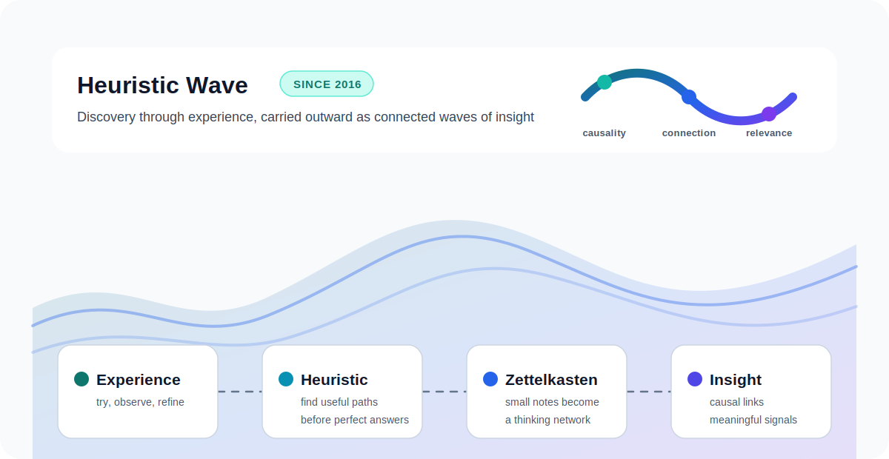

## Heuristic Wave 🌊

Since 2016, Heuristic Wave는 기술을 정리하는 블로그이기 전에, 지식을 발견해 나가는 방식에 대한 이름입니다. 경험으로 얻은 작은 단서들이 서로 연결되고, 그 연결이 다시 새로운 질문과 실험으로 이어지는 흐름을 담고 있습니다. 이곳의 글들은 단순한 기록을 넘어, 문제를 발견하고 관계를 읽고 다음 가설을 세우는 사고의 연습장이 되기를 지향합니다.

`Heuristic`은 정답을 한 번에 주입받는 방식보다, 경험과 실험, 시행착오를 통해 스스로 배워 가고 문제를 풀어 가는 접근에 가깝습니다. [Merriam-Webster](https://www.merriam-webster.com/dictionary/heuristic)는 이 단어를 실험적 방법, 특히 시행착오를 통해 학습과 발견, 문제 해결을 돕는 것으로 설명합니다. [Online Etymology Dictionary](https://www.etymonline.com/word/heuristic)에 따르면 어원 역시 그리스어 `heuriskein`, 즉 "찾다", "발견하다"라는 뜻과 연결되어 있습니다. 이 블로그에서의 Heuristic은 완성된 결론보다, 어떤 문제를 만나고, 어떤 단서를 붙잡고, 어떤 선택지를 버리거나 남겼는지를 기록하는 사고의 흔적입니다.

`Wave`는 그렇게 얻은 영감과 연결이 한 지점에 머무르지 않고 파도처럼 번져 나간다는 의미를 담고 있습니다. 하나의 기술 메모가 다른 아키텍처 아이디어로 이어지고, 작은 실험이 운영 경험과 만나고, 흩어진 개념들이 다시 새로운 질문을 만들어 냅니다.

AI 시대에는 지식을 많이 보관하는 것만으로는 충분하지 않습니다. 제텔카스텐(Zettelkasten)처럼 지식이 잘게 나뉘어 연결되어 있을 때, 중요한 능력은 그 사이에서 인과 관계, 연결 관계, 유의미한 관계를 찾아내는 일입니다. 단순히 정보를 검색하는 것이 아니라, 정보 사이의 흐름을 읽고 다음 가설을 세우는 힘입니다.

제텔카스텐은 노트를 단순히 모으는 방식이 아니라 생각의 그물을 만드는 도구에 가깝습니다. [Zettelkasten.de](https://zettelkasten.de/introduction/)도 제텔카스텐을 사고와 글쓰기를 위한 개인 도구로 설명하며, 수집보다 연결을 강조합니다. Heuristic Wave가 말하는 것은 바로 이런 사고 방식입니다.

이곳에는 AWS, AI, DevOps, 보안, 백엔드, 실험 노트가 섞여 있습니다. 각각의 글은 독립적인 기록이지만, 동시에 더 큰 지식 네트워크의 한 조각입니다. 이 블로그를 읽는 과정이 기술을 따라 배우는 시간을 넘어, 문제를 발견하고 연결하고 다시 해석하는 연습이 되기를 바랍니다.
